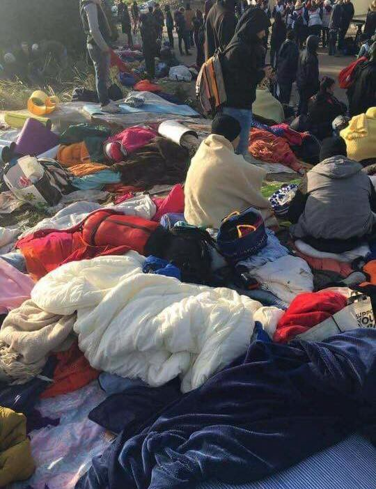
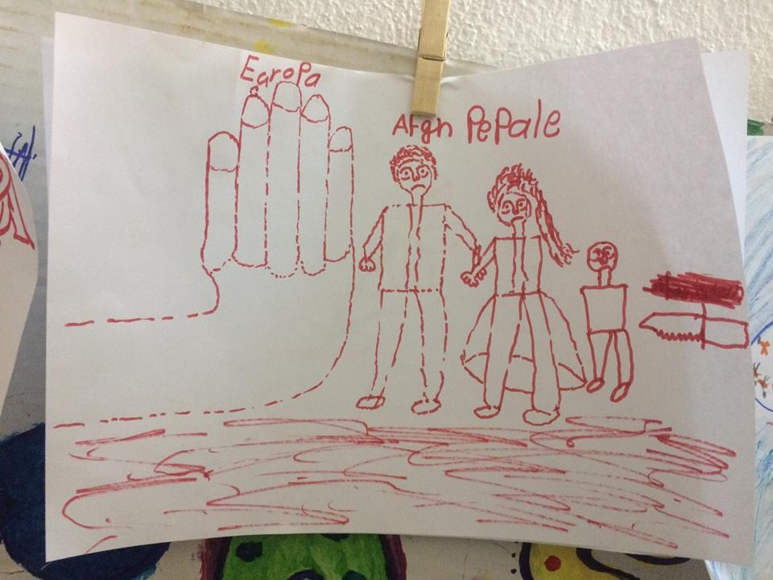
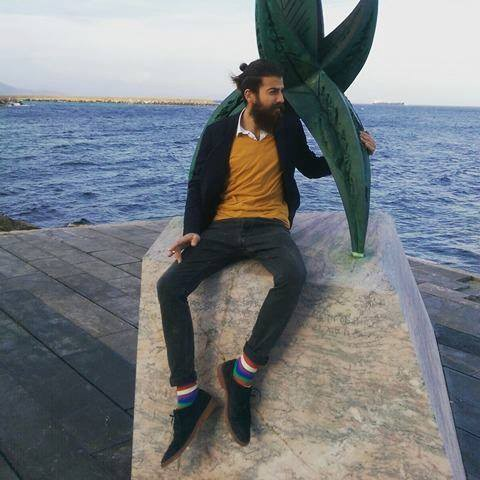
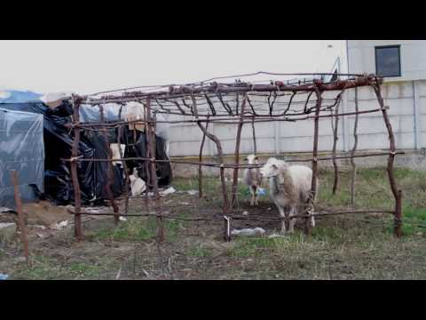

### AYS NEWS DIGEST 08\.02\.17 — UK reneges on the Dubs Agreement, destroys hopes of refugee children

People camp outdoors in Paris\. Photo Credit: Calais Action
#### Feature

In May 2016, the UK parliament passed an amendment to the Immigration Act of 2016\. The so\-called Dubs Amendment is named after Lord Dubs, who was one of the nearly 700 Jewish Czechoslovak children who were accepted to the UK as part of the Kindertransport\. The amendment was to take 3,000 unaccompanied minors from across Europe and to relocate them to Britain, where many had families, in addition to Britain’s other commitments to child refugees\.

Today however, the government has published [an obscenely self\-congratulatory press release](http://www.parliament.uk/business/publications/written-questions-answers-statements/written-statement/Commons/2017-02-08/HCWS467) wherein they announce the reduction of their commitment from 3,000 to 350 children\. Furthermore, the 200 children who were taken from Calais were counted as part of this target, meaning that there remain only 150 spaces\. In addition to the children who were brought in under the Dubs Amendment, a total of 700 unaccompanied minors were brought into the UK as part of different EU family reunification programs\. This is a laughably small figure, especially considering that there are over 90,000 unaccompanied minors scattered all throughout Europe, and they are especially vulnerable to exploitation and abuse at the hands of adults, both refugees and natives of the country in which they are staying\.

Lawyers have responded by taking the government to court, and the next court hearing is to take place on February 10\. The organization Help Refugees is at the forefront of this effort\.The namesake of the amendment has condemned this move by the Home Office\.

> “During the Kindertransport, Sir Nicky Winton rescued 669 children from Nazi persecution virtually single\-handedly\. I was one of those lucky ones\. It would be a terrible betrayal of his legacy if as a country we were unable to do more than this to help a new generation of child refugees\. I urge the prime minister to show leadership by continuing and building on this programme, not shutting the door to some of the most vulnerable refugee children\.” 

Given Britain’s wealth and the minuscule numbers accepted into the country, this episode is shameful and reveals the sway that right\-wing xenophobes have over British politics\. If you are a resident of the UK, please sign [the petition](http://www.citizensuk.org/dubs_petition) calling for the terms of the Dubs Amendment to be honored\.
#### Greece

A refugee child’s illustration of the unwelcome treatment received by Afghan refugees\. Photo Credit; Refugee Support Greece
### Greek Forum of Refugees denounces brazen deportation of Afghans

As Afghanistan has been reclassified as a safe country by the EU, many Afghan refugees now find themselves living with the fear of deportation looming\. The agreement made between the EU and the government of Afghanistan essentially amounts to bribery, with EU promising money to the government in exchange for the relocation of refugees\. In response to this travesty, the Greek Forum of Refugees has released a [powerful condemnation](http://refugees.gr/not-late-act-responsibly-stop-deporting-afghans-unsafe-country/) \. The statement brings attention to the reasons why Afghans find themselves compelled to flee all the way to Europe, namely that Afghan refugees in Iran and Pakistan find themselves discriminated against and denied entry into wider society\. It also calls attention to the recent wave of suicide attempts undertaken by Afghan refugees across several countries\.
### Greek Asylum Service publishes press release on relocation

[The release](http://asylo.gov.gr/en/wp-content/uploads/2017/02/Press-Release-Relocation-Insights-08-02-2017.pdf) contains a number of interesting facts and statistics, and tries to argue that EU member states are responsible for the slow pace of progress\. The average time between registering a candidate for relocation at one of the asylum offices and submitting a request by Greece to another Member State to accept that candidate is 49 days\. However, the average time required once a pledge by another Member State has been received and a request is made by the Relocation Unit is only six days\. This is a result of the fact that the number of pledges made by other Member States remains insufficient\. While until 1 February the Asylum Service had registered a total of 24,233 relocation candidates, the pledges received amounted to only 15,164\.
### Refugee in Greece writes poem lampooning pitiful UNHCR allowance\.

No food for them save bitter thorn\-fruit, which does not nourish nor release from hunger\.

The UNHCR has announced on several occasions that it intends to begin distributing money to refugees in Greece\. On Monday, officers of the UNHCR informed me that my friends and I would be included in this new scheme\. We expect a roll\-back in services provided by volunteers, as well as UNHCR as they will say we are now able to ‘support ourselves, as they have provided 90 euros a month per person\.’ They have continually treated us badly and left us in inhumane conditions, all we want is to get out of these camps and move on with our lives; to have jobs, education, relationships and a life; everyone reading this knows 90 euros is hardly enough to support yourself for a week in Europe, let alone a month\.

“90€”

how to earn ninety euro a month?
sell your humanity 
to earn ninety euro 
let your human rights be employed
to the highest bidder
they will be sold
your feelings, them too
and in return: ninety euro

yes, you could sell these things 
if you had nothing but them 
but here, we don’t have the right to choose 
we take ninety euro 
instead of our humanity 
after all, it’s useless
if you’re living life as a refugee

let me tell you how
how to ‘earn’ 90 euros a month
without even working at all:
simply live your life like a sheep 
just eat 
and sleep
and drink
and wait 
then you will take ninety euro 
while others store millions in your name
UNHCR, European authorities, European governments that is theirs

simply be a that person who the others call a 
refugee
then you will take ninety euros
each and every month
you want to? 
simply run away from war 
save your life from death 
and you will receive ninety euros

simply seek asylum
even better: in one of the European countries 
no more, no less
no rights, no love
but, here, have 90 euros
instead

I’m a refugee
I’m in Greece
so now I’m 90 euros better off
each month
but
every day
Europe drops our rights in the ocean 
where little baby bodies rot
drowned on the way to your lands
the little ones you all forgot

tell, me, please
what can we buy with 90 euros?
our humanity back 
our feelings back
our human rights back

oh, wait: my mistake…
no store that stocks humanity 
no shelf with feelings 
no aisle of human rights 
they were bought from us
with weapons, and oil and all the band things in\-between
now you bask in your millions and strip us of our humanity

what you can buy with 90 euros?
let me tell you:
a new T\-shirt or 
new shoes
that’s it, then the money’s gone; no roof, no food and no life

maybe we can go to a pub
sit on a chair like a normal person
call the waiter: 
‘’excuse me, two drinks please,’’
he tells you they are quite expensive
he sees through your eyes
knows your really a refugee
‘’oh, don’t worry, i reply: i just got 90 euros\.’’

even now we can invite a partner for a drink 
but don’t tell them nothing
case they find out your a refugee
because thats what we’ve learnt from humans
care more for euros
than for life
more for things
than a wife

my suggestion is,
anyone with 90 euros
or even with 9
buy yourself a book
on human rights
read it, cover to cover
don’t leave it on the shelf
out of sight 
like me and my friends

I don’t like to take without giving
but my hands are tied
behind my back
breaking under your inhumanity
make a line 
make a line 
everybody get in line

you earned ninety euros
congratulations
it’s distribution time

“At least still I can dress up as fashionable as I am” says Ahmed Al\-Mouhmad, the author of the poem\.
### 53 new arrivals on Chios were reported
#### Macedonia
### Reinforcements sent to Macedonian\-Greek border

An additional 36 Frontex officers have been sent in as reinforcements to monitor the border between Greece and Macedonia, to make sure that refugees do not go across the border\.
#### Croatia
### Assailants brutally beat Iraqi asylum seeker in Karlovac

Three suspects have been arrested in the aftermath of a brutal beating of an 18 year old Iraqi asylum seeker in the city of Karlovac, 50km away from Zagreb\. The attackers will be charged for inflicting heavy injuries but not for a hate crime, as the police believes that the attack happened “for no apparent reason\.” There have been several attacks against asylum seekers in Croatia since early January\.
#### Hungary
### Hungarian government announces new measures against refugees

János Lázár, the right hand of Orbán, has announced in a town hall meeting that the government is planning several legislative changes\.

1\. All asylum seekers will be automatically detained

2\. This will happen at the border zone, and people will have to wait there for the decision

3\. The 700–800 people currently in the asylum process will be transferred to the border area to be detained

These measures were first announced a number of weeks ago, but more detailed blueprints have been released and the implementation has begun\. To justify the Hungarian government’s actions, which are a clear violation of refugees’ rights as put forth by international and EU law, Lázár said that, “although the applicants would not be be allowed to move freely in the country, the camps should not be described as detention” because people could supposedly go back to their country at any time\. The official government press release makes further outrageous claims, namely that “immigrants staying in Hungary pose a security risk,” and that “tens of millions are waiting to start moving towards Europe\.”

The measures are clearly meant to completely isolate refugees from society at large, to humiliate them so that they will have no desire to risk the journey to Europe\.
#### Italy
### Video shows the dilapidated state of a refugee reception center

Over 2,000 people live in the area of San Ferdinando in shacks, tents, and abandoned buildings\. Attempts to improve the living conditions of those who find themselves in the camp have hit a dead end
#### France
### People continue to sleep in the streets of Paris

Paris Refugee Ground Support has shared photos showing the awful, but unfortunately not surprising, conditions that refugees in Paris find themselves living in\. It is the middle of winter, and yet people sleep in tents, on the filthy ground\. The numbers of homeless refugees are rising at an alarming rate, according to PRGS\.

### An update on CAO Langres

“Around 45 people live in an what they believe to be a former hospital\. We were not allowed to see the rooms, only the community kitchens\. People say locals are greeting them, no racists, but language barrier is a huge problem\. Wifi not provided\. Some asylum requests are already processed, but many still do not know what will happen to them\. They also report about a lot of empty promises made during the eviction of the jungle like processing Dublin cases what did not happen\.

They only get once a week a language course which is in France and therefore they cannot really learn the language\. I was told, there are no language courses provided by government but only unpaid volunteers\. So this is maybe one of the biggest and most important challenges\. Some CAOs reportedly don’t get any language courses\.

Another big challenge is the social welfare\. It depends on the region, we know about a range from 210–340€\. But people have to pay for clothes, food and public transport with this money\. We are afraid, that because of this conditions, Calais will be more and more crowded again, when the weather gets better again\.”

### Top Ups for Refugees asks for donations\!

The organization provides refugees with cell phone credit, and have distributed over 400,000 Pounds worth of credit thus far\. Demand is high, as refugees need to keep in touch with their friends and loved ones\. If you can afford to, please help them through the link given below\.

#### Sweden
### Another Afghan refugee boy commits suicide

The boy, who was an unaccompanied minor, took his life in a home in the night between this Sunday and Monday, in a home in Trollhättan\. This tragic death is another in a string of suicides by unaccompanied minors from Afghanistan after authorities reported that they will be speeding up deportations\. The people who care for unaccompanied minors report that the children are distraught and afraid for their futures as a result of the news\. This alarming trend is seemingly not receiving coverage in the mainstream media in Sweden\.

_Converted [Medium Post](https://areyousyrious.medium.com/ays-news-digest-08-02-17-uk-reneges-on-the-dubs-agreement-destroys-hopes-of-refugee-children-97cc0ca96fe0) by [ZMediumToMarkdown](https://github.com/ZhgChgLi/ZMediumToMarkdown)._
