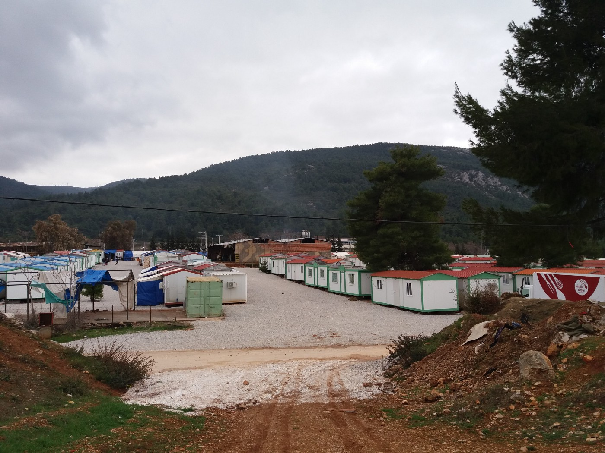
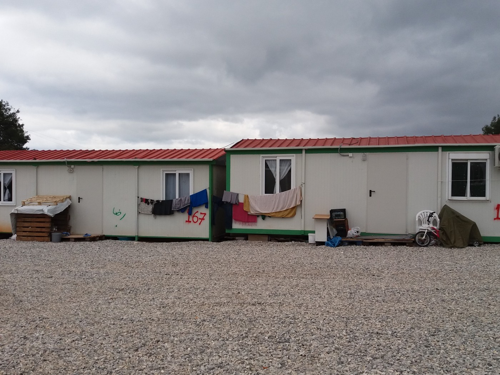
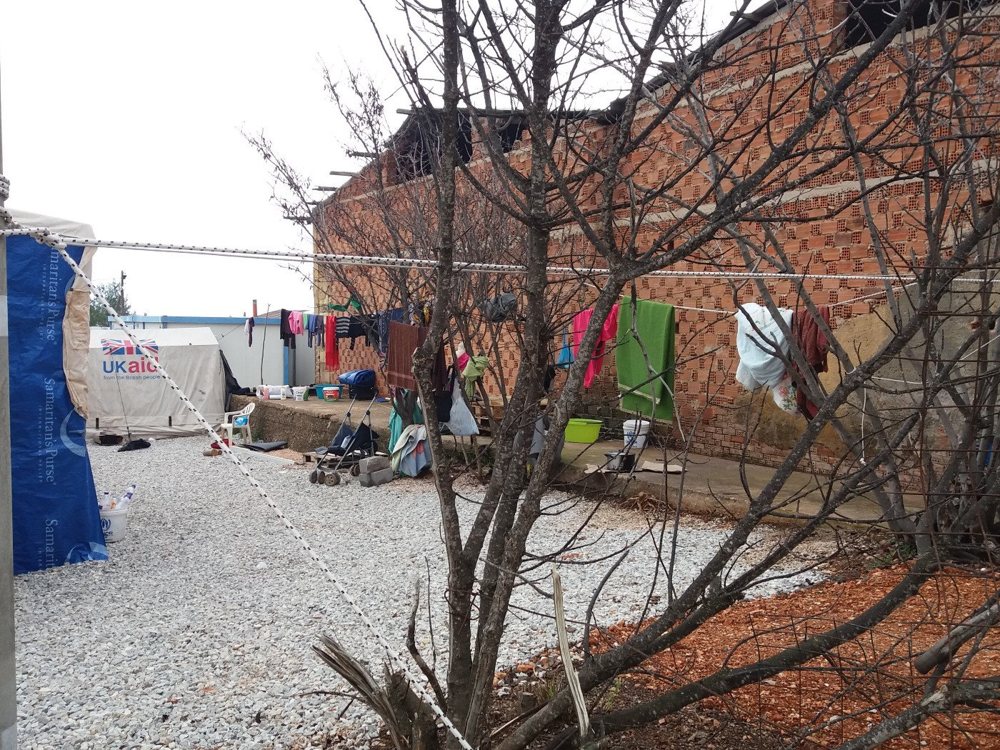
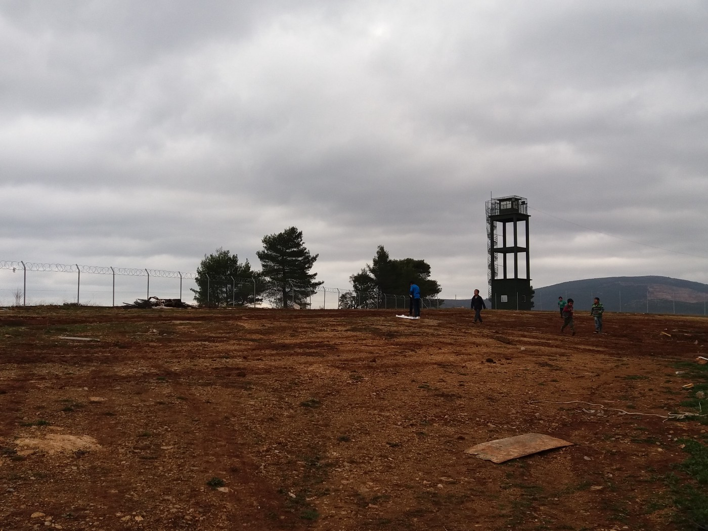
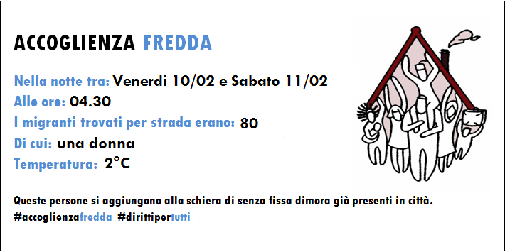

### AYS DAILY DIGEST 11/2/2017: Forced evictions of refugees in Turkey and France

_Military police forcing people from makeshift camps in Izmir area // Police in France continues to harass people who are forced to stay in the streets // Nobody but group of volunteers cares about homeless refugees who are sleeping in the streets // Report from Malakasa camp in Athens area // Sweden government concerned about state of minors refugees in this country_

 \. Photo by Oliver Feldhaus\.](assets/8d2db940278a/1*6lfikvcnvRPJrSqjDFikcQ.jpeg)

Berlin, Protest in solidarity with refugees [Kaltetod Europa — Not in my name](https://www.facebook.com/pg/kaeltetodeuropa/about/?ref=page_internal) \. Photo by Oliver Feldhaus\.
### Turkey
#### French style evictions

According to many independent sources, since February 8th, refugees living in makeshift tent camps in Torbalı and Bayındır districts, Izmir area, are being evacuated by military police\. Most of the people who are living here are refugees from Syria\.

The exact number residents is hard to establish since people are coming and going all the time\. Most of them are surviving while working as seasonal workers in the nearby farms, often exploited as cheap workers who are paid less than 10 euro a day for their hard work\. Some of them receive their money only at the end of the season, and in some cases, those who hire them, do not pay them at all\.

According to the reports, everybody is supposed to leave the area by Monday, but it is not clear where they will all go\. People in this makeshift camps are surviving with the help of a very limited number of volunteers, who are — due to censorship and strict government rules, too afraid to talk about what is happening\.

Life in these camps is unbearable\. There is not enough toilets, showers and clean water\. Apparently, there are lots of children suffering from pneumonia in the camps, but, since they do not have refugee status, hospitals are refusing to help them\.

This makeshift camp exists for almost three years, and until now many times rumors were spread that people will be moved to live in human conditions\. It never happened\.

Currently, around 2\.8 million Syrians are stranded in Turkey\. Most of them are living in poverty, while around 400,000 children are not able to go to school\. Only in Izmir, it is estimated that about 90,000 people are living, but the number fluctuates since people are coming all the time, but also — those who can afford to pay smugglers — are leaving for Greece\.
### Greece
#### Despite difficult living conditions, more people are being accommodated in Malakasa camp

In [AYS Daily Digest from February 10](https://medium.com/@AreYouSyrious/ays-daily-digest-10-2-seeing-how-it-could-be-peaceful-evacuation-in-paris-99ea3ee14460#.y8lh0wz49) , we reported about the difficulties the residents of Malkasa camp have to face with every day\. Today, one of our volunteers, visited the camp and spoke with some of the residents\.

Malakasa camp\. Photo by AYS\.

Currently, there are around 600 people in this camp, but the number could increase soon since many who are relocated from the islands are being sent to Malakasa\. Only during the last week, around 70 people arrived from Moria, Lesvos\.

Until two months ago, people in Malakasa were living in tents\. However, after the protests, some 200 families were moved to hotels, while for the a others containers with electricity and heaters were provided, something that should have been done long time ago\. Some residents complained that the bottom of their containers have holes, but we were informed that it is an issued that will be fixed soon\.

IOM, UNHCR, SIF and Safe the Children are present in this camp\.

As well as in many other camps in Greece, food in Malakasa is not good and in many cases not eatable at all\. The situation in that field is not improving, and there is no even any announcement that it can happen soon\.

Medical care for residents is provided by the Doctors of the World and Doctors Without Borders\. The group called Remar SOS is providing tea and soup for the residents every day\.

The camp is placed close to the military barracks and highway\. Once a day people have possibility yo take the bus and go to Athens\.

There is much more to be improved in this camp in order to provide at least decent living conditions\. It is a place surrounded by the wire, far away from any shop or place that can provide rest for the people\. \. \.

Unfortunately, with all the improvements that have been made and new arrivals, it does not look like there are even intentions for the camp to be closed down or people sent to live in more human conditions\.

Photo by AYS\.
#### Relocation nightmare continues

Despite the very difficult situation all over Greece, the relocations and resettlements are still happening very slowly\. [According to the official data](https://ec.europa.eu/home-affairs/sites/homeaffairs/files/what-we-do/policies/european-agenda-migration/20170208_ninth_report_on_relocation_and_resettlement_en.pdf) , Hungary, Austria, and Poland remain the only EU Member States that have not relocated anyone so far\. Slovakia continues relocating on a very limited basis and the Czech Republic has not pledged since May 2016 and has not relocated anyone since August 2016\.

The goal is to have 2,000 monthly relocations, but that number has never been reached\. In December, 1,162 people were relocated and 1,131 people in January\.

As of the beginning of February 2017, 523 unaccompanied minors have been registered but only 248 have been relocated\. The main difficulty is to relocate married minors \(particularly when under the age of 17\) since many Member States have legal obstacles to allow the relocation of this category of separated children\.

Greek Relocation Unit of Asylum Service issued a very critical statement in relation to the slow process\.

> “The average time between registering a candidate for relocation at one of the asylum offices and submitting a request by Greece to another Member State to accept that candidate is 49 days\. However, the average time required once a pledge by another Member State has been received and a request is made by the Relocation Unit is only six days\. This is a result of the fact that the number of pledges made by the other Member States remains insufficient\. 

> While until 1 February the Asylum Service had registered a total of 24,233 relocation candidates, the pledges received amounted to only 15,164\. In addition, the average time for receiving a response to an outgoing request is 29 days, well beyond the ten\-day period provided for in the guidelines adopted by the European Commission and the Member States\. In fact, the average response time by the Member States to the relocation requests made by Greece is growing\. In January 2017 only five per cent of all requests received a response within ten days, while the average response time for 79 per cent of all requests was between 21 and 40 days\. Meanwhile, the average time required between the moment an acceptance is received and the asylum seeker is actually transferred is 58 days, as the Member States require more time to prepare for receiving the asylum seekers\. These delays result in slower decongestion of reception facilities in mainland Greece, widespread frustration among asylum seekers, and overall loss of credibility of the relocation program\.” 

The relocation program is supported by EASO, IOM, and UNHCR, who are also not doing much to do their part of the job\. Just one of the examples is that volunteers are often taking their role and helping to people who are supposed to move to the other country to buy the ticket and organize their travel\.
### Italy
#### New regulation for asylum seekers

The situation in Italy remains alarming, even though hardly anybody is talking about it\. [Volunteers operating in the area of Como are reporting](https://www.facebook.com/comosenzafrontiere/photos/a.634422403386490.1073741834.558043977691000/664898050338925/?type=3) about 80 persons who slept out in the open last night while the temperatures were 2°C\.

In Porderone, [local media are reporting](http://react-text: 138 http://messaggeroveneto.gelocal.it/.../il-dormitorio-del...) , people are sleeping in a parking lot, 11 of them\. Most of them are people who have gained refugee status, but their “reception time” is over and they find themselves on the street without roof or work\. The number of people with this status is increasing since the ways out of Italy are blocked by closed borders\.

In the meantime, the government approved the creation of special appeals courts to deal with the asylum seekers’ applications\. Apparently, decision issued by these courts will be binding, abolishing the right to further appeals\.

The measures are introduced in order to speed up the processing of asylum claims, but also the deportations of people whose claims are rejected\.

It currently takes an average of two years to complete the legal asylum process in Italy, often involving multiple levels of appeals\.

The UNHCR expressed its concerns about these new procedures saying that asylum cases have to be “thoroughly examined”\.

The Italian government also announced the building of 18 Permanent Repatriation Centers across the country to replace the Identification and Expulsion Centers\. The new centers would house a maximum of 100 people\.
### France
#### More humiliation for refugees in France

Police in Paris is finding new ways to humiliate people who are sleeping in the streets because they have no other solution\. An v [olunteer](https://www.facebook.com/agathe.nadimi) took a picture of stones that have been put to prevent people from lying down to sleep under the bridges\. This has been done in the area of Port de la Chapelle where from people were forcibly evacuated on February 10\.

 \.](assets/8d2db940278a/1*B0GNwbGcs_bVQqoorZWJhA.jpeg)

Photo by [Agathe Nadimi](https://www.facebook.com/agathe.nadimi) \.

[While in Paris, RRDP researchers](http://react-text: 326 https://www.facebook.com/RefugeeRightsData/posts/1634608290179343) were confronted by “alarming” scenes in the La Chapelle district\.

_“While we were there, we witnessed the police taking people’s belongings — some in the night, some in the daytime — it’s quite a visible phenomenon,”_ said Natalie Stanton, RRDP Deputy Director wrote\.

Research conducted by this groups is showing that 59\.6 percent of refugees said they had been woken up by police and forced to move during the night, with 54 percent describing the experience as “violent”, and 52 percent saying they “felt scared”\. At the same time, 36\.5 percent of respondents said they had experienced other forms of police violence in Paris, including physical beatings and verbal abuse\. A third had their sleeping bag, tent, blanket, clothes or other belongings taken by police, citizens, or other refugees\.

In Calais, group [Help Refugees](https://www.facebook.com/HelpRefugeesUK/posts/384067588620587:0?hc_location=ufi) have been out looking for unaccompanied refugee children this morning, at \-5 degrees\. Of the 150 children that have been registered by volunteers in Calais, they only located very few\. Some of them are as young as 13\.

> “The French children’s accommodation center run by FTDA was at full capacity of 30 places\. The children we spoke to this morning hadn’t slept\. Children have been fainting from exhaustion\. We are gravely concerned for their safety at this time — especially considering the government’s recent decision to end the Dubs amendment\. French authorities have decided that they will continue to not allow the construction of shelters\. 

> The situation will only continue to worsen as more children arrive into Calais\. It is impossible for volunteers to safeguard these incredibly vulnerable children from those people who might wish them harm\.” 

Every night, volunteers are distributing food, hot tea, and sleeping bags\. Hundreds of people — including children, were outside\.
### Sweden
#### Investigation into suicide attempts and suicides

[After seven reported](https://www.gp.se/nyheter/sverige/riksdagen-tar-upp-ensamkommandes-självmord-1.4153580) suicides and suicide attempts among unaccompanied minors in Sweden, the state Social department decided to start to look into these reports, considering the situation serious and alarming\.

However, [the local media](http://react-text: 148 http://sverigesradio.se/sida/artikel.aspx?programid=83...) are reporting about the minors that have started to organize themselves on social media discussing suicides\. It is the volunteer network Vi står in ut \(direct translation from Swedish: We can’t stand this\) that is warning about that this trend only is going get worse and that something has to change in order to prevent this\.

Even more warning [repor](http://react-text: 179 http://mobil.unt.se/.../heroinmissbruk-bland...) t comes from the police in Uppsala which estimates that around 90 unaccompanied minors who are living in this municipality are using heroin\. They are mostly young boys from Afghanistan\.

 in Belgrade\.](assets/8d2db940278a/1*Idv3-bqelk4W0ixRM68tlg.jpeg)

Photo by [Dylan Longman](https://www.facebook.com/dylan.longman) in Belgrade\.

_Converted [Medium Post](https://areyousyrious.medium.com/ays-daily-digest-11-2-2017-forced-evictions-of-refugees-in-turkey-and-france-8d2db940278a) by [ZMediumToMarkdown](https://github.com/ZhgChgLi/ZMediumToMarkdown)._
