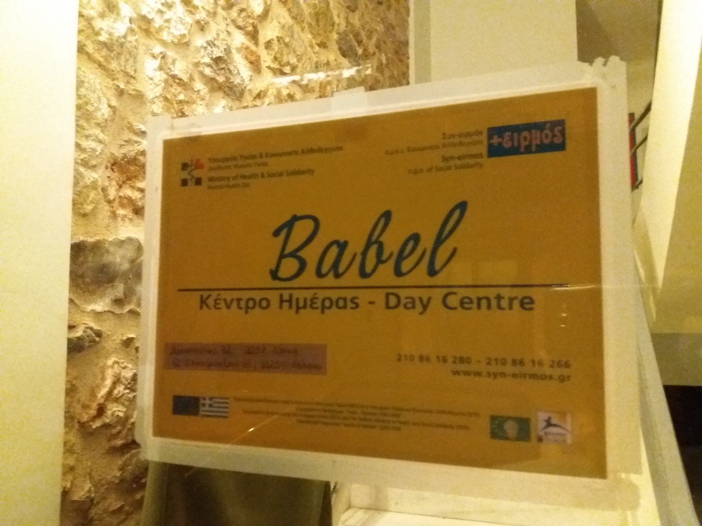

### AYS SPECIAL: Closed borders are damaging our mental health

_The Babel Day Care Center team, has been worked with refugees, migrants and volunteers for years\. One of them is Nikos Gionakis who in the interview with for AYS warns about the conditions people are left to live in, conditions devoid of hope, and they urge for changes in order to save the world we are living in\._

_“Closed borders do affect mental health because they mean that people are cut out from hope\. If you have hope, you can move, you can accept to do sacrifices, for some time\.”_ This is the opinion of **_Nikos Gionakis_** , member of the the **_Babel Day Care Center_** team in Athens which has worked with refugees and migrants since 2007\.

With 30 years of experience in the field of mental health, including years on the “frontline” of the so\-called refugee crisis, Nikos is definitely the person who should be trusted when he says that closed borders are a danger for all of us\.

_Nikos Gionakis from the Babel Daily center works for over 30 years to help people over come trauma\. He claims condition refugees are forced to live in are inhumane and that it has to be changed\._

**Learning by doing**

The Babel Day Care Center was established 10 years ago as part of the Syn\-eirmos Social Solidarity NGO which works in the areas of social solidarity, social economy, care and mental health for children and adults\. The center is open, officially, until 4pm, but we met Nikos around 6pm while the place was still full of people\. These kinds of working hours have been practiced since 2015, when people started coming in big numbers\.

_“It was very difficult to find solution\. Suddenly, so many people started coming and the state did not pay any attention to them\. It was a political choice\. They did not offer anything\. Even more, their attitude was that if we do something positive for migrants or refugees, more people will come\. As the ex\-minister of health Adois Georgiadis put it: “Lets make their life unbearable so that they would not come, and those who are here will leave\.”_

Babel team was determined to fight against this kind of attitude together with the Solidarity movement in Greece\. They started creating networks in order to help to all those who were coming, but also to help those who were helping them — locals and international volunteers\. Even the official politics changed, due, rather, to the pressure of arrivals than a real change in attitude\.

New phenomenon that rises out of the crisis is a volunteer movement comprised of people with different backgrounds, coming to Greece from all over the world and trying to help\. Many of them have never had any experience in emergency situations, and never experienced trauma of such a kind\. For people in the Babel Center, this was a new group they started working with\. Especially vulnerable were, and still are, volunteers who were helping to people arriving on the islands\.

_“Many of them were not used to work with people who lost their families in a shipwreck\. But, who is? I spoke with some of them who were telling me about how many boats used to come in one day, and how they could not manage it, how people were in a very bad conditions, and they did not know what or how to do\. The situation was very chaotic\. There was no coordination or anything and volunteers were overwhelmed\. Many people thought that they are there to rescue people who are victims, and if they do that, they will receive gratitude\. Instead they met with very angry and frustrated people, sometimes hostile, and they did not know how to manage the situation\. Some even felt it is something personal, and became angry, started shouting at refugees… They had good intentions, strong motivation, but no knowledge or skills in order to deal with the intense situation like that\. A big part of our job became to support people who are taking care of others\. If you want to take care of others, someone has to take care of you,”_ Nikos remembers\.

Everybody ho comes to the Babel daily center leaves something\. People who are working their are trying to give something to everybody, too\.

But even professionals, Nikos admit, did not know how to deal with this new situation\. Not only tragedy of such magnitude, but also how to help survivors who are coming from other countries, who experienced war, many losses, speak different language, had different religion beliefs… The people at Babel Center were learning while working, but also started organizing trainings and work to transfer their skills, which they do even up to this day\.

**Resilience instead of weakness**

While talking about traumas refugees and migrants are coming with, Nikos highlights that it is important to have in mind that many of them are very angry with everything and everybody\. The Babel approach is to show them how strong they are and not to look at them as victims\. _“Most of them are the strongest examples of resilience\. I am not sure that if I were in their position, I could have done what they have done, to come to Turkey, pass over in that way, and even when they come here, to continue to struggle with things they have to every day,”_ Nikos said adding that the strongest among the strong are parents with children\.

However, the way how humanitarian aid is currently offered, for professionals like Nikos is worrisome\. _“For example, when people are stranded at the islands, in order to move to the mainlands they have to show vulnerability\. If not, their demand is not prioritized and they will have to stay there endlessly\. This is not human\. Even if you come here as healthy individual\. If we assess people as they arrive here and again after one month after living at Moria, Chios, Souda… they will not be the same\. It is not only the living conditions, but the expectations, perspectives\. It is all that makes you feel bad\. You come expecting to find safety but you are not finding it\. You come here to find some dignity, and you are not finding it\. You hope to join your relatives in other countries, but you are stuck here\. The information you are given, or not given… these are all the things that affect negatively mental health of people\.”_

Nikos regularly visits camps and other places where migrants and refugees are living, finding poor conditions and despair\. _“Generally what I have understood is there are many responsible agencies, NGOs or states\. But what I mind is that people are not treated as humans,”_ he claims\. _“I am aware that in all this, we have to investigate good practices, and to make them visible\. At the same time, I have to say that even if conditions in some camp are better, people should not live in camps but in houses\. I understand it is the emergency, but also it is not\. Saying that it is, is just an excuse\. After 2 years, you cannot speak about emergency state\. People should live in decent conditions\. And the best camp is not a decent place to live\.”_

**Atmosphere of competition**

For inhuman conditions he also blames the atmosphere of competition that is created\. _“It is like business\. But it is also something we could expect will happen\. NGOs are based on donations\. In order to get donations, they must show they do something and achieve their quantitative goals\. So, if it is1500 consultations in 6 months, they will count even saying a good morning for 1500 times\. Anyway, things are very complex\.”_

Professionals who are working in the field are aware that without volunteers the entire situation could have been much worse, while at the same time they are warning that in some cases volunteer efforts could do harm\. _“As we say — the path to hell is made of good intentions\. There are volunteers who come and do wonderful job, on the other hand, some come here and do what ever they want\. And the main principals we should respect is do not harm\. It is enough,”_ Nikos believes\.

Based on the Babel daily work experience, the most vulnerable group among refugees and migrants are adult men\. While number of groups and organizations in the field are organizing activities for women or children, this group remains neglected\. _“And what do men do in the camps at the end? Nothing\. In some cases they are even forbidden to do things,” Nikos explains\. “If a person do nothing for one week, one becomes victim and learns that in order to have anything it has to ask for it\. But that is with everybody in this condition\.”_

**Integration as a solution**

The victimization affects mental health\. The solution, according to the Babel, is not offering short term psiho social support, but to create conditions in which people will feel not as a victims, but to make them active, help to integrate in societies they are living in\. Additionally, it is very important to tell to people clearly about what is their future in the way they understand\. But, it cannot be done in camps\. _“What ever we do here in the center, is destroyed when people go back\. Not only because of the living conditions, that are awful, but because of the meaning these conditions have\. They ask themselves all the time questions like do I deserve to live in such conditions?”_

This is a process, Nikos repeats several time\. “Slowly\-slowly” and the change will come is one of the main lessons the Babel staff learned\. However, they urge that the approach toward the refugee crisis to be changed\.

The number of recent suicides and suicide attempts among the refugee and migrant population, or the increase in substance abuse, or self\-harm all over Europe, is one of the consequences of living conditions and lack of information in many ways\. These issues are especially present among male population\. _“In many cases people are doing this because they do not see other way to face their despair,”_ Nikos explains\. The increase comes with the fact that people are losing hope\. For a long time, many people believed something will change soon, but they are waiting for too long a time\.

All this will leave consequences not only for the refugee and migrant population, but for all people, those being volunteers or just locals in countries where refugees are living, people who feel guilt because they cannot do anything to change the present situation\. What kind of consequences is impossible to say now, but professional in mental health do agree that we are facing a very dangerous situation\. The change with come, Nikos believe, from ourselves\. _“But it is the process\. We have to change our behavior and attitudes\. Otherwise, we cannot change the others\.”_

The Babel Day Care center in Athens, open for all those who need help\.

\( _By Nidžara Ahmetašević, Athens_ \)

_Converted [Medium Post](https://areyousyrious.medium.com/closed-borders-are-damaging-our-mental-health-cf810a93d45b) by [ZMediumToMarkdown](https://github.com/ZhgChgLi/ZMediumToMarkdown)._
