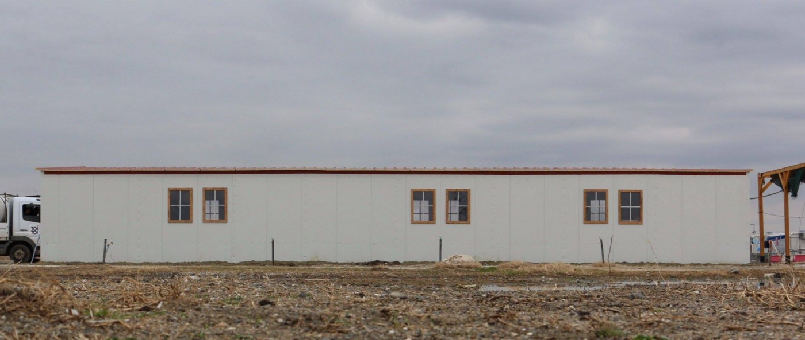
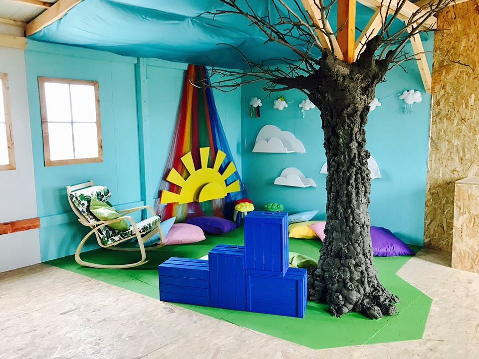
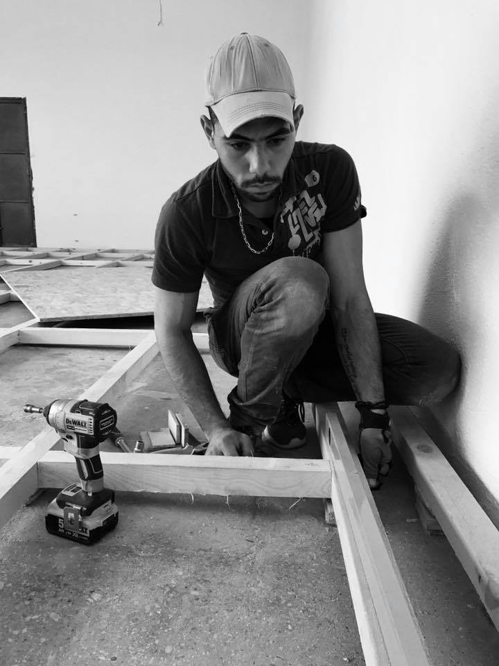
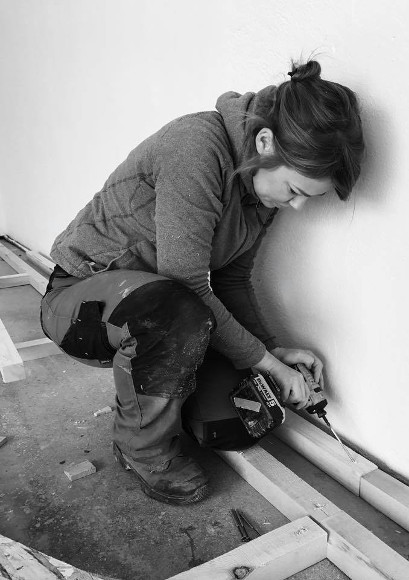
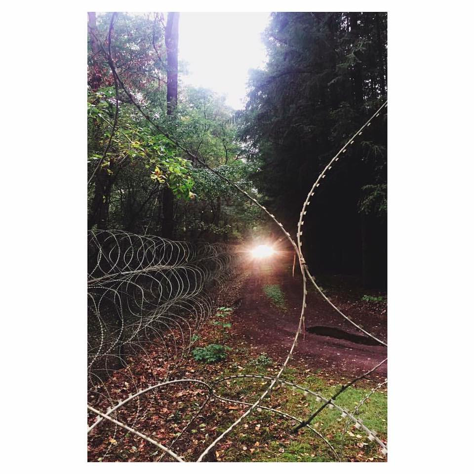
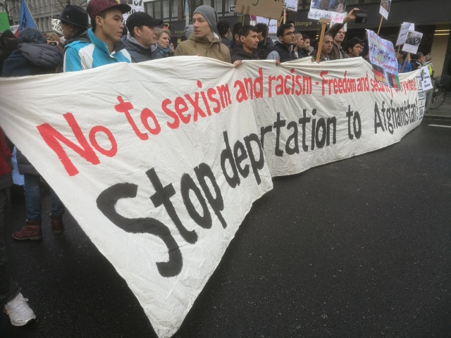

### AYS DAILY DIGEST 12/2/2017: “They said we had to get out of France”

_Refugee Rights Data Project reports on extent of police violence and misstreatment faced by refugees in Paris\. Terrible living conditions for children in Netherland’s “family locations”\. Uplifting updates from The Timber Project\._

](assets/4d11f2011a75/1*L5GiZR2u9AG_7g-INSbiIw.png)

Photo by [Refugee Rights Data Project](http://refugeerights.org.uk/)
#### France
### “If we question them or say we have nowhere to go, they bring out the tear gas”

The [Refugee Rights Data Project’s new study](http://refugeerights.org.uk/reports/) , published in its entirety today, shows the extent of police violence and misstreatment faced by refugees in Paris\. According to the study, 60% of respondents said they had been woken up by police and forced to move while sleeping in the streets, with 54% describing this as a “violent” experience\. The report also says that 36% have experienced other forms of police violence in Paris, while around 15% said they had belongings taken from them by authorities\.

Minors are not treated any better, with 50% saying they had been asked to move while they were sleeping\. For those who receive shelter, hygiene standards are an issue\. One respondent explained _“I live in a hotel but it is very dirty\. I share the room with three other people but we are getting allergies and itchiness because of the dirt”_ \. RRDP’s deputy director Natalie Stanton notes that “ _these findings are particularly alarming in light of the UK government’s decision to end transfers under the Dubs Amendment — a legal mechanism that could help safeguard children in Paris who want to seek protection in the UK”\._

Minors, more than adults, do not want to stay in France and hope to join family members in the UK\. The small hope created through the Dubs Amendment has now been extinguished and joining the country through other legal pathways is proving close to impossible\. One 16\-year old boy for example said he had applied for reunification with his family in the UK where he has two sisters and two brothers, but had not had a response and was feeling very confused\. Meanwhile, another unaccompanied minor explained that his application to join family in the UK had been rejected, and was deeply concerned about his options\.

](assets/4d11f2011a75/1*rPnqHQIL1Md3Uu_GPTrecQ.png)

Photo by [Safe Passage](http://safepassage.org.uk/)

Protests are growing over the government’s decision to allow only 350 unaccompanied children to come to the UK, thousands short of the figure suggested by government sources last year\. [A protest calling for a proper enactment of the Dubs Amendment will take place on the 25th of February in London](https://www.facebook.com/events/1824886271109193/permalink/1825311314400022/) \. Help4Refugees says _“many of the children from the Calais camp were lured out of the camp with the promise of a better life in the UK \(…\) they remain without any hope for family re\-unification”\._ Safe Passage adds that children in the Dunkirk camp are at high\-risk of being smuggled and trafficked and says over 100 could be eligible under Dubs\.

Image by Creative Caravans

This Valentine’s Week, three associations in Dunkirk’s La Linere Refugee Camp, the Refugee Women’s Centre, Kesha Niya and Dunkirk Refugee Children’s Centre, will merge their fundraising efforts\. To support these projects, you can send an [e\-card for Valentine’s Day](http://thecreativecaravan.co.uk/shop/) for £5, £10, or £20, with all proceeds shared between the three groups\.
#### Greece
### Volunteers needed

The Nurture Project, which focuses on infant feeding support, is looking to recruit a virtual volunteer to assist the head of the organisation for approximately 10 hours per week\. For further information and to apply please email laura@nurtureprojectinternational\.org\. As usual, other volunteer calls including recent urgent ones by ERCI are posted on [Greecevol](http://greecevol.info/task.list.php) \.
### Updates from The Timber Project

[The Timber Project](https://www.facebook.com/thetimberproject.org/) has built countless essential structures throughout Europe, including a wifi/phone charging point and shower units at the Serbia\-Hungary border as well as playgrounds in Greek refugee camps\. In Nea Kavala, the group has now built a community centre, after recently finishing the construction of a distribution centre\.

Photos by The Timber Project

The new “We Are Here\! Community Centre” still needs funds to buy educational materials, art, textile and sports supplies\. You can support them [here](https://www.gofundme.com/weareherecentre) \. Meanwhile, The Timber Project is moving on to its next project, a children’s space for the Vasilika camp\.

Photos by The Timber Project
#### Netherlands
### Terrible living conditions in Netherland’s “family locations”

The Oxford Monitor of Forced Migration reports “many children whose families’ asylum applications have been rejected by the Netherlands, now live in camps spread over the country known as “family locations”\. Studies have pointed out the intense emotional harm these children face due to police violence and harsh living conditions\. The Oxford Monitor notes the Dutch state has preferred to built an additional prison at Camp Zeist, instead of adressing these conditions\.

Camp Zeist\. Photo by Aida Kristina Ničija

Conditions at the camp are described as follows:

> The families are housed in single rooms without any privacy and are provided with weekly allowances below minimum state standards\. The parents’ freedom of movement is heavily restricted and the families are submitted to daily in\-house registration\. If one of the parents misses the in\-house registration \(for example due to medical or legal appointments or a visit to the court\), the weekly allowance is reduced with a ‘fine’\. 

> Once or twice a week a team of the Migration Police, the official police force responsible for arrests and deportation of refugees, will raid a family location\. With no prior notification or warning, up to ten officers will enter into a room just before dawn, to arrest one of the refugee families\. While neighbouring families are kept at a distance by force or intimidation, the arrested family is granted just five minutes to pack their belongings\. What is not packed has to be left behind 

Several families have now formed a grassroots collective with political Dutch activists — the campaign, with the title ‘No child to the side’, is calling for international support to pressure the Dutch state to end the violations of the children’s rights and those of their families\.
#### Germany
### Protests against deportations to Afghanistan

[Enough is Enough](https://enoughisenough14.files.wordpress.com/2017/02/img_20170211_141025.jpg?w=640) says thousands of protesters took to the streets yesterday, demanding a stop to deportations to Afghanistan\.

Photo by Enough is Enough\.

This comes after German Interior Minister Thomas de Maizière called on states to accelerate deportations\. A number of regional governments have resisted pressure from Berlin, pointing to security concerns\. Afghan asylum seekers not only face security issues when returning home\. [News Deeply](https://www.newsdeeply.com/refugees/community/2016/11/16/young-afghans-returning-from-europe-face-isolation-and-fear-back-home) reports how Afghans’ mental health problems are exacerbated by _“the psychological trauma caused by their treacherous journey and rejection in Europe_ ” and adds that “ _some find themselves alone, without family or professional networks to rely on for support\. With little left after the financial and social sacrifices they made to migrate, resuming a normal life in Afghanistan becomes nearly impossible_ ”\.
#### Italy
### Refugees again sleeping in the “Bronx” parking lot

In Pordenone,11 people are again sleeping in the parking lot nicknamed “the Bronx”\. In a situation reminicent of Paris, [Messagero Venetto](http://messaggeroveneto.gelocal.it/pordenone/cronaca/2017/02/11/news/il-dormitorio-del-bronx-si-ripopola-1.14860124?ref=hfmvpnec-2) says police’s periodic controls lead to the taking away of sleeping bags and blankets, then restored by the volunteers and Red Cross\. The paper also says that the status of people sleeping in the parking lot has changed\. Last year, asylum seekers were there since they could not find a sleeping place, but now there are enough shelters for asylum\-seekers in the region\. Nowadays, the streets are the dormitory of those who have already received the refugee status, but end up without a roof or a job\.

The volunteers from Rete Solidale also comment that it is now more and more difficult to get out of the country since France’s border is almost impossible to cross\.
### The relocation nightmare continues Part 2

In early December, the European Commission urged member states to relocate at least 2,000 refugees per month, in order to end the relocation programme by September 2017\. This target is clearly not being reached\. In fact, numbers seem to stabilise around 1,000 people, with numbers even dropping between December and January\.

One of the problems is that the European Commission counts on the participation of every member state to reach this target, something that is unlikely to happen any time soon\. Austria, Hungary and Poland have not relocated anyone since the beginning of the programme and the Czech Republic hasn’t relocated since August\. Other countries have relocated very few refugees, including Slovakia \(9\) and Croatia \(10\), with some even actively undermining the relocation process, by rejecting an over\-proportionate number of people\. Bulgaria for example, as of the 15th of January, has rejected 47 people and approved only 137 requests\. The Czech Republic also approved 15 requests and rejected 16, while Estonia approved 124 and rejected 60\. Countries do not always give valid reasons for these rejections\. Even worse, **some countries reject refugees on the basis of nationality, even when these nationalities are included in the relocation program\.** Unfortunately, the report does not mention which countries are involved in these practices, information that refugees would love to have access to before making their list of prefered countries for relocation\.

_Converted [Medium Post](https://areyousyrious.medium.com/ays-daily-digest-12-2-2017-they-said-we-had-to-get-out-of-france-4d11f2011a75) by [ZMediumToMarkdown](https://github.com/ZhgChgLi/ZMediumToMarkdown)._
