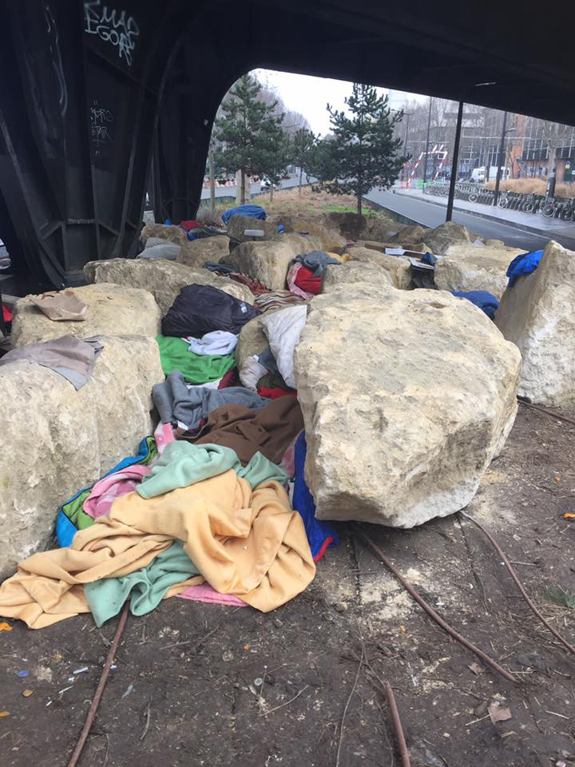

### AYS Digest 13/2: Stonewalled in Paris

_Targeting of the most vulnerable continues in Paris\. Volunteers encouraged to reach out prior to helping\. Cash cards in Greece: assistance or borders between borders? New insights on Macedonia returns to Greece\. Music and doctors’ visits on the educational menu in Serbia\._

Photo Courtesy of SoulWelders: Belgrade
### FRANCE: Paris

People in Paris continue to be targeted\. Unfortunately the peaceful evacuation of people that occurred last week seems to be a glitch rather than a sign of change\. Although the boulders installed under the bridge severely minimize the amount of space available in the location, people in need of shelter continue to squeeze in between the rocks\.

Photo Courtesy of Sarah Fenby\-Dixon

> The police continue to treat people with violence and cruelty\. I was told that blankets had again been confiscated yesterday morning, the police gassed people last night and boulders have been put in place to prevent people from sleeping under a bridge\. 

> I spoke to a young man who had been in Norway from the age of 14 but was rejected when he reached 21\. He is now terrified that he’ll be sent back to Afghanistan, where he has no family and knows no one\. He said ‘I just need someone to give me a chance\.’ — Sarah Fenby\-Dixon 

Volunteers also report a crackdown at the La Chapelle refugee center, with volunteers prohibited from distributing tea and eventually being asked to leave the area\.

With the plight of refugees in Paris increasingly visible, more well\-meaning people are looking to volunteer\. However, as in all “hot\-spots”, it is crucial to seek out and listen to the wisdom of experienced volunteers\. The following is a helpful reminder by long\-time volunteer and Paris resident Danika Jurisic\. The whole post \(available [here](https://www.facebook.com/permalink.php?story_fbid=1781255798867718&id=100009499466124&pnref=story) \) is an excellent guide, but here are some particularly crucial pieces of information:

> If you are coming with a car, make sure you have insurance and all the necessary documents, cause if you car brakes down, no one can help you\. You will end up paying enormous amount of money, and you probably won’t help anyone\. You need to be self sufficient and well organized\. 

> You might have been volunteer in Calais, Greece, Balkan, wherever, but that won’t help you in Paris\. This is not like other camps\. 

> If you come over and start a food distribution without coordinating with the rest of the groups, you will cause a confusion\. When it comes to food, it is really ridiculous to buy it in UK or anywhere and bring it all the way to here\. Paris has everything and the prices can be low\. There are many association that are coming on the camp and distributing food…\. 

> Do the research\! \! You need to know what is “la bulle” , where is Porte de la Chapelle, how to use google maps and your way in Parisian metro\. You need to be well informed and well organized, so we don’t lose experienced volunteers who could do much more if they weren’t babysitting \[other volunteers\] \. Get a functional phone and be sure you are available\. You have several prepaid cards that work perfectly within France, they will save you and us a lot of money\. Get Lyca number for free and top it with 5 euros…\. 

> We don’t have a warehouse, we don’t have many cars\. This is Paris, space is precious and expensive, we have improvised small storages within proximity of the camps, but they can’t be used for sorting, meetings, packaging or anything you were used to before\. Please come with neatly packed, organized donations and do tell us before distribution what are you bringing and how much of it\. Numbers are important\. 
 

>  If you are uncertain of what to bring, or invest into, check out the needs list: 
 

>  [http://app\.needslist\.co/lists/paris\-refugee\-camps/](https://l.facebook.com/l.php?u=http%3A%2F%2Fapp.needslist.co%2Flists%2Fparis-refugee-camps%2F&h=ATO5UvloAhmEl54MY7Xq11-5obD92ghsnnThTxQ5BFiKF028gloinfeA0fLJ1dj4dRuFbNhq6rzq4ruJg08d-ssM0bQezrTtz7kM5LGdt9D4zsf38HVbJ53SPaT6FkNwhxMsxUtqha5Uh7RPMpbEyQ&enc=AZOuhGDFP7S5vHpyImO40Zl6PSM2DTACH3MPlNpDMCa69BrgW4_FKwJY0z3fpV4SU2QR0EwSny2yPZkNwRRY-HskEzjkQ0I9N96mjIbQKNHAFwLYI0EYUlyXWta-qVuXDzR5MnBYKxfqtzYwEUXPoFqSo5gR19-BVUiZvomY6ADDqomkwr5P4wXg0kbE9B9h67Kl2sQsbPyE-beDZMpPBEd0) 

With careful research and humility, we can continue to make a positive difference \(no matter how small\) in the lives of the people stuck in limbo\.
### GREECE

New insights into the cash card system reveal some uncomfortable truths\. Refugee\.info has a comprehensive guide to the cash card system in multiple languages\. Some highlights are included below:

_Those moved to private accommodation are eligible for cash cards\. Additionally, if an individual is moved from a catered location to a non\-catered location, they may receive a higher amount of cash assistance to compensate for this\._

_Until April 2017, there is no time limit on spending the cash on the cash card — however starting in April, the amount will expire at the end of the month\._

_Individuals on an island who moved “without permission” to the mainland are ineligible for cash cards\._

_Those residing in squats are not eligible to receive cash cards\._

_Additionally unaccompanied minors are ineligible to receive cash cards\._

Photo courtesy of Refugee Support Greece

Although cash cards are a positive step, the amount of regulation and monitoring being implemented reminds us that these are also tools to exert leverage over people\. It is clear that people setting out on their own and choosing to live in squats are essentially being punished by being made ineligible\. The cash card system “de\-incentivizes” these options, and is thereby a way to further monitor and manage the movement of people\.

For further information \(in English\) on the cash program, click [here](http://blog.refugee.info/you-asked-cash-assistance-in-greece/) \.

We have already begun to see the repercussions of the program\. For example, people in Elliniko camp have not received supplies for babies for 3 months now\. They were told that since they receive cash cards they have to buy them for themselves\. A family of 3 gets 190 euros a month\. How is this sustainable by any stretch of the imagination? We don’t know\.

The prohibition on individuals who come from the islands to the mainland “without permission” is especially striking in the context of the updated refugee numbers by the Ministry of Health in Greece\. Although many camps on the mainland are under capacity, islands \(Chios and Lesvos especially\) are desperately over\-crowded\. And now it appears that people who try to escape this situation will face additional hardship and possibly be cut out of a crucial support structure\. Research the numbers for yourself [here](http://geochoros.survey.ntua.gr/ekepy/map) \.

Photo courtesy of Ministry of Health in Greece
### MACEDONIA

Long\-time refugee support organization LEGIS has published a comprehensive report on the removal of forty\-nine individuals from Macedonia to Greece last week\. The report emphasizes that although the refugees were readmitted to Greece via the official readmission procedure, due to poor communication they were given little to no notice, making the removal far more startling and traumatizing than it had to be\. The refugees were notified late in the evening that they would be taken in the early morning, giving them no time to say goodbye to friends and volunteers whom they had gotten to know over the previous 11 months together\.

> “We are happy that they will have at least some prospects now, accessing relocation in Greece\. Something they missed for 11 months in Macedonia, time that is complete waste of life\. But we are sad that our friends are gone, and even more that we didn’t have time to say proper goodbye\.” — a Volunteer in TC Tabanovce 

Again, this incident is another moment where efficiency has superseded humanity\. The whole underlying framework of refugee support should always be to support humanity, which decisions like this do little to affirm\. Instead, they treat people like packages to be mailed\. Several of the refugees recorded a video and sent it to Driton Maliqi, expressing their desire to say goodbye to good friends\.

Read the report in full [here](http://legis.mk/news/2244/greetings-from-koutsochero-camp-near-larissa-greece) \.
### Serbia

Refugee Aid Serbia is continuing to conduct English programming, focusing on relevant, survival English for refugees\. Today, the focus was doctor\-patient and dentist\-patient interaction\. These practical hands\-on skills not only take people’s minds off the here and now, but give them viable skills for the future\. Great work\.

Photo courtesy of Refugee Aid Serbia

In Miksaliste, the day took a musical turn with volunteers demonstrating and playing none other than the Queen Bee herself, with a rendition of the hit “Halo\.” Watch it below\!

_Converted [Medium Post](https://areyousyrious.medium.com/ays-digest-13-2-stonewalled-in-paris-4dd9362f1430) by [ZMediumToMarkdown](https://github.com/ZhgChgLi/ZMediumToMarkdown)._
