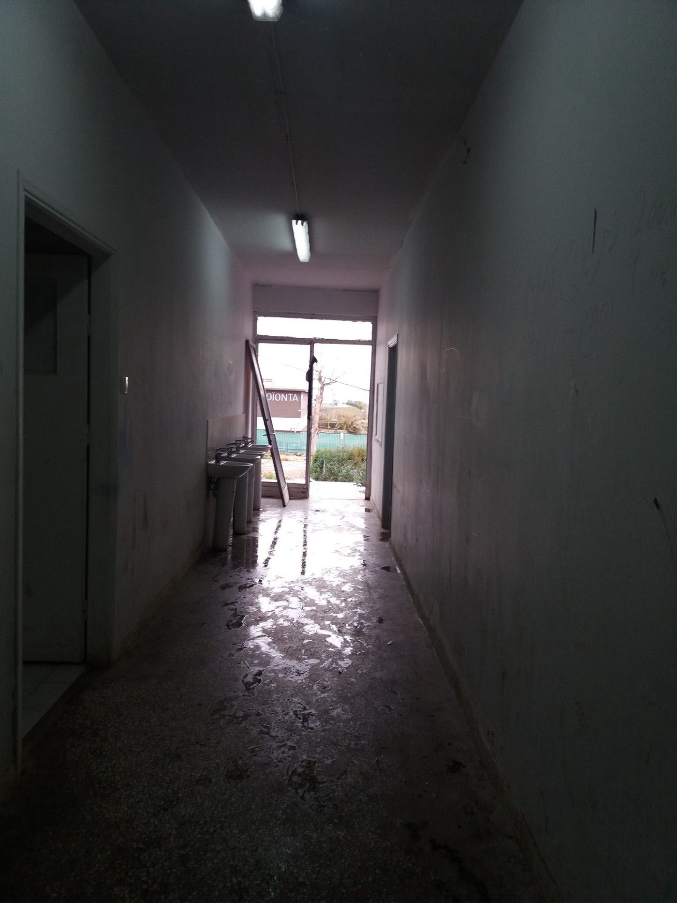
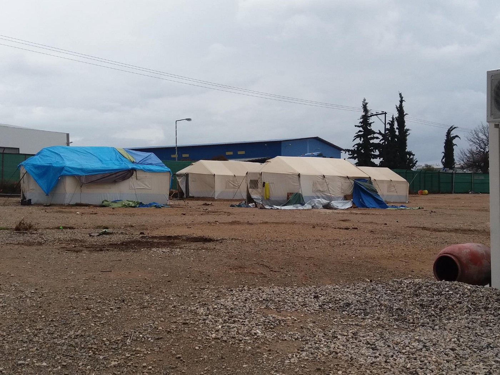
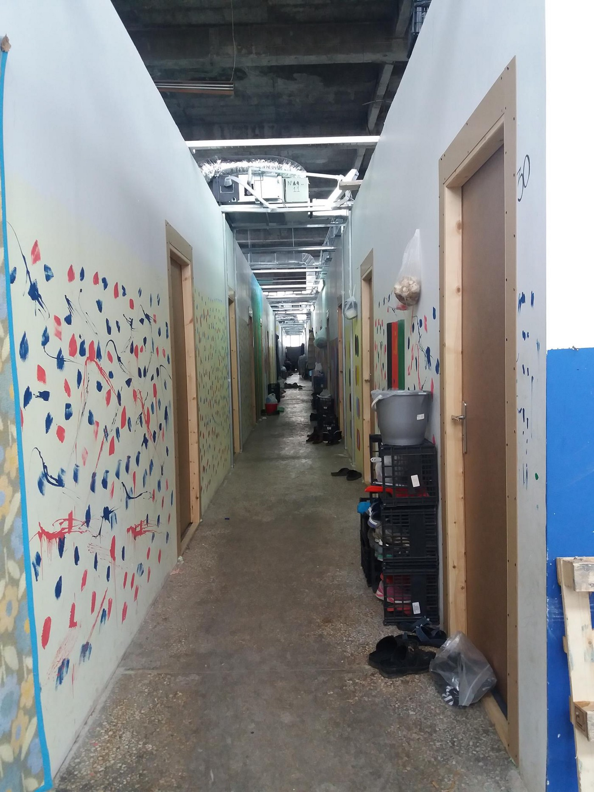
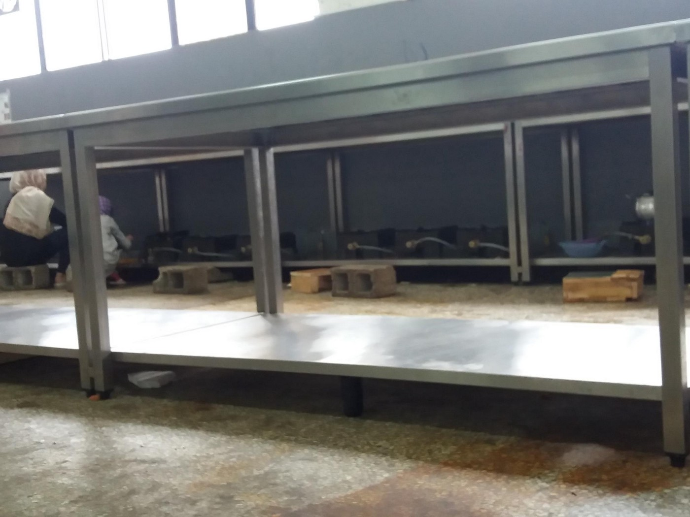

### AYS Daily Digest 14/02/17: The EU\-Turkey deal has been a disaster for thousands
#### Amnesty International calling out the EU leaders \| daily struggles in the Greek camps: a story from Oinofyta \| Report: **push\-back practices in 5 countries from Central and Eastern Europe** \| Germany: grounds for Refugee Status for Syrian men avioding compulsory military service

 \)](assets/ac16a570852f/1*G7pZ8aHO5M_JMDr8t7aB0g.jpeg)

A drawing by Heva \(9\) who was staying at the Mazarakis camp in Cherso, Greece, illustrates some of the dangers many people have been through and will never erase from their memory\. \. \. \( Drawing made at the [Open Cultural Center — OCC](https://www.facebook.com/OpenCulturalCenter/?ref=page_internal&hc_ref=PAGES_TIMELINE) \)
#### GREECE
### In detention according to the Deal

The deal aimed at returning asylum\-seekers back to Turkey on the premise that Turkey is safe for them, has left thousands exposed to squalid and unsafe conditions on Greek islands\.

In the new briefing “ [A Blueprint for Despair](https://www.amnesty.org/en/latest/news/2017/02/eu-human-rights-cost-of-refugee-deal-with-turkey-too-high-to-be-replicated-elsewhere/?utm_source=twitter&utm_medium=quote&utm_term=VGhlIEVVLV&utm_campaign=social) ” Amnesty International also documented unlawful returns of asylum\-seekers to Turkey in a flagrant breach of their rights under international law\.
Conditions on the Greek islands are not only degrading but also put the physical well\-being and lives of refugees, AI stresses out\. On top of that, the hospital doctors on Lesvos have [complained](http://www.ekathimerini.com/216164/article/ekathimerini/news/lesvos-doctors-accuse-ngos-of-failing-to-care-for-refugees) that the organizations receiving European Union funding to help migrants are not doing enough, resulting in them being forced to bear an excessive burden\. Several human rights groups have complained about conditions at Greek refugee camps, particularly Moria and Elliniko, in southern Athens\.

> “Nobody should die in the cold on Europe’s doorstep\. Leaders who claim the EU\-Turkey deal could be a blueprint for new ones with countries like Libya, Sudan, Niger and elsewhere should look at the horrible consequences and be warned: this should never be repeated\.” 

#### Relocation

141 relocations were organized in the week between the February 6 and 13, bringing the total to 8,874 relocated from Greece since the begining of October 2015\. Past weeks relocations were to these EU member states:
31 to France
32 to Belgium
39 to Ireland
32 to Portugal
7 to Slovakia

[**RefuComm**](https://www.facebook.com/refucomm/?ref=page_internal&hc_ref=PAGES_TIMELINE&fref=nf) reminds everyone of the legal aid services listings for each island and region:

> \- [Which organization does what, where and when?](http://data.unhcr.org/mediterranean/download.php?id=2185) 
 

> \- [Contacts list](http://data.unhcr.org/mediterranean/download.php?id=1999) for Protection Working Group member organizations in Greece at national level \(‘Protection’ in UNHCR terminology includes legal aid provision but is a wider category, so check the 4Ws spreadsheet above first\)
 

> \- Where are you or your refugee friend in Greece, and what is the nearest official site called where there might be [legal aid provision](http://rrse-smi.maps.arcgis.com/apps/MapSeries/index.html…) ? 
 

> \(use in conjunction with the 4Ws and Contacts spreadsheets above\) 

### Everyday struggle in Oinofyta camp

Around 600 people currently live in Oinofyta refugee camp near Athens\. 
This camp, as many others, is placed in the industrial zone, not that close to any urban area\. Even though people who run camp and volunteers are trying to make this place at least sutible for life, the conditios and situation we flund are just another proofe that it is time to close the camps and for all the people to be moved to apartments, hotels or allowed to continue their journey as soon as it is possible\.

Until December, people in this camp lived in tents\. Now they are moved inside of the old industrial building where they live in modest rooms with a thin partition in between, and open space above so it is very noisy, but at least with some kind of privacy\.

Toilets are a big issue for residents\. They are not sanitary or safe, especially for women\.

Until recently the camp had an issue with lice, bed bugs and scabies, but — according to Lisa Campbell, the camp manager who works with the [Do Your Part](https://l.facebook.com/l.php?u=http%3A%2F%2Fwww.dyp3.doyourpart.org%2F&h=ATMNjwZImavQbWoe4W0sOLbf7JyrMTd-2NEypdWslNBRVAO1qpAUAYdBP3Wo_IHpSTKPXO-YPqopRB02b6mKWvWALOn05qjuGwlPACbQMmn_ECeteG_F4WUaivecdi-OObo) organization from the US, they are still fighting with it\. “We assisted the residents in removing all of the mattresses from the rooms and we held two bonfires\. Teams of doctors have been working with the residents on controlling scabies,” she explained adding that by the end of this week, the old infamous UNHCR blankets should be replaced with the new ones\. 
While visiting the place, we saw rats around the building and learned that the management has been fighting it\. However, several hundred residents, among which 175 children under 18, including 6 newborn babies, have to live with rats, among other problems\.
The area where people sleep is large and cold, in spite of the heating system that was installed recently\. It is surely better than how it used to be, but hardly good\.

Photo: AYS

All except for nine male residents live inside\. Some of these nine have different metal problems, but they live in tents\. Menager explains that it was the only solution stressing the issue of the general lack of support for people with special needs\. “Some of the ones with mental health issues have been given help, but it is difficult because they have to go to Athens for treatment by a psychiatrist since there isn’t one in the camp,” she explains\. “As for the drug addicts, a few of them have also asked for help but we don’t have a drug counselor here and the doctors cannot give the necessary treatments\.”

Camp management acknowledges that, on a daily basis, the biggest problems are those “that stem from a loss of hope for the residents”\. The result are often fights and despair that can be felt when entering this camp, same as with many others\.

> They all want to move on and the slow pace of asylum services and the constant wondering, if they will be able to go somewhere else, is making them all edgy\. 

Inside the camp, there is a beauty salon, a hairdresser, and a place where some of the residents are sewing bags out of recycled materials\. They hope the bags will be sold online and the money will go directly to the residents\. These rooms are the only nice part of the camp\.

Photos: AYS

Inside of the camp, there are two medical groups who provide urgent care facilities, on\-call 24 hours a day for emergencies, help people with chronic diseases\. All the kids go to the school that is organized in the camp\.

Speaking well about the cooperation with the government in general, Campbell noted, however, that “they just seem to want to create camps and make sure that the physical needs are taken care of\. They aren’t looking at the cultural needs and psychological needs\.”

The food at the camp is supplied by the army catering\. Along with that, since May last year, Do Your Part manages to provide fresh vegetables and other dry goods to the residents who can cook for themselves\. Provisional kitchen was put up by Sea of Solidarity and there is a total of 45 burners for the residents to use\.

Provisional kitchen at Oinofyta \(Photos: AYS\)

Each week, around 3000 euros is spent on vegetables, rice, chickpeas, lentils, eggs, salt, sugar, tea, tomato paste and the gas for cooking\. “That comes to about 5 euros a person\. The government catering company is being given 4\.86 per day for each person so I think we are doing pretty good,” Campbel concludes\. 
Even here, volunteers are needed\. Contact address for those interested is: [DYPLisa@gmail\.com](mailto:DYPLisa@gmail.com) \.

](assets/ac16a570852f/1*ZwQFRqTCh5ilOitv5t71-w.jpeg)

Translators Without Borders are providing this newsletter in Arabic, English, Farsi and Greek\. To access these, click on [the link](https://drive.google.com/drive/folders/0B-_rJ_0o5IZIX0lma1dTZnFEUjA)
#### HUNGARY
### Pushed Back at the Door

Hungarian Helsinki Committee has recently published a [report](http://www.helsinki.hu/wp-content/uploads/pushed_back.pdf) describing **push\-back practices in 5 countries from Central and Eastern Europe: Bulgaria, the Czech Republic, Hungary, Poland and Slovenia\.**

Increased border control and the construction of physical and legal barriers restricting access to protection for people fleeing war and terror characterize this ‘scary new’ reality\. The political discourse shaping legislative and policy measures in the participating countries is centred around issues of security and terrorism, while little or no room is left for the obligation to grant the right to asylum and to protection\.
#### CROATIA
### From a Spanish classroom for an international classroom in Croatia

A beautiful initiative came from the students at the El Altillo School in Jerez de la Frontera, in Spain, who collected funds at the International Day they had organized and passed it on\. This has helped making it possible for us to equip a classroom in Porin asylum centre in Zagreb where the AYS volunteers work with schoolchildren every day to help them with the most important steps they are making as young asylum seekers in our country— their education\.

On the behalf of AYS and of our little friends at Porin, we send out a big **GRACIAS** to everyone in El Altillo School, together with their teacher setting a beautiful example of solidarity\!

Photos: the Spanish school team
#### GERMANY
### Full legal protection status for Syrian men who risk being drafted into the Syrian army

The administrative court Aachen ruled [in several cases today](https://l.facebook.com/l.php?u=http%3A%2F%2Fwww.taz.de%2FUrteil-zu-Fluechtlingsstatus-in-Deutschland%2F!5384673%2F&h=ATM9T_9rqEOchTrOsjNwOPaLgHczPUQ-rfl1Q_8B3BJy4pOlLNLPBWD9uegLkg5K97bno3cGT_Hh5-Iqc_w1W03-eTNgvHKbEyOwoxbdFfE-TqBsEs0G-lIzpZXRhW4mdkH6) , that military\-aged men from Syria have the right for full refugee status under the Geneva refugee convention and not only subsidiary protection\. The claimants came in 2015 to Germany and asked for asylum\. The judged argued, that men liable to military service aged 18 to 42 and reservists are only allowed to leave Syria when they have an approval\. Therefore it’s likely that the men, who wanted to avoid their compulsory military service, are being seen as oppositional and be persecuted\.
More concretely, what the court has found is that persecution due to conscientious objection to military service when that objection is based on a realistic belief that the person would be ordered to commit war crimes or crimes against humanity if they agreed to the military service is and always has been grounds for [Refugee Status](https://l.facebook.com/l.php?u=http%3A%2F%2Fwww.unhcr.org%2F3d58e13b4.html&h=ATM9T_9rqEOchTrOsjNwOPaLgHczPUQ-rfl1Q_8B3BJy4pOlLNLPBWD9uegLkg5K97bno3cGT_Hh5-Iqc_w1W03-eTNgvHKbEyOwoxbdFfE-TqBsEs0G-lIzpZXRhW4mdkH6) not just Subsidiary Protection\.

The court left open, if every asylum seeker would face persecution in Syria because of their stay abroad or their asylum requests, when returning\. Several courts have denied this in earlier decisions\.

The judgement is without legal capacity\. Federal government can still appeal against the decision at the Higher Administrative Court in Münster\.

If you have any information you would like to share with AYS, the best way is to [write us a message](https://www.facebook.com/areyousyrious/) or email us at: areyousyrious@gmail\.com

_Converted [Medium Post](https://areyousyrious.medium.com/ays-daily-digest-14-02-17-the-eu-turkey-deal-has-been-a-disaster-for-thousands-ac16a570852f) by [ZMediumToMarkdown](https://github.com/ZhgChgLi/ZMediumToMarkdown)._
