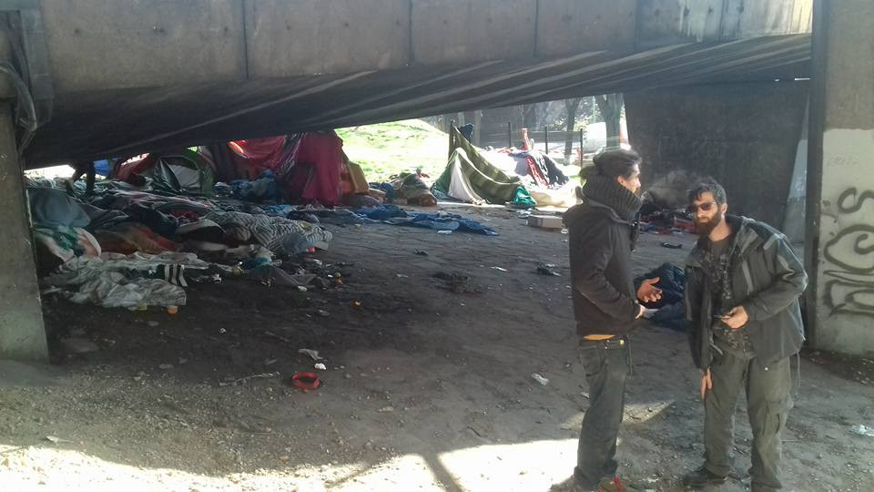
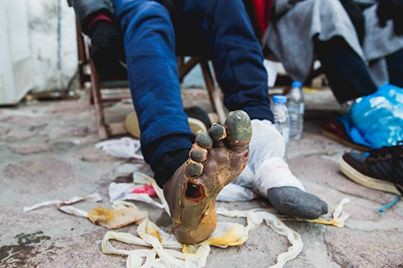
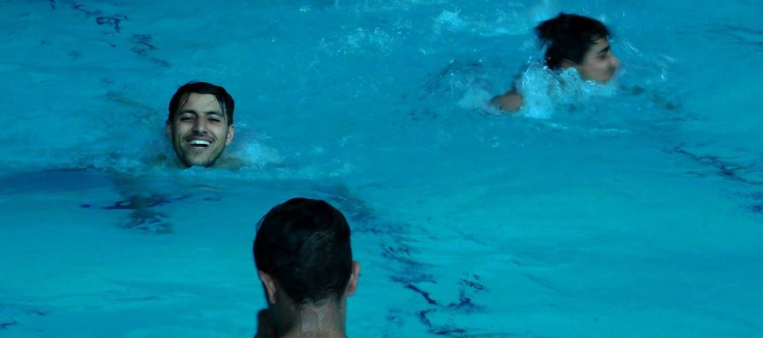
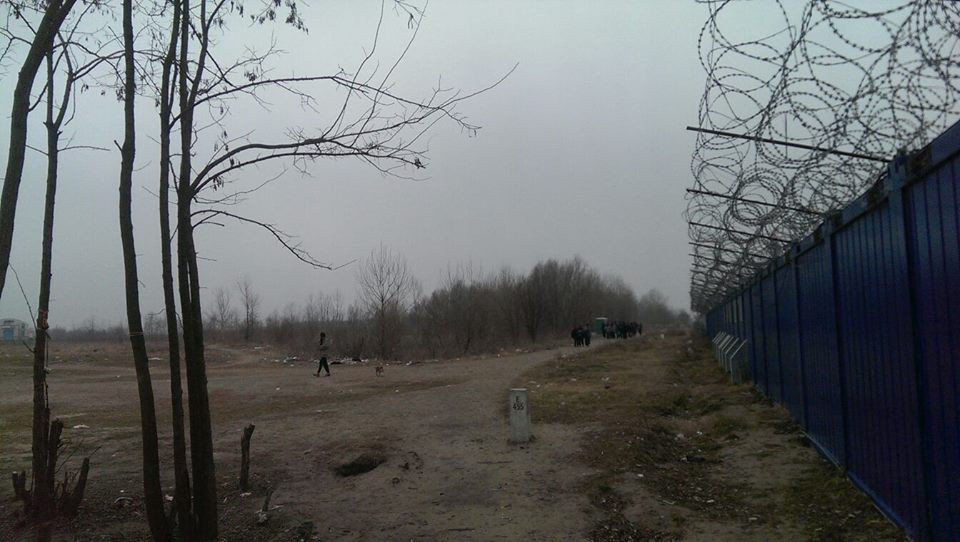
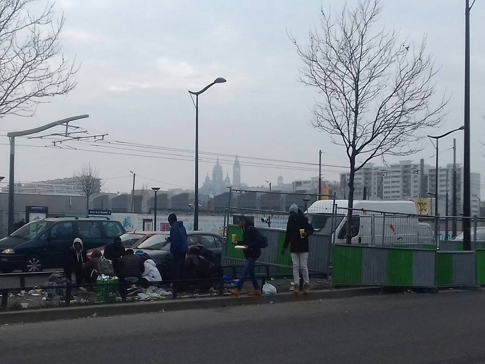

### AYS digest 15/02: No peace and no solution for many sleeping in the streets

Port de la Chapelle\. Paris\. Photo: Jonathan Rebours

_New arrivals in Greece — worst case of frostbite / UNHCR in coordination with local authorities reached a deal to provide more hotel accommodation in Rhodes and Piraeus / Special unit dealing with Pakistani asylum seekers opened in Athens / Push backs in Macedonia / Swimming pool project on the go in Belgrade / Reports on police violence on the border of Serbia and Hungary / Unbearable situation for rough sleepers in Pordenone municipality in Italy — activist demand public property houses to be opened to house those in need / People still sleeping rough in Paris and still being harrased_
#### Greece
### **Worst case of frostbites**

As reported from the field there was one boat today picked up close to Molyvos by Frontex and transferred to Skala\. There were 57 people in total 2 children 19 women and 36 men\.

Many of the men were suffering from frostbite on their feet and the picture below shows one of the worst cases\. Volunteers on the ground underlined that “If anyone doubts the desperation of these people and the need to flee this photo is testament to their determination to reach what they see as the safety of Europe\.”

Worst case of frostbites\. Photo Aaron Storry
### **UNHCR in coordination with Rhodes and Piraeus local authority to lease hotels for refugee accommodation**

As camps are not just overcrowded, but also bad for business, authorities in Rhodos presented today that UNHCR plans to house 40 refugees in a hotel leased for purpose of housing those that are in migration\. This effort is described by islands’ authorities and reported by Rodiaki\.gr as an attempt to prevent hot spot creation since it is something that island’s core economy — tourism, can not handle\. This same thing is about to happen in Piraeus with the same number of units organized by UNHCR\.
### **Regional Asylum Office in Athens has opened a special Unit dealing only with asylum claims of Pakistanis**

In another move by the authorities, and as reported by Mobile info team from refugees in Greece, the Regional Asylum Office in Athens has opened a special Unit dealing only with asylum claims of Pakistanis\. The Asylum Service said that this unit will be able to process 30 to 40 cases each week\. This will improve the chance to get through on Skype and get an appointment with the Asylum Service\. In the past the waiting time for a Pakistani to get an appointment was around one year\. Now, according to the Asylum Service, it might only be a few days\. The times to call Skype for Urdu speaking refugees are: Monday, 15:00–16:00; Tuesday, 14:00–15:00; Wednesday, 10:00–12:00; The Skype ID to call is asylum\.service\.urdu
#### Macedonia
### **Push backs in Macedonia**

Macedonia continues with pushback of people who are trying to cross border from Greece\. People are being arrested and pushed back on a daily basis, but the authorities are not willing to share the numbers with the public\.

However, some people who are stranded in Macedonia for some time, decided to voluntarily go back to Greece, the first EU country they entered\. Five people from Vinojug camp, near Gevgelija, returned\. There is 55 people in this camp now\. In the camp Tabanovci, on the border with Serbia, there is 47 people and around 20 in the asylum center Vizbegovo, near Skopje\.

People who manage to get through Macedonia are usually smuggled by cars to the northern border at the village of Logan\. Volunteers and the Red Cross in the field are trying to provide first aid and emergency help in food and other basics\.
#### Serbia
### **Swimming pool project in Belgrade**

SoulWelders team announced today that their swimming pool project is still on the go stating that “The residents being in such deplorable conditions,have to go through extreme and unfair measures to obtain a simple clean, boiling water in dirty oil drums was the nearest\. That means outside and under freezing conditions, old stoves and a fire warming the water and an empty plastic bottles to pour their naked torso\. As a result, they can hardly ever get one\. Independent volunteers like [Jelka Zorn](https://www.facebook.com/jelka.zorn) started up the idea on how we could help them get this basic hygiene treatment and humanize their lives a little\. Together we decided that the swimming pool idea was just perfect\. For a week now, by groups of five, residents walk through town to get to a public swimming pool\. We provide them with tickets, swimming suits and towels, and they can enjoy a normal day where they take a shower and swim like everyone else\! So simple yet so meaningful” SoulWelders team thanks everybody for donating for this action since those donations made it possible\.

Swimmingpool joy\. Photo: SoulWelders
#### Hungary
### **Police violence on the border**

[Signal of Solidarity — Flüchtlingshilfe](https://www.facebook.com/SignalofSolidarity/) team is operating in Budapest and the transit\-zones of Horgos/Roeszke and Kelebija/Tompa these days\. They have encountered a group which states that they have been beaten by Hungarian police while trying to cross the border\. Police, in a manner so familiar, also destroyed their phones to make them unable to orientate or communicate\.

The border\. Photo: Signal of Solidarity — Flüchtlingshilfe
#### Italy
### **Activists from Pordenone demand long term solution for rough sleepers**

It seems that the practice of stealing blankets from refugees sleeping in the streets is not practiced only by the French, but also Italian police\. Rete Solidale Pordenone published a statement today citing that these practices are happening over and over again in Pordenone\. In their statement they are praising the efforts of those, such as Rifondazione Comunista’s who have received refugees in their offices, but are stating that such efforts are not sustainable and demand that the municipality provides long term solution, enable the existing centers to receive people temporarily, but open up houses that are public property for those in need\.
### **International conference on migration in Como**

There is an upcoming international conference on migration to be held on Saturday 18 February, 9am to 1pm, at Teatro Sociale in Como\. If interested, please follow [this link](https://www.facebook.com/osservatoriomigranticomo/photos/a.744394972361875.1073741828.730614903739882/921879921280045/?type=3&theater)
#### France
### People sleeping rough in Port de la Chapelle

Activists and volunteers on the ground in Paris state that the situation with rough sleepers in Paris is unbearable and that police is still harassing people for having nowhere to go\. Last night they counted 400 people sleeping rough around Hidalgo’s ‘humanitarian centre’\. Some have been here for months and the police continue to make life as unbearable as they can\.

Port de la Chapelle\. Photo: Jonathan Rebours

_Converted [Medium Post](https://areyousyrious.medium.com/ays-digest-15-02-no-peace-and-no-solution-for-many-sleeping-in-the-streets-67548adc711f) by [ZMediumToMarkdown](https://github.com/ZhgChgLi/ZMediumToMarkdown)._
