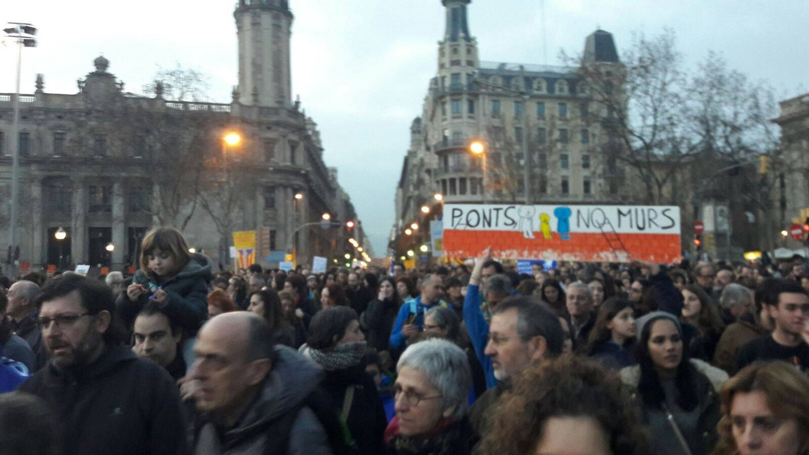
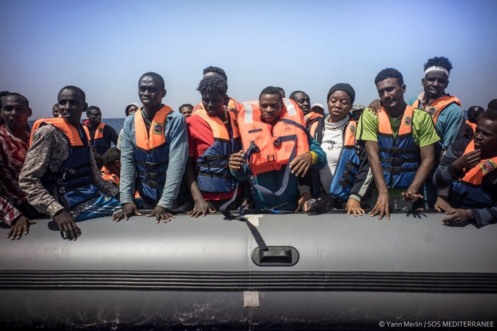

### AYS DAILY DIGEST 18/2/2017: Casa nostra es casa vostra

_300\.000 people in the streets of Barcelona saying refugees are welcome // Refugees in Greece protesting inhuman living conditions in Elliniko camp // Prosecution in Italy investigates those who are rescuing people from the sea instead smugglers // Volunteers efforts in Paris_

### Feature
#### Democracy killed by the borders

Hundreds of thousands of people in Barcelona went out on the streets marching to urge Spanish government to take in at least 16,000 refugees, as they are obliged to do under a quota system agreed in 2015\. The march was organized by a grass route group calling itself [Casa Nostra Casa Vostra](https://www.facebook.com/volemacollir/) \(Our home is your home\) \. According to the independent sources, more than 300,000 people took part in the protest\.

Unlike some other politicians, Ada Colau, the mayor of Barcelona, called residents to “fill the streets” and march under the slogan “Volem acollir” \(“We want to welcome them” in Catalan\) \. Many held signs saying: “Enough excuses, welcome them now”\.

Photo by Casa nostra, casa vostra

Like most of the EU countries, Spain failed to fulfill its promise accepting only 1,100 people so far\. Last year, the mayor Colau called all the people who are willing to accept refugees in their homes to register\. Her call resulted in thousands of emails all over the country\. However, it did not make the government fulfill its obligation\. Even more, they did more than most of the other EU member states to tighten the borders\. Today, citizens of Barcelona reminded them about their promise while saying that everything is ready to accept people who need home\.

Citizen in many EU countries expressed their willingness to accept refugees and migrants, but their governments are not listening to these voices, undermining the basic principle of democracy, rule of the people, and violating human rights of thousands\.

According to the official numbers, no relocations from Italy occurred this week\. Since the beginning of the relocation scheme, 3,205 persons from this country were relocated, which is just 8 percent of the initial 39,600 target\. From Greece, 188 people were relocated from over the same period of time: France \(63\), Ireland \(39\), Portugal \(38\), Belgium \(32\), Estonia \(9\) and Slovakia \(7\) \.

According to the EC figures, 8,874 persons have been relocated from Greece to other European countries since the beginning of the relocation scheme, which is 13 percent of the initial 66,400 target\.

### Greece

Residents of the Elliniko camp in Athens protested today again against the terrible living conditions\. This old, abandoned, Olympic complex has been turned into the refugee camp where over 1000 people are forced to live until today\. Conditions are more than inhuman\. The camp is under the control of the Ministry of Migrations that forbids access to independent volunteers and even friends of residents\.

Living conditions in Elliniko\. Photo AYS\.

People of Elliniko demand immediate housing\. The government promised several times last year that the camp will be closed down, but they failed to fulfill that so far\.

Despite dreadful living conditions for refugees, more people are arriving every day to Greece\. According to the official figures, between 6 and 12 February, 207 refugees and migrants were registered in Greece as new arrivals, which is less than the week before when 460 were registered\. However, the main cause for this decrease is bad weather\.

Most of the people arrived at Kastelorizo \(85\), and Lesvos \(54\) \. All the islands are overcrowded for months now\. In order to accommodate new arrivals, more people are sent to the mainland, to apartments, hotels and some to camps\. Between 4 and 10 February, 507 people were transferred from the islands to the mainland \(305 Lesvos, 124 Chios, 68 Samos, seven Leros, and three Rhodes\) \.

But despite relocations, the situation at the islands remains horror like\. Reports of incidents of self\-harm, suicide attempts, and panic attacks on Samos are numerous which is expected to have in mind that people are still living in tents on the sea shore, having little to no hope that they will soon have a chance for a normal life\.

More official number:

> Total arrivals in Greece \(Jan — Feb 2017\): 1,936
 

> Total arrivals in Greece during Feb 2017: 543
 

> Average daily arrivals during Feb 2017: 36
 

> Average daily arrivals during Jan 2017: 45 

> Daily estimated departures from islands to Mainland: 45
 

> Estimated departures from islands to Mainland during Feb 2017: 863
 

> Dead and missing: 272 dead — 152 missing \(2015\)
 

> 146 dead — 51 missing \(17 Nov\. 2016\)
 

> \(Source: Hellenic Coast Guard, Greek territorial waters\) 

> 21,000 estimated number of refugee and migrant children across Greece\. Among them 2,200 UAC
 

>  2,792 children have been relocated from Greece, as of end of January Among them 233 UASC relocated or in the process to be relocated \(4 November 2015–31 January 2016\)
 

> 53 accompanied children have been returned to Turkey through the EUTurkey statement \(20 March\- 31 January 2016\) 

IMPORTANT INFO FROM REFUCOM

[Please seek legal aid to prepare BEFORE your asylum interview](https://www.facebook.com/refucomm/posts/399606917057783?hc_location=ufi) \.

RefuComm reminds that the asylum interviews are typically taking around three hours per person, and sometimes even more\. That is why it is important to be well prepared\.

Use [RefuComm’s information](http://refucomm.com/information/?lang=ar) in combination with getting individual advice from an asylum lawyer\.

If you’re not sure where or how to find and contact the free legal aid services that are available in Greece, Europe and worldwide, [please check RefuComm post here](https://www.facebook.com/refucomm/posts/397335963951545) \.
### Italy

People are continuously arriving in Italy, where living conditions for refugees and migrants are hardly improved\. From 4 to 16 February, 1,018 persons, including 39 unaccompanied and separated children, arrived by sea\. All of the new arrivals departed from Libya, coming from sub\-Saharan African countries and Morocco\. However, people from Bangladesh and Pakistan were among new arrivals\.

At the same time, people from Greece are finding their way to Italy\. On 9 February, 91 Iraqi and Iranian nationals, including many families, arrived in Apulia after two days long trip\.

Some interesting information is published by the media this week about the work of the Italian prosecution\. Apparently, the ongoing investigations are focusing on the boats that are saving lives instead of on smugglers\. AFP quotes a prosecutor who said that there is “an abnormal proliferation of NGOs operating” at the sea, adding that some of them have sophisticated equipment and that they investigate who is financing them and why\.

A number of organizations have their boats in the sea and they are saving lives every day\. The first once to launch a private rescue boat was the Maltese organization Moas who are in the sea since the summer of 2014\. Since 2016, they were joined by the boats by the German NGOs Sea Watch, Sea Eye, and Jugend Rettet, as well as the Dutch Lifeboat Project, the Spanish Proactiva Open Arms, and the Aquarius by SOS Mediterranean and Doctors Without Borders \(MSF\) \.

Photo by SOS Mediterranee, Yann Merlin\.

MSF slammed these investigations saying that the NGOs were “not the cause but a response” to a humanitarian crisis, and had been forced to act because Frontex was failing to prevent migrant deaths at sea\. Only today, 467 people have been rescued by the boats operated by the NGOs\.
### Serbia

It is estimated that there are around 7,700 refugees and migrants in Serbia at present\. Almost 90 percent are accommodated in the government\-run centers, while the other are staying rough in Belgrade or near the Hungarian border\. According to some estimates, around 250 men were sleeping rough around Subotica last week\.

Volunteers are still with them trying to provide basic help and improve their living conditions\. Unfortunately, a second person died last week due to hypothermia\. The body of a Pakistani man, who was supposedly left behind by smugglers near the Serbian\-Bulgarian border at the end of January, was discovered\. His body was transferred to his relatives in Western Europe\.
### Hungary

During this week, 53 people managed to enter Hungary legally\. Additionally, the Hungarian police arrested 32 persons who tried to cross illegally, while 329 were prevented from crossing and another 236 were intercepted inside Hungary and pushed back\.
### France

The situation is not getting any better for people in the streets of Paris or in Calais\. According to various volunteer resources, in the North of France, over 150 unaccompanied children are sleeping outside\. Many were removed from “the Jungle” in November last year\.

Volunteers are not abandoning them\. Only in Paris numerous groups are present, as well as locals who are bringing warm clothes, blankets, sleeping bags, food, and drinks\.

 \.](assets/e6a3317af1f7/1*a8MjlvNWi3gldX4u_h7Y5Q.jpeg)

Photo by [Solidarite migrant Wilson](http://Solidarité migrants Wilson) \.

AYS volunteer in the field reports about activities of different groups:

“PRGS is a very active group going around the north\-eastern part of the city between Saint Denis and Gare du Nord where many refugees sleep outside, giving out aid every night and some days doing specific distributions like shoes, jackets, trousers, etc\. \. on a bigger scale\. These distributions have to be very controlled and need a substantial amount of volunteers to help out when comparing to the night distributions that don’t require the team to stay in one place for very long\. Every night the team gives out the basic needs like warmth items and food and also some specific items requested by individual refugees\. At the end of the shift, the group gets the numbers of people found and keeps a record of them\.

Utopia 56 is a more official group that practically runs the Hidalgo center that works as a camp for single men\. Emmaus is another NGO that in reality is in charge of the reception center and interviewing refugees in the so\-called “bubble,” and are funded by the state\. Utopia, nevertheless, seems to be the organization that looks after the refugees in the center and gives them aid\. This center consists of the “bubble” which is the most visible structure on the street but not the most important in terms of sheltering people\. They rely on volunteers, many of them students, to sort out donations and do distributions around the center\. Utopia has a system in place dividing the city into sections with different drop off points and volunteers are assigned in those areas and then donations are collected and sent to the center or where needed\. They also make trips to Calais from time to time\.

A part of the team also goes out at night trying to pick up the most vulnerable refugees sleeping outside giving priority to children, women and sick people\. They have four hotels funded by MSF where they can place around 65 people every night and every night they fill it up\. Refugees can only stay for one night at the time which means that they can only hope to be lucky and get picked up again the next day\.

For a long time, volunteers have organised themselves to bring refugees to hospitals and guide them through French bureaucracy and since January, MSF has a mobile clinic that is present in front of the centre three times a week\.

_Converted [Medium Post](https://areyousyrious.medium.com/ays-daily-digest-18-2-2017-casa-nostra-es-casa-vostra-e6a3317af1f7) by [ZMediumToMarkdown](https://github.com/ZhgChgLi/ZMediumToMarkdown)._
