### AYS NEWS DIGEST 17\.02\.17 — Children in Calais prevented from taking showers

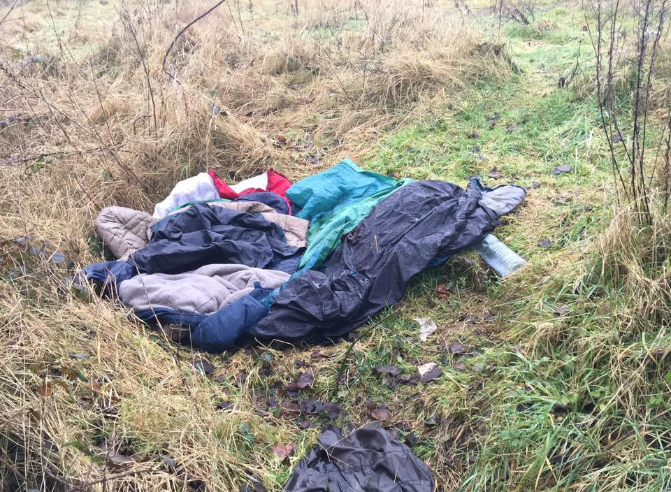

Photo by Care4Calais

_Volunteers needed in Dunkirk//Home Office gives bad justifications for abandoning the Dubs amendment//Turkish camps evicted//_
#### France
### Police prevents children from taking showers

After having described the UK and its “weekly benefits of £36” as a problem transforming the country into an El Dorado for refugees, Calais mayor Natacha Bouchart now seems to believe that portable showers are what atttracts children all the way from Eritrea to Calais, and is doing everything in her power to stop this famous “pull factor”\.

On Wednesday, police arrested Mariam Guerney from the Secours Catholique, journalist Haydée Sabéran and seven minors as they were taking them to the showers recently installed by the NGO\. They were taken to the Coquelles police station, and released after more than an hour\. Interestingly, [Passeurs d’Hospitalités](https://passeursdhospitalitesenglish.wordpress.com/2017/02/16/calais-journalist-haydee-saberan-secours-catholique-employee-and-seven-minors-arrested-in-front-of-the-showers/) notes that the CRS communicated with their superiors via radio and the arrests therefore seem to have been validated by hierarchy\. The arrests come a week after the mayor used her resources to block access to the showers via a [rubbish skip](http://www.lemonde.fr/societe/article/2017/02/09/migrants-a-calais-la-municipalite-bloque-l-entree-d-un-batiment-du-secours-catholique_5077132_3224.html) \. Her attempt to prevent children from taking showers however was denied by a local court, which gave the city 24h to take the rubbish skip away\.

Meanwhile, Sabéran in her [article](http://www.liberation.fr/france/2017/02/16/a-calais-suivez-nous-on-vous-emmene-pour-aide-a-l-immigration_1549035) on the events of the day, says that the Secours Catholique has already detected two cases of scabies and one case of Impetigo, further demonstratig the necessity of these showers\.

Volunteers say refugees, including kids as young as ten, have been returning to Calais from all over France\. Around 600 are back in the area, now living in the woods and fields and some in squats\.

The situation is desperate, with the local group “Calaisiens en colere’ hunting people and calling the police on them whenever they can\. Several volunteers also say that police have been destroying tents and stealing blankets and while some of the youngest kids are being sheltered by volunteers or local people, they are still at danger when trying to cross into the UK at night\.

Given the context, there is a great need for volunteers and a vital need for donations\. With police on the hunt and destroying tents, volunteers say that bivvy bags are the best option for refugees sleeping rough\. They further say they need to be in goretex or a similar material and should only be in dark colours to avoid detection\. Sleeping bags need to be 4 season, meaning they should be suitable for conditions below O°\.

Herts for Refugees has managed to source a really good quality and low cost supply of ex army kit\. A 4 season sleeping bag and army issue bivvy is just £17\.50 for the two; an army issue blanket is £6\. You can text PARI15 followed by the amount you want to donate to 70070 or paypal: [info@hertsforrefugees\.org](mailto:info@hertsforrefugees.org) \. You can also buy for direct delivery to the warehouse from [Leysurefare](https://www.leisurefayre.com/section.php/86100/1/help_refugees) \.

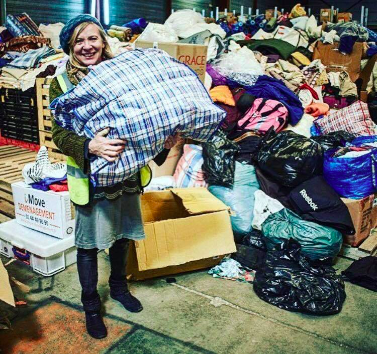

Photo by Megan Stuart
#### Dunkirk
### Volunteers needed in Dunkirk

The Dunkirk Refugee Childrens’ Centre is looking for a highly motivated, independent volunteer to take the lead in developing their new Youth Program for teens and unaccompanied minors in the Dunkirk Refugee Camp\.

The role of the Youth Coordinator will focus on liaising with local authorities and camp managers to secure a safe space for the RCC Youth, overseeing a program of recreational activities for teens living in the camp, increasing access to and participation in education in French colleges and the tracking and safeguarding of unaccompanied minors and other vulnerable teens\.

The role requires strong skills in logistics and excellent interpersonal skills\. Fluency in either French or English is essential\. Please contact dunkirkchildrenscentre@gmail\.com for more information\.

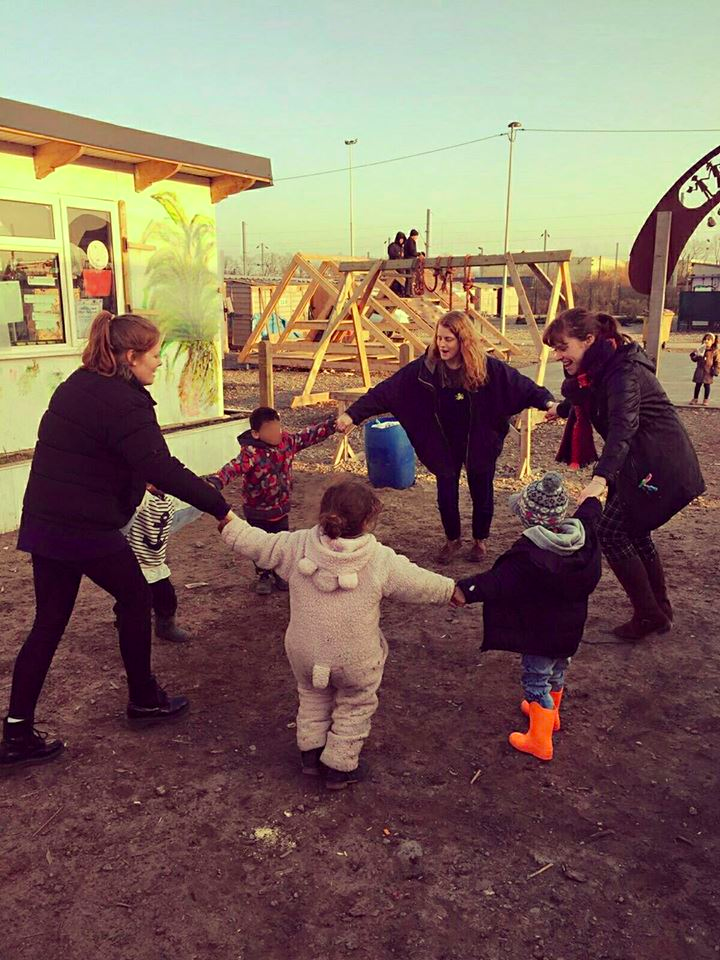

Photo by Refugee Children’s Centre

The centre is also looking for volunteers to fill the following positions:
- Additional Needs Support Workers 
• Education Coordinators \(3–7 and 7–12\) 
• Activity Coordinators
• Sports Coordinator 
• Community Outreach Officer

### Show of solidarity in Paris

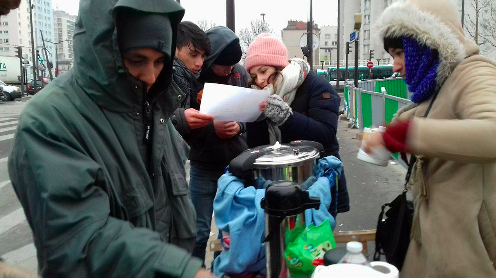

Photo by Solidarité migrants Wilson

After having been told to move away from the centre to distribute food and tea, the group “Solidarité migrants Wilson” calls on people to meet at 10h30 on Saturday to distribute breakfast and show solidarity, despite obstacles put in the way by the authorities\. Paris Refugee Ground Support says they had no issues with the police last night and were able to distribute without problems\. However, tensions between Afghans and Sudanese are rising, given the difficult access to the Parisian refugee centre\.
### Yet another death due to borders

A refugee died on the Ventimiglia\-Cannes railway line this morning according to [Repubblica Genova](http://genova.repubblica.it/cronaca/2017/02/17/news/ventimiglia_migrante_morto_sul_tetto_di_un_treno-158536549/) \. Authorities say he climbed onto the roof of the train in the hope of eluding controls and was electrocuted by high voltage cables\.
#### UK
### Inaccuracies in the Home Office explanation for abandoning the Dubs Amendment

Home Secretary Amber Rudd has given four separate justifications for abandoning the Dubs amendment, which Help Refugees says are not justifiable reasons for Britain to close its door to the most vulnerable of refugees\. We decided to post the whole article, as it describes in detail not only why the justifications are false but also why the Dubs amendment remains an existential need for these kids\.

**1\. The Dubs amendment “acts as a pull”\.**

Help Refugees says “ _There is no evidence for this\. It is highly unlikely that foreign children and their families have knowledge of or an understanding of a complex British legal framework\. Regardless, only children that arrived before 20th March 2016 are being considered\.”_

**2\. The Dubs amendment is leading to children using people smugglers\.**

Help Refugees says _“People smuggling can only exist in the absence of safe and legal routes\. Aidan McQuade, director of Anti\-Slavery International has said “the absence of safe migration options for vulnerable people fleeing war has been the single greatest factor to increase the risk of human trafficking in Europe over the past two years”_

**3\. Child refugees in refugee camps in Jordan and Lebanon are more vulnerable than those unaccompanied in Europe\.**

Help Refugees says _“This playing off of two highly vulnerable groups against each other is a distraction\. Whilst child refugees in Jordan and Lebanon are undoubtedly vulnerable and in need of assistance, so too are those unaccompanied refugee children in Europe\. A year ago the EU’s criminal intelligence agency Europol warned that pan\-European gangs are targeting minors for sex abuse and slavery\. They claim that at least 10,000 children have gone missing — a number that is likely now greatly increased’\._

**4\. The 350 number that has been reached was through consultation with local authorities, thus is not the decision of the government — they are only fulfilling what they are obliged to\.**

_“The consultation process was opaque and hugely flawed\. Local authorities have not been given the opportunity to continue to offer spaces\. Andy Elvin of TACT, the UK’s largest fostering and adoption charity has described the government’s claim that local authorities have no more space for refugee or unaccompanied children and young people as as “lie”\. He states that “When the immigration minister, Robert Goodwill, announced that there was no capacity, this was based on a complete absence of knowledge about the capacity in the sector\.”_

5\. **\(Bonus\) France does not want the UK to accept more children as it fears this acts as a ‘pull effect’**

This argument made by Home Secretary Amber Rudd has left French authorities ‘astonished’ according to [Le Monde](http://www.lemonde.fr/referendum-sur-le-brexit/article/2017/02/17/tensions-entre-londres-et-paris-sur-l-immigration_5081120_4872498.html) \. A French diplomatic source says France never asked the UK to stop the process, and on the contrary asked the government to reexamine cases it had previously rejected\.
### Creation of the Alf Dubs Children’s Fund

Regardless the roadblocks, Lord Dubs trucks on and is launching a fund to help bring children fleeing war and persecution to Britain, according to the [Jewish Chronicle](https://www.thejc.com/news/uk-news/kindertransport-peer-launches-fund-for-refugees-after-government-u-turn-1.432839) \. Lord Dubs and ten of his fellow Kindertransport refugees have set up the [Alf Dubs Children’s Fund](https://alf-dubs-childrens-fund.fundraise.tech/) and donated between £500 and £1,000 each\. The money will be used to help Citizens UK’s Safe Passage project to open safe and legal routes to Britain for children\. Bob and Ann Kirk, who also came to Britain on the Kindertransport and have donated to the fund, explained:

> “If our private sponsors hadn’t supported us, we wouldn’t be here — nor our children, grandchildren and our new great\-grandson\. Today’s refugee children also deserve the chance of a secure future\.” 

#### Greece
### Update from Katsikas

Refugee Support Greece has started to prepare for new arrivals at the Katsikas camp, cleaning out the hangar and dismantling old shelves before the building team moves in to create a series of dignified shopping spaces\.

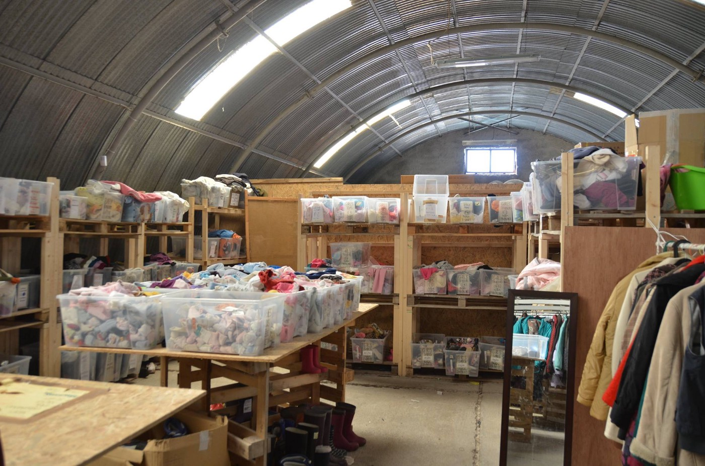

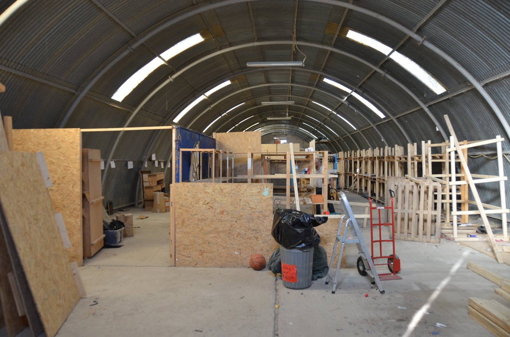

Photos by Refugee Support Greece
### Racists lock school gates in Oraiokastro

Members of the “Patriotic Union” locked school gates to stop refugee kids attending school in Oraiokastro\.

[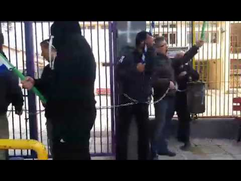](http://www.youtube.com/watch?v=5a7rs-cz4Ek)

Anti\-racist groups and residents turned out to support the kids and face down the racists at the school gates and the children were later able to enter through another building\.
### Swisscross’ new projects in Lesvos

In just a few days, Swisscross has been able to start or advance several new projects\. The group has started to work with No Borders and the social kitchen “The Other Human” to provide foodstuffs so that refugees can cook their own specialties and also provided 20kg of flour to Pakistani refugees so that they can start baking bread\.

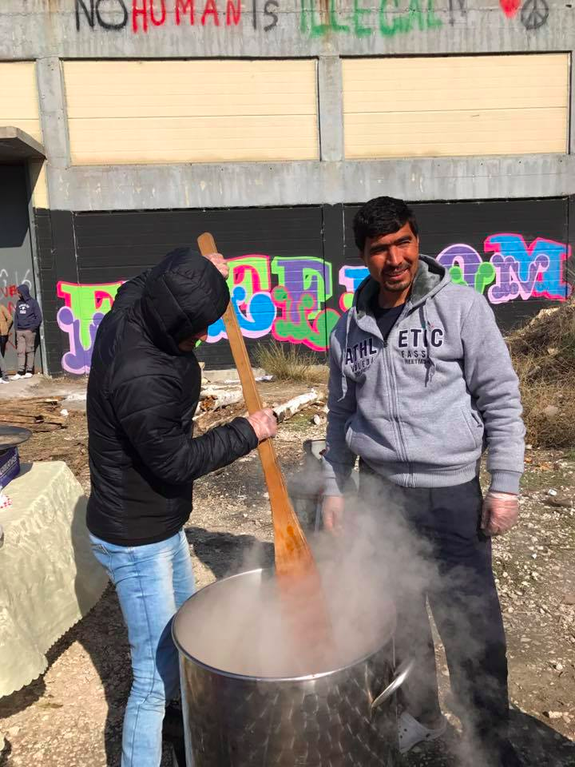

Photo by schwizerchrüz\.ch Michael Räber

Swisscross is also building a community centre for the residents of Kara Tepe and Moria and previously helped people completely clean and empty the squats they are living in\.

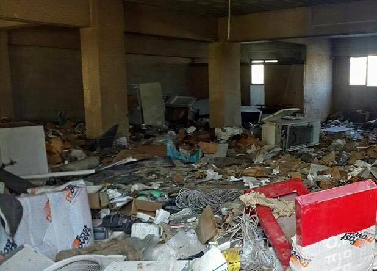

Before and after\. Photo by schwizerchrüz\.ch Michael Räber

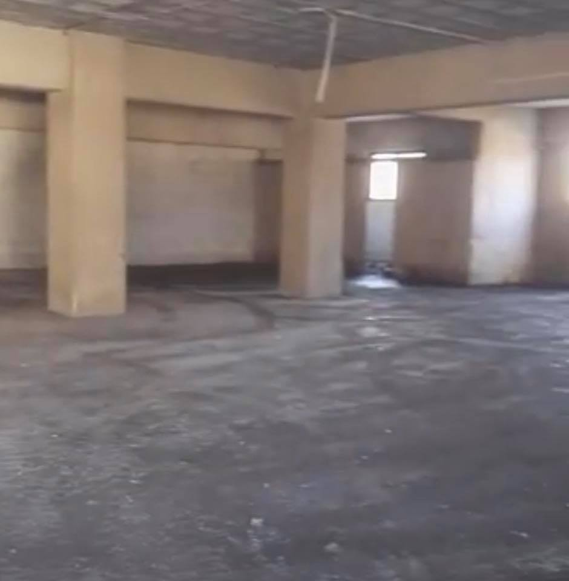

The group is [looking for new volunteers](https://swisscrosshelp.herokuapp.com/volunteers_en) for its projects on Lesvos\. For more volunteering opportunities you can check out [Greecevol](http://greecevol.info/) as usual\.
### Transportation problems for eligibility interviews

As a volunteer from Athens informed us, the backlog of full registration interviews should be completed by the end of February, so many more people will soon be having eligibility interviews\. The Greek Asylum Service is giving some people in Athens eligibility interview appointments three hours away in Patras and some families are missing their appointments as they cannot afford the bus or train ticket\. While they will get a new appointment, the problem will remain the same\. The train ticket costs €17 return per person — so far, volunteers have managed to cover these expenses but that is clearly not the long\-term solution\.
### Guidance note on housing of refugees

The [Athens Volunteers Information and Co\-ordination Group](https://www.facebook.com/groups/AthensVolunteersInformation/) has compiled a [guidance note](https://drive.google.com/drive/folders/0B5eHzYChsokickdsVVMzcVNGeVU) highlighting some of the issues that volunteers need to think about when considering providing housing of refugees\. The guidance note includes “hints and tips for future management of housing needs” and has been updated to include legal issues as well\.

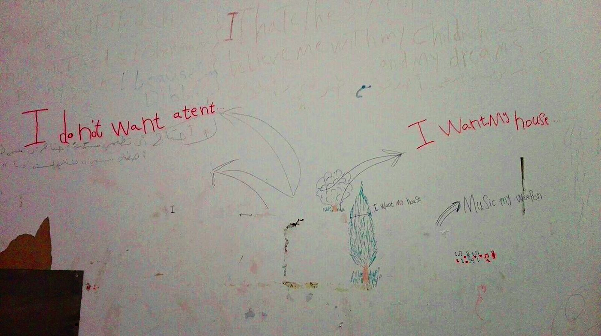

Photo by Nurture Project
### Arrivals, Registrations, Relocations
- 67 refugees arrived on Lesvos in freezing conditions
- 48 people were registered until 7:30AM this morning on “other” islands
- 127 relocations took place between the 15th and the 16th bringing the total to 9,110 –66 refugees, most of them kids, arrived in Spain\.

#### Austria
### Families return from Croatia

[Border Crossing Spielfeld](https://www.facebook.com/RefugeesSpielfeld/?fref=nf) says a Kurdish family was able to return to Austria after being deported to Croatia 71 days ago\. The mother was extremely worried as she is expecting a baby and check\-ups took place only every two\-three months\. The family thanks all those who supported them, adding that they “love their new home”\.

One Syrian uncle and his nephew will also return to Austria soon\. The 70 year old uncle had already scheduled an operation in Vienna to save his eyesight but was deported nonetheless last autumn\. Five other Syrians and Iraqis have been allowed to return to Austria in the last couple of days\.

Border Crossing Spielfeld says hundreds of people are still waiting for a decision from the Austrian government\. The group says 700 people were deported to Croatia on shaky legal grounds between the summer of 2016 and January 2017, despite having been brought to Austria through state\-organized transports in the winter of 2015\. The people had already started rebuilding their lives and were suddenly uprooted from their new homes\.
#### Turkey

Last week, we wrote about the eviction of refugee camps in Turkey\. In an update on the situation, [The Worldwide Tribe](https://www.facebook.com/theworldwidetribe/) describes the situation on the ground and the impact this eviction will have on them:

> The people living in these camps are Syrians, doing seasonal agricultural work in the fields around the city of Izmir \(…\) 

> Many other children are \(also\) exposed to illnesses and developmental disabilities as a result of poor nutrition and health conditions\. 

> The most recent demolition of shelters and tents this week will only deepen the trauma of these children further…\. as if surviving civil war, a treacherous journey and life in a tent in the mud is not bad enough\. 

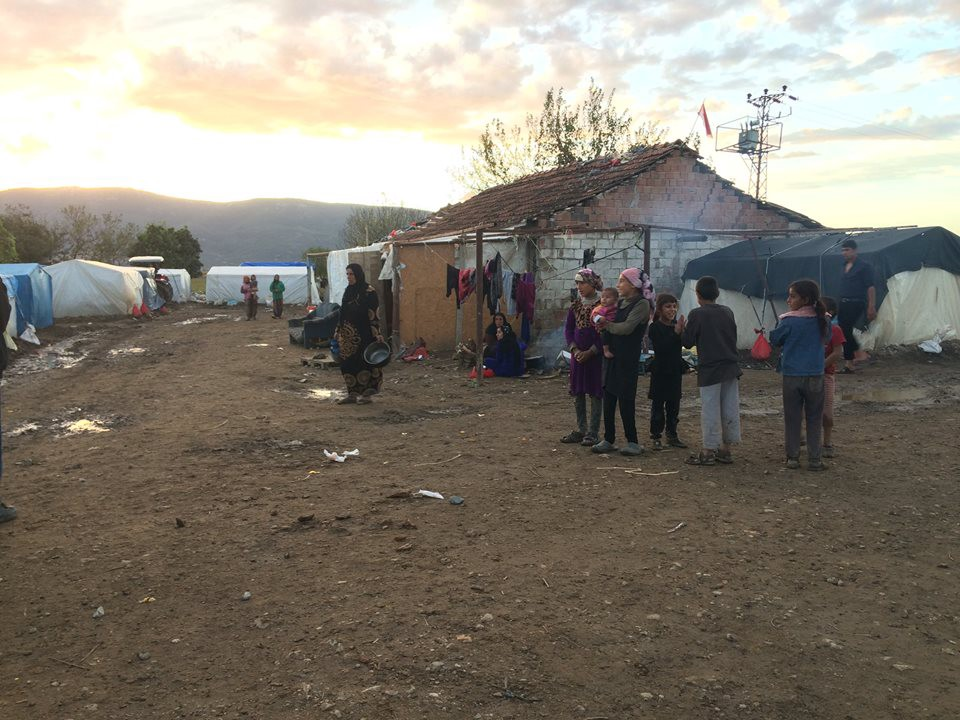

](assets/d12709b665c0/1*7iIDXS1ZAf-_4VsImw_PRQ.jpeg)

Photos by [The Worldwide Tribe](https://www.facebook.com/theworldwidetribe/)

As in France, authorities seem intent on destroying tents without thinking about the consequences for people’s lives — previously, volunteers said that refugees had been told they are expected to rent homes, despite not earning enough money to do so:

> In return for originally directing people to the tent areas and giving people jobs, “dayıbaşı” \(the bosses of the areas\) deduct money from refugees’ wages, pay irregularly or even do not pay people at all\. Since the agricultural workers need to live close to their working areas and don’t know the local language \[Turkish\], they are forced to accept the dayıbaşı system\. Thus, being evacuated from their tents means taking away their means to earn an income\. 

If you want to find out how to support the work of the Worldwide Tribe’s partners in Turkey even after the camp’s eviction, please c [lick here](https://www.facebook.com/groups/TheTribeTurkey/) \.

_Converted [Medium Post](https://areyousyrious.medium.com/ays-news-digest-17-02-17-children-in-calais-prevented-from-taking-showers-d12709b665c0) by [ZMediumToMarkdown](https://github.com/ZhgChgLi/ZMediumToMarkdown)._
