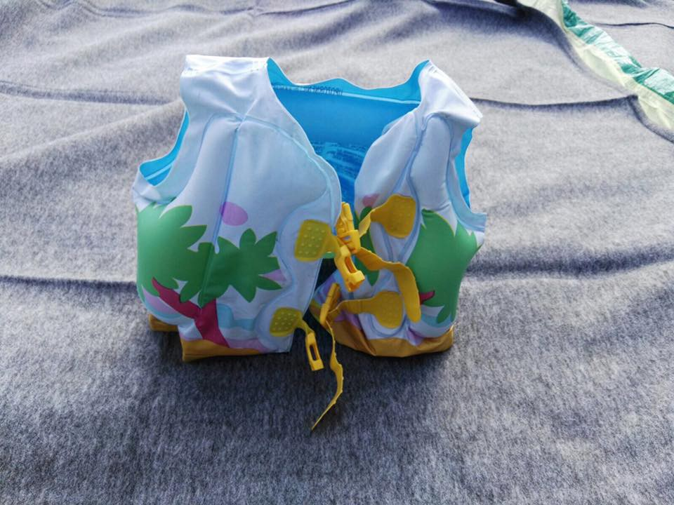
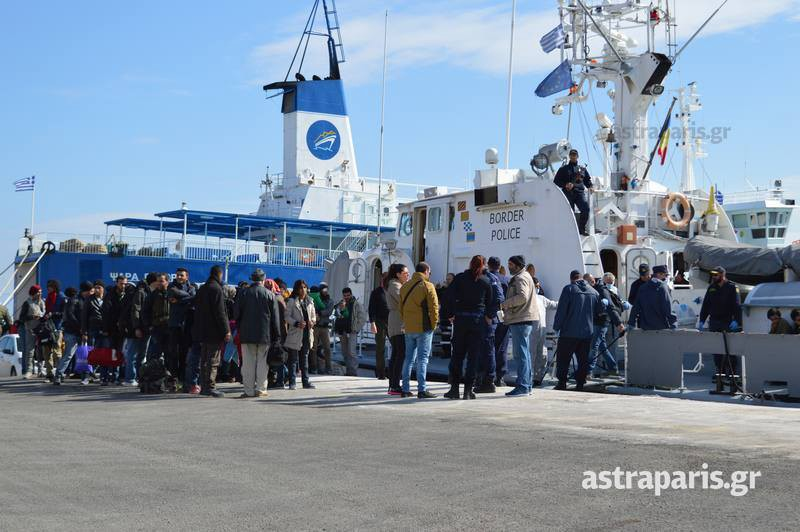
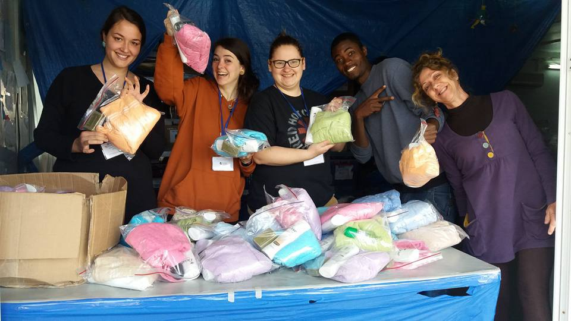
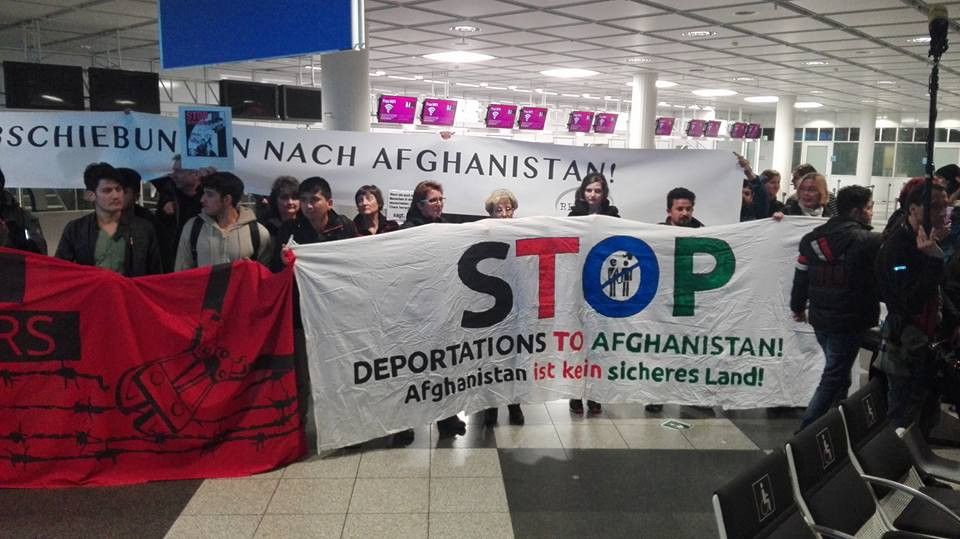
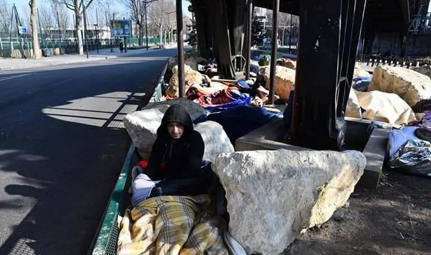
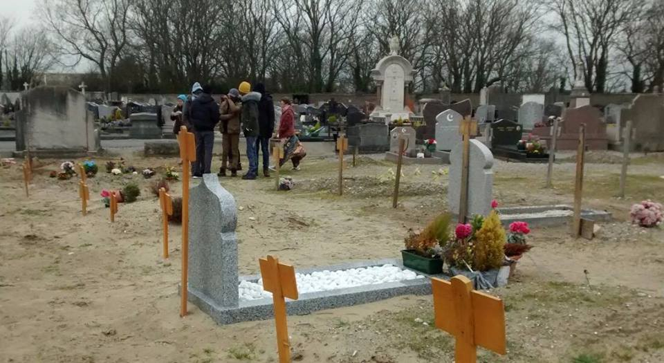
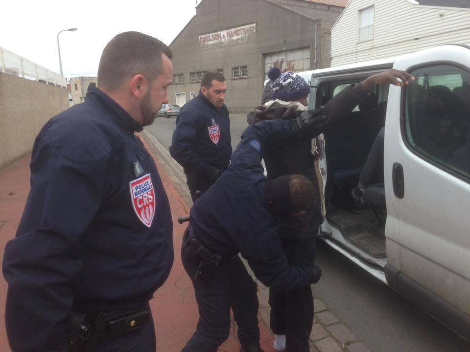

### AYS digest 22/02: New Amnesty international yearly report — words will break bones

Chios today\. Photo: Salvamento Maritimo Humanitario

_No year for human rights — new Amnesty International report / Three people die while trying to cross the Maritza river between Turkey and Greece / Info about the Asylum interview in Greece for Urdu speakers / Four tons of donations collected by AYS arrived safely to Serbia and is being distributed / Croatia still has no program of language learning for asylum seekers / Bavaria deporting 50 people to Afghanistan today — protest action on the Munich airport / Call for Uk people to write to their MPs and urge the UK government to reverse its decision to end the Dub scheme_

Amnesty International has released its yearly report on the state of the world’s Human rights\. New report examines many instances of human rights violations, but defiance also\. It finds, among other things that aggressive political rhetoric are dehumanizing vulnerable groups and creating a toxic environment all around the world\. Figures such as Trump or Orban posing as a tip of an iceberg\. The report also finds that worldwide, 36 countries broke international law and forced refugees back into conflict zones or places where their rights were at risk, Guardian reports\. The report is structured in a way that it has couple of pages on the condition of human rights in every country of the world which makes it easy to find a particular one of one’s interest\. Even though this is a bleak more that 400 page report, the editors claim that defiance that they document too proves that “Ultimately, the charge that human rights is a project of the elite rings hollow,” “People’s instincts for freedom and justice do not simply wither away\.” For full report follow [this link](https://www.amnesty.org/.../Docu.../POL1048002017ENGLISH.PDF)
#### Turkey
### **Three people drown trying to enter Europe**

Three people have died today when a rubber dinghy, packed with eight passengers tried to cross the Maritza river on the border between Turkey and Greece in an attempt to reach Europe\. The survivors were rescued and taken to nearby hospitals in Turkey, Anadolu Agency reported\. For more details and a complete death toll of those trying to cross into the fortress Europe in the last two days, follow [this link](http://www.hurriyetdailynews.com/haber-detay.aspx?pageID=238&nID=110040&NewsCatID=351)
### Greece
### 145 people rescued of the coast of Chios

In three separate events, overall number of 145 people reached shores of Chios today and one alleged smuggler has been arrested\. People mostly come from Iraq and Syria

Arrival of 127 people out of 145\.
### **Cleaning the shores on Chios — making it work in Berlin — Mimycri project**

In more news concerning this island, Chios Eastern Shore Response Team — CESRT and Salvamento Marítimo Humanitario have been cleaning the entire eastern shore of Chios of old boats, lifejackets and trash over the last summer\. Reusable material has been collected for upcycling\. This project is now taking shape: mimycri is using the boat material to produce bags, purses and backpacks\. Refugees in Berlin are involved in the design and production process\. For more on this check out their [FB page](https://www.facebook.com/mimycri/?hc_location=ufi)
### **You, too can enjoy and clean Lesbos**

There is a cleaning crew organized on Lesvos, too and Lighthouse ECO Relief still welcomes all volunteers for their Environmental & Upcycling project at Skala Sikaminias\. They clean the beach and the surroundings in an attempt to make the island a “natural paradise again”\. For more details please turn to [this link](https://www.facebook.com/groups/informationpointforlesvosvolunteers/permalink/655671744640276/)
### **Samos volunteers had a good week**

Samos volunteers, on the other hand, reported that they have distributed many things this week and together with their smiles on the photos, they posted this message “We started with flashlights that recharge with solar energy or movement on Monday\. Tuesday, we distributed 627 hygiene kits\. Today we did 350 pairs of sandals, socks and hijabs\. Finally, tomorrow we will be distributing shampoo\. Thanks so much to our hard\-working team of volunteers\! Great job, you guys\!”

Happy Samos Volunteers
### **For Urdu speakers, RefuComm have prepared some info about the interview procedure**

RefuComm Resources in Urdu

یونان میں سیاسی پناہ کے انٹرویو کی تیاری

Preparing for Your Asylum Interview with the Greece Asylum Office

یونان کا سیاسی پناہ سے متعلقہ دفتر آپ کو انٹرویو کے لئے بالئے گا اور انٹرویو کے بعد فیصلہ کرے گا کہ آپ کی

درخواست قبول کی جائے گی یا نہیں ، اور اگر قبول کی گئی تو وہ یہ فیصلہ کریں گے کے آپ کو کس قسم کی بین

االقوامی تحفظ عطا کی جائے گی۔

The Greek Asylum Service will call you for an interview to decide whether your application for asylum will be accepted or rejected, and if accepted which type of international protection applies to you

اس انٹرویو کے لئے اچھی طرح سے تیاری کرنا بہت ضروری ہے ، تاکہ آپ کی درخواست پہلی مرتبہ میں قبول ہونے

کے امکانات زیادہ اچھے ہوں۔

It is very important that you prepare for this interview, so that if you need international protection you have the best chance of getting it at the first instance decision\.

For more check out their web page [http://www\.refucomm\.com/](http://www.refucomm.com/)
### **Learn a language — teach a language**

While on the subject of different languages and Athens — if you would you like to learn/practice Arabic or Farsi with a native speaker, or you are a refugee who wishes to learn/practice Greek or English language outside the class — the Civis Plus language club proposes an informal method of learning a language\. They meet every Friday in the comfy office of NGO Civic Plus from 7\.30 till 8\.30 pm\. If you are interested in such exchange of knowledge, or want to know more please contact the organizer via this e — mail address [eschena\.clea@gmail\.com](mailto:eschena.clea@gmail.com) \.
### **LGBT Film Project**

Today we seem to be on the roll with creative projects and one of those is certainly an initiative called LGBT Film Project\. This is the organizers massage and contacts:

“The LGBT Support Group for Refugees in Greece are launching our latest project: the creation of a series of short films, fact and fiction, written, directed, and starring LGBT refugees, telling their own stories\. We have a team of industry experts to help with each stage of the production process, and we will be holding masterclasses, where individuals can learn professional skills\. Once the films have been completed, we will be debuting them at a premiere in Athens\.

If you would like to be involved, or you know someone who would like to be, please tell us\! Whether you’d like to write a script, edit, act, or anything else, we want to hear your ideas\.

We also want to hear from those who could offer professional skills or financial backing to help the project\.

Please comment below if you are interested, or email [LGBTrefugeesgreece@gmail\.com](mailto:LGBTrefugeesgreece@gmail.com) ”
#### Croatia
### **We made it\!**

Only volunteers that manage storage know how much effort and energy it requires handling it all properly\. And only those that have tried to send donations to Serbia know how complicated their customs regulations for importing humanitarian donations are\. Unfortunately, many shipments were stopped at the border due to the insufficient documentation\.

Well, we, AYS, just made it\! \! \! Almost 4 tons of clothes, blankets and sleeping bags shipped from our storage in Zagreb, Croatia were just approved by customs officers in Belgrade and our donations will be distributed to refugees all over Serbia\. Happy day\!

A big thanks goes to all our donors, our tireless volunteers and our partners in Serbia\.
### **“Integration is lost in translation in Croatia”**

For many years civil society organizations and other activists in Croatia have been advocating for a public and free program of language learning in Croatia for all asylum seekers\. Still, even though learning a language is a first step of successful integration, Croatian ministry of education has not done much, if anything, to address the need of accessible facilities for learning Croatian language\. On the international day of mother tongue, there was a panel held on this issue in the center of the city\. For Croatian speaking readers, the video below reports on this panel

#### Germany
### **Bavaria not backing up on continuing to deport to Afghanistan**

Facing deportations to Afghanistan the Federal states of Germany are not as united as German chancellor Angela Merkel declared in the beginning of February\.

Prime minister of Schleswig\-Holstein Torsten Albig \(SPD — Social Democratic Party\) declared: “I am deeply disappointed by the Government’s position\.”

Federal states with red or green governments \(SPD or Green Party\) stand against deportations to Afghanistan, but usually all big parties unite against those actions\. 5 federal states already disagreed completely with any deportations to Afghanistan, while Bavaria will most probably deport approx\. 50 Afghani persons today from Munich Airport to Kabul\. Other states declared they want to have a close look at the legal base if they should have to proceed any deportations and decide based on it\. As Bavaria is not backing down on their deportation plan, activists are organizing protest actions in Munich airport\.

Munich airport today
#### France
### **Between a rock and a hard place**

As if robbing refugees of their blankets was not enough, in a more heavy — to — carry — effort — Paris authorities have set up large rocks to safeguard the places such as under the bridge at Paris Metro Line at Boulevard de la Chapelle in Paris\. As people have no place to go, they just sleep between those rocks\.

Boulevard de la Chapelle in Paris\. Photo: The voice of refugees
### **Final farewell to John Sina**

Help refugees has posted this message today that we bring in full:

Funeral\. Photo: Help refugees

“This afternoon some of our volunteers in Calais attended the funeral of a young man from the Oromia region in Ethiopia known as John Sina who was just 20 years old when he died\. He was sadly struck down on the Calais motorway on January 21st\. He left the French state protection in December, having lost faith in the Home Office allowing him safe passage to the UK\.

On their way back to the warehouse they witnessed 7 minors being arrested outside the [Secours Catholique — Caritas France](https://www.facebook.com/Secours.Catholique.Caritas.france/) warehouse, where the police have been targeting refugees hoping to shower\.

Stop and search\. Photo: Help refugees

Today has really highlighted some of the shameful treatment of vulnerable children in Europe\. And this is just the tip of the iceberg\. There are many horrors that we do not witness\.

Write to your MPs, you can find your local MP here — [http://www\.parliament\.uk/mps\-lords\-and\-offices/mps/](http://www.parliament.uk/mps-lords-and-offices/mps/) \. Let them know that you care about the fate of unaccompanied kids in Europe, that you would like the UK to protect children in need of sanctuary\. Ask them to raise this issue in parliament\.

Thank you”
### **The UK government MUST reverse its decision to end the Dub scheme — write to your MP**

In regards to treatment of unaccompanied minors in Europe Calais 4 Calais posted that they will be “watching closely the debate in the House of Commons tomorrow regarding unaccompanied minors\.” and state that “The UK government MUST reverse its decision to end the Dub scheme\.” They also urge for all of those who are able to to “Find your MP and write to them here [https://www\.writetothem\.com”](https://www.writetothem.com/)

_Converted [Medium Post](https://areyousyrious.medium.com/ays-digest-22-02-new-amnesty-international-yearly-report-words-will-break-bones-cfdc1b229049) by [ZMediumToMarkdown](https://github.com/ZhgChgLi/ZMediumToMarkdown)._
