### AYS daily digest 24/02 — repeated Hungarian police brutality

New cases of police beatings on the Hungarian border / More lives lost in Libya due to smuggling / Basic humane living conditions — new toilet facilities in Belgrade / Free clothes shop opened in Athens and more

Belgrade “Bus Station” — Young 14 year old refugee arrives back in Belgrade barracks after being beaten by Hungarian border police in one more try to cross the border\. A total of 75 tried “the game” in the same night and all were brutally attacked, including some that after losing consciousness were bitten by dogs used by police to try to wake them up\. They were accompanied by volunteers and other refugees to Belgrade Hospital, photo/text by Nuno Felicio
#### LIBYA
#### More lives lost trying to reach safety in Europe

In the city of Al\-Khums, 115 km to the east of Tripoli, a tragedy happened once again due to people smuggling\. Twenty\-seven people died of suffocation and being crushed after being locked inside a shipping container\. A local source said a smuggler stuffed a shipping container with more than 50 African migrants in order to take them to a beach where they were expected to commence their sea journey to Europe, [reports](https://www.libyaobserver.ly/news/african-migrants-died-asphyxia-inside-shipping-container-en-route-beach) Libya Observer\. The 56 survivors, among them a 5\-year old girl, were taken to hospital, some with serious injuries and fractures\.

Earlier this week when the bodies of 74 migrants were found on the shore near Zawiya, the local coast guard said smugglers had removed the engine from their boat, [wrote](http://mobile.reuters.com/article/idUSKBN16225Y) Reuters\.

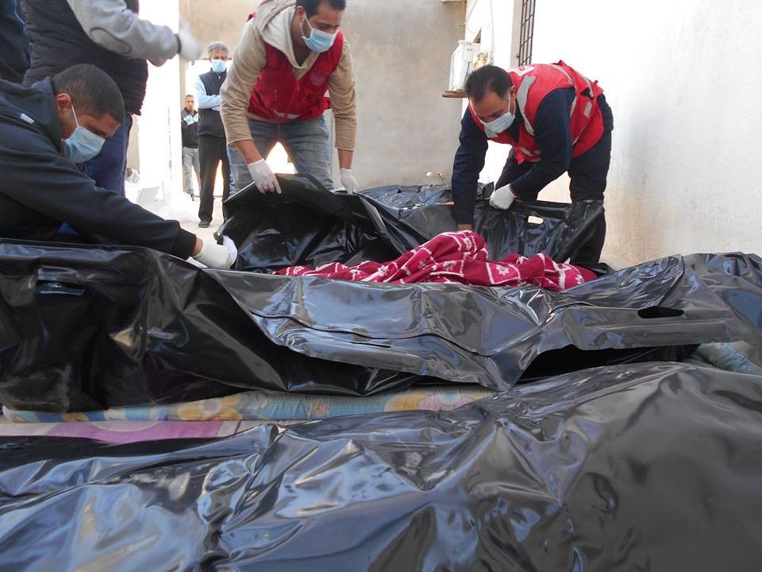

Photo by Libyan Red Crescent

TRT World published an [investigation into Libya’s human trafficking mafia](http://www.trtworld.com/magazine/the-kingpin-of-libyas-human-trafficking-mafia-301505) \. They spoke to multiple sources about the leading role Al Bija \(the new commander of the coast guard in Zawiya\) and Al Qasseb \(head of the security department of Zawiya’s refinery\) play in the human smuggling business in Libya\.

> Al Bija’s stranglehold over human trafficking here is an open secret that international actors are almost certainly aware of, multiple sources confirm\. “The Europeans should have all these details since for months they have been gathering information at sea as part of Operation Sophia,” the man explains, referring to EUNAVFOR Med’s training programme for the Libyan Coast Guard and Navy\. Launched in 2015, EUNAVFOR Med was initially designed to dismantle the smuggling network in the central Mediterranean, but soon included search and rescue activities \(SAR\) for refugees at sea too\. It is being run in coordination with Fayez Mustafa al\-Sarraj, who heads the UN\-backed government in Tripoli\. 

#### SERBIA

The systemic violence at the Hungarian border with Serbia is still ongoing, with new cases of severe beatings coming to light daily\. Sources in Belgrade report on 70–80 refugees \(including children\) beaten by the Hungarian police\. Beatings happened on Tuesday night and again yesterday, while the authorities unofficially said more than 200 people were pushed back that night\. Many refugees came to a clinic in Belgrade yesterday\. Some of them were beaten till they passed out, others have serious pain in their legs and flanks\. One boy‘s arm was broken, as documented [here](https://www.facebook.com/permalink.php?story_fbid=777653022391126&id=747163385440090) \. Hungarian MigSzol are collecting refugee testimonies on beatings which you can [read here](http://www.migszol.com/border-violence) \.

A source from Belgrade writes about a victim of yesterday’s incident:

> He is one of the guys that helps most volunteers as a translator\. He spent last night in hospital helping volunteers and the 75 refugees that got back from the border and had wounds caused by the Hungarian police\. It was one of the worst nights and he was there\. Tonight he is one of the 10 refugees resting in our apartment\. He has a remarkable life history\. He is not sure about his age; he thinks he’s 24\. His first memories are of working in his home town in Afghanistan, very young\. He has always been a handy man and before working for the western forces he worked with glass\. He worked for the US and NATO, including Hungary, the same country where the police beat him up and call him Taliban when he tries to cross the border\. He worked for the US for six years, got many medals and recommendations and helped many victims of ambushes, but the US denies him asylum\. He has marks on his back because the Taliban considered him an enemy since he had helped the West\. His life was in danger, so he left for Europe\. On the way, in Bulgaria, the police broke his arm and deported him back to Turkey without any aid, but not without beating him up again when they left him by the border\. His arm is in the state seen on the pictures from 7 months ago\. The Croatian police also broke his nose\. Now he waits in Belgrade for the next opportunity to enter the EU, maybe to go to Italy or Spain\. To work hard and bring over his family, including his baby daughter\. Until then he helps his friends and volunteers\. When they are telling me their stories, I have to ask them many times to make a pause for me to process everything, think a little and swear a lot\. 

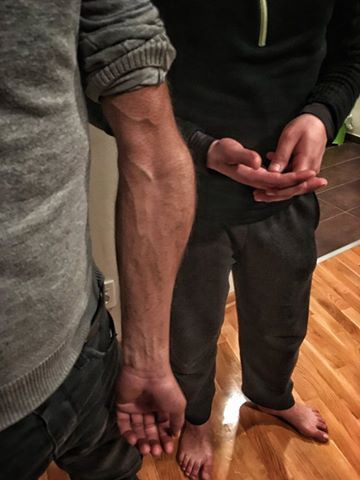

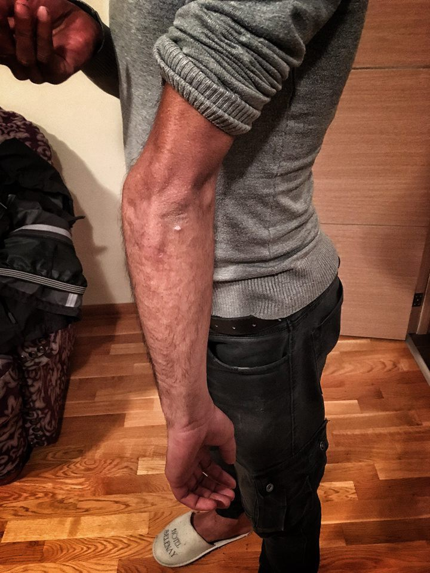

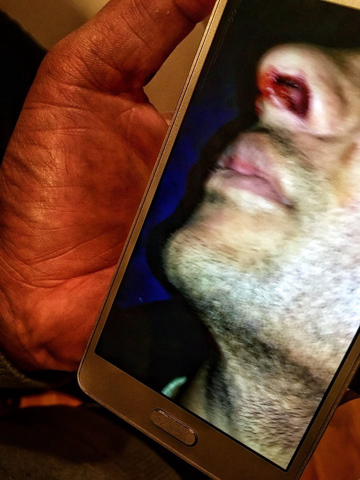

Photos by Nuno Felicio
#### New toilet facilities in Belgrade

Help Refugees funded 15 toilets and four sinks with drainage for refugees living in the biggest squat on the outskirts of Belgrade, while [The Get Shit Done Team](https://www.facebook.com/The-Get-Shit-Done-Team-304001796641127/) helped organise and install the facilities\.

The people living at the location have had zero sanitation facilities in freezing conditions until now\. They are living in conditions not fit for any human being\. These toilets are just the first step towards making their living conditions humane, HR write\.

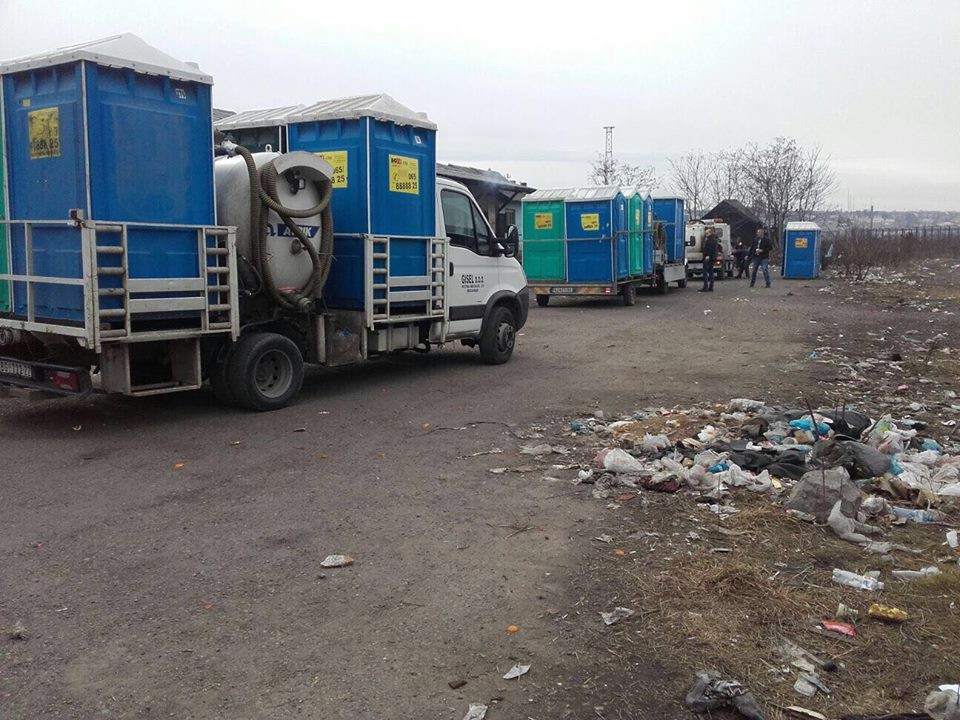

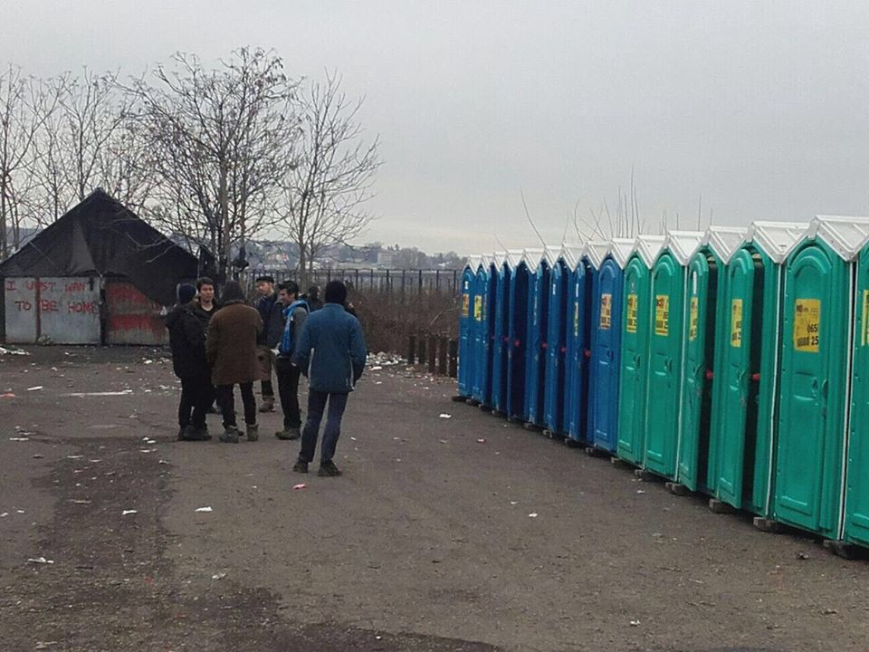

Photos by Help Refugees
#### GREECE
#### Athens

The team behind Hope Cafe, who provide meals in Athens, opened a free clothes shop for anyone not able to afford clothes\. Nappies/pampers and hygiene packs are also available\.
Opening the shop wouldn’t be possible without donors\. If you would like to contribute by donating or volunteering, feel free to [message](https://www.facebook.com/soulfoodforrefugees) them\!

OPENING HOURS are 11:00–15:00 every day\. Closed on Sundays\.

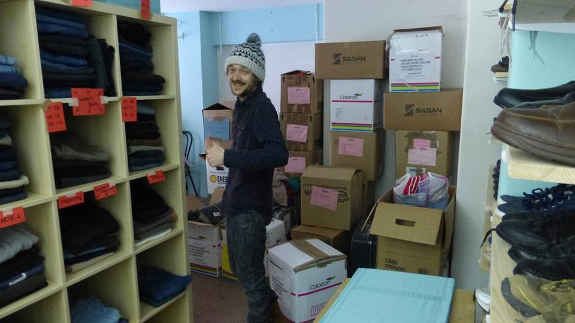

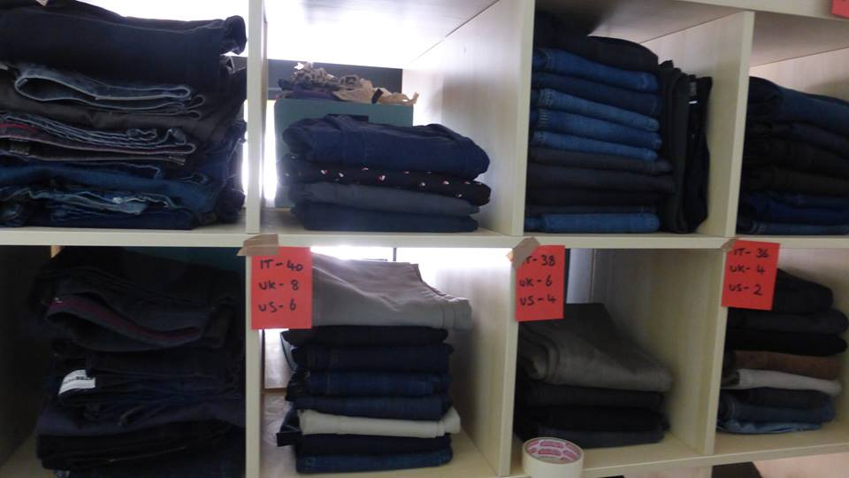

photo credit Hope Cafe\. Refugee Soul Food\.
#### Alexandria

Refugee Support Greece update on The Katsikas camp project

> Having stripped out the space, we are now ready for the lovely guys at [The Timber Project](https://www.facebook.com/thetimberproject.org/) to build us a shopping arcade with 5 fully fitted shops \(mini\-market, men’s boutique, women’s boutique, kids boutique, shoe\-tique\) sorting area, storage area and a cafe\. Each of the shops will have a wooden floor, a pitched roof and a window\. In the summer we will also look into installing air conditioning\. 

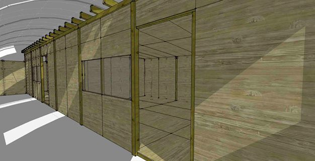

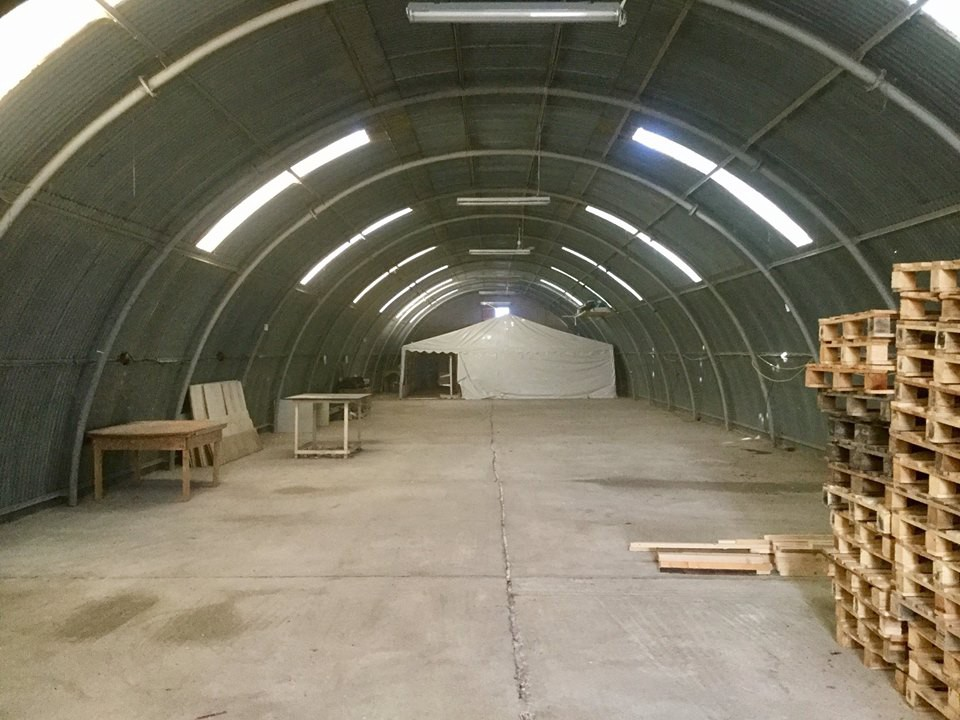

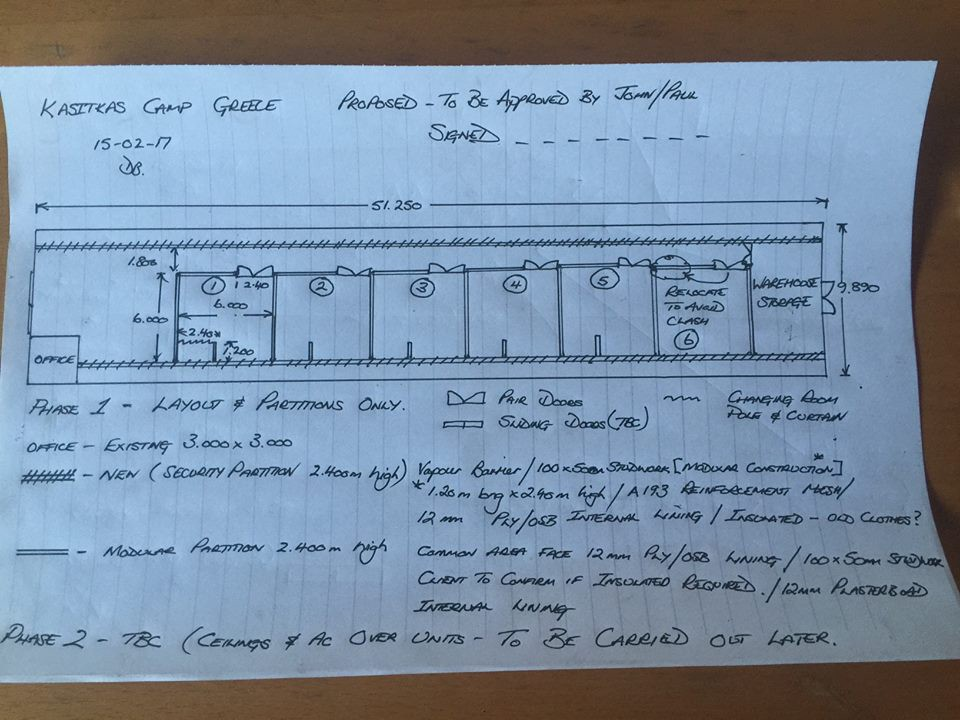

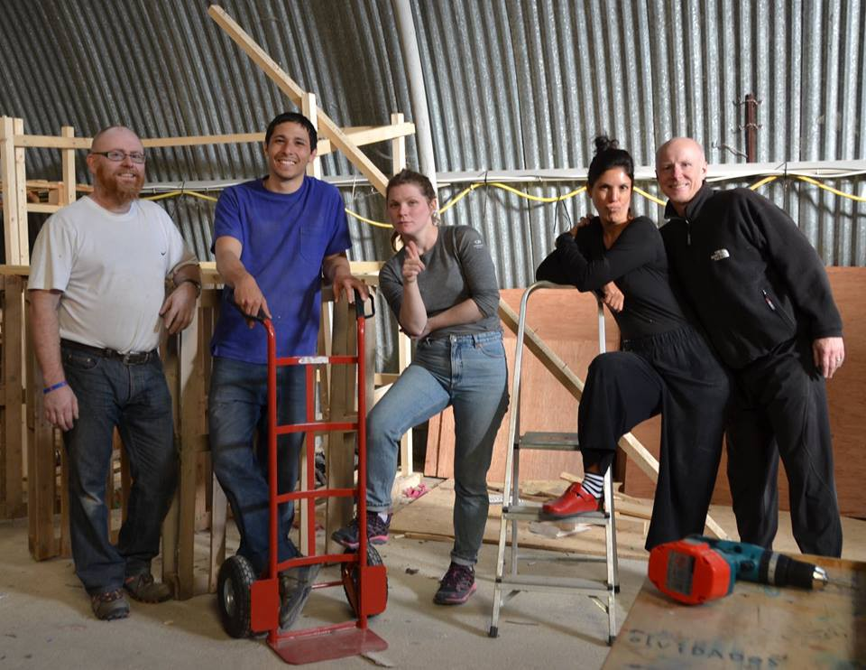

photo credit Refugee Support Greece
#### Chios

There were four landings today with more than 170 people coming to Chios, Pothiti Kitromilidi reports from the site\.

> We didn’t have the time for posts because the refugees stayed for hours and hours waiting for the bus and we are the only team that stayed with them covering their needs and trying to play with children and involve them in activities to help them pass the time\. CESRT volunteers worked so hard to provide everything plus they had to watch the unfair system of the buses\. People needed to pay for the transportation to Vial \(registration area\) \. We want to thank Zaporeak proactiva for their support\. They cooked food and prepared tea for them\. 

](assets/218a37a0b677/1*kD7ZG95d4JiQKr4h7aWqiA.jpeg)

[**Pothiti Kitromilidi**](https://www.facebook.com/pothiti.kitromilidi?fref=nf)

There were 35 new registrations: 20 on [Chios](https://www.facebook.com/hashtag/chios?hc_location=ufi) , 15 on [Kos](https://www.facebook.com/hashtag/kos?hc_location=ufi) \.
### “Can’t park human beings”

Moroccan Ambassador to Rome Hassan Abouyoub rejected the idea of setting up camps in North Africa for asylum seekers who get sent back after being intercepted at sea while trying to reach Europe, [report](http://www.ansamed.info/ansamed/en/news/nations/morocco/2017/02/23/moroccan-envoy-says-no-to-camps-for-turned-back-migrants_0ad6ba32-2b5c-41c4-90f2-96c6abdce1d0.html) AnsaMed\.

Claiming a collective, solidary approach and shared responsibility was needed, Abouyoub said:

> “It is not acceptable to park human beings\. I don’t give lessons to Europe but the security response \(to migrant flows\) is not suitable and has not produced results”\. 

#### ITALY

A total of 2700 municipalities agreed to participate in the new ministerial plan to build new CIEs in their territories\. The sum of 100 million euros have already been designated in support of those who agreed to sign the plan, but Minister Minniti reassured those municipalities that they will benefit from more financial support, Italian CIR [reports](http://www.cir-onlus.org/it/comunicazione/news-cir/51-ultime-news-2016/2250-richiedenti-asilo-e-accoglienza-ministro-minniti-da-2700-comuni-ok-a-piano-accoglienza-diffusa) \.
#### Ventimiglia

Police have been looking for migrants throughout the night in Ventimiglia\. The exact number of people taken into custody \(and destined to be deported back to some center in the South\) is unclear\. Some migrants managed to enter the Red Cross camp where they had to be fingerprinted, but at least they are not going to be deported\. Police were also harassing other regular migrants in Ventimiglia\. These are seasonal workers who were sleeping on the river banks because they can’t afford a place to sleep between one season and another\. \(Again, these are regular migrants with regular work permits\) \. Reported by [Progetto20k](https://www.facebook.com/progetto20k/posts/407506662942587?hc_location=ufi) \.
#### SWEDEN

Driven by recent simplistic and occasionally completely inaccurate information, the Swedish Ministry for Foreign Affairs decided to clarify some of the most common claims about migration and crime in Sweden and the Swedish migration policy in this new [report](http://www.government.se/articles/2017/02/facts-about-migration-and-crime-in-sweden/) \. The often falsely alarming claims include so\-called “no\-go zones”, numbers of rapes and gun violence\.

_Converted [Medium Post](https://areyousyrious.medium.com/mass-scale-border-police-brutality-how-much-longer-218a37a0b677) by [ZMediumToMarkdown](https://github.com/ZhgChgLi/ZMediumToMarkdown)._
