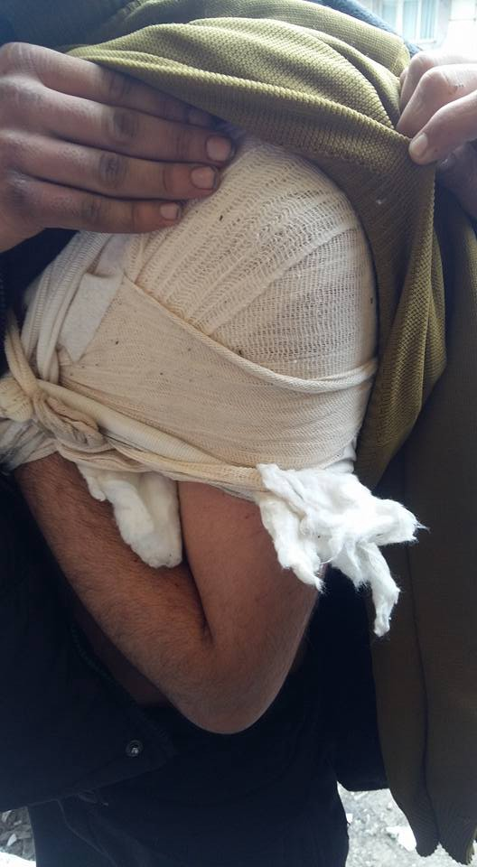
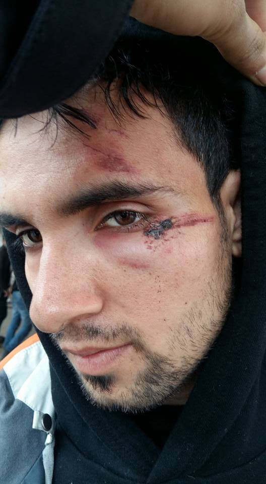
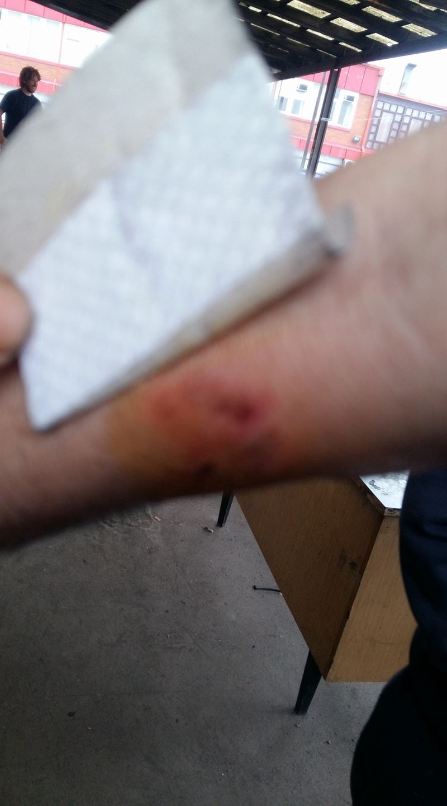
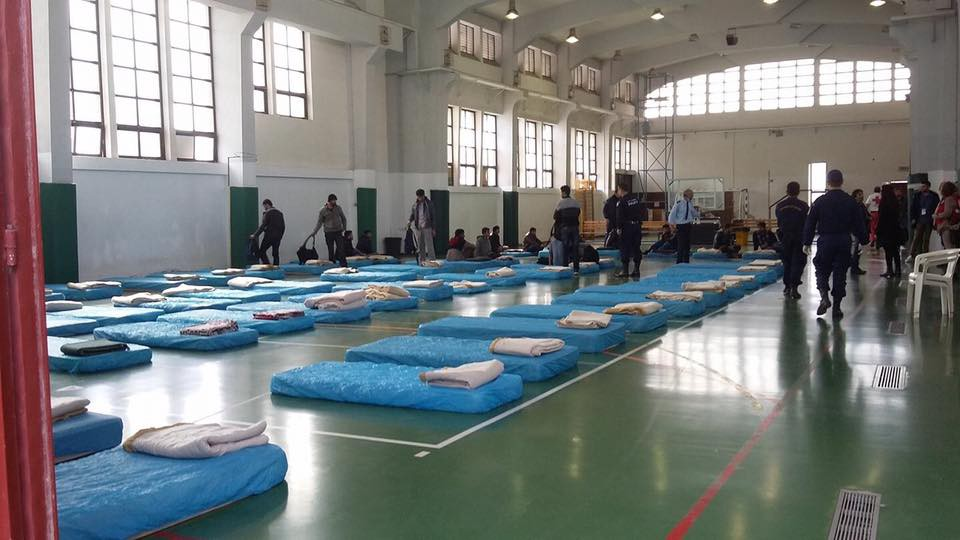
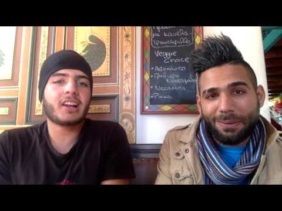
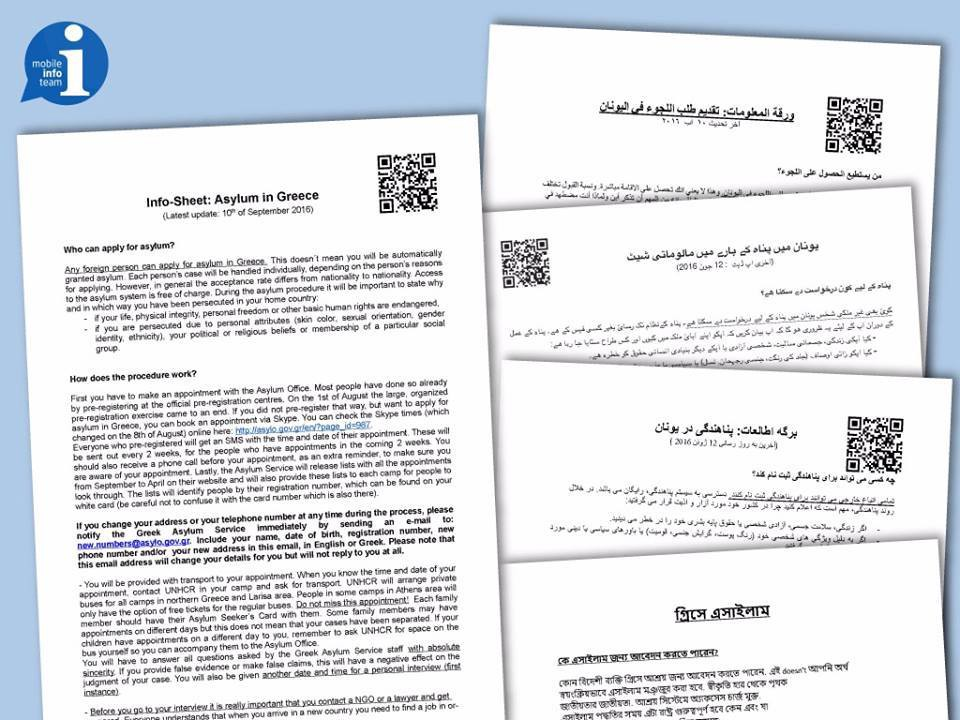
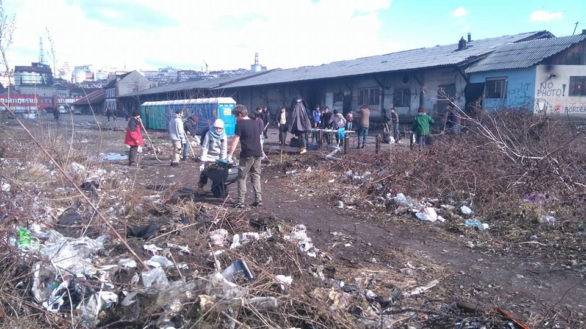
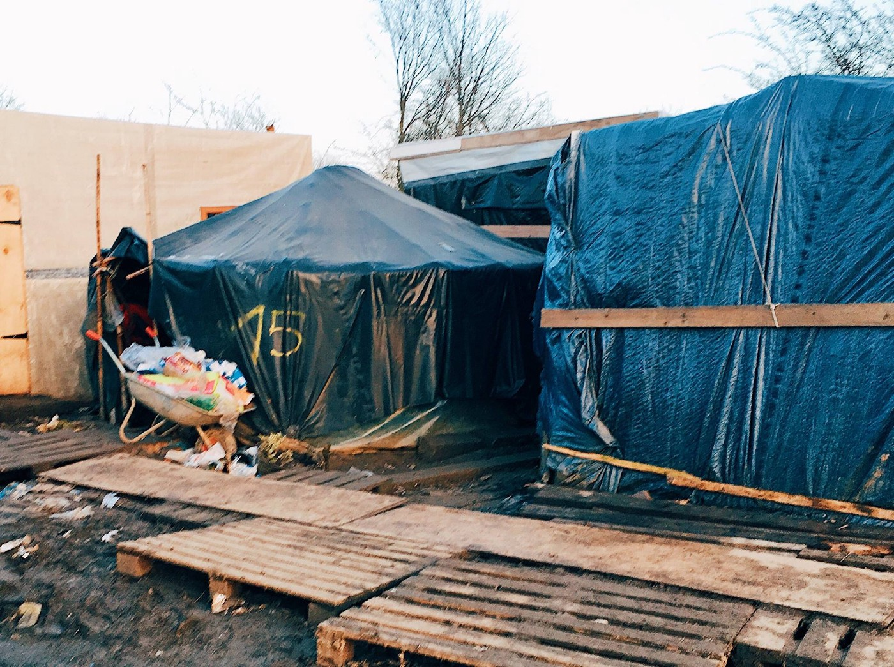
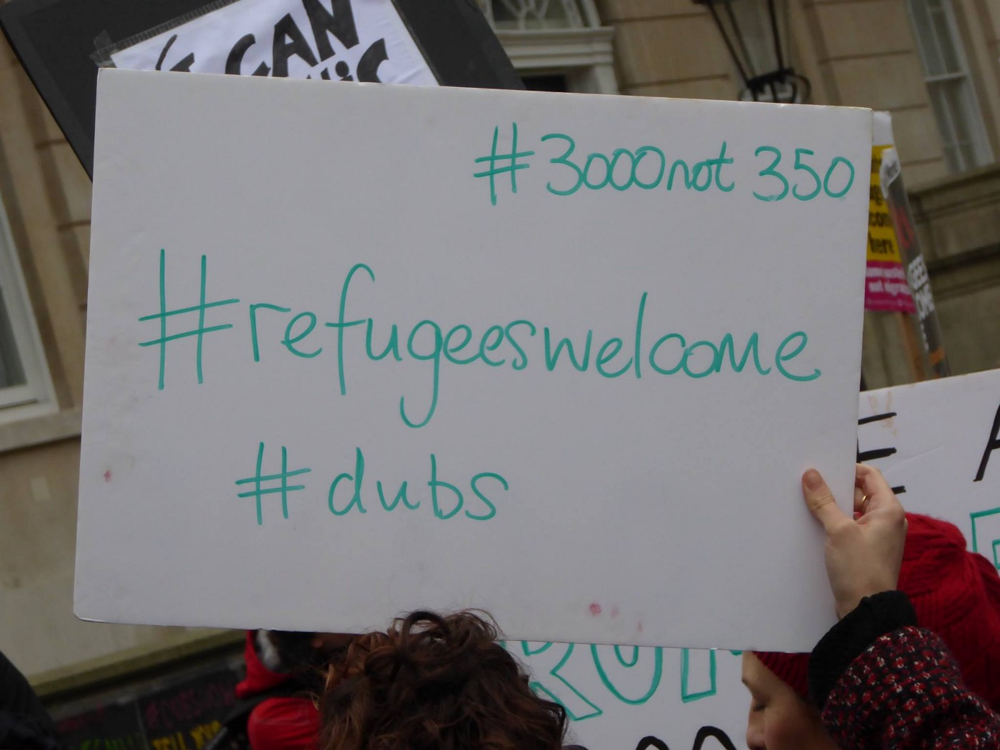

### AYS DAILY DIGEST 25/02/2017: UNHCR vs\. people testimonies about life in Greek islands

_The slow process of relocation // Number of people arriving in Europe from Pakistan increases daily // Protests at Moria // Over 20 people arrested in Bosnia while trying to cross from Serbia // People in Paris moved rocks together // Welcome refugees protests in France, Bulgaria, UK…_

](assets/8b50869b57ae/1*41XL375uDcq84VZLfNQ0Lw.jpeg)

Photo by [**Philippe Caro**](https://www.facebook.com/philippe.caro.7)
### Feature
#### Guards of the fortress Europe

Almost 14,000 people arrived in Europe over the sea since the beginning of this year\. Mostly of them arrived to Italy — over 70 percent — and the rest to Greece and Spain\.

At the same period of time, the sea took lives of 366 brave people who took this perilous journey trying to enter into the fortress Europe\.

Those who managed to find their way into Europe are facing arrests, deportations and harsh migration policies all over the continent\. Images from Hungarian\-Serbian border and the systematic violence people are faced every day with, were not in today’s major European media\. Even though, unfortunately, these images do portray the EU today\. [We reported yesterday](https://medium.com/me/stories/public) about that, but we remind about this crimes committed over people who are probably among not too many who still believe in European dream\.

Victims of Hungarian border police brutality\.

Reminder — 70 to 80 innocent people, including children, were beaten up by the Hungarian police this week while over 200 people were pushed back\. Hungary is part of the EU, as we remember\. But Brussels is staying quite about this and all the other violations of existing laws and basic human rights\.

Meanwhile, relocation inside of Europe remains extremely slow, something that is hard to understand\. During the last week, 419 people were relocated from Italy: to Belgium \(29\), Finland \(145\), Germany \(186\), Portugal \(8\) and Switzerland \(51\) \. This number makes up to only 9 percent of the targeted number of relocations so far\. At the same time, 309 people were relocated from Greece: to Belgium \(58\), Ireland \(40\), Malta \(15\), Netherlands \(72\), Portugal \(51\), Slovakia \(7\), and Spain \(66\), which makes 13,7 percent of planned relocations\.
### Greece
#### 60 people arrived to Crete

Today, 60 new arrivals were registered in overcrowded Greek islands, adding to 189 that were already registered during the week\. New arrivals were registered in Akrotiri Peninsula in Crete\. All, including one child and 12 unaccompanied minors among, came from Pakistan\. Apparently, they have been for two days at the sea after leaving from Bodrum, Turkey\. According to the [Refugee City Plaza Hotel](https://www.facebook.com/sol2refugeesen/) sources, all people who arrived have been transferred to an indoor hall in the city of Chania\.

So far this year, 2,053 people have arrived in Greece\. People from the islands are still being transferred to the mainland, some to apartments, but many to camps all over Greece, where conditions are not improved much over the time\. In their weekly report UNHCR claims that the _“Greek authorities and humanitarian actors continued to improve conditions and shelter in priority sites, particularly in a number of Reception and Identification Centres \(RIC\) on the islands, where overcrowding remained a serious concern \(Lesvos, Samos, Chios\) \.”_ We did not get this type of information from refugees or volunteers in the field, so far\. All we can hear is that the conditions are not improving at all\.

Two young Syrians, who are stuck in Moria, Lesvos, are telling about their everyday life in the camp, giving picture different that those given by the UNHCR\.

You can follow Basel and Murad on their You Tube channel Camp Moria Refugee Twins every day\.

Nevertheless, during the last week, UNHCR assisted 281 individuals to be transferred from the islands to the mainland; 90 from Lesvos, 79 from Chios, 19 from Samos, 65 from Leros, and 4 from Rhodes\.

Despite announcement that people will be moved to mainland, more accommodation facilities are being built in Lesvos\. Last week, the first four two\-storey containers were installed at Moria, where 49 two\-storey and 20 single prefabricated houses are planned\. This has been done by UNHCR in coordination with the Ministry of Migration Policy, and they consider it as a progress\.

Even more worrying is the announcement that camps that have been evacuated over the last couple of months will be reopened soon\. Most of them are in the North\. People have been moved to hotels and private accommodation during the winter \(after many protests and only in the middle of winter\), but looks like from March some of them will have to return to the camps\. Rumors about this have been going on for some weeks, but we found final confirmation in the last UNHCR weekly report\. At least for Kalachori camp\.

> “The ‘Warehouse Site’ SK Market — Kalochori, among other sites, was fully evacuated on 16 February and will undergo infrastructure works by the Army before reopening\.” 

In the meantime, in Frakapor only 57 people are left\. It is not clear if people will come back even to these caps after “structural improvements”\.

At the same time, people in the field in the Northern Greece are reporting that the government and the organizations who are cooperating closely with the government, are increasing their presence on the many sites, while introducing stricter rules for volunteers, including registration with the ministry\. It is hard to say where this will lead and what is the final goal, but we will follow the sitution\. If you have any info for us, please feel free to contact us via our FB page\.

People stranded at the islands are protesting almost daily\. Today in Moria refugees from different south African countries protested calling for freedom and against racism, claiming that they are the most discriminated group\. The protest was also the reaction to yesterday’s tragical death of one person from Sierra Leone who died in the hospital of Lesvos\.

The Greek Police on Friday announced that they arrested nine suspected human traffickers who were moving people from Turkey to Greece\. Among those arrested are five Greeks and four Pakistani\. Investigators believe they are part of the group that is in operation since October 2016 and have smuggled more than 200 people into Greece\.

Another 11 suspected members of the racket were being sought\.

At the same time, police in Thessaloniki have arrested a 52\-year\-old French man who allegedly sexually molested four teenage refugees from Pakistan at his home\. He was also charged with the illegal possession of drugs\. Man is arrested after the boys — aged between 14 and 17 — filed a complaint with police saying he repeatedly molested them, claiming he lured them to his home offering food and shelter\.
### IMPORTANT INFO

The [Greek Asylum Service](http://asylo.gov.gr/) has made public a detailed diagram explaining the procedures for people arriving in Greece after March 16, 2016, that is available here\.

For detailed but simplified information on all of these procedures please see [RefuComm website](http://www.refucomm.org) \.

[The Mobile Info Team](https://www.facebook.com/mobileinfoteam/?fref=nf) [Info sheets](http://bit.ly/info-sheets-english) on different asylum options are available online, in different languages\. Check out these info sheets to make sure you know as much as possible about the asylum procedures you need to go through\.

[Truck Shop, without the truck](https://www.facebook.com/mobileclothesproject/) it is a free shop where families and individuals who are now housed in apartments or hotels, can come and choose what they need and like\.

> “Our “customers” get a big bag and search through our well\-sorted clothing area with underwear, socks, pajamas, trousers, winter tops, winter accessories, baby items and much more\. In our hygiene section, we offer everything from shampoo to pampers\. The free shopping tours’ last section is shoes\!” 

### Bulgaria
#### Solidarity prevails in Elin Pelin

Not often we can publish good news from Bulgaria, and we are happy to do that today\. The group of people in Elin Pelin, the town about 24 km from capital Sofia, held a protest against authorities’ decision to deny registration to one Syrian family, the case we already reported about\. Alongside, a petition has been launched to secure the Syrian family’s registration with the municipality\.

Previously, the authorities in this town refused to accept a Syrian family or issue residence documents to them, in spite of them having official humanitarian refugee status\. The mayor claimed that the residents are hostile to the family\. Mayor Ivailo Simeonov said that he would not allow the family to stay\. _“They have to find another place to live\. I do not intend to allow anyone to disturb the peace of my fellow citizens,”_ Simeonov said\.

One good news is followed by bad one, unfortunately\. According to the recent survey conducted, the majority of adult Bulgarians — 73 percent — approve of the idea for citizens of certain majority Muslim countries to be forbidden entry their country\. The survey was conducted by Gallup International among 822 adult Bulgarians\. The goal was to check attitudes on migration and terrorism\.
### Serbia
#### New team of volunteers arrived to Belgrade

Officially, around 7,700 people are in Serbia now, most of them — 86 percent according to UNHCR — are accommodated in 17 governmental facilities\. The other are sleeping rough in different places, mostly close to the border, or in Belgrade\. Volunteers are with them\. A team from [Melting Pot Europa](https://www.facebook.com/meltingpoteuropa/posts/1413850628646660?hc_location=ufi) came to help people in werehouse to clean part of the place, and they set up a medical help station\. Volunteers medics come from Spazio salute popular in Padova\.

Melting Pot Europa
### Bosnia and Herzegovina
#### Over 20 arrests in 24 hours

As the police brutality increases at the border with Hungary, more people are trying to find their way into the EU through Bosnia, attempting to enter Croatia\. Early morning this Saturday police arrested two groups — 22 people — who tried to cross from Serbia near Raca\. Apparently they will be pushed back to Serbia\.

The day before, two persons from Afghanistan were found in the truck coming from Serbia\. They were transferred to the asylum center\. The truck driver is the citizen of Moldova and he was arrested\.

During February, 16 people were arrested while trying to cross from Serbia\. Most of them were citizens of Pakistan, followed by people from Afghanistan, Syria, Algeria, Iraq, Iran and Palestine\.
### Hungary
#### Official picture

According to the official figures, during the week, 50 people entered into the transit zones at the border with Serbia and they were granting access to seek asylum in Hungary\.

Addition, the Hungarian police reported 61 arrested, while 579 people were prevented from crossing the green border, and another 296 people were intercepted inside Hungary and expelled back to the other side of the border control fence\.
### France
#### Moving rocks together

Many people gathered today in Paris trying to curb the stones that were put in place in order to prevent people from sleeping rough in the streets\. Unfortunately, as expected, they were stopped by the police who told them to wait for the green light from the city because, apparently, the rocks are now considered to be of the “Urban” \(furniture\! \)

However, activists and refugees together were able to move a few blocks and begin an engraving before police arrived\. They were also able to finish the installation “fragile”\.

[The Worldwide Tribe](https://www.facebook.com/theworldwidetribe/posts/1837597713192654?hc_location=ufi) team reports from the Current Fonts camp, about half an hours drive from where the Calais Jungle used to be, a place hidden between the trees\.

> “About 100 people currently live there, most of them in shelters rather than tents now \(thank God\) \. The final decision as to whether these 100 people can stay in their makeshift homes / whether this camp too will be demolished, will be made in court in a few days time…on the 28th February\. I asked one of the guys how he felt about potentially losing his home AGAIN, and he said to me, “What can I do? I am not scared, all of us, we will make a plan together\.” 

The Worldwide Tribe
### Sweden
#### Against prejudices

Interesting post by Swedish government about their life in this country and migration\.

> “In recent times, simplistic and occasionally completely inaccurate information about Sweden and Swedish migration policy has been disseminated\. [Here, the Swedish Ministry of Foreign Affairs looks at some of the most common claims\.](http://www.government.se/articles/2017/02/facts-about-migration-and-crime-in-sweden/) ” 

UK
#### Voice of the people

Another Let the Children In\! the protest was held in London\. The protest took place on the opposite side of the road to the entrance to Downing Street, and quite a number of people showed up\.

Photo by Stephen Furner

_Converted [Medium Post](https://areyousyrious.medium.com/ays-daily-digest-25-02-2017-unhcr-vs-people-testimonies-about-life-in-greek-islands-8b50869b57ae) by [ZMediumToMarkdown](https://github.com/ZhgChgLi/ZMediumToMarkdown)._
