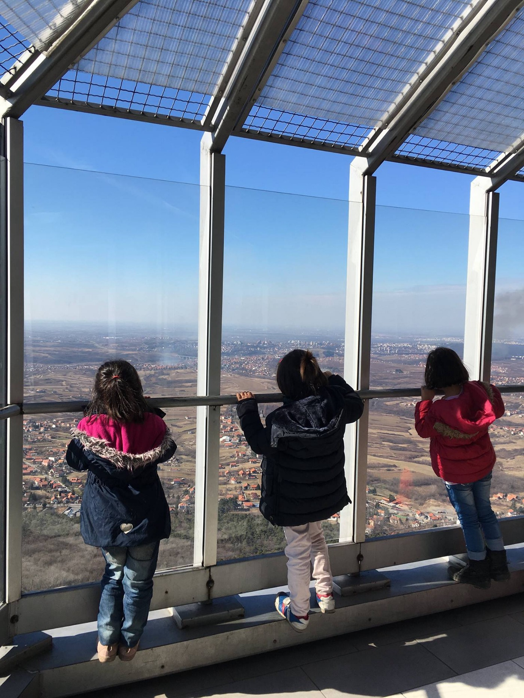

### AYS DAILY DIGEST 26/2: Court ruling provides promising update to Dublin enforcement\.

Photo Courtesy: One Light Global
### FEATURE

A recent ruling by the Court of Justice of the European Union establishes new conditions under which an asylum seeker’s transfer under Dublin can be halted, even if other criteria are satisfied; namely, that “if the asylum seeker to be transferred faces an individual risk of inhuman or degrading treatment because of his individual situation…\., notably the case in circumstances where the transfer of an asylum seeker, with a particularly serious mental or physical condition, leads to the applicant’s health significantly deteriorating\.”

The case that set the precedent was related to a family that applied for asylum for Slovenia; under Dublin, they would be required to be transferred to Croatia to file their claims; however, the new ruling declared that although Croatia’s asylum system is not “systematically flawed,” the condition of the potential transferee was so vulnerable, that such a transfer would cause lasting harm\. This ruling opens a new opportunity for many refugees who, without a doubt, remain in incredibly fragile states\. Incrementally, progress can be made\. Read the full ruling \(French, Slovene, and Swedish\) [here](http://curia.europa.eu/juris/document/document.jsf?text=&docid=187916&pageIndex=0&doclang=SL&mode=req&dir=&occ=first&part=1&cid=1022022) \.

It is unclear if this could potentially set a precedent for a similar ruling to be made in order to prevent forcible repatriation of asylum seekers, like those being deported to their “home” country no matter how unsafe the conditions are at home\.

Additionally, Safe Passage posted a comprehensive guide to applying for a visa for asylum for France on their Facebook page\.

“The French visa for asylum procedure allows people to apply for asylum in France while they are still in their country of origin or in a third country through a French embassy or consulate\.”

Safe Passage provides assistance to individuals interested in applying for this procedure in various stages, helping match candidates with “personal connection” sponsors in France and also assisting candidates in writing a fully detailed asylum claim\. For the full information, read [here](https://www.facebook.com/SafePassage2EU/posts/1835989186617286?hc_location=ufi) \.
### SYRIA

[In an interview with ATTN](http://www.attn.com/stories/15150/doctors-new-term-describe-syrian-childrens-suffering?utm_source=facebook&utm_medium=post&utm_campaign=internal) , Dr\. M\.K\. Hamza, a neuropsychologist with the Syrian American Medical Society, made the argument that the psychological symptoms being exhibited by Syrian children are over and above typical manifestations of PTSD, and recommended that a new term be used: Human Devastation Syndrome\.

> “We have talked to so many children, and their devastation is above and beyond what even soldiers are able to see in the war…\.They have seen dismantled human beings that used to be their parents, or their siblings\. You get out of a family of five or six or 10 or whatever — you get one survivor, two survivors sometimes\. A lot of them have physical impairments\. Amputations\. Severe injuries\. And they’ve made it to the refugee camp somehow\.” 

Photo Credit: White Helmets

Although Dr\. Hamza is specifically referring to the case of Syrian children, all children who face war and devastation of their families and livelihoods face similar syndromes\.

The suffering of many of these children does not end when they leave the war zone; instead, they are exposed to additional risk and exploitation in refugee camps, enclaves, and on the route to a marginally safer life\. Even if that destination is reached, the the horror will continue to echo through their lives, only highlighting the need for a comprehensive system of support for people who have seen more in a short time than any human should have to in a lifetime\.

Man with dislocated arm near Adana, Turkey\. Photo courtesy of Jennie Östland
### TURKEY

Refugee camps around Adana are in great need of doctors and other support as Khalsa Aid and other ancillary groups have scouted around 8 camps with over 8,000 people along the border between Syria and Turkey\. Although the constant presence of medics is most urgently needed, food, clothes, toilets, water, and more is all needed for the region\. Khalsa Aid has experienced volunteers and contacts on the ground and is happy to liase with any group that wishes to come\. Contact Jennie Östland [here](https://twitter.com/OstlundJennie) for more information\.

Open Cultural Center with a successful week of language classes\. Photo Courtesy of Open Cultural Center
### GREECE

A new video showcases a plea from Greece\.

The link above shows a creative and heart\-rending video put together by a resident in Souda\. “You’re torturing us by doing this\. Help us\. Help our kids\.”

According to Greek Migration Minister Yiannis Mouzalas, Greece is planning to close many refugee camps during 2017, instead planning to relocate the individuals previously residing there \(around 10,000 people\) to apartments\. Although this move is a positive one, it remains to be seen if and how it will be implemented\. Minister Mouzalas himself [cites the estimate of 55,000](http://greece.greekreporter.com/2017/02/25/mouzalas-we-plan-to-close-most-refugee-camps-in-2017-move-people-into-apartments/) people as being accommodated in Greece, so it remains difficult to see how 10,000 people constitutes “most” refugees in Greece; however it is still an important step forward in affirming the dignity and humanity of vulnerable persons in Greece\.

Mobile Info Team posted a comprehensive guide to asylum for LGBT asylum seekers to assist in clearing the air about the application and required criteria\. View it here \(scroll for English\)

Children from Krnjača Camp, Serbia ata playground for the first time too long\. Event & photo courtesy of One Light Global
### SERBIA

Experienced volunteers posted a helpful guide to all those looking to send aid to Serbia\. Organizations deeply appreciate the support and kind wishes involved of those seeking to send aid; however, aid that is not sent in accordance with procedure can cause serious complications both for those sending the aid and for organizations trying to receive and distribute aid, meaning that less ends up in the hands of those that need it\. Please save this guide for your reference and remain in close contact with the organization you wish to support\.

> Hey everyone\. We keep getting people asking how to bring donations into the country so I thought I would clarify it as a separate post: 

> \- In order to get second hand clothes across the border you will need a sender and receiver organisation with matching paperwork on both ends as to the items you are bringing\. 

> \- Everything will need to be professionally cleaned by a cleaning company and signed off as such\. Then all items must be inventoried by item type and number, and boxed and clearly labelled according to the contents \(1 box of trousers, measured by number and also by weight to be on the safe side\) \. New goods do not require cleaning but do require the same paperwork and packaging procedure\. 

> \- You will need to pay am import tariff once you have surrendered your goods to customs for inspection\. They will then be held there until claimed by the receiver organisation\. If you simply turn up at the border you can \(and most probably will\) be denied entry, as you are lacking the proper import paperwork\. 

> The reason the procedure is so strict us because Serbia is not an EU country, and so any goods not officially proven to be for humanitarian aid will be treated as a commercial import, which again requires paperwork and which has a heavy levy due to the county’s unfavourable trade agreements with the EU\. 

### HUNGARY

The show\-trial for Ahmed H\. and Yamen A\. and their families \(of the famous [Röszke 11 continues](http://www.reuters.com/article/us-europe-migrants-hungary-idUSKBN13P1MP) \) \. Those wishing to provide support for them can donate to this generosity campaign, which aims to ameliorate lawyer fees and other associated costs\. This fundraiser was created and is managed by reliable contacts, and the money will reach its intended destination\.

Residents of Krnjača on an excursion\. Courtesy of One Light Global
### GERMANY

Despite Germany’s comparatively glowing reputation for refugee support, a recent report documents that over 3,500 attacks targeting refugees occurred in the last year alone\. Three\-quarters of the attacks occurred outside of refugee centers; however a staggering 988 of the incidents targeted refugee hostels\. In all, 560 were injured, with 43 of them being children\. In the context of almost daily shrill “reports” exaggerating the impact of “refugee crime,” the silence of these news outlets that are ostensibly simply dedicated to “justice” and “human rights” is deafening\. Read the full report [here](http://m.dw.com/en/more-than-3500-attacks-on-refugees-in-germany-in-2016-report/a-37719365) \.

> It can be expected for these incidents to intensify and increase as Europe continues to harden its hearts towards refugees\. Concerned citizens must do more to reach out to refugees in their community, educate those around them, and stand up in the face of violence\. 

### SWEDEN

A fire broke out on the second floor at Restad Gård, [lasting through the night on Thursday night/Friday morning](http://www.svt.se/nyheter/lokalt/vast/brand-pa-asylboende-tva-hoppade-ut) , which is a home for asylum seekers in Vänersborg\. Two persons jumped out of a window in order to avoid the smoke and had to be brought to hospital in an ambulance\.

According to the local Police, 15 persons required treatment for smoke inhalation on site and 10 persons were taken to the hospital including the two who jumped out of the window\. Exactly how severe the injuries were remains unknown for now\. The two persons that jumped are the ones worst injured\.

Fires at homes for asylum seekers and in houses planned to be transformed into accommodations for refugees is not a new event\. During 2016, there were 112 fires reported\. Of them 20 were caused by accident or reckless behaviour\. The remaining 92 fires are considered as cases of arson\. In 37 cases, the fires have been started of someone who lived at the asylum home\. In two cases it is clear that an outsider started the fire\. In the remaining 53 cases the perpetrators still are unknown\. They have all been evaluated without being solved, there are suspicions about both internal and external perpetrators\. In 12 cases, an unknown suspect had been trying to burn down future asylum homes\.

In some cases the fires are assumed to be potential hate crimes\.

_Converted [Medium Post](https://areyousyrious.medium.com/ays-daily-digest-26-2-court-ruling-provides-promising-update-to-dublin-enforcement-c0e16d1b4662) by [ZMediumToMarkdown](https://github.com/ZhgChgLi/ZMediumToMarkdown)._
