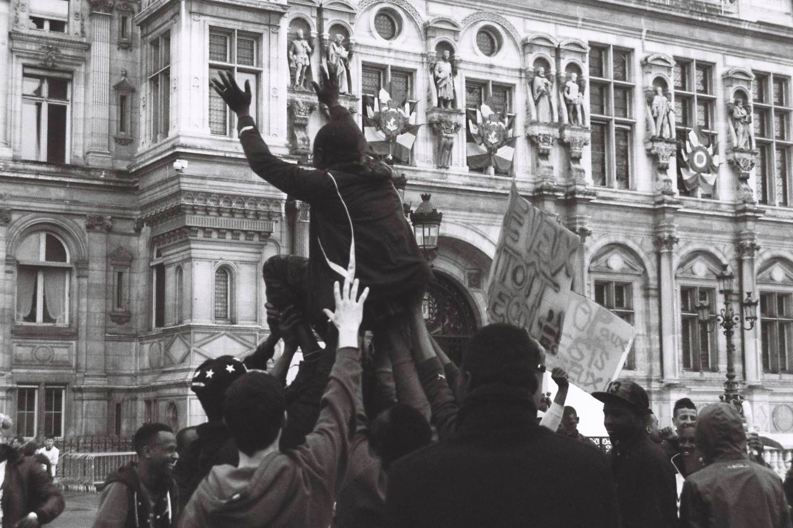
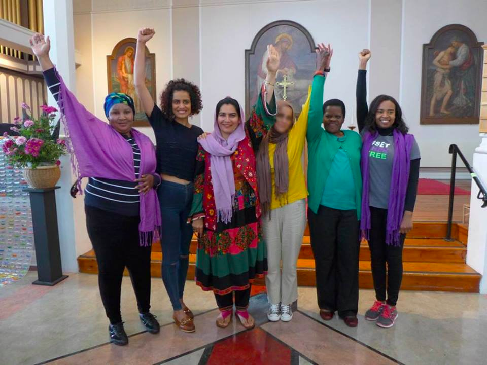
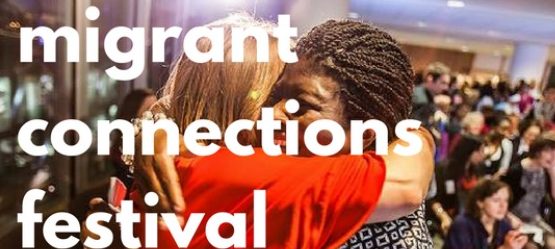
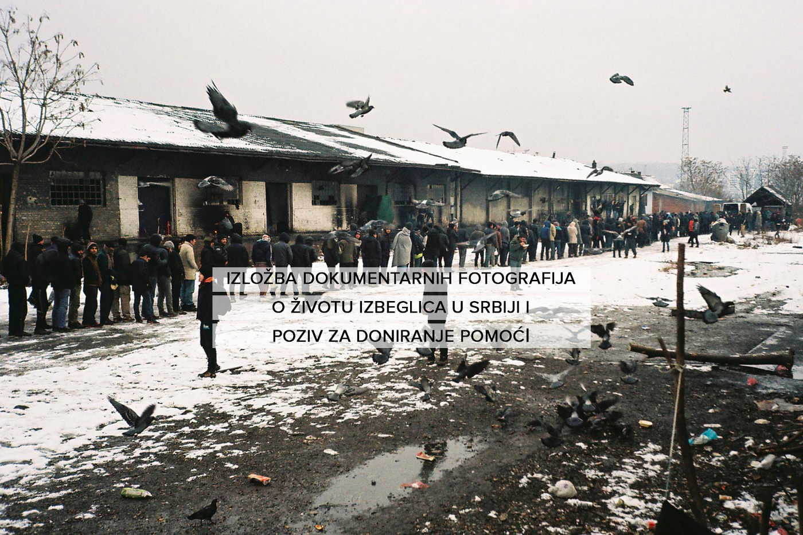

### This Week’s Solidarity Events in Europe
#### 27th of February to 6th of March— Calendar of protests, fundraisers and other events in solidarity with refugees
### Belgium

**Monday 6th of March** — [Let’s Bring Them Here](http://www.bringthemhere.eu/) : Only 13,000 people have been relocated so far from Greece and Italy\. Hundreds of people will gather for a car rally around the Schuman roundabout, to show EU leaders just how serious they are about welcoming refugees\. People will be driving to Brussels in their own cars, offering themseves as ‘Official European Chauffeurs’, willing to bring refugees to their respective countries if that’s what it takes to make it happen\. Drivers and support still needed\!
### France

**Saturday 4th of March 10h\-11h30** — [Roms, unaccompanied minors, young foreing adults: banned from school\!](http://www.labellevilloise.com/salon-anticolonial-3/) : NGOs and volunteers supporting Roms and unaccompanied children will discuss these children’s difficult access to the French education system\.

_Address: 19–21 Rue Boyer, 75020 Paris_

**Monday 6th of March 3PM\-5PM** — [Aucun Mineur à la Rue\!](https://www.facebook.com/events/1320778598002297/) : Hundreds of unaccompanied minors are forced to sleep in the streets of Paris as the office responsible for evaluating unaccompanied minors \(DEMIE\) refuses to shelter them\. A protest will therefore take place to demand the children’s immediate protection and an impartial evaluation by the DEMIE\.

_Address: In front of the DEMIE, 5 rue du Moulin Joly, Paris_

](assets/85fe71d8c87c/1*X0DeG65-HZCQwiGqyEcIlg.png)

Photo by [Dessins Sans Papiers](https://www.facebook.com/groups/dessinssanspapiers)

**Until the 28th of February from 10AM — 7PM** — [Sale of the book “Dessins sans Papiers”](https://www.facebook.com/events/1437059872993714/) : The book contains 200 drawings made by refugees in reception centres and the streets of Paris since this summer\. 10 euros per book will be given to the TIMMY, a group supporting unaccompanied minors in Paris\.

_Address: 43 rue Myrha, Paris 75018_
### UK

**Wednesday 1st 10AM to 4PM —** [National Refugee Women’s Conference: Building a better asylum system](https://www.facebook.com/events/1437295249614017/) : Women for Refugee Women and the London Refugee Women’s Forum organise the second National Refugee Women’s Conference\. There’ll be inspirational speakers, a range of workshops, and opportunities to discuss how to move forward in a post\-Brexit, post\-Trump world\. You can get your tickets [here](https://www.eventbrite.co.uk/e/national-refugee-womens-conference-building-a-better-asylum-system-tickets-30078658076?aff=efbevent) \.

_Address_ : _Amnesty International, 25 New Inn Yard, EC2A 3EA London_

**Saturday 4th/Sunday 5th of March** — [Migrant Connections Festival](https://www.facebook.com/MigrantsConnectionsFestivalMarch2017/) : Migrant Connections Festival is 4th\-5th March migrant led festival fostering community & solidarity\. There will be live music, poetry, food and interactive campaigning and solidarity workshops on everything from detention, destitution and housing to community and campaign building\.

_Address: Praxis Community Projects, Pott Street, E2 0EF London_

**Wednesday 8th of March 4PM\-7PM** — [Women in Asylum](https://www.facebook.com/events/379908802388674/) : To mark International Women’s Day 2017, the Evelyn Oldfield Unit is looking at the challenges facing women asylum seekers in the UK, and how these can be overcome\. This free event will involve short informative film screenings, a lecture on gender and asylum policy, and a panel discussion about how policy makers and refugee advocates can support asylum\-seeking women\. This event is mainly but not exclusively open to refugee, migrant and asylum\-seeking women\. You can book your ticket [here](https://www.eventbrite.co.uk/e/women-in-asylum-safeguarding-and-support-tickets-31932141896) \.

_Address: London Metropolitan University 166–220 Holloway Road, E1 7 Islington_
### Serbia

**Until 4th of March** — [Documentary photography exhibition about life of refugees in Serbia and call for donations](https://www.facebook.com/events/1144112645711099/) : Lazara Marinkovic is a Belgrade based journalist, author and photo\-reporter\. Her articles and photo reports are published in various media outlets, such as VICE, Al Jazeera, Pescanik, NIN, Bturn magazine and others\. Street gallery’s “People at the gates” is her first solo exhibition of documentary photographs created while reporting the refugee crisis in Serbia from August 2015 to date\. All photos are for sale and all proceedings will be donated to humanitarian organizations helping the most vulnerable refugees in Belgrade\.

_Address_ : _Ulična galerija, Čavketov pasaž Belgrade 11000_

_Please contact us through our Facebook page if you would like us to mention your event\._

_Converted [Medium Post](https://areyousyrious.medium.com/this-weeks-solidarity-events-in-europe-85fe71d8c87c) by [ZMediumToMarkdown](https://github.com/ZhgChgLi/ZMediumToMarkdown)._
