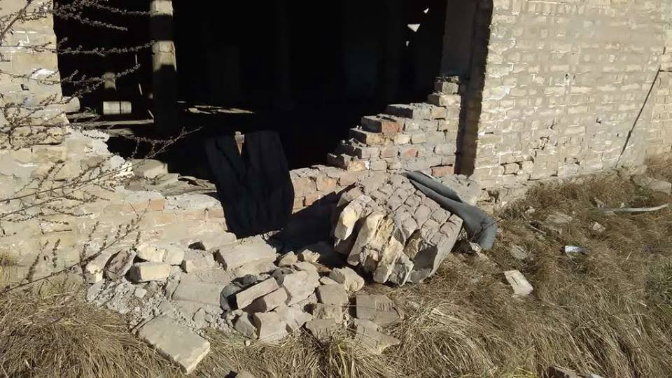
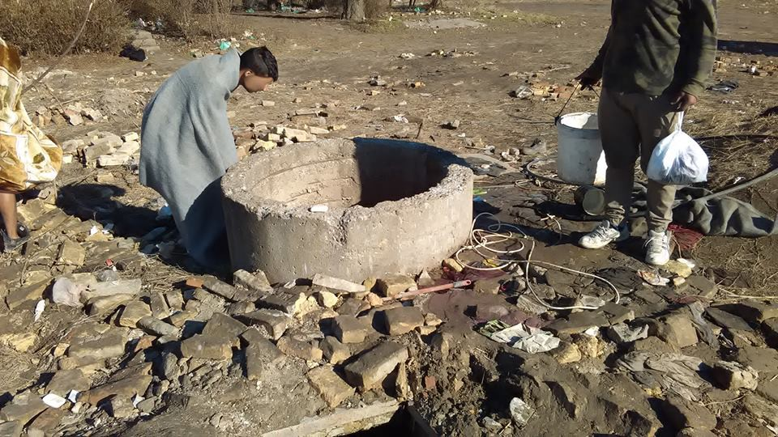
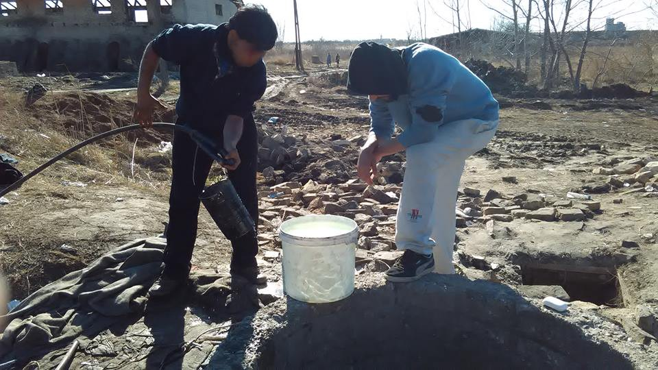
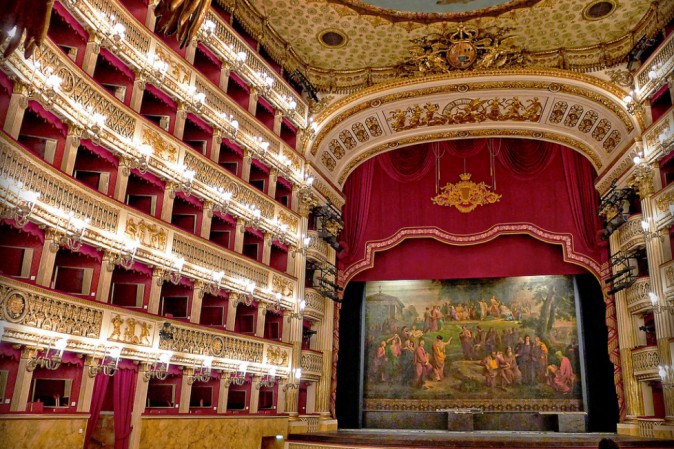
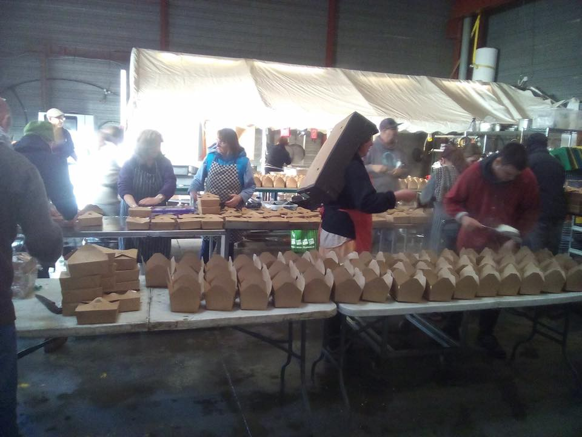

### AYS Daily Digest 28/2/17: Hungary to “Build that wall” making us all pay

Life on the border\. Photo: Umino

**_Hungary to build another wall / Relocation numbers slightly increased, but still not meeting the quota / Privacy lessons for all of us / Improvising showers on the border / 50 refugees arrived to Italy through humanitarian corridor / Students helping with asylum applications in Genoa / Theater in Napoli opening it’s doors to refugees / Refugee community kitchen in France needs donations in money and/or time_**

As many have been reporting over and over again, violence on the borders that guard Fortress Europe is palpable and systemic\. Borders of Croatia, Bulgaria and Hungary seem to be the worst with Hungarian government leading the way in publicly taking the most hard lined stance in denouncing the rights of people in migration and reducing them to horrid state of being\. Therefore it does not come as a surprise that in such a state of affairs, hungarian authorities have decided that one wall on it’s border to Serbia is not enough and are building another one\. As Deutsche Welle reports, Orban’s chief of staff, Janos Lazar, said the government had earmarked 38 billion forints \($130 million, 123 million euros\) for both the fence and newly planned migrant camps that are supposed to house refugees in shipping containers\. Meanwhile, Hungarian Helsinki Committee and Human Rights Watch are sending a complaint on Friday to the EU Migration Commissioner over the country’s proposed policies\. On Monday, a European Parliament committee was also planning to discuss the state of fundamental rights in the country\. “The European Commission should not stand by while Hungary makes a mockery of the right to seek asylum,” Human Rights Watch deputy director Bejamin Ward said\. “Using transit zones as detention centers and forcing asylum seekers who are already inside Hungary back to the Serbian side of the razor\-wire fence is abusive, pointless and cruel\.”, [Deutsche Welle reports\.](http://www.dw.com/en/hungary-begins-second-line-of-fence-on-border-with-serbia/a-37734475)
#### Greece
### **41 refugees rescued**

On Monday, [41 refugees were rescued](https://t.co/tGr4YA6nMs) at sea under difficult conditions near Kithira island in Greece \. 16 of them are children\.
### **Relocation numbers slightly increased, but still not meeting the quota**

There were 409 people relocated from Greece to other European countries in a period between the 20th and 27th of February bringing the total number of relocations to 9566\. 71 were brought to Belgium, 214 to Germany, 31 to Latvia, 1 to Luxemburg, 51 to Portugal, 41 to Spain

During the past cca 30 days, between the 24th of January and the 27th of February this year, 1,647 people have been relocated which is an improvement, but still far from the 2,000 monthly target that the European Commission had since December\.

With that, we have to note that Bulgaria, Croatia, Cyprus, Czech Republic, Finland, Lithuania, Slovenia, Liechtenstein, Hungary and Poland have not relocated anybody during that period\.
### **Unfairness of Turkey / EU deal**

In a reverse procedure — deporting people to Turkey under provisions of Turkey/EU deal is still going on\. The unfairness of such a deal is lost on many, but understood by the most\. Here is one of those who are trying to explain the magnitude of the unfairness\. If you are up to a bit of reading, [follow this link](https://www.hrw.org/news/2017/02/27/unfairness-forcing-refugees-greece-back-turkey)
### **Privacy lessons**

Whether people stay in squalid conditions in Greek camps, or they are relocated to other countries, every move or stay is recorded by a camera and used for different purposes and proving different points, depending on who gets to use the photos\. Therefore Refugee education Chios has started teaching their students to better protect themselves online so their pics would not be used for purposes they either do not condone, or were not informed about the intentions behind the camera\. This is as much as proclamation, as it is note to self\. Here is Refugee education Chios post in full:

“Privacy is something that we often take for granted, especially on social media sites such Facebook and Twitter\. Many of our students have had this right to a private life stripped away from them, and found photos of them uploaded onto the internet without their consent or knowing what purpose the photo was originally taken for\.

So as part of our duty as education providers, we ran a privacy lesson in our school, where we informed our students on how they can increase their privacy online\. This included informing them of the dangers of people asking to take their photo\.

We weren’t sure how successful this lesson was until this weekend, where the teenagers asked a stranger not to take their photo in the middle of the street due to their right to privacy\.

Education is more than just opening a book and learning ABC\. These are skills which will benefit them outside the classroom too\!”
#### Serbia
### **Improvising showers near the border**

Life on the border\. Photo: Umino

While Hungary plans to build a double wall so that not even a breath of fresh air could enter, people that are stuck in northern Serbia live in conditions that are hard to describe with words\. In an effort to make a day a little bit easier Fresh Response initiated improvised showers so the people don’t can access a bit of basic hygiene\. Landowners and police seem to be skeptical but didn’t intervene by now\.

Life on the border\. Photo: Umino
#### Italy
### **50 refugees arrived through humanitarian corridor**

This morning a new group of 50 Syrian refugees — most of which were women, children, and old men — arrived at Fiumicino airport through humanitarian corridor, implemented by Sant’Egidio Community\. On Thursday 2nd March, another group of 75 refugees will arrive in Rome, and the total number of refugees rescued will grow to 655 people since the beginning of the project\. The welcoming procedures started right after landing\. Once having completed registration processes at the Border Police, the refugees were taken to the reception centers in order to start the resettlement and integration phase\.
### **Students helping with asylum applications in Genoa**

It is always good to hear when people are organizing with progressive intentions in mind, this time 15 young university student will help those that need help with asylum application\. “Clinica legale in materia di immigrazione e asilo” is the name of the initiative, implemented by Realino Marra in cooperation with Genova University\. 15 students have been trained through specific workshops, role games, and meetings with representatives from Save The Children, and UNHCR, NGO professionals, lawyers, and cultural mediators\. These students will help asylum seekers to fill in all the bureaucratic paperwork in order to apply for international protection
### **Theater for the oppressed**

Teatro San Carlo di Napoli

Continuing with worthy initiatives happening in Italy, San Carlo Theatre, in Naples, opens its doors to 1300 immigrants for a music concert\. The “Associazione 3 Febbraio di Napoli” presented the initiative, held on 28 February, in which classical Italian music will be played\. As the Mayor of Naples, Luigi De Magistris, said: “This is an important initiative in order to show the link between the Theatre and people living in Naples, regardless their nationality”\.
#### France
### **Refugee community Kitchen needs donations and time**

Picture bellow shows Refugee community Kitchen \(RCK\) packing the meals that Utopia56 will hand out in Calais tonight\. All those meals, about 200, will be eaten tonight, and odds are it won’t suffice\. RCK’s total meals per day are over 1000 again\. Therefore RCK need donations of money, food and time\! If you can help in any of those three departments, please email refugeecommunitykitchen@gmail\.com

RCK

_Converted [Medium Post](https://areyousyrious.medium.com/ays-digest-28-2-hungary-to-build-that-wall-making-us-all-pay-b37ae77bd880) by [ZMediumToMarkdown](https://github.com/ZhgChgLi/ZMediumToMarkdown)._
