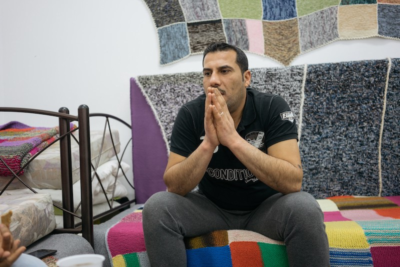
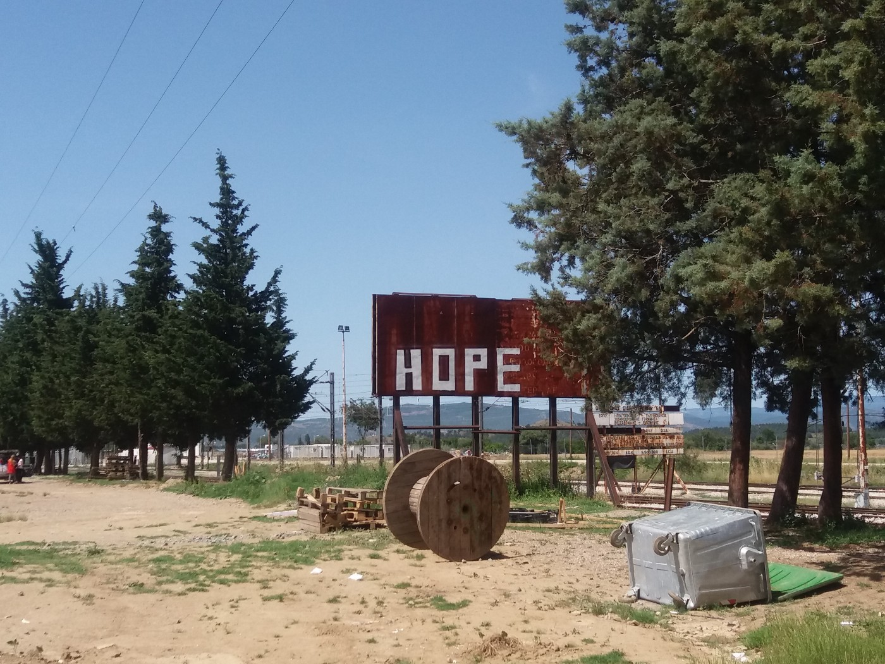
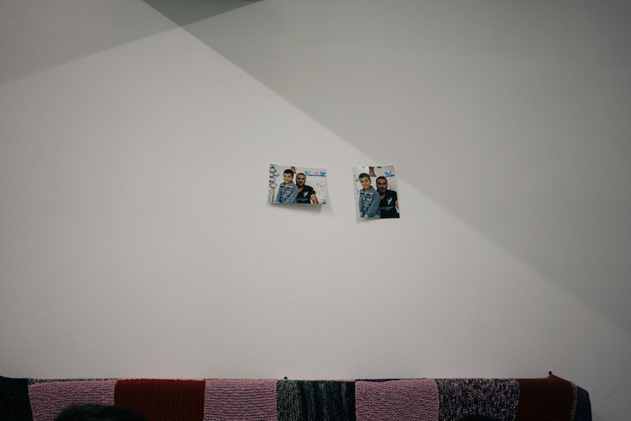
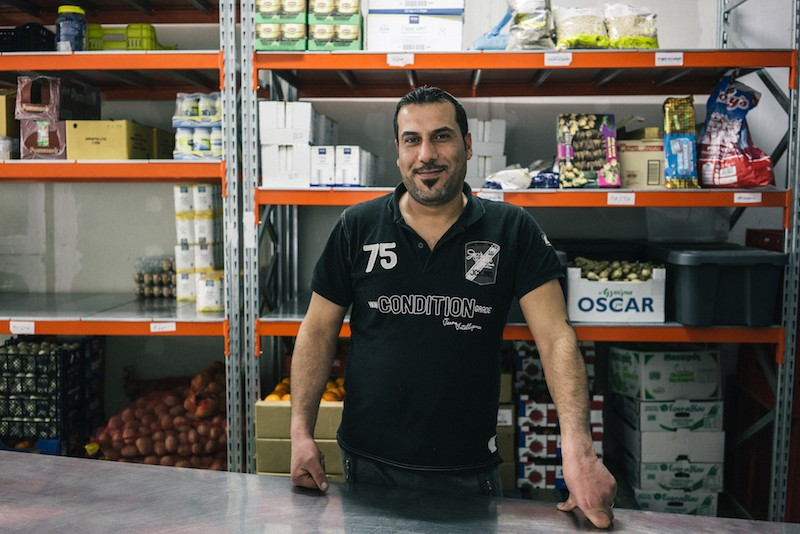

### AYS SPECIAL: Meet Mohammed, one father struggling to reunite his family

_In July last year, Mohammed Jameel and his 8\-years old son had their last interview in Greece\. They were told that they would be allowed to go to Germany and reunite with Jameel’s wife and daughter\. In November, they got final approval to go, but they are still in Greece, waiting for the day when they will be allowed to travel\._

“This is the hardest time of our journey,” says Mohammed, who is stuck in Greece with his son\. They have been trying to reach his wife and daughter for almost a year\. Photo ELPIDA\.

Mohammed and Ahmed left their home in Bagdad, Iraq, a year ago\. Since then, they survived three days of the journey on a broken dingy, a number of arrests, life in makeshift camps, official camps, endless walks, life in Idomeni under one big tent with over 500 people\. Today they live in a safe place, Elpida home project in Thessaloniki, where people are helping them in the best possible way\. But, for Mohammed, this is the worst time of this life\. “This waiting is the hardest part of our journey,” he told AYS through a volunteer who interpreted his words in a room where he and his son are living\. “This is harder than Idomeni or the journey\. In Idomeni, we were lost and didn’t know where or when we are going\. But here, it feels like somebody is lying to us all the time, giving us false promises\. This is tiring and long\. We went through all this, and we are waiting for the permission to go and see our family, to reunite with them\. To bring my son to his mother, and to see my daughter\.”

Mohammed’s story is just one of many in Greece\. He is telling it while trying to hold back tears and to appear strong in the front of strangers, yet he is aware that it is important to tell their difficult story hoping that somebody will read it and be able to end the uncertainty and absurdity of the system of closed borders that separates families\. Here is his story\.

“I was born in 1978 in Bagdad, Iraq\. I have two children, one boy, and one girl\. My wife and a daughter are in Germany, Cologne, while my son and I are here in Greece\. We have not seen each other for a whole year\.

We left Bagdad in February last year\. The two of us came to Greece on the sea after leaving Turkey with a group people on a small dingy that broke down in the middle of the sea\. We managed to fix it and arrive safely to one of the Greek islands, and then to head to Athens and later to Idomeni\. In the first attempt, we were stopped by the police, arrested and kept in one place where we were not allowed to leave\. I was not allowed even to smoke\. After a couple of days, we ran away with a group of people\. We walked 163 km to Idomeni, where we arrived on February 25th\.

When we got there, the border was still open\. We got the number 119 on our registration paper that I still have with me\. It is the number I will always remember\. However, it meant nothing\. Every day, we had to stay in the line and wait for another number that was written on a piece of paper by hand\. People used to change numbers on their papers, trying to cheat in different ways\. We were waiting our turn to cross the border\.

Immediately after the border closure, people still had hope that it will be open again soon\. Then, they started realizing that it will not happen\. \. \. Photo AYS

While waiting, we were living in one big tent with a lot of others\. Sometimes more than 500 people\. People used to squeeze in the night, sometimes the entire families, if they did not have a place to stay\. More people were coming every day\. Some of them did not even have anything to sleep on, so they used to put one piece of clothing under them and one over them before sleep\. If you tried to walk through the tent in the night, you could step on people if you were not very careful\.

We were waiting and living like that in Idomeni for over three weeks and then the border closed\. We were just lost at that moment\. We were already lost, but people had hope that something would change\. Immediately after the border closure, people still had hope that it will be open again soon\. Then, they started realizing that it will not happen and started strikes and different forms of protest\. One day, some of the refugees were throwing stones at the Macedonian army\. That is how angry they were\. The army threw tear gas back at them\. It was like that for three days, back and forth\.

Meanwhile, some people tried to run away to the villages around, but police chased them and pushed them back to Idomeni\. At the end, I stayed there for three months, constantly hoping the border would open\. During that time, we did not know what will happen to us\. We had no TV or any access to news but relied on the occasional visits of journalists who used to bring us information\. We were just desperate and did not know what is going on\.

During that time, I lost 36 kg\. I still carry pictures of me before the journey, on the boat, when we arrived, and from Idomeni\. My son also lost a lot of weight\.

When we left, my son had some kind of idea of what awaits us because his mother and sister left two months before, taking the same route\. We had to separate since I wanted to stay and earn more money to pay for the journey and to have some savings for our new life\. My wife took our daughter who is handicapped\. She could not take care of both of them alone\. We were supposed to follow them soon\. After the two of them left, I stayed alone with my son\. My family helped me to take care of him in Iraq since it was for the first time for me to be alone with him\. But when we left the country, it was only two of us\. I did not know what to do\. I had to take him everywhere I go\. During the journey, people do not have time to take care of other people’s children, and we were alone, all the time together\. It was especially hard in Idomeni\. Sometimes we had only three apples a day to eat\. When I had some money, I tried to buy a tin of tuna or similar things for my son, if it was available\. Food in Idomeni was very scarce\. Only a piece of bread and a thin layer of jelly, or cheese, sometimes small slices of turkey, which was a big thing if and when happened\.

They wanted to have family portrait, but closed borders and bureaucracy are preventing their reunion\. So far it is only two of them, Mohammed and Ahmed\. Photo ELPIDA\.

It was not safe surroundings, for me and even less for my son\. I did not know so many things about parenting a boy\. When he was sick, I had to find a way to deal with it\. I remember the day when he came to me with something on his head\. We ran to see a doctor, but with the language barrier I could not really understand what is going on, and there were no interpreters in the hospital\. Until now I am not sure what happened\. Doctors helped him, and I assume he was badly bitten by some insect\. Even today he has a scar on that place\.

After 3 months in Idomeni, we found smugglers to take us through Macedonia and Serbia together with the group of people, 20 of us\. The only child in the group was my son\. We walked for three days through the mountains, following the railroad\. One day it was raining heavily and it was very cold\. We saw a bridge and decided to stop and hide from the rain, but also to take a break\. We were all completely wet\. Some of the guys decided to go and look for the food and managed to find something\. But, police spotted them, followed and found us\. It was 7 am\. We were afraid since we heard all these horrible stories about police violence\. But these policemen were from the EU, Slovenia, and they treated us OK\. Finally, they took us by the army car with other people who were arrested, to a police station\. On the way, I remember seeing we are only 17 km away from Serbia\.

We were taken to the police station, interrogated and searched, and then left to wait until the evening when they put us in the car and drove back to Greece\.

My son was very brave along the way\. But sometimes he needed to stop while we were walking\. Unfortunately, if one person stopped, nobody can wait, and you cannot stay alone since we were in the mountains and forests\. He sometimes felt very tired, felt pain in his stomach, but we had to continue walking\. I was heartbroken to see him going through all this, but we had to\. Sometimes I wished they will arrest us just to stop all that suffering\.

Then we were back in Idomeni, and I decided to leave the camp\. We went to camp Ladadika where we stayed for two months\. It was much better there, but we still lived in the tent\. But our own tent\. After that, we came to Elpida\.

All this was very difficult, but I do not regret we left Iraq\. Not for a moment\. In Iraq, people were killed and we are running away from that\. We left for the first time after Sadam Hussein was killed, in 2007, and fled to Syria\. But, we came back in 2012 believing that situation would have improved\. I used to own little wholesale food shop in Bagdad\. That was destroyed in a bomb attack, and I started selling the same things at the street\. Soon, I was able to buy another small shop\. But life was unbearable\. Death, fear, kidnapping… That is how I remember Iraq\. Every day\. What I saw here is nothing in comparison to what we lived in Iraq\.

People were leaving all the time\. At some point, we heard a rumor about the closing of the border in Macedonia and decided to go before that happens\. And this is where we arrived\.

Now I am waiting every day to see my name on the list of those who are able to go\. My son goes to the school here, and life is safe\. But he needs his mother\. Sometimes I feel I cannot do what is the best for him\. And I feel it is my fault if I see him being sad\. I feel pressure, fear, huge responsibility\. My daughter in Germany is sick, and just this week my wife told me she has a heart problem, too\. And all I can do is to sit and wait\. I am all the time worried about them, us here and them there\. And my son needs his mother, his sister, he needs to go to a real school, to eat what he wants, but I feel I cannot give him all that\. But, I learned to make a very good omelet\.”

Mohammed is trying to stay strong\. In order to stay active, he takes part in everyday life in Elpida and helping with food distribution\. He looks relaxed behind the counter\.

The moment when Mohammed feels relaxed\. “I have to do something while I am waiting\. We cannot just sit here and do nothing\. I am happy to help\.” Photo ELPIDA\.

Two of them are living a big room, tidy and cozy\. Mohammed made it look like that to make his son feels better\. He got him a guitar, he hung some small family portraits on the wall\. Not the entire family, but only two of them\. And they wait\. Like thousands who are trapped in Greece\. In November, they got final approval to reunite with their family, but they are still in Greece, waiting for the day when they will be allowed to go\. When they finally finds out the date for their travel, there is a big chance they will have to find the way on their own to pay for the ticket to Germany\. Even though it is against all the rules, it is happening every day\. From the moment they apply or reunification and get the approval from the country they are going to, it can take even 6 months\. By the rules, they should not pay for this trip, but it is happening every day that they get informed that if they do not pay for them selves they will have to wait longer due to bureaucratic obstacles that are hard to understand for anybody\. Another obstacle on their long journey that they will have to overcome\. And they will\.

War, closed borders, and endless bureaucratic procedures kept this, and many other families, separated for over a year, forcing them to live a life that nobody deserves\.

_Nidzara Ahmetasevic, AYS_

_Converted [Medium Post](https://medium.com/are-you-syrious/ays-special-meet-mohammed-one-father-struggling-to-reunite-his-family-863de6885f40) by [ZMediumToMarkdown](https://github.com/ZhgChgLi/ZMediumToMarkdown)._
