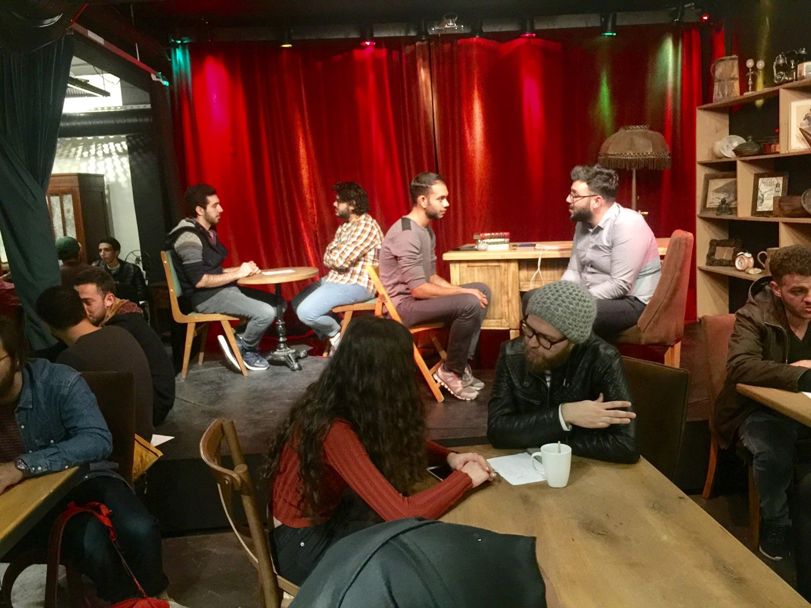
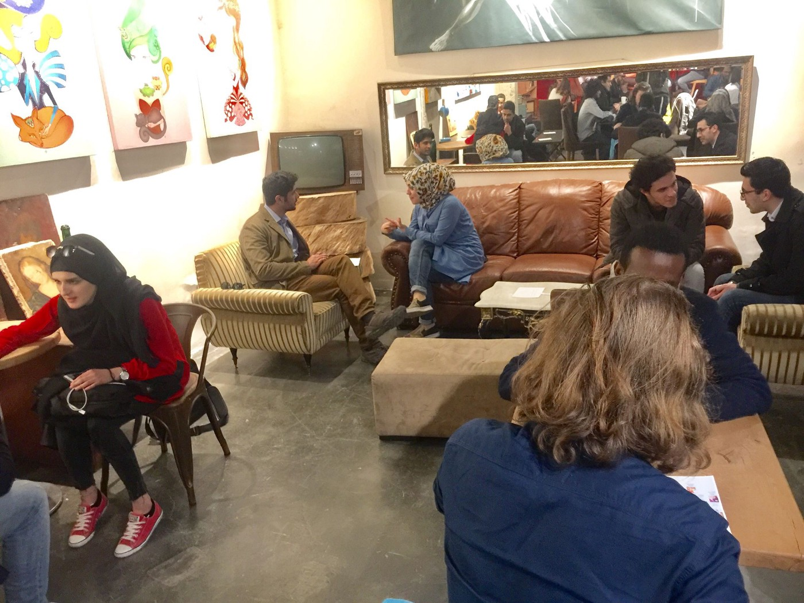

### Istanbul&I, How We Got To Know Each Other

In the basement of a coffee shop in the Cihangir neighborhood of Istanbul, a group of about 60 students, professionals, and everything in between came together last Thursday evening\. It was a Speed Friending event put on by the youth community group [Istanbul&I](https://www.facebook.com/IstanbulandI/) , whose mission is to empower disadvantaged and displaced communities through social impact programs\.

Until that night, I hadn’t really met the refugee population of Istanbul outside of the work I was doing with my day job assisting asylum\-seekers in far\-flung parts of the country\. Unlike in Greece, where I had spent the previous six months, refugees here are integrated into the landscape of the city\. There are no camps in Istanbul, no tents or housing containers atop newly cleared earth, or housing squats clustered in the center of the city\. But if you take a closer look, they’re here\.

You can find Arabic lettering on Syrian storefronts throughout the city, arguably more public calligraphy than this city has seen in the nearly hundred years since the implementation of the modernization project of the newly\-established Republic of Turkey that moved away from the script of the Ottomans to the Roman letters it uses now\. Though it feels natural in a cityscape dominated by the most beautiful mosques you will ever see\.

You can also find them in the faces of the underbelly of the city\. In some of the [panhandlers](http://www.reuters.com/article/us-syria-crisis-turkey-refugees-idUSKBN0FQ15Q20140721) and the [young boys recycling trash](https://www.youtube.com/watch?v=yX3MzMRtJHI&feature=youtu.be) , evidencing the desperation of trying to survive in a metropolis too big, too busy, and too expensive to afford them the peace they came here in search for\. But most are locked away, working illegally in [textile factories](http://www.bbc.com/news/business-37716463) to earn pitiful wages, if they are paid at all, making the affordable, trendy clothes Westerners like me have come to expect\.

That night, I apprehensively descend down the windy stairs, surprised at how nervous I was\. Eight months ago, I quit my job at a non\-profit in New York to work with refugee populations on both sides of the Aegean Sea\. In that time, I’ve met hundreds of people, often times at events similar to this one — the dramatic increase in the number of my Facebook friends validated the feeling that I was pretty good at meeting and connecting with strangers\. This event was different, but I wasn’t sure why\.

I find the only I had friend until that point and felt a little more at ease\. The vibe of the place is familiar and comforting to my urban sensibilities\. One of the first people I meet is a blonde\-haired, blue\-eyed guy with a hipster beard and a matching beanie\. He’s someone I could have easily met in Williamsburg, or San Francisco, or Amsterdam\. In that split second I had him all figured out\. Like me, I thought, he’s in Istanbul for some reason that combines just the right mix of professional aspirations and curiosity at this ancient culture, with a twist of thrill\-seeking adventure\.

“Hi, my name is Shala\. What’s your name?” I heard “Austin\.” Or rather, my logic\-loving brain heard it\. “Waseem,” he repeated\. “You don’t look like a Waseem\.” That’s literally what came out of my mouth\.

I was left puzzled by my own assumptions\. I wasn’t supposed to think this way\. I’m certainly not new to this, having myself been a baby refugee smuggled into what would be my new home\. But here I was, forced to confront my passport\-normative world\.

The night continued to challenge me in ways I didn’t think I think I needed to be\. Every few minutes, the buzzer reminded us that we had to slide down to meet a new friend\. The organizers were purposeful in mixing up nationalities, statuses, genders, and even markers of religiosity so that we each walked away changed, a little bigger in our worldview than how we came in\.

Waseem was an architect from Syria, and so was his friend, who I would meet a few swaps later\. I met a Mongolian student and a Yemeni one, both studying in nearby universities and fluent in the local language\. I met a Turkish student studying solar physics\. Fossil fuels were drying up and she thought there was huge potential for countries in the global south to lead in these innovations\. I was impressed by the thoughtful and innovative conversations happening in my new home and at the same time sad for what I had just left behind\. While our [warriors in North Dakota](http://www.countercurrents.org/2016/11/22/police-blast-nodapl-activists-with-water-cannons-in-sub-freezing-temps/) were trying to hold on against dogs, water cannons, and tear gas, the [CEO of Exxon\-Mobil was made Secretary of State](https://www.nytimes.com/2017/02/01/us/politics/rex-tillerson-secretary-of-state-confirmed.html?_r=0) \.

There was an Egyptian photographer who said he felt that there was no future for him in his home country\. And then I met an American, but from the other kind of America \(or so they tell us\) \. She was from a small town of 7,000 and spoke endearingly about how she fell in love with Turkey when she was here as a high school exchange student\. After completing university and against the advice of travel advisories, she had to come back\. I knew exactly what she meant: I first came to Istanbul in 2008\. Since then, without realizing it, I too was conspiring for a way to return\. And I did, but by then Istanbul had changed\.

I thought I did, too\.

The speedy friends I made all had stories that defied my neatly\-categorized preconceived ideas of power structures, who the beneficiaries were of events like this one, and who was imparting the benefit by generously offering their time and allowing others the blessing of even getting to know them\. There was nothing I could offer any of the people I met aside from a listening ear, an open heart, and my friendship\. Thankfully, no one asked me about Trump or my opinion on what was happening in the US\. They just wanted to know me\.

The idea that relationships made with refugees, or even immigrants for that matter, are inherently one\-sided, with certain people giving the help and other people receiving the help is just about as tired as the idea that mosques have no place in modern cities, or bars no place in deeply\-spiritual ones, and that there is any inherent relationship between the skin tones of the refugee\-producing countries and the refugee\-receiving ones other than circumstance\. Like Istanbul, it’s much more nuanced, complex, and beautiful than that\.

I’ve known for a while that I’ve gained more from the connections I’ve made in Greece and Turkey than I’ve been able to offer\. Every day, I continue to be humbled by how little know\. And even then, every so often, I’ll put my foot in my mouth\.

\(By Shala Gafary\)

_Converted [Medium Post](https://areyousyrious.medium.com/istanbul-i-how-we-got-to-know-each-other-8be92aa89c90) by [ZMediumToMarkdown](https://github.com/ZhgChgLi/ZMediumToMarkdown)._
