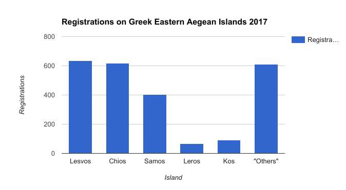
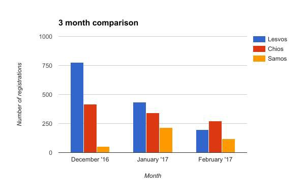

### AYS Daily Digest 01/03/17: Are some nationalities among the refugees purposely ignored?
#### Greece: Unanswered previously arranges Asylum Service Skype calls to people from Pakistan, Bangladesh, Iraq and Afghanistan \| Frontex boss: NGOs encourage the traffickers \| Higher number of arrivals to Italy, but also of deaths at sea \| UK: MPs voted in favor of Dubs’ continuation \| Unaccompanied minors risk being expelled from Sweden

Mediterranean sea, February 24, 2017
Refugees at the Golfo Azzurro rescue ship, as the vessel heads to Italy \(Photo: Santi Palacios\)
#### FEATURE
### Asylum Service Skype settings: Don’t answer the incoming calls?

People from Pakistan, Bangladesh, Iraq and Afghanistan in Greece are unable to access asylum process because the Greek Asylum Service is not answering their Skype calls\. We have received a number of complains from people who are trying to reach this service but with no success\. Several other organizations working in the field confirmed the problem has persisted over a time\. 
According to the rules, those people who arrive to the Greek mainland and want to get Asylum Seeker’s card and apply to stay in the country, or to join their family in another European country, have to book an appointment with GAS through Skype\. The person has to call at a certain time of the exact day, depending on the language they speak and the region in which they are staying, and set up an appointment\. 
The official GAS Skype timetable for all languages is available [here](http://bit.ly/skype__timetable) \.
Once the person gets through on Skype, they will get a five digit number that they will use to go to the asylum service and get the asylum seeker\`s card\. Sometimes, due to a large number of calls, it can take several attempts, but many people complain that they never got through, though they are trying over again\.

> “Hello
 

> Please I need some help about my card
 

> I have trying last 4 month but no pick the call” 

> “Hi\. How are you? I am calling on Skype every Wednesday and Thursday but didn’t attend my call anybody\. What is reason sir\.
 

> Just ringing but didn’t attend” 

> It is hard to understand what is the reason for this negligence, but either way, the result is that many people are placed in a very difficult situation and forced to stay illegally in Greece\. 

According to the information we obtained, GAS claims that they are understaffed, while some sources are saying the people in charge arrive late at work\. Some even claim that there are lawyers that ask sums of 500€ so that the applicants who call with their ID actually get an answer\.

In 2016, the Asylum Service registered 51,091 applications for international protection\. This number does not include the approximate 15,000 applications the full registration of which will be completed in 2017\. The four \(4\) main countries of origin of asylum seekers are Syria, Iraq, Pakistan and Afghanistan\.
#### SEA
### Frontex suggests NGOs involve in criminal act while saving lives at sea

The head of EU border agency Frontex in an interview with a German newspaper criticised charities that rescue migrants off Libya, arguing that they encourage the traffickers who profit from the dangerous Mediterranean crossings\. Such rescue operations “should be reevaluated”, Fabrice Leggeri said\. He also charged that some NGOs cooperate poorly with EU security agencies, continuing the rhetorics from his previous report in December, when he said they were picking up migrants at sea “like taxis”\.

There has been a sharp increase in the number of deaths this year, with 255 people dying at sea since January 2017\. More than 4,200 people in total died in the Mediterranean in 2016\. The number of people from Syria, Iraq and Afghanistan has decreased while the number of those from Africa, particularly Nigeria and Eritrea, has increased\.

Michael Buschheuer, the head of [Sea Eye](http://sea-eye.org/) , said in a [statement](http://sea-eye.org/frontex-attackiert-lebensretter-sea-eye-reagiert/) addressing Leggeri, that they refuse and always refused to work with smugglers\. “Smugglers are murders,” he said\. That’s why he condems the accusations of Frontex as absurd\. Since April 2016 Sea Eye rescued more than 5000 people near the Libyan Coast\. On 7th March they will start their next rescue mission\.

■■■■■■■■■■■■■■ 
> **[MSF Sea](https://twitter.com/MSF_Sea) @ Twitter Says:** 

> > We do not share @FRONTEX’s mandate. We are not anti-smuggling operatives; we are doctors and nurses at sea purely to save lives. https://t.co/Uu9Eem47Xj 

> **Tweeted at [2017-02-27 18:06:20](https://twitter.com/msf_sea/status/836276294002302976).** 

■■■■■■■■■■■■■■ 

#### GREECE
#### Islands — official registration

139 people have been officially registred today on the Greek islands\. For the first time since January 30 new arrivals are registred on the island of Leros: 27 people\. Another 71 have been registred on Samos and 41 on other islands\.

During the month of February no people were registred on Leros, while 51 person was registred on Kos, 117 on Samos, 198 on Lesvos, 274 on Chios and 333 on other islands, making a total of **974 people officially registred** in February\.

Just few weeks after Minister Mouzalas announced that “no more tents were present in Greece”, 2 tents burnt down in Moria on February 27\. Luckily nobody got hurt, but a lot of private belongings were destroyed\. According to our sources, it was once again a small NGO that had to cope with the needs of the residents who lost the little they had in the fire\. Despite all the protests and promises made by the government, nothing really changed in the last weeks and still self funded volunteers have to cover the real daily needs of the residents, they claim\.

At the same time, a clothing “shop” was organized and set up in Moria by the [TruckShop](https://www.facebook.com/mobileclothesproject/) team that has been providing jumpers, jackets and undergarments to people stuck in these horrid camp conditions\. 
“We urge all organizations working within camps in Greece to contact us if they would like assistance in establishing a clothing store\. Clothing distributions that offer choice don’t need to be difficult\! We can help\!”
#### New arrests of a suspected smuggler on Samos

The Greek coastguard arrested a Turkish man on the island of Samos who smuggled 71 refugees and immigrants into Greece over the past two days, media [reports](http://dailyhellas.com/2017/03/01/turkish-human-trafficker-arrested-by-greek-coastguard/) \. He was arrested at Mytilene, along with the 44\-year\-old Syrian man who was also detained\. During the arrest, the authorities found 10 international asylum seekers’ forms and copies\.
### Camps in the mainland on stand by

For a while now we have been receiving news about the camps on the mainland, that have previously been closed, getting ready to receive new residents that are supposedly soon coming from the Greek islands\. Vasilika is one of the camps discussed among the people and it is said to be the designated new temporary home to the people who are stuck in the overcrowded camps on the islands\. This is one of the camps that provided many a horrified looks at the photos sent from the camp in the summer peak when the first rains created huge problems for the people there as they almost flooded the entire camp area\. Mazarakis camp in Cherso is also said to be equipped with containers, to replace the old tents, and the word is that once again it will host refugees, but this time under the direct management of the Greek officials, according to our sources\. There have been no official confirmations yet to these plans\.

 **once again got other people’s shit done, setting up the long awaited light system in the Softex camp, after the refugees have been living and fearing for their safety in one of the most dangerous of camps on the Greek mainland\.** \(Photo: [Help Refugees](https://www.facebook.com/HelpRefugeesUK/?fref=nf) \)](assets/a90f6a02e9a3/1*8NnDuMC3nQjT9zAr4oeApg.jpeg)

[**The Get Shit Done Team**](https://www.facebook.com/The-Get-Shit-Done-Team-304001796641127/?ref=page_internal&hc_ref=PAGES_TIMELINE) **once again got other people’s shit done, setting up the long awaited light system in the Softex camp, after the refugees have been living and fearing for their safety in one of the most dangerous of camps on the Greek mainland\.** \(Photo: [Help Refugees](https://www.facebook.com/HelpRefugeesUK/?fref=nf) \)

One of the rare places with decent conditions for the refugees in Greece is Elpida\. But even in such circumstances those who are suffering can’t find peace\.

> “ I am waiting every day to see my name on the list of those who are able to go\. My son goes to the school here, and life is safe\. But he needs his mother\. Sometimes I feel I cannot do what is the best for him\. And I feel it is my fault if I see him being sad\. I feel pressure, fear, huge responsibility\. My daughter in Germany is sick, and just this week my wife told me she has a heart problem, too\. And all I can do is to sit and wait\. I am all the time worried about them, us here and them there\.” 

Read [Mohammed’s story](https://medium.com/@AreYouSyrious/ays-special-meet-mohammed-one-father-struggling-to-reunite-his-family-863de6885f40#.pcnt9we1p) , one of the many that refugee stories that separate families and make their sorrow grow even after reaching safety\.
#### ROMANIA

New information on Romania for refugees and those working closely with refugees who might find themselves in Romania is available on the [we2eu](http://w2eu.info/romania.en.html) page\. It contains information on the [current situation](https://live.w2eu.info/en/romania/) in the country, [general](http://w2eu.info/romania.en/articles/romania-overview.en.html) information, [asylum](http://w2eu.info/romania.en/articles/romania-asylum.en.html) , [health care](http://w2eu.info/romania.en/articles/romania-medical.en.html) and other aspects of [living](http://w2eu.info/romania.en/articles/romania-living.en.html) in Romania\.
#### SERBIA

The owners of the old factory in Subotica where the refugees are sleeping have started tearing the building down, as planned and announced earlier\. The place that has served as a provisional accommodation for a large number of people, hiding there while trying to cross the border and move on, has already lost the rooftop and it should soon be gone from the property, leaving the people to find another deserted place that could be a refuge for them, [local NGOs say](http://maglocistac.rs/varga-pocelo-rusenje-stare-ciglane-u-subotici-u-kojoj-borave-migrati/) \.

UNHCR’s “Highlights and statistics” as well as other information they published on the situation in Serbia is available on [this link](http://reliefweb.int/sites/reliefweb.int/files/resources/53909.pdf) \.
#### ITALY
### Higher number of arrivals to Italy

IOM Rome reports that 13,457 migrant arrivals in Italy before the end of February represents a significant increase compared with arrivals in the same period during each of the past two years\. Last year just fewer than 9,000 migrants had arrived by this date\. IOM notes that Italian arrivals already are well above those recorded during the first two months of either 2015 or 2016\.

Deaths at sea in the region this year also are running well ahead of fatalities in 2016, especially on the Mediterranean’s central route linking Libya and Italy\. IOM’s Missing Migrants Project reports an estimated 444 deaths or disappearances of migrants on this corridor through 26 February, compared with 97 last year at this time — an increase of almost 400 percent\.

 \)](assets/a90f6a02e9a3/1*QJjLK9lxfSP3EXPvGQp21A.jpeg)

Today’s Times includes a letter from Rowan Williams appealing to the Government not to close ‘Dubs’\. \(By [Safe Passage UK](https://www.facebook.com/Safe-Passage-UK-159240661197359/) \)
#### UK
### MPs vote in favor of protecting the refugee children

The Dubs scheme has been closed by the UK ministers, but today MPs voted in favor of its continuation\.

It was backed by 254 votes to one and although the vote is non\-binding on the government, its supporters said they would put down new amendments to legislation next week to try to force the government to keep the option open\.

The government has been criticised for ending the programme, which it says could encourage people traffickers\.
#### SWEDEN
### Unaccompanied minors risk being expelled this year because of the waiting time and procedure

**18thousand** unaccompanied minors are currently waiting for an answer to their demand for international protection in Sweden\. The average waiting time is 466 days, which is 50 days longer than the waiting time for adults, [according to numbers](http://www.dn.se/nyheter/sverige/ensamkommande-barn-vantar-langre-an-vuxna/) provided by the Migration Agency\. For the children with Afghan citizenship the time of waiting, in the cases where the decision is pending, can be even longer — up to 500 days\.
This practice can lead to an increased number of young people with mental health problems\. “That is why the lone children should be prioritized”, Anna Karin Hildingson Boqvist from the office of [Ombudsman](https://www.barnombudsmannen.se/om-webbplatsen/english/) for Children in Sweden points out\. 
On the other hand, the Swedish minister of migration Morgan [Johansson says](http://www.dn.se/nyheter/sverige/morgan-johansson-det-ar-inte-tillfredsstallande/) that the suggested upper time limit for the waiting of unaccompanied minors might be reality “when the situation goes back to normal\.”

In the prognosis from October whose changes [we mentioned](https://medium.com/@AreYouSyrious/ays-daily-news-digest-07-02-more-money-less-care-and-slow-relocation-9d5f7bf9351e#.o3onev1yf) previously, it states that about 9000 children will be considered to be adults during 2017 since they will be 17,5 years old or turn 18 before their decisions are clear\. This will lead to expulsions, since they will longer be handled as unaccompanied minors in the Swedish asylum system\.

The waiting times could be even longer since the [Rättsmedicinska](https://www.rmv.se/verksamheter/medicinska-aldersbedomningar/medicinska-aldersbedomningar-asylarenden/) verket is going to take over the mission regarding medical age exams and in the meantime they will be paused\. The officials defend the long waiting times by saying that they will not change the procedures or the rule of law\.The Migration Agency welcomes any solution that could make the waiting times shorter for unaccompanied minors, but stresses the fact that they want everything to be done according to the safe procedures\.

There are up to 14 000 unaccompanied minors that are affected by the decision to stop the medical age exams and to resume them later in March\.

_Converted [Medium Post](https://areyousyrious.medium.com/ays-daily-digest-01-03-17-are-some-refugee-nationals-purposly-ignored-a90f6a02e9a3) by [ZMediumToMarkdown](https://github.com/ZhgChgLi/ZMediumToMarkdown)._
