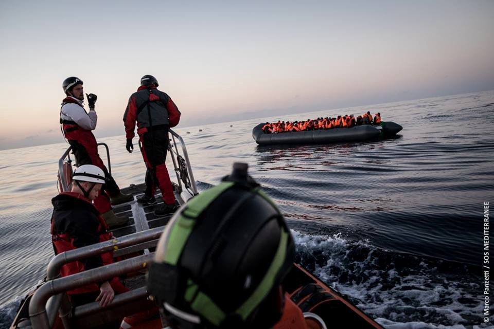
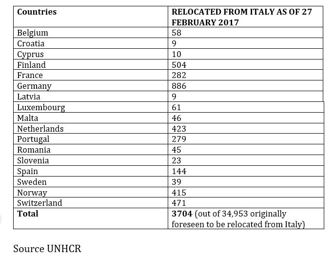

### AYS DAILY NEWS DIGEST 02\.03\.2017 — Euro Commission calls for sanctions, the curtailing of refugee flow into Europe

A picture from today’s Aquarius mission rescue\. Photo Credit: SOS Mediterranee

The European Commission has reiterated that it will not hesitate to sanction countries that refuse to receive refugees from Italy and Greece\. The In September 2015 the union agreed to transfer 160,000 asylum seekers into other countries over the course of about 2 years, but so far only 13,546 have been relocated, 3,936 of them from Italy and 9,610 from Greece\. February has broken a record for the number of transfers, with 1,940 relocations in total, but this figure still falls short of the targets of 3,000 and 1,500 monthly relocations for Greece and Italy respectively\.

Out of all of the EU countries, only Luxembourg, Malta and Finland are close to fully meeting their obligations under the 2015 agreement\. Others, such as Hungary, Austria, and Poland have not taken in any refugees as per the agreement\. “If countries don’t intensity transfers soon, the commission won’t hesitate in using the powers given by the treaties\.”

The Commission also called for harsher measures against irregular migrants\. “Our duty is to tell refugees and our citizens that if there are people in need of help we will help them, but in some cases they should go back to their countries” stated Frans Timmermans\. Among the plans for curtailing the flow of refugees is leveraging €200 million in 2017 to prevent refugees from crossing the Mediterranean\.

The Commission has stated that it will continue to work with third countries to stem the flow of refugees, particularly Libya\. The Commission seems to be moving towards its plan of training the Libyan coast guard to return refugees back to Libya after they are caught and placed in camps until their asylum applications are processed\. AYS has condemned this inhumane plan many times over, and it is worth remembering that Libya is currently embroiled in a civil war, and remaining in the country poses a threat to all, especially the African migrants who make up the vast majority of the traffic along the route\. It is worth remembering that Libyan militias slaughtered dark\-skinned Africans en\-masse after the toppling of former dictator Muammar al\-Qaddafi\.
#### Iraq
### 4,000 refugees are forced to flee daily from Mosul

As the operation to retake Mosul from ISIS intensifies, the flow of civilians from the affected neighborhoods rises\. 28,000 have fled since February 19, when the operation to retake West Mosul began\. The UN reports that 176,000 have been forced to leave their homes since the offensive against Mosul began\.
#### Greece
### Syrian refugee arrested after being found inside a suitcase

The refugee is a 23 year old man who was being taken in a suitcase by his mother, who herself has legal documentation, onto a ferry to reach the mainland\. The mother and the smuggled person, as well as her other son who was with her, were all arrested\.
### Ellinikon Warehouse urgently needs donations\!

At the moment, most in demand are food items, hygienic products, medical supplies, and certain limited items of clothing\. The following are most needed:

▶ FOOD:
 Tea
 Instant coffee
 Sugar
 Oil
 Biscuits 
 Tuna
 Sardines
 Couscus/Bulgur
 Tahini
 Juice
 Milk
 Flour
 Tomato Sauce

▶ CLEANING:
 Clothes detergent
 Dishwashing liquid
 All purpose\-liquid cleaner
 Cleaning tools: mops, brooms, etc\.
 Plastic trash bags \(big size\)

▶ BABY CARE:
 Wipes
 Diapers \(specially n1 and n5\)
 Baby formula 1, 2, 3 
 Liquid milk for 1 and 2 years \(powder milk rather than the long life one\)
 All kind of baby care hygiene products 
 Pushchairs

▶ PHARMACY:
 Antibiotics
 Lice lotion
 Scabies treatment \(Permetrine 5%\)

▶ CLOTHING:
 Flip\-flops: all sizes adults and children
 New underwear: adults and children

Please, DON’T SEND other clothing products\. The warehouse is full of clothes\. Many thanks\.

All of these goods should be delivered to Old Athens Airport, Elliniko, basketball stadium, Pampiraiki warehouse\(Olympic airways entrance on the coastal road\) 26 Posidonos Avenue, 16 777, Greece\. [Here](https://goo.gl/maps/g4wjJV4aAjE2) is the location on Google Maps\.
### Numbers

45 people were picked up off the north coast of Lesvos around 10pm last night\. Among them are 34 men and 11 women, 2 of whom are pregnant\. Everyone was rescued safely and taken in without serious conditions\.

A further 85 people were rescued from a boat south of Kalamata\.
#### Bulgaria
### Bulgarian media reports 60% rise in unaccompanied minor refugees

Each day, an average of 7 unaccompanied minors entered Bulgaria in 2016\. There were 2,772 such refugees in 2016, in comparison to 1,816 in 2015\. The vast majority of unaccompanied child refugees are from Afghanistan\. Most unaccompanied child refugees, who are required by law to be separated from adults, live in the same refugee camps as the bulk of the refugee population, albeit in separate facilities\.
#### Serbia
### An important message to those wishing to volunteer\!

As international attention is brought to conditions in Belgrade warehouses, many people are looking to help\. This is a good time for you to check in with yourselves, to ensure that you are being helpful in the most effective way\. Sometimes, sending donations to already established field teams can be more useful than spending the same same amount of money for a weekend trip to Belgrade\. Long term volunteers are encouraged to contact people on the field to see how they can work together, but also if certain types of donations are still needed\. Upon arriving to site, we highly recommend contacting teams such as HFI, Soul Welders or Noname Kitchen to see how you can contribute\. They will probably have most information about what needs to be done\.

Also, please remember our refugee friends are not keen to be photographed or filmed without consent\. They use warehouses as their temporary homes, and you should behave as their guests, not intruders\.

#### Hungary
### International Relations for Peace seeks equipment\!

The group is known for their work on the Hungarian\-Serbian border, where they have been working since September 2015 and where refugees are subjected to increasingly harsh treatment and general unpredictability\. The following machinery and hardware are currently needed the most:

\- Clothes \(paper,plastic, etc…\) Compactor Machine \(for reducing garbage collection fee\)
 — Clothes dryer 
 — Scale \(large for boxes\)
 — Wrapping machine and wrapping foil
 — Vacuum storage pack
 — Ozone generator \(min\. 3gr/h\) \(Urgently need\! \! \! \) \(Disinfect clothes\! \! \! \)

People who are able to fulfill these requests are asked to message [Dániel Szatmáry](https://www.facebook.com/szatmary.daniel) on Facebook\.
#### Germany
### Mission Lifeline has bought a boat for rescue missions

The organization “Mission Lifeline” has bought a ship to rescue lives in the Mediterranean, After 6 months of fundraising, they bought a ship for 130,000 Euro, 50\.000 less than was originally estimated\. In the next weeks, they plan to renovating the ship and moving it from Hamburg to the Mediterranean, after which a crew of 15 volunteers can start their mission\. The operation of the boat will cost 30,000 per month\. They hope donations will continue to come in, and they plan to document the rescue mission on video\. Among the donators were private persons, schools, clubs, a theater, and companies\. If someone is willing to donate 50\.000 or more, they will change the name of the ship\!
### 20,000 refugees are still forced to live in emergency accomodations

20\.000 refugees in Germany continue to live in “emergency accommodations” such as gymnasiums, industrial halls, etc\., where they are not able to cook on their own, receive foods from caterers, and do not have any private space\. The largest number is found in Berlin \(15,000\), followed by Hamburg with 1,200 persons\. While the number has been decreasing since 2015, when 850\.000 refugees entered Germany, for some of the refugees these provisional shelters have become a long term accommodation\.
#### France
### Calais mayor bans distribution of food to refugees

As people are starting to make their way back to Calais following the demolition of the “Jungle” camp, Calais mayor Natacha Bouchart has moved to ban the distribution of food to the new residents, claiming that such accommodations pose a security risk\. According to the decree, “repeated, prolonged gatherings” are now forbidden, forcing aid workers to continue their work in secret\. She says that she is “personally opposed,” to food distribution, “even if it is humanly difficult to say\.”

In truth, it is an attempt by the government to prevent people from once more amassing in the area\. The area has been making it difficult to refugees to access other accommodations for their day\-to\-day needs as well, such as making it more difficult for people to shower\. The government’s efforts to prevent movement to Calais will be in vain, as even those who do access centers often report dreadful conditions therein, and a great many homeless remain scattered across the country\. For these people, hope lies in making their way across the Channel\.
### Video shows officials confiscating refugees’ blankets

### Organization continues to be in need of telecommuting volunteers

#### UK
### Refugees must wait for as long as two years to access English lessons

The [new report](http://www.refugee-action.org.uk/wp-content/uploads/2017/02/Locked_out_of_learning_briefing_paper_February_2017.pdf) issued by Refugee Action has made some shocking discoveries, namely, that refugees must wait an average of 20 months before they are put into ESOL classes\! Most providers have waiting lists which span 1,000 people, and some have stopped accepting applications altogether until the queues are reduced\. At the same time as demand is higher than ever, the government is busy cutting funding to ESOL programs\. According to research, there is a 42 million pound yearly shortfall for the classes\.

Language is vitally important for refugees coming into a new country, without proficiency of the English language they cannot be expected to integrate into British society, or to find meaningful work\. The severe lack of resources puts a severe strain on the entire refugee processing system, as more and more people\. A lack of language skills leaves newcomers marginalized, more liable to be taken advantage of, and pushed into the ghettoized peripheries of society\. Investment in this field is therefore particularly crucial for the future of all refugees\.
#### Mediterranean

#### EU
### EU Commission asks members to make good on commitment to Border, Coast Guard agencies

_Converted [Medium Post](https://areyousyrious.medium.com/ays-daily-news-digest-02-03-2017-8e945e524055) by [ZMediumToMarkdown](https://github.com/ZhgChgLi/ZMediumToMarkdown)._
