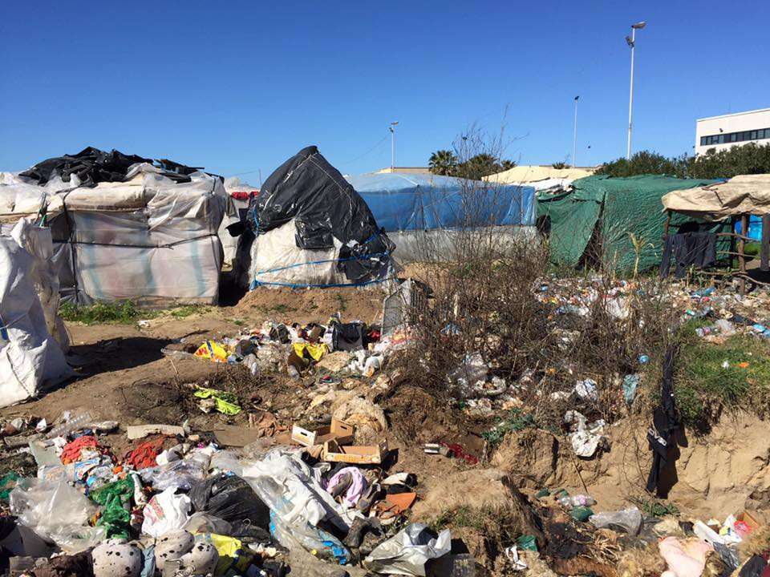

### AYS DAILY NEWS DIGEST 03\.03\.2017: Civil Society Talks Back

Food prep in Belgrade: Hot Food Idomeni\. Photo Credit: Zoe Wild
### FEATURE: Civil Society Talks Back

In spite of the heated discussions and strong advocacy for solidarity with both refugees and EU states in the European Parliament in terms of migration and resettlement policy, the EU Commission settled on prioritizing solidarity in a sadly predictable way — solidarity in pushing people away\. On March 2nd, the European Commission released a series of recommendations that are supposed to enhance the solidarity and cooperation of return programs\. The full decision is linked [here](http://europa.eu/rapid/press-release_IP-17-350_en.htm) \.

In response, 90 civil society organizations have spoken, condemning the action\. In a press release on March 3rd, Legis announced their participation in this condemnation, highlighting the specific actions being protested\.

> “As well as falling short in terms of good governance, the Commission document puts forward an interpretation of human rights that effectively undermines them\. It urges member states to detain migrants more quickly and for longer periods of time, and presents increased returns as a key deterrent to migration\. The results of such policies are expected to be a weakening of human rights safeguards in the return and the asylum process\. The linking of asylum to return, as well as the explicit targeting of specific nationalities of asylum seekers accused of “abusing” the asylum system is shocking\. 

> As just one of the extremely worrying examples, the Commission instructs member states to opt for prolonged detention and to apply the maximum possible detention period, specifically targeting member states that apply shorter periods as “bad examples”\. It encourages widespread detention of persons deemed to be at risk of absconding, a notion which the Commission has significantly broadened\. It promotes the wide use of entry bans and insists that member states use all of the flexibility foreseen in the legislation to derogate from the full application of the safeguards in the Return Directive\.” 

The statement goes on to emphasize the inefficacy of these programs as well as the lack of research or consultation with organizations or other local actors in the assessment of the proposals\. Read the full press release with a link to see all the participating organizations [here](http://legis.mk/news/2275/90-civil-society-organisations-address-eu-commission-in-joint-statement) \.

In tandem with these policy shifts, it can be expected that civil society, volunteer organizations, and activists will be facing increased pressure to conform, sit down, and be silent in the name of solidarity\. Although pragmatism can be a strong guide in these instances, it is crucial to assess on what areas organizations and individuals will be willing to compromise and on what areas they simply cannot\. As dry and tedious as it may be to dig through these minutes, they are the key to understanding what is looming for those waiting to move forward, fearing to be sent back\.
### GREECE

The following is a heart\-rending report written by [Gabrielle Tan](https://www.facebook.com/gabrielle.tan/posts/10154840972605469) of Action from Switzerland on a case that nearly went disastrously wrong in Greece:

> Faced with horrendous conditions on the Greek islands, Ali did what many try to do: Cross the closed borders\. But Ali was unlucky\. He was caught, charged and sent back to Chios where he was detained under a police directive\. Access to him had been frustrating and on the whims and fancy of whoever was on duty\. 

> Ali was supposed to have a rescheduled interview with EASO at 9am on 01 March, after an administrative error that made him miss his interview on 28th February\. 

> But on 1st March, Ali was quietly transferred to Lesbos in the wee hours of the morning at 4am, scared and confused\. He managed to call his brother on the ferry to Lesbos\. 

> Police on Chios alleged that they did so because they received no instructions from the Greek Asylum Office on Chios that Ali wanted to continue his asylum process\. 

> If not for for the quick and effective action of some solidarians, Ali might not have gotten a lawyer to represent him and might have been deported to Turkey quietly\. Ali is safe from deportation for now but the fight is not over\. 

> Ali’s case shines a light on the serious shortcomings in the handling of asylum applications, the lack of a centralised system of communication/database between the relevant authorities, and their competence\. It raises serious questions about the credibility and validity of all deportations to Turkey so far and about whether they were handled correctly, adhering to one’s right for asylum\. 

We salute the lawyer who is on Ali’s case and representing him at this tumultuous time\. In addition to highlighting the shortcomings of the system, this event also can serve as an example of how a community can stay on the alert in order to prevent injustice\.
#### Nea Kavala

A volunteer in Nea Kavala reports that some parents are highlighting inconsistent and insufficient educational support for children\. “In January, here there were round about 130 children going to the ‘Afternoon Zone School’ — they were brought there and taken back by bus — now there are just about 40 left,” writes [Maritta Gudrun](https://www.facebook.com/maritta.gudrun/posts/1898830797029749) \.

Around 26 families and residents of around a dozen containers are being taken from Nea Kavala to other housing \(hotel and apartment housing\); however around fifty new individuals arrived in the camp recently\.
#### Greece: “Not penalized by tourists”?

Taleb Rifai, the secretary\-general of the United Nations World Tourism Organization, praised Greece for its reception of refugees, stating that “Greece was correct in receiving them… by correct I mean abiding by international law\. That’s why you were not penalized by tourists\.”

Greek tourism revenues are on the rise — 9 percent in 2017\.

This somewhat bizarre compliment is a definite stretch in terms of relevance, considering that several islands receiving refugees last year suffered painful drops in tourism\. Regardless, all commitment to refugee support should be based on commitment to human rights, not concern over tourism penalties\.
#### Crete

On Friday, a suspected Greek\-British smuggling ring was busted by authorities\. [Hellenic Coast Guard and the National Crime Agency of the UK](http://dailyhellas.com/2017/03/03/smuggling-ring-dismantled-by-greek-british-operation/?utm_source=dlvr.it&utm_medium=facebook) were the operators of the action\. A total of 110 individuals who are suspected of using the services of this ring were also detained\.
#### Samos

Ariel Ricker of Advocates Abroad [reported](https://www.facebook.com/ariel314159/posts/10102234497141806?hc_location=ufi) on a horrific story of a minor suffering terrible abuse at the hands of the system on Samos\.

Minor, chained to a chair\. Photo courtesy of Advocates Abroad

> He was openly handcuffed to a chair when we first met him\. He was viciously beaten by police in the station earlier\. His back and ribs were covered in open wounds when we met him\. When we found him, he had been handcuffed to that chair for 4 nights and 3 days\. 

> Our Advocate attorney complained in writing and in person twice to UNHCR, to no avail\. UNHCR emailed a near unintelligible response to the complaint, and still has not followed up\. 

> Thanks to the dedicated staff in the Athens Ombudsman’s Office, who responded within hours by call and email, this boy is safe from the police in a protected house\. 

> It shouldn’t take independent lawyers secretly photographing abuse and complaining to multiple sources to ensure the safety of children\. But it does, it has, and it apparently will for a long time to come\. 

Updated release from News that Moves addressing refugee responses\! Check it out below\.

Credit: NewsThatMoves
### SERBIA

Click the link below to watch a video of distribution by Hot Food Idomeni which has served almost one million meals to date between Greece and Serbia\! Way to go, and keep up the amazing work\! Video credit: Zoë Wild, One Light Global\.

UNHCR has released updated numbers on refugees in Serbia:

“In February, 502 intentions to seek asylum in Serbia were registered: 43% by men, 14% by women and 43% for children\. Applications were filed by citizens of Afghanistan \(40%\), Iraq \(21%\), Syria \(16%\), Pakistan \(8%\), or other countries \(15%\) \.

_EAST_ : Over 600 asylum seekers were accommodated in four Reception Centres \(RCs\): 257 in Pirot, 200 in Divljana, 93 in Dimitrovgrad and 57 in Bosilegrad\. Most are from Afghanistan, followed by Iraq and Syria and around 45% are children\.

_SOUTH_ : 980 refugees, asylum\-seekers and migrants were accommodated in the Reception Centres of Preševo \(759\) and Bujanovac \(221\) \. Most are from Afghanistan and Iraq, followed by Syria and Pakistan, and over a half of them \(55%\) are children\.

_BELGRADE_ : Around 2,800 refugees and migrants were counted in Belgrade: Krnjača Asylum Centre accommodated 1,043 asylum\-seekers, including many families, while 918 male refugees and migrants — including 324 unaccompanied or separated boys — were sheltered in Obrenovac\. Authorities counted 840 refugees/migrants in the city centre\.

WEST: Transit Centerss in the West sheltered 1,923 refugees and migrants: 991 in Adaševci, 625 in Šid and 307 in Principovac\.

> 66 asylum\-seekers informed UNHCR and partners they had been denied access to asylum procedures in Croatia, but instead been collectively expelled back into Serbia, many alleging serious maltreatment by Croatian officials\. 

NORTH: Hungarian authorities admitted 31 asylum seekers into procedures at their “transit zones” near Kelebija and Horgoš border crossings\. During the same period, over 100 asylum\-seekers informed UNHCR and partners they had been denied access to asylum procedures in Hungary, but instead been collectively expelled back into Serbia\.

Subotica TC sheltered 133 asylum\-seekers and Sombor TC 105, while only 12 asylum seekers \(including one woman and two minors\) camped at Horgoš and Kelebija border sites, awaiting admission into Hungarian “transit zones”\.
Around 200 unregistered migrant men from North Africa, Pakistan and Afghanistan were counted sleeping rough around Subotica, waiting to irregularly enter Hungary\. \(Period 27\.2\. \-3\.3\. \)”

NewsThatMoves reports that [children](https://newsthatmoves.org/en/informal-classes-for-children-in-presevo/) in Preševo Reception Center are now receiving 2\.5 hours of informal classes per day, starting at 9 am\. The children are divided into small groups by age, and they study Mathematics, Serbian and foreign languages, art, biology and geography\.

Makeshift camp similar to the one that recently burned in Italy\. Photo credit: Collettivo Mamadou
### ITALY

The Italian coast guard reports that almost [1000 individuals were saved](http://www.thelocal.it/20170303/almost-1000-migrants-were-rescued-off-libya-on-thursday-italian-coastguard) off of the Italian coast on Thursday alone\. With temperatures continuing to rise, these seas can continue to be expected to be full of people trying to cross\.

Arson has not been ruled out as the cause of a fire that took the lives of two men from Mali in the “gran ghetto” of Rignano\. The location has just been evacuated, although around 100 individuals remain, citing concern that their departure could jeopardize their livelihoods\.

> The shacks, made of wood, plastic and cardboard, rapidly caught fire and the flames destroyed everything in the area \(5000 square metres\) \. It was so quick and violent that the fire brigade doesn’t exclude arson\. A lot of gas canisters exploded, making the situation even worse\. 

> As stated before, on 1st March the authorities of Bari started to evacuate the “gran ghetto” due to potential criminal infiltration\. On Thursday 2nd March some of the migrants who didn’t want to leave the camp \(around 200 people\) protested in front of the Prefecture of Foggia, reiterating their will to not leave the ghetto, afraid of losing their seasonal job and asking to talk directly to the prefect\. 

> In the last year, the ghetto had been partly destroyed by two big fires, but every time the wooden shacks had been rebuilt\. \[…\] From 2012 till today, this is the 7th fire and the one with the most tragic aftermath\. The Region \(Puglia\) had declared many times its will to close down the camp\. The Unione Sindacale di Base \(the Unions\) stated that these are the tragic consequences of a non\-existent reception and integration policy and of a migrant hunt created in our country\. 

\(translated from [Repubblica\.it](http://bari.repubblica.it/cronaca/2017/03/03/news/foggia_incendio_gran_ghetto_morti_due_uomini-159635915/?ref=RHPPLF-BH-I0-C8-P1-S1.8-T1) \. \)

On the 4th there is a demonstration showing solidarity with those who refuse to leave the camp\. Learn more about it [here](https://www.facebook.com/events/233700983767045/) \.

On March 1st, a draft of a law in favor of protection of unaccompanied minors passed the senate in Rome\. The law would include the following provisions, in accord with the European regulations and indications:
- measures for non\-refoulement
- acceleration of the identification procedure, which will be the same for the entire country
- health care guaranteed
- access to education guaranteed
- priority to family reunification when possible

### GERMANY

Germany and Tunisia are pursuing more cooperation on, no surprises, sending people back to Tunisia\. The agreement which was signed on Friday details increased collaboration between Tunisian officials in Germany in identifying Tunisians who are possibly up for deportation\. Germany also has promised to increase aid to Tunisia as part of the deal\.
### FRANCE

[Charities like Utopia 56](http://uk.reuters.com/article/uk-europe-migrants-calais-idUKKBN16A18M) criticised harshly Natacha Bouchart’s proposed ban on food distribution to refugees and residents in and around Calais\. The ban on gatherings could shut down aid groups from distributing food entirely, an action that Mayor Bouchart attempted to argue was the cause of escalating tensions in the camp\.

_Converted [Medium Post](https://areyousyrious.medium.com/ays-daily-digest-03-03-2017-civil-society-speaks-back-fc2559ff29e) by [ZMediumToMarkdown](https://github.com/ZhgChgLi/ZMediumToMarkdown)._
