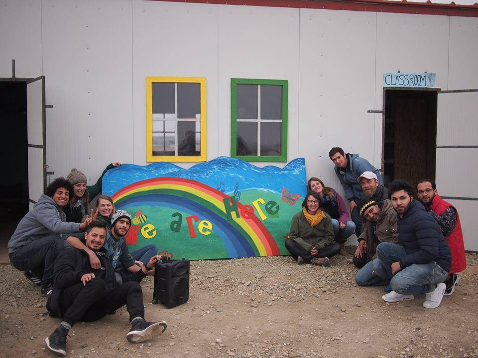

### AYS DAILY DIGEST 5/3/2017: Community center in Nea Kavala reopens

_Despite decreasing numbers of residents in the camp, with a lack of information, volunteers are prepared for again raising numbers / Reports of police violence on Samos and Piraeus / Rapidly increasing number of displaced persons in Mosul / 690 people disembarked on Italian islands / Spanish Guardia Civil calls for reinforcement on external borders_

### Feature

Today we want to start with some good news: In a joint effort the [We Are Here — Community Centre](https://www.facebook.com/WeAreHereCentre/posts/1959116530976609) and The Timber Project with support of Help Refugees rebuilt the community center of the Nea Kavala camp in Northern Greece and finally reopened it\. After it burnt down, volunteers worked tireless to set it up again and were done already in February\. During the last weeks We Are Here with support of LDS Charities managed to finance interior walls, furniture and other needed items\.

](assets/9409ab404ac2/1*aMV8lRaMFa6GHMtmT_aAfQ.jpeg)

Children’s space in the new community center\. Credits: [We Are Here — Community Centre](https://www.facebook.com/WeAreHereCentre/)

Further volunteers revamped the women’s centre with help of the camp residents to make it a more comfortable place\. This all happened while the number of residents in the camp is decreasing the last days\. “ Many are just relieved and happy to be finally leaving the camp\. Yet it is another move to an unknown location, without knowing what will be waiting for them, who they will have around them or what services or information they can expect,” We Are Here reports\. But there is a lack of information as the residents don’t know where they will be moved and only get a notice one day before they leave\. But at least they are being transferred to appartments in different towns\. Of course, this does not neccessarily mean, the camp will be closed soon\. We Are Here says: “We believe it is likely that people will be brought to Nea Kavala from the arrival islands, which are very overcrowded\. If this happens, we don’t know if the camp will first be completely emptied or not, so we must remain flexible as always about what the next step could be\.”
### Iraq

Following the more intense fights in West Mosul, tenthousands of people have been displaced internally\.

■■■■■■■■■■■■■■ 
> **[Hala Jaber](https://twitter.com/HalaJaber) @ Twitter Says:** 

> > Number of people displaced 4m #West_Mosul are increasingly rapidly. In the last 9 days alone 7,619 families (45,714 individuals) displaced. https://t.co/2FxYjV608i 

> **Tweeted at [2017-03-05 08:22:41](https://twitter.com/halajaber/status/838303740964777984).** 

■■■■■■■■■■■■■■ 

### Greece
#### Samos

Advocates Abroad reported another case of police brutality on Samos\. Two residents of the hotspot in Vathy accuse five police officers of beating and kicking them after a passport control\. After being thrown off a small cliff they ran through cactuses and bushes to get in safety\. They also say they heard two shots and are now afraid of leaving the camp again\. So far AYS was not able to get this incident confirmed by another source\.

Meanwhile nine women and for children who just arrived in Mytilini \(Lesvos\) would be detained in a bus close to the port over night\.

On Samos 20 new arrivals were registered today\. Volunteers reported two boats arriving this morning, 12 \(8 men, 2 women, 2 kids\) and 15 \(7 men, 1 teen, 3 women, 4 kids\), all ok\.
#### Piraeus

Referring to an article of [era\-aegean](http://www.era-aegean.gr/?p=24210) NoBorders Greece reports, that a couple in Piraeus was not allowed to enter a ship, because the women fainted\. They had an appointment for their asylum process in Athens\. Apparently there were also reports of police violence and no care by ambulance or other authorities\.

■■■■■■■■■■■■■■ 
> **[NoBorders](https://twitter.com/Refugees_Gr) @ Twitter Says:** 

> > &gt; the couple was in Athens on Friday for the asylum process. Although carrying medical papers, woman was denied access on ship
#refugeesgr 

> **Tweeted at [2017-03-05 19:29:46](https://twitter.com/refugees_gr/status/838471620079517696).** 

■■■■■■■■■■■■■■ 

#### Cash Cards in Greece

are being provided for asylum seekers living in urban appartements and housing provided by Care International\. As Refugee\.Info reports, they received some 200 requests during the lasts two weeks and passed them on to Care International\. The NGO says, that they will contact people eligable for the Cash Card Programme during the next three weeks\. More information about the programme can be found [here](http://blog.refugee.info/you-asked-cash-assistance-in-greece/) \.

](assets/9409ab404ac2/1*wqwQ4Zyf7UtGDIA16Pwk5w.jpeg)

Cash Cards for people in Greece\. [راهنمای پناهندگان Refugee\.Info دليل اللاجئ](https://www.facebook.com/refugee.info/)
### Serbia

Volunteers in Belgrade got a full cricket set to entertain the people stuck in the capital city of Serbia\. Not only in Afghanistan but also in Pakistan and countries from the commonwealth it’s very popular\. In the next days volunteers will organize games to play cricket together\.

](assets/9409ab404ac2/1*JxanfdasPDMRixK6zJcfug.jpeg)

Cricket set for Belgrade\. Credits: [Calor português para os refugiados](https://www.facebook.com/calortuga/)
### Italy

IOM and MSF reported today, that the Aquarius — the boat of SOS Mediterranee and MSF — brought 513 people to Pozallo, including many western African nationals, 172 Bangladeshis and 62 Syrians\. 177 people were brought to Lampedusa today\.

](assets/9409ab404ac2/1*hRfRoZLi7-FQG0gh79iPgQ.jpeg)

Landing on Pozallo\. Credits: [Ahmed\.أحمد](https://twitter.com/karika10)
### Spain

Following the border crossing of Ceuta and Boza the Spanish Guardia Civil has [reportedly](https://beatingborders.wordpress.com/2017/03/05/bozas-and-new-tactics/) called for at least 150 more soldiers in the area and riot control equipment\. The Spanish Interior Minister further suggested to use drones to monitor the borders of Ceuta and Melilla\.

_Converted [Medium Post](https://areyousyrious.medium.com/ays-daily-digest-5-3-2017-community-center-in-nea-kavala-reopens-9409ab404ac2) by [ZMediumToMarkdown](https://github.com/ZhgChgLi/ZMediumToMarkdown)._
