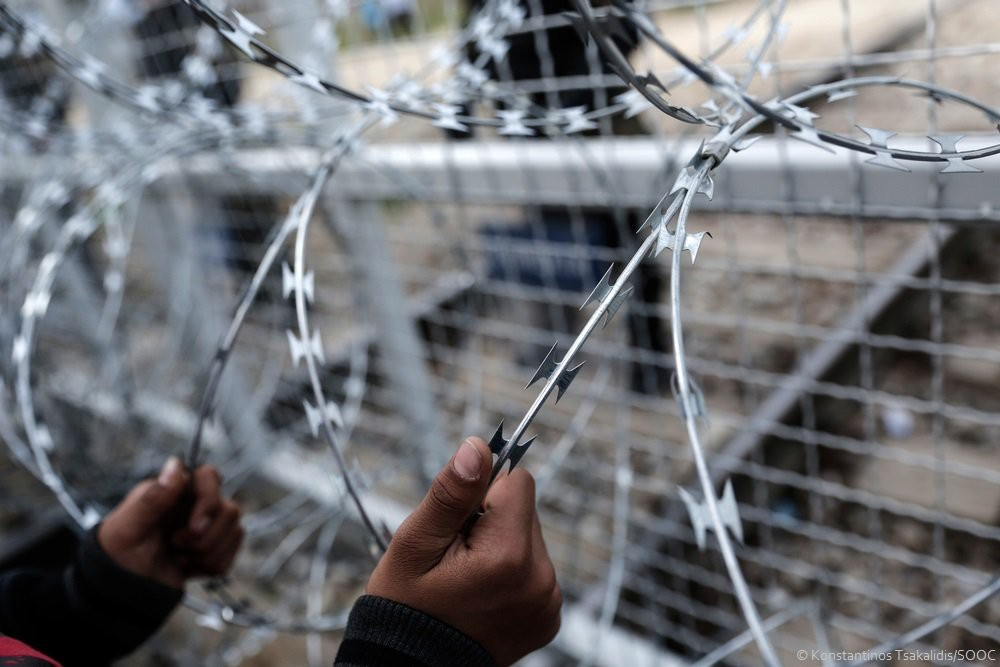
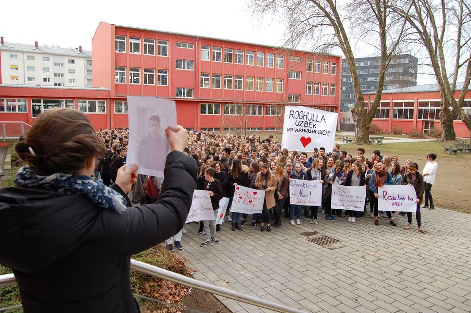

### AYS Daily Digest 07/03/17: Europe at it’s best — new laws, more suffering

Photo taken from MSF on Sea Twitter account

_Hungary passed a law saying that all asylum seekers are to be detained indefinitely while waiting for their status to be resolved / European Court of Justice ruled that Belgium was within its rights to refuse visas to a family of potential Syrian asylum seekers who said that they were at risk of torture and inhumane treatment / Refugee minors on hunger strike in a French town / House of Commons MPs voted against Heidi Allen’s amendment to the Children and Social Work Bill / Animated videos on legal procedures in Greece / A man from Pakistan that was attacked two weeks ago in Macedonia has passed away / SoulWelders cleaning up the barracks in Belgrade / First group of Yazidis arrived in Portugal_

A sad day for all of us who live in Europe and a catastrophic day for those who have to flee their homes and try to reach the fortress\. Hungarian parliament has reached a decision that all asylum seekers should be detained while they await their interviews\. This decision applies to all of asylum seekers, no matter where in Hungary they are\. People will be placed in two to three container camps with no possibility of free movement\. In light of this decision, Amnesty international deputy director for Europe, said: “Rounding up all men, women and children seeking asylum and detaining them months on end in container camps is a new low in Hungary’s race to the bottom on asylum seekers and refugees\.” Hungarian prime minister, on the other hand, justifies such a decision as stopping the “Trojan horse”, i\.e\. refugees and announces that there are millions more to come\. Just as a reminder, Hungary accepted only 502 asylum seekers in 2015 and 425 in 2016\.

Many human rights organizations are calling for the EU to stop this policy, but judging by the rest of the sorry state of Europe, hardly anything is going to happen, even though, as Amnesty international notes in their statement: “This new border detention package is just the latest in Hungary’s aggressive crackdown on refugees and migrants\. These measures will even be applied to children, a flagrant violation of international and European law\. It will also enable refugees to be forcibly returned to Serbia without due process\.” The United Nations refugee agency said the new law “violates Hungary’s obligations under international and EU laws, and will have a terrible physical and psychological impact on women, children and men who have already greatly suffered\.” [Guardian reports](https://www.theguardian.com/world/2017/mar/07/-hungary-to-detain-all-asylum-seekers-in-container-camps) \.

On the other side of the fortress, UK’s Immigration Minister Robert Goodwill said the British government does not believe a person being tortured in their country of origin is always enough reason to be granted asylum\. Goodwill told Parliament that not all proven survivors of torture “automatically qualify for protection” if they cannot produce evidence they will be at risk if they are sent back to the country they left\.

The Freedom From Torture organisation accused the Government of “egregious mishandling of medical evidence”\. Freedom From Torture said that appeal judges were often reversing negative asylum decisions related to victims of torture\. 76 per cent of appeal cases involving torture were overturned in favour of the applicant\. [Independent reports](http://www.independent.co.uk/news/uk/politics/asylum-seeker-torture-uk-refugee-immigration-minister-a7608206.html)

Help Refugees also informed that “Today in the House of Commons MPs voted against Heidi Allen’s amendment to the Children and Social Work Bill by just 20 votes \(287–267\) \. The bill would have forced the government to assess local councils’ capacity to take in more child refugees from Europe\. To date, the government has made no effort to do so\.

The government wants to cap the number of children taken in under the Dubs Amendment at 350 — but we know that councils across the country are willing to take in much more\. Birmingham has indicated it has an additional 79 places, Lewisham an additional 22, Hastings and Rye have 48 more spaces, Glasgow 16, Bristol 10 among many more\.”

Meanwhile, in the heart of European bureaucracy it was decided that EU member states are not obliged to give visas to those people intending to seek asylum in their country after the EU’s top court decided not to change the bloc’s refugee policy\.

The European Court of Justice ruled that Belgium was within its rights to refuse visas to a family of potential Syrian asylum seekers who said that they were at risk of torture and inhumane treatment\.

In the ruling, the court said that allowing third\-country nationals to lodge applications for visas on this basis would de facto allow potential asylum seekers to apply for shelter at European embassies across the globe\. This would “undermine the general structure of the \[EU’s asylum\] system”, according to the court\.
#### Greece
### **New arrivals**

There were 68 new arrivals on Greek islands today, including 31 in Samos today\. Volonteers from this island are reporting that a ship with mostly families arrived under very heavy rain showers\.
### **Animated videos on legal procedures in Greece**

As they are more than 60 000 awaiting for some kind of solution in Greece, Refucomm has made animation videos in order to help people understand what the legal procedures for different needs look like\. Refucomm adds that “as an organisation that has been working with information for refugees since September 2015, we are very aware that asylum seekers in Greece are struggling to understand the processes, which can have dire consequences\.

Unaccompanied minors in particular are responsible for their own asylum applications and struggle to understand what they need to do access their rights\.

Many people stuck in Greece don’t read\. Public bodies are unable to move fast enough to provide information and amenities to asylum seekers and we work with them to fill this information gap\.

Misinformation is rife and has caused, at the very least, confusion and mistrust\.

The animation is a SMART and CREATIVE way of getting information to refugees quickly and efficiently, in a language they understand and without the requirement to be able to read\.

We are working with all the major NGO’s in Greece, the Greek Asylum Service who have approved the animation content, and we are collaborating with mobile information teams to get the film shown in the camps, squats and minors homes\.

Our team is currently in Greece and on their way to five camps in the South to show the films and answer questions that people may have around the interview\.” Follow [this link to videos](https://www.youtube.com/playlist?list=PLCwovROtk5ZCVPZNZoGADC2GzxubpMuOC)
#### Macedonia
### **A man that was attacked two weeks ago, died last night succumbing to the injuries**

I\.A\.S\., citizen of Pakistan, who was violently attacked on 25th of February, together with F\.K\.A\., also from Pakistan, has passed away last night\. F\.K\.A\. is still recovering from the injuries\. Two men have testified that they were attacked and subsequently robbed by five people near the highway that leads from Skopje to Kumanovo\.
#### Serbia
### **SoulWelders cleaning up the garbage**

Jonathan and Help Refugees in Thessaloniki gathered the money so that SoulWelders can facilitating the work on the ground and clean up the garbage that has piled up in Belgrade around the barracks where refugees sleep\. Thumbs up, guys\!

#### Italy
### **Refugees sleeping rough in Rome**

Baobab experience reports that their volunteers know of at least 35 refugees sleeping rough on the streets of Rome, but many more are out there, too\.
### **Makeshift camp under threat**

Meanwhile, in more news from Italy — in San Ferdinando, in Reggio Calabria, a makeshift camp is under the threat of an evacuation\.
### **Dear Mrs Delia**

Not to be all bleak about the state of Europe, here is a wonderful story of one caffee and it’s owner:

Since 2015, Mrs\. Delia manages the Hobbit bar\. The bar is close to Ventimiglia’s station, on the way to the suburbs’ bridges\. Delia has been serving refugees unsold pizzas in the evening, and soon the word spread around and the bar became a daily meeting point for the migrants staying in Ventimiglia\.

Delia lets them use the toilet, the plugs to recharge their phone, she distributes donated clothes and the bar holds Italian classes\. Pregnant women and children do not pay for food, but whoever wants a free meal must follow the rules\.

The controls for hygienic standards are frequent, reason why Delia imposes strict rules\. She shouts whenever the toilet is left dirty, and she is proud of the fact that no fight has ever happened there, the only way to keep the bar clean and to prevent the risk of closure

Lately, the bar has suffered economic problems, but Delia’s kindness has been rewarded — since the last February, she got help from MSF doctors, representatives from Amnesty International, guys from the migrants’ associations \(La talpa e l’orologio, Articolo2, Presidio Permanente No Bordes, Progetto 20k\) and even two Caritas’s volunteers, who had never been there before and now are actively collaborating\.

Good luck to Delia and all of her guests\.
#### Austria
### **Another family deported from Austria to Croatia**

Another family from Afghanistan, Uzbek minority, has been deported from Austria \(Leibniz\) to Croatia \(Zagreb\) through theDublin III procedure despite the intervention of lawyers and supporters\. The family \(two sons, 14 and 19\) arrived in November 2015 and was well integrated in Leibniz\. The elder son recently won a kickboxing tournament and became Austrian champion in his weight class\. There is a petition on Change\.org which achieved 500 signatures in 6hrs\. Citizens of Leibniz have been protesting against the deportation on Sunday\. Austrian media have picked up the case as well\.

Protest against deportation\. Photo: Border crossing Spielfeld
#### France
### Unaccompanied refugee minors on hunger strike

> « We need help\. We’ve suffered a lot in our countries\! They’ve brought us to Hostens, in the countryside and nothing is happening\. We want to integrate and start school to prepare for our future\. We will reach the age of 18 and will end up in the streets\. We are hopeless\.” 

35 refugee minors in Hostens en Gironde, a town in southwestern France 35 km south of Bordeaux, are on hunger strike since Sunday evening\. Two of them have already received medical assistance at a hospital, reports say\.

These young people were transferred to Hostens from other departments, some had already had started professional trainings\. They have requested to speak to a judge, to explain their situation\. Aged between 14–18, they have ambitious dreams, want to become plumbers, carpenters, mechanics, cooks\. Officials responded that they need to be patient\. The child protection office has 4\.000 cases to take care of, and that the refugees won’t get any preferential treatment \.They will be transferred to Merignac by the end of the month, but it will take time until they get a chance to be considered for school\. According to [another news](http://www.sudouest.fr/2017/03/07/inquiets-de-leur-sort-ils-refusent-de-manger-3255037-2780.php) outlet, they are “still in the reception and orientation phase and have to wait for the decision about their situation”\. 
Until then they continue with their one hour of French per week, taught by the volunteers, that is, 4 hours of learning in a month\.
#### Portugal
### **First group of Yazidis arrives in Portugal\.**

Government will not impose movement limits to people fleeing from war\. In Portugal we don’t have refugee camps and never will have, said deputy minister Eduardo Cabrita\.

Lisbon

The first group that chose to go to Portugal already arrived in Lisbon\. The group of 24, originally from Iraq, was received by Eduardo Cabrita and Paula Oliveira, social action MP from the council of Guimarães, town where they will be placed\. This is the first group of the total of 90 Yazidis that will be placed in Portugal in the short term\. For this group in particular there are some preparations in place that include psychological and language support\.

The next group of Yazidis will arrive in April and will include unaccompanied children\. They will be placed in the Lisbon area\.

_Converted [Medium Post](https://areyousyrious.medium.com/ays-digest-07-03-europe-at-its-best-new-laws-more-suffering-40a04014d7a5) by [ZMediumToMarkdown](https://github.com/ZhgChgLi/ZMediumToMarkdown)._
