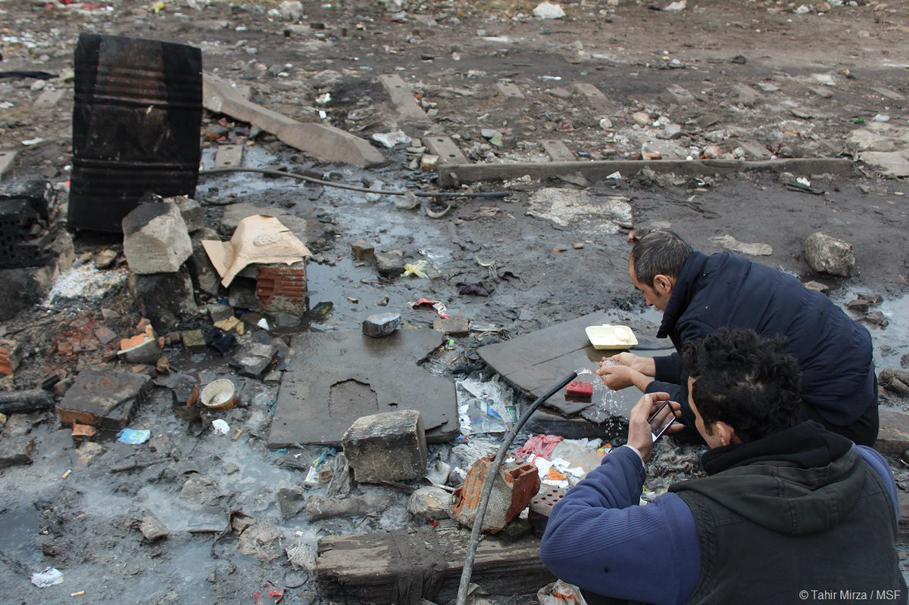
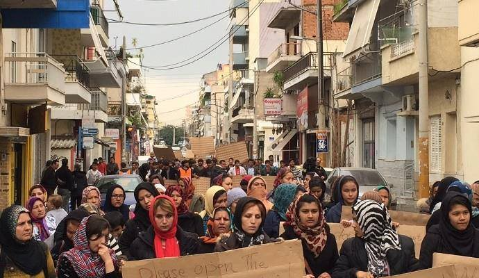

### AYS DAILY NEWS DIGEST 09\.03\.17 — Relocation program highlights the failures of the EU

With the closure of the Balkan Route, countless refugees remain trapped, reliant on smugglers\. Photo Credit: Tahir Mirza, MSF
#### Feature
### Newly released UNHCR statistics reveal how far from completion relocation program is

Even a year past its deadline, the vast majority of EU countries have failed to uphold their commitments to the relocation of refuges from Italy and Greece\. The countries in question had agreed in 2015 to relocate 66,400 refugees from Greece and 39,600 from Italy\. These relocations were meant to help Italy and Greece, the two countries at the forefront of the refugee crisis\. Both countries are in great need of help, as their systems are extremely congested from the huge numbers of people in the country\.

UNHCR has released a [new infographic](http://reliefweb.int/sites/reliefweb.int/files/resources/54154.pdf) , showing how many people have been relocated as of March 3\. The results are a shame to the EU, as they show that only 9,632 \(14% of the allocated quota\) have been relocated from Greece, while 3,964 \(9%\) have been relocated from Italy\. Furthermore, despite the fact that the plan was to be completed in 2016, not a single country in question has come close to fulfilling its quota\. Malta comes the closest, having taken 73% \(96 out of 131\) of the expected amount\. A few more countries have crossed or come close to the 50% mark, Ireland \(320 out of 600\), Finland \(1064 out of 2078\) and Latvia \(228 out of 481\) \.

Other countries have barely taken any refugees at all\. Hungary, Austria, and Poland have not relocated a single refugee\. Several nations have taken only a bare minimum, such as the Czech Republic \(0\.4%\), Sweden \(1%\), Bulgaria \(2%\), Slovakia \(2%\), and Croatia \(2%\) \. Politicians from these countries, most notably Victor Orban of Hungary, rail against the EU’s so\-called violations of national sovereignty by imposing predominantly Muslim foreigners on majority\-Christian nations, often employing explicitly racist imagery\.

The EU has failed not just refugees, but is also putting a massive burden on the Greek and Italian systems, which are struggling to process all of the refugees who land on their shores\.
#### Turkey
### Turkish government revokes organization’s license to operate in Turkey

Mercy Corps is one of the largest organizations providing aid to refugees living in Turkey, whose living conditions are widely deplored as unacceptable\. Turkey was also being used as a base to provide aid for those still remaining in Syria, with an estimated 350,000 to 500,000 civilians receiving aid every month according to their count\. Within Turkey, Mercy Corps also helped 100,000 people\. That is, until the Turkish government decided that the organization no longer has the right to operate in a country where aid is already so hard to come by\.

The official reason was stated as the organization’s failure to provide the necessary documents to extend their operating license\. The Turkish press however, has been rife with allegations that Mercy Corps arms groups fighting against the Turkish government\. Mercy Corps is just one of nearly 400 NGOs that have been shut down in Turkey following last summer’s attempted coup, making it increasingly likely that the shutdown was not a result of a simple technicality\.

Those most hurt by this decision will of course be the refugees, both in Turkey and Syria\. The Turkish government’s expenditures are greatly insufficient to provide for the peoples’ needs\.
#### Greece

Female Afghan refugees demonstrate near Piraeus as part of International Women’s Day\. Photo Credit: Nasim Lomani

#### Bulgaria
### Supposedly defending “national interests”, Bulgaria seeks to change regulations on integration

Bulgarian authorities have made clear their intentions to change their regulations on the integration of refugees, citing tensions in society as the cause\. Following the Court of the European Union’s recent decision securing the right of EU member states to deny humanitarian visas to applicants, the change of rules will likely make it even more difficult for refugees to receive the rights that they are entitled to\. It is as of yet unclear what these changes will entail, but given the recent vile moves by the Hungarian government confining refugees to camps separated from society at large, there is reason to be alarmed in this case as well\.
#### Croatia
### Are You Syrious? opens classroom in Porin refugee center

With the help of our donors and volunteers, we have turned a conference room into an oasis of knowledge and friendship\. Our special thanks go to [LAUDE El Altillo School](https://www.facebook.com/laudealtillo/) for their financial support, to Multi Forma, Matija Gubec Elementary School, Alfa d\.d\. and [Offertissima](https://www.facebook.com/OffertissimaHrvatska/) for donating furniture and study equipment\. Our heartfelt thank you goes to the asylum seekers and our volunteers who have contributed greatly through their ideas, enthusiasm, and hard work\.

We are very happy to see around 40 children on daily basis, studying and developing with the help of 30 volunteers who devote their time and knowledge selflessly\.

#### UK
### Local councils have voiced their willingness to accept more Syrian refugees than the government quota

The Guardian [has reported that](https://www.theguardian.com/world/2017/mar/09/we-want-more-syrian-refugees-offers-exceed-official-uk-pledge-of-20000) local authorities have voiced the availability of more spaces for refugees than the British government has offered to accept\. The government has offered to provide 20,000 spaces, while local councils reported that they have enough space to accommodate nearly 22,000, and are willingly to allocate more space should there be such a need\. This is an extremely heartwarming gesture at a time when xenophobia and anti\-refugee sentiments have been voiced at an alarming rate across Europe\.

Approximately 6,000 Syrian refugees have been settled in the country as of now\.
### Refugee aid organizations condemn Parliament’s abrogation of the Dubs Amendment

On March 7, the Parliament voted to decisively kill the Dubs Amendment, the goal of which was to let in some 3,000 child refugees currently in Europe\. The result caps the number of child refugees accepted into the country to 350, ignoring the needs of the most vulnerable refugees in Europe\. The statement and signatories of the condemnation may be found [here](https://medium.com/@voicesforchildrefugees/organizations-and-charities-issue-joint-statement-denouncing-governments-reprehensible-decision-55c03f7a2bcd#.rzvq4799p) \.

_Converted [Medium Post](https://areyousyrious.medium.com/ays-daily-news-digest-09-03-17-relocation-program-highlights-the-failures-of-the-eu-4565c932e921) by [ZMediumToMarkdown](https://github.com/ZhgChgLi/ZMediumToMarkdown)._
