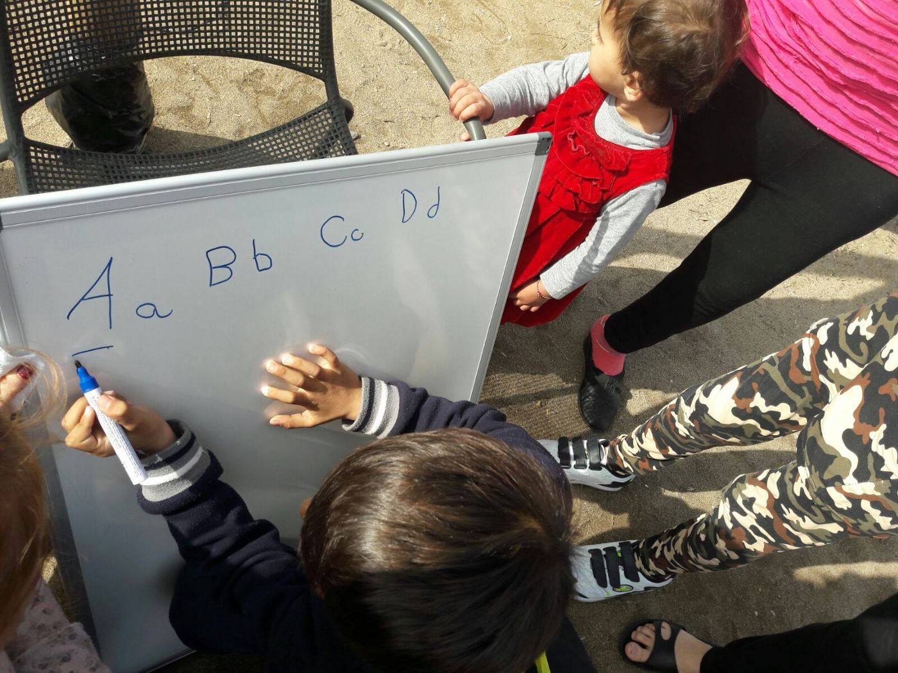
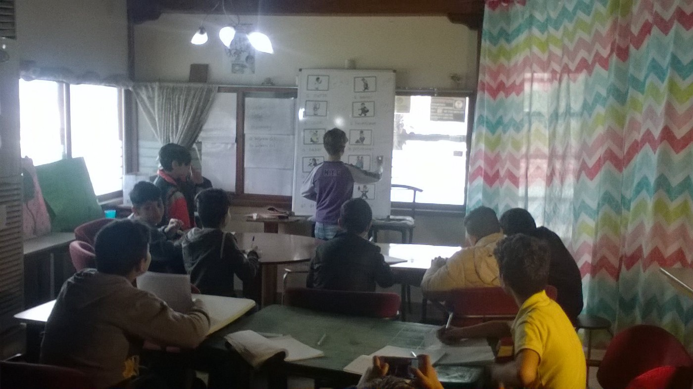
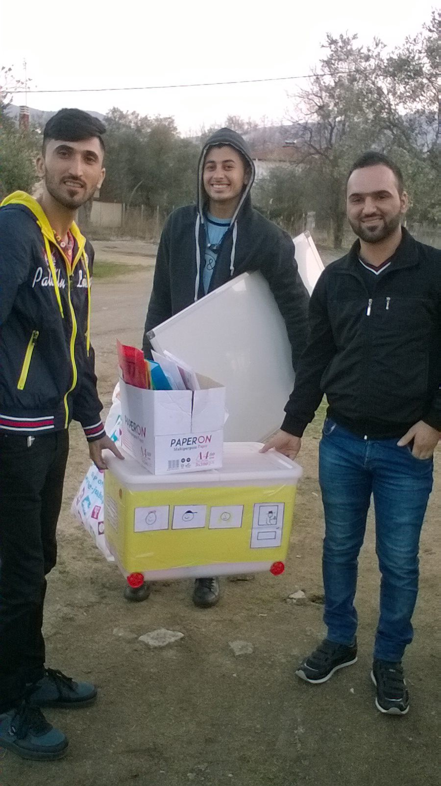
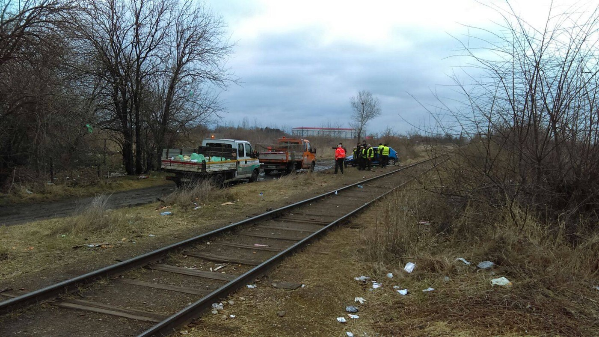
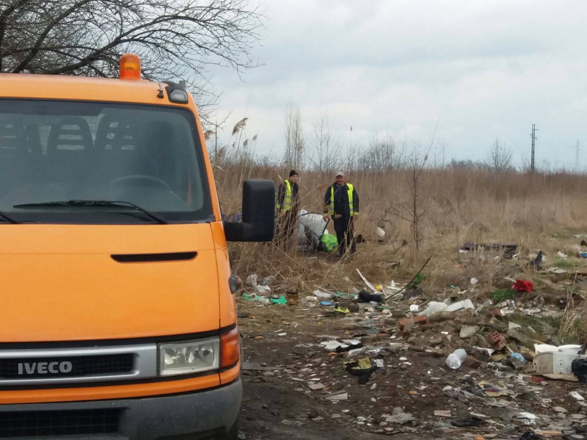
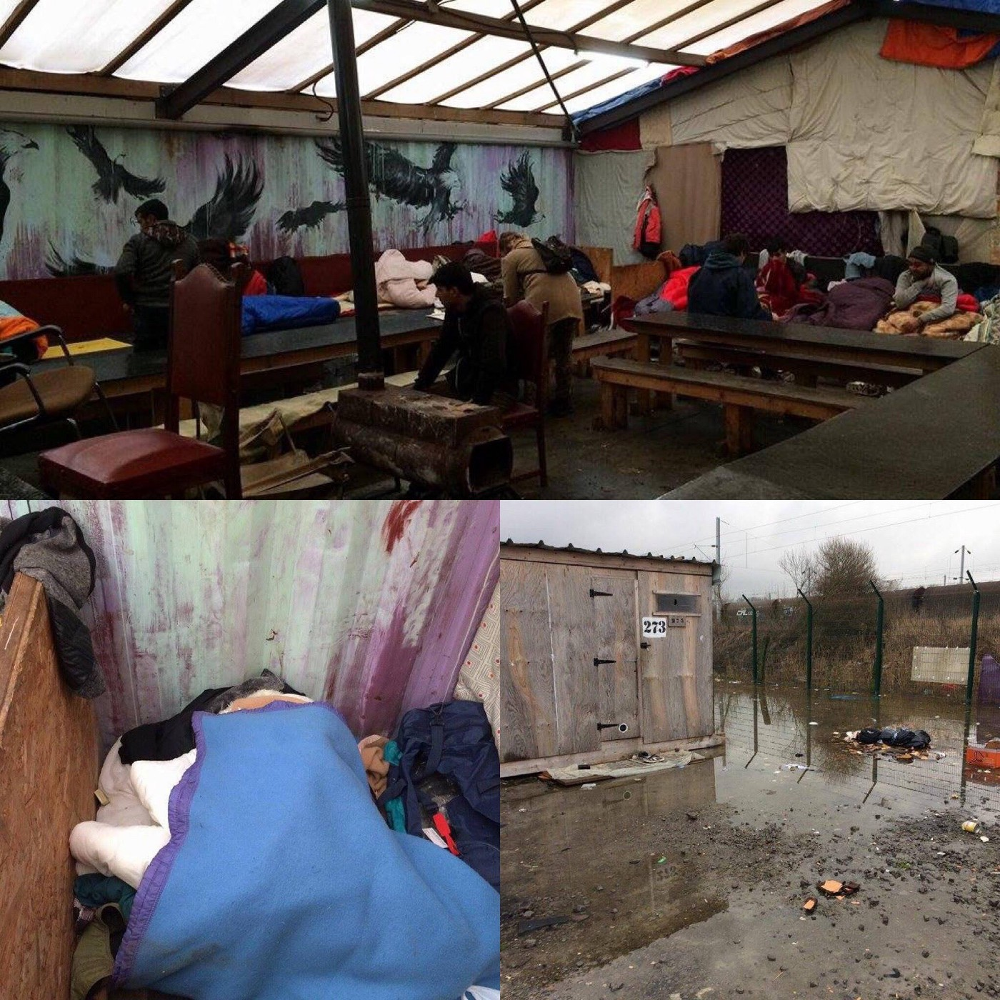

### AYS Daily Digest 10/3: Who Bears the Cost?

Another family scared out of relocated home in Bulgaria\. Finger pointing in Greece as refugees await news on Turkey deportations\. Serbia border hideouts evicted yet again\. Dunkirk to remain open until September 2017\.

Children learning from school boxes in Greece\. Photo credit: We Are Here
### FEATURE: who bears the cost?

[Bordermonitoring\.eu brought attention](http://bulgaria.bordermonitoring.eu/2017/03/08/refugee-family-with-a-status-has-to-leave-belene/) to a disturbing development in Bulgaria:

> Some days ago, a Syrian family, who had already received refugee status, was welcomed by the Catholic church in Belene, in the north of Bulgaria\. But this was a problem for Krasimir Todorov, a municipal councilor, who organized some locals to protest against the family and the priest Paolo Cortesi, who helped the family\. Todorov had been elected on a ticket called [“Democrats and Patriots for Belene”](http://sofiaglobe.com/2017/03/07/row-in-bulgarian-town-of-belene-over-church-sheltering-syrian-refugee-family/) and claims that in spite of his involvement in these actions he is neither racist nor anti\-refugee, stating that it was the fear among the general public, and his responsibility to them, that drove him to these actions\. “People are afraid that after one family settles, another 50 will come\.” 

> Last year, the Syrian family originally came via Greece via the relocation scheme and was coordinated from the State Agency for Refugees in Bulgaria \(SAR\) to the Catholic community of Belene\. Now the family has to leave again, because of the tensions in the city of Belene\. Cortesi announced the church would stop its charitable activities in the town\. 

The irony of this terrible event is only heightened by a recent poll in which Bulgarians marked [“freedom of movement” within the EU](http://www.novinite.com/articles/179159/Bulgarians+See+Free+Movement+as+Most+Cherished+EU+Right) as the most valued right as members of the EU\. This is the second case of a family being pushed out of a town protesting the relocation scheme\.

> It is events like these that serve to ground the abstract and dry political monologues on “comparative approaches to solidarity” like those discussed in parliament\. Across the world, the phrase “but who will bear the cost?” is invoked time and time again to justify turning on refugees — arbitrarily and artificially pitting “the common man” of that country against the incoming refugees\. As governments, media, and citizens continue to normalize anti\-refugee rhetoric under the guise of “simple questioning of the norm” and focus exclusively on the refugee issue as an example of how the EU is overreaching itself in the name of solidarity, the repercussions are terrifying\. 

### GREECE

Only 359 relocations from Greece between the 27th of February and 9th of March\. While France remains the country with the most relocations, it has relocated only 62 people since \(at least\) mid\-January\. Additionally, the mayors of Lesvos, Chios, Samos, Leros, and Kos have secured 50 million euros in additional EU funding in order to further shore up the flagging official “refugee support” system there\. How the money will be spent, however, is not yet known\.

Additionally, in spite of a recent dig by Angela Merkel, who criticized not only conditions for refugees in Greece but also, conversely, the lack of implementation of the EU\-Turkey deal \(read: sending people back to Turkey\), the highest administrative court in Greece heard a case on Friday that could possibly set a precedent for two Syrian asylum\-seekers whose cases were rejected and who now face deportation to Turkey\. [ReliefWeb reports](http://reliefweb.int/report/turkey/eugreece-hearing-deal-turkey) :

> To carry out the EU\-Turkey deal, the Greek government instituted an accelerated border procedure designed to enable authorities to [send people back to Turkey](http://reliefweb.int/node/1574931) \. The agreement is based on the flawed premise that Greece and the EU don’t need to evaluate the individual protection needs of those arriving via the Aegean Sea since Turkey is deemed a “safe third country” or “first country of asylum\.” 

> No one has yet been forcibly returned to Turkey based on a finding that their asylum application was inadmissible because they could obtain effective protection in Turkey\. Many of the initial decisions, in which asylum officers from other EU member states participate, have ruled such asylum claims inadmissible\. 

> But prior to June 2016, Greek Asylum Appeal Committees consistently reversed inadmissible decisions and ruled that Turkey is not a safe country and that asylum applications should be admitted for regular examination on their merits in Greece\. Following changes in June to their composition, appeal committees have declared Turkey a safe country for at least 17 asylum seekers, including the two Syrians whose case will be heard on March 10\. 

The results of the case are pending\.

NewsThatMoves posted a comprehensive guide to the active medical NGOs as well as the services they can provide to refugees\. It is crucial that refugees know what services are actually available rather than being forced to rely on rumours that disincentivize individuals from exploring their options\. Read the list [here](https://newsthatmoves.org/en/rumour-medical-assistance-by-ngos-and-other-organizations-in-greece/) \.

We Are Here posted a [fabulous update](https://www.facebook.com/WeAreHereCentre/posts/1961785484043047) on their educational activities which now include people of all ages and genders in several locations\.

> In order to provide classes for as many people as possible between us, we coordinate with another volunteer group on the ground, Lifting Hands International \(LHI\), who provide language classes for women as part of a range of services similar to our community centre role in Nea Kavala\. So although in all our photos, you will only see boys and men, the girls and women are also getting lessons, but are catered for elsewhere\! With our previous stronger focus on younger children and with LHI running a women’s space, It had actually been the teenage boys and the men of the camp who had been under\-served for quite some time, so it feels like a positive step forward to now be able to provide them with regular lessons\. 

Teenagers’ class\. Photo courtesy of We Are Here

> In the early afternoon we run a beginners class for ‘Babas’ — mostly for older men\. Having been able to provide daily classes has made all the difference, and their progress and growth in confidence with using the language is noticable\. Some have worked their way up from mastering the ABC in a small group before joining the classes\. 

It is great news to hear that men and boys are getting some much\-needed attention as many volunteers note that the traditional Humanitarian Sphere focus on women and children often endangers men, while reduplicating services to women and children\.

The team also have innovated the solution “school in a box” in order to reach the children who are falling through the cracks and don’t have access to even semi\-regular educational activities:

> There are many, many children in this community, who are simply not getting acceptable access to education, and we are pretty restricted in the services we can provide for younger age groups, for a variety of reasons\. There are also many people who would like to learn but are not easily able to access classes, for example those who are older, are in faraway hotels, or who have young children they cannot leave\. Knowing this community to be tight\-knit and education hungry, with people willing to share resources and knowledge, we decided to provide some resources and encouragement for them to be able to teach each other, by preparing and distributing a ‘school in a box’ kit to each hotel\. 

> The pack included a whiteboard and board pens, and a box with paper and basic stationery\. To help with English, each family received an English\-Arabic picture dictionary, and a folder with some picture vocabulary sheets of useful vocabulary, that we will build up over time\. 

> We also distributed a pencil case kit for children and a ‘study pack’ with progress sticker book for each child aged 5–9, with worksheets for the English and Arabic alphabets, and maths\. 

As can be expected, the boxes are a hit\.

School bus or a school box? Photo courtesy of We Are Here
### SERBIA

[Soul Welders](https://www.facebook.com/SoulWelders/posts/714958828706153) reports that there was yet another police “cleansing” in the spaces in and around Subotica this morning\.

According to UNHCR, 114 individuals were taken from their shelters and taken by bus to Preševo camp\. Although 30 were allowed to return, a cleansing team accompanied the police officers to “clean up” \(as in take\) all belongings left behind\.

“clean up” in Kelebija

In spite of this, it is anticipated that numbers will return to normal within a week as the treadmill of individuals trying to play the game will continue, and possibly increase in flow as the weather continues to improve\.
### France:

In a glimmer of hope, the French government has announced that Dunkirk camp will be maintained through September 2017, meaning a breath of relief for persecuted humanitarian and volunteer groups trying to support the thousands of people on the margins of society\.

Dunkirk\. Photo courtesy of Help Refugees\.

Help Refugees has posted a comprehensive update on their activities which cover a broad range\. They also collaborate and work with several other humanitarian actors on the ground\.

> On Child Protection we work closely with the [Dunkirk Legal Support Team](https://www.facebook.com/DunkirkLegalSupportTeam/) \. There are an estimated 100 unaccompanied minors living in the camp, many of them sleep in the open community kitchens\. A number of these children have family members living in the UK\. Just yesterday a 15 year old boy from Afghanistan, who sleeps in one of the kitchens, was visited by his father who lives in the UK\. He has a right to join his father in the UK but while he waits for the authorities to process his case he is sleeping on the filthy floor of a community kitchen\. His father visited him in the camp and saw the conditions he is has to live in while waiting for the slow and frustrating process\. 

> Our partners [Safe Passage UK](https://www.facebook.com/Safe-Passage-UK-159240661197359/) are working on his case with the legal centre\. Family reunification cases are incredibly time\-consuming and in the meantime this boy is not living in a safe facility adapted to his needs as a minor\. He is not in full\-time education as we would wish for a boy of his age\. 

> The amazing RCK team continues to provide about 400 meals per day and manages the two free\-shops of the camp which enable camp residents to cook for themselves, selecting the items that they need in something that resembles a bit of normality\. 

> The [Dunkirk Refugee Children’s Centre](https://www.facebook.com/dunkirkrefugeechildrenscentre/) continue their fantastic work providing a welcoming haven for children in the camp and an impressive education and activity programme\. 

Read the full report [here](https://www.facebook.com/HelpRefugeesUK/photos/a.123267671367248.1073741830.111893659171316/397437300616949/?type=3&theater) \.

Additionally, in spite of the bleak situation in Paris, many Paris startups have announced that they will open their doors to refugees looking for jobs in startups\. Please see the Techfugees group for more updates\.

Activists in France are organizing a massive protest against the deportation of Farhad, a refugee from Afghanistan who was arrested while trying to change locations in France\.

> Farhad sought asylum in Norway but was refused\. In France, like many other people, Farhad slept between the gates of the brand new Hidalgo center for 7 days in the hope of not being out on the street again…\. Farhad lost his place in the “humanitarian” barbed wire queue\. He left for Lille with the intention of seeking asylum there and was arrested on the road\. On his transfer from the CRA of Lille to that of Mesnil\-Amelot, he was insulted by the police and anointed him with an electric pistol\. Its course is not isolated and although it is commonplace it remains more than ever unacceptable\. Moreover, Farhad suffers from hepatitis B, and kidney stones\. He was not treated in any of these countries\. 

On March 13th, Farhad will be forcibly placed on a plane and sent back to Afghanistan; however, this plan does not mean we cannot be moved to action\. Raising awareness and protesting the action may not result in Farhad being released, but it will show him, and many others, that we will not let them go without a fight\. Join here\.
### SWEDEN

A recent report documents that Sweden was unprepared to take in the [163,000 asylum seekers it did over the course of 2015](https://www.thelocal.se/20170309/how-sweden-handled-the-refugee-crisis-report) \. From the beginning of the crisis, Sweden remained one of the greatest promised lands; however the accommodation abilities became extended beyond their capacity\. Success was noted in that accommodation was provided to all; however, bureaucratic measures such as registration were patchy and resulted in additional confusion for refugees and workers\. The report states that this will hopefully result in strengthening the Swedish system to accommodate further influxes of refugees, although it is unclear if Sweden will be loosening its now\-strict immigration procedure any time soon\.

_Converted [Medium Post](https://areyousyrious.medium.com/ays-daily-digest-10-3-who-bears-the-cost-256fb47f2190) by [ZMediumToMarkdown](https://github.com/ZhgChgLi/ZMediumToMarkdown)._
