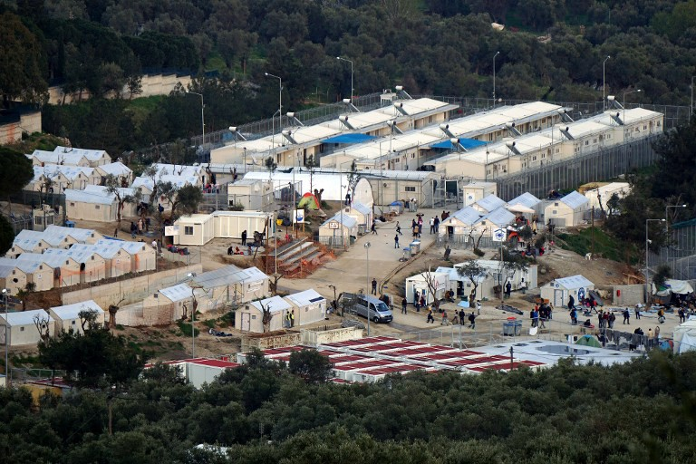

### AYS SPECIAL: From Migrant Crisis to Detention Crisis

_The trouble with the media sensation surrounding an image like that of Alan Kurdi is that it predicates compassion upon photogeniety\. It encourages you to care about what can be articulated in a photograph over what can’t\. More insidiously, it permits you to stop caring about something as soon as horrific photos of it no longer inundate your newsfeed\._

Moria camp, Lesvos

Looking out from the harbor of Mytilene a year ago, chances are, you would have seen several boats crammed with migrants motoring from Turkey to Lesvos, to continue their journey to a new home\. Today, a big grey boat is heading in the other direction\. It’s the HMS Protector, stationed here alongside a squadron of other NATO ships to prevent any other migrants coming\. The Greek and Turkish coastguards will not talk to one another, so like a third party to a playground squabble, NATO has to act as a go\-between, relaying the location of migrants’ boats from one side to the other\.

HMS Protector has been stationed in Mytilene since March of last year, when it became EU policy to deport new arrivals to Turkey\. This about\-face effectively stanched the flow of migrants to Lesvos\. Whereas 31\.000 arrived on the island last February, the sum\-total for last month was 252\. \(Currently, more than 5,000 people are living on Lesvos, even though the capacity is around 4,200\. \)

It would be easy to surmise from these statistics that the migrant crisis in Greece is over\. Indeed, to surmise anything else might seem disingenuous\. How could the migrant crisis not be over \(you might ask\) now that nobody is migrating? How could it not be over, now that none of the scenes that made us think of it as a crisis are occurring any longer; now no mountains of life jackets are accumulating on Lesvos beaches, no flotillas of boats are arriving all together, and no children are washing up, dead, on the shore?

> But these familiar front\-page images never encapsulated the crisis in Lesvos, and the fact that they are now bygones does not mean the crisis is, too\. 

These images captured the anguish of migration at the expense of capturing its tedium\. They invited us to wonder how terrifying it must be to feel the spray of the Aegean on your skin and know that it might swallow you up before you reach land\. But they gave us no sense of the tedium of then having to walk forty miles in sea\-sodden clothes, to take your place in a queue of eight thousand people waiting to be registered as refugees\.

The reason why reportage of the crisis came to be dominated by such a small and unrepresentative stock of imagery is very simple\. It’s a news editor’s job to present readers with a single shocking image, beneath a blaring headline, as shorthand for an entire event\. Such images have a habit of insinuating that they comprehend an issue while only articulating a fragment of it\.

An image as desolating as that of Alan Kurdi’s body on the beach not only convinces but coerces us that it says all there is to say: nobody wants to be the person to point out that the issue can’t be encapsulated by a picture of a dead child\.

> The trouble with the media sensation surrounding an image like that of Alan Kurdi is that it predicates compassion upon photogeniety\. It encourages you to care about what can be articulated in a photograph over what can’t\. More insidiously, it permits you to stop caring about something as soon as horrific photos of it no longer inundate your newsfeed\. 

Which brings us back to what is happening on Lesvos now\. The EU\-Turkey deal not only stopped migrants arriving on the Greek islands, it also made it much more difficult for them to leave\. Turkey’s offer, to take back migrants whom the Greek authorities have not settled, has enticed the Greek authorities not even to let them travel on to Athens, for fear that Turkey may not accept their deportation if they did\. As the glare of media attention has faded from the migration crisis it has transformed into something less spectacular but no less disturbing — a detention crisis\. Over ten thousand migrants are now trapped on the islands of Lesvos, Samos, and Chios without any idea how long they will be there\. Most of the five thousand migrants on Lesvos live in Moria, a refugee camp run by the Greek military\.

Before telling you about what Moria’s residents must endure, it’s worth restating the most basic facts of their situation\. These are people — mostly Syrians, Iraqis, and Afghanis — who have fled war zones which probably mentally or physically scarred them, perhaps took away their loved ones, and certainly took away their livelihoods, who then boarded boats on which they could have drowned\. Now, imagine if you can \(and I can’t imagine very well\) what it must be like to be told that as sad as all that is, Europe has no place for you, so could you please just live behind this barbed wire until further notice\.

> With its security guards and its twenty\-foot\-high steel fence, Moria looks like a fortress, but it smells like a sewer\. To its left runs a stream clotted with rubbish\. Peering through the fence you can see the tarpaulin\-covered tents the migrants live in, sturdy enough for a music festival but not much more\. 

As shocking as all of this may sound, the monotonous squalor of daily life in Moria is never going to grab headlines like the death of Ayn Kurdi, precisely because of what makes it so depressing to live through — the fact that it is the same day after day\. It’s a drudgery too diffused to be captured in a single moment\. But that doesn’t mean it’s any less morally urgent\.

It doesn’t mean that the people in Moria, or those spread across the Greek islands, are any less deserving of a home in Europe, or your money, or your time\.

_\(By Ben Cooke, volunteer with_ [Humanitarian Support Agency](https://www.facebook.com/groups/volunteers.coordination/) _\)_
#### AYS is open for your stories, videos, photos… If you want us to consider something for publications, please get in touch through our Fb Inbox or by email ays\.info\.team@gmail\.com

_Converted [Medium Post](https://medium.com/are-you-syrious/ays-special-from-migrant-crisis-to-detention-crisis-84941596fa26) by [ZMediumToMarkdown](https://github.com/ZhgChgLi/ZMediumToMarkdown)._
