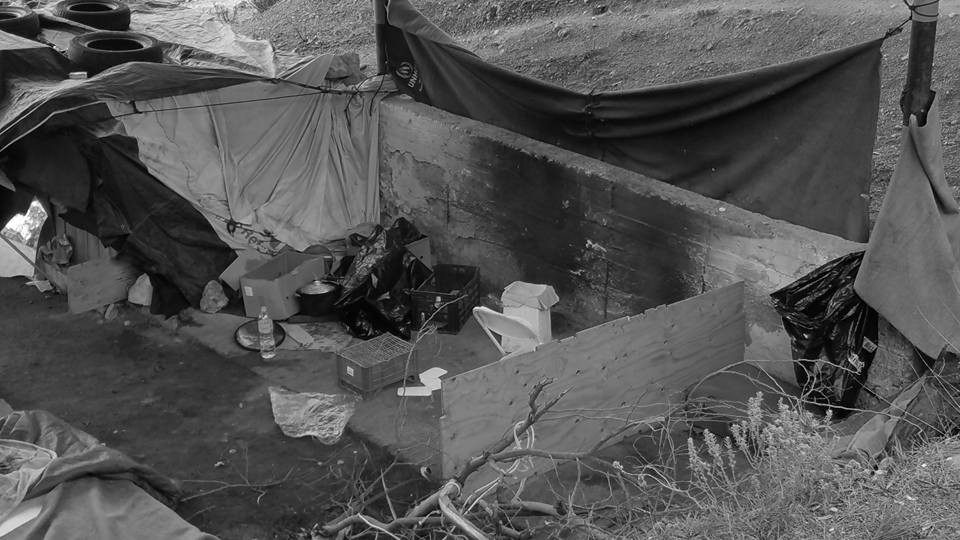

### AYS DAILY DIGEST 12/3/2017 — A psychological war against refugees

_Tens of thousands of Syrian children left unvaccinated / Doctors, nurses and medical translators needed in Greece / Belgrade aid distribution center being built / Upgraded wire fence on the Hungarian border — refugees announce hunger strike / Asylum seekers protest against problematic asylum procedures in Finland_

](assets/bc7c45762607/1*gEVAMP-bHj8ySZNwKh7_dw.jpeg)

Photo by [ECHO Refugee Library](https://www.facebook.com/refugeelibrary/?ref=page_internal)

After the shameful decision of the Hungarian parliament that all asylum seekers should be detained in container camps while awaiting their interviews, Hungarian government ahead with Viktor Orbán continues their “psychological war with refugees” as one of them called it in a [statement](http://moving-europe.org/a-protest-call-from-imprisoned-refugees-in-bekescsabahungary/) published for the press today, announcing a hunger strike\.

Amnesty International has called on the EU to “show Hungary that these illegal and deeply inhumane measures will have consequences”\. The United Nations speaks of a violation of international law\. The systematic detention of immigrants existed in Hungary until 2013, when it was halted following pressure from Brussels, the UN and the European Court of Human Rights\.

Other organizations such as Médecins Sans Frontières have also accused Hungary of assaults on refugees\. “There appears to be a welcome package of mistreatment to the EU,” its chief, Christopher Stokes, told The Associated Press\. “It includes at least beating, almost always tear gas at very short distances and other eye sprays\.” The Government denied this and prepares measures to limit the action of NGOs while surrounding the country with new fences and trained “migrant hunters”\.

Just a reminder, last year Hungary hosted mere 425 asylum seekers out of 29,432 applications\. In 2015 it had accepted 502\. In the same years, Germany, with an eight\-fold population, welcomed 280 000 and 890 000 refugees\.
#### SYRIA
#### **Tens of thousands of children left unvaccinated**

Aleppo, 9 March 2017
A boy plays with a cat next to a 1948 Buick in the war\-torned al\-Shaar neighborhood in Aleppo\.
Photograph by Joseph Eid, taken from Art Against

Other than receiving one or two doses in isolated campaigns, Syrian children are not vaccinated against a range of preventable diseases such as measles, rubella, tetanus or pneumonia\. Mass displacements of people left medical authorities and NGOs unable to focus their efforts on these activities or without resources, says Sara Ferrer, MSF nurse coordinating MSF’s medical projects in Aleppo governorate\. Read the full interview with Farrer about the worrying medical situation [here](http://www.msf.org/en/article/syria-war-has-left-tens-thousands-children-unvaccinated) \.

In the last year MSF launched two vaccination campaigns, most recent one being in January\. In 12 days, 6,540 children under the age of 15 were vaccinated, 93 per cent of the target, says Ferrer\.

_Asked what should be done, Ferrer said_ “ We believe that WHO, other UN agencies and other medical players should press for an increased population coverage for vaccinations\. Small steps are being taken, such as an immunisation programme for children under one year old in the provinces of Hama and Idlib\. But it’s not enough\. Syrian children deserve greater protection against a complicated future\.”
#### GREECE

**DOCTORS, NURSES and MEDICAL TRANSLATORS needed**

Emergency Response Centre International \( **ERCI** \) is looking for certified and registered Doctors and Nurses with minimum 2 years of working experience, as well as Arabic and Farsi translators familiar with the medical terminology \(Medical Students\) for immediate deployment in Greece\. Sharing accommodation and operational transportation will be provided\.

Please reach them at aid@ercintl\.org with the subject ‘’MEDICAL’’, with your CV, certificates and availability\.
#### KOS report

An independent volunteer reported from Kos\. There is approximately 1254 refugees currently on the island, of which 1022 are residing at the Hot Spot and Annex area\. More vulnerable ones are placed at the Argos hotel run by UNHCR, Save the Children UOM and Praxsis UOM, also at Arsis apartments\. Only 8 children are going to school\. At the Hot Spot close to the small village Pyli around 800 people are all in ISO boxes\. A new wired detention center is being built close by and should open in a few days\. The people in the Annex, which is the old car park of the Hot Spot, are sleeping in tents and in ruins\. The number varies from 180 to 300, mostly Pakistanis\. There are showers and toilets, often out of function\.

There is enough volunteers and workers at the moment\.
The only thing not covered inside the Hot Spot is clothing\.

](assets/bc7c45762607/1*HIiyEi5lQM2lPE6GvtXClA.jpeg)

Kitchen = cooking over small wood fires or scavenged gas burner\. One pot per space\. 10–15 occupants per space; “Brother, can you spare some WiFi\. \.?”
\(Piggybacking the UN’s signal to send assuring texts and pics to family back home\)— credit [Brooke Burgess](https://www.facebook.com/brooke.burgess.9/posts/10154919991376758?hc_location=ufi)

[**The Timber Project**](https://www.facebook.com/thetimberproject.org/?ref=page_internal) are currently working at Katsikas camp where they are building a shopping arcade for [Refugee Support Greece](https://www.facebook.com/RefugeeSupportGreece/) \. 
For the decorating part they teamed up with Habibi works, a creative space set in a huge warehouse across from camp Katsikas, offering a wood workshop, metal workshop, textile printing, sewing, arts and crafts, gym equipment, 3D printing, laser cutting, language lessons, gardening and cooking all in a non exclusive, incredibly welcoming environment\. 
Stepping into Habibi works is like finding a little bit of magic in an otherwise dark environment, write The Timber Project\.

Habibi\.works — Photo by The Timbre Project

If you would like to join The Timbre Project as a volunteer, [write to them](https://www.thetimberproject.co.uk/volunteer) \.
#### ATHENS

Zaatar NGO published [a new schedule](https://www.facebook.com/zaatarngo/posts/1371069359580070) for the upcoming week March 13–18\.

There were 84 new arrivals in Greece today\. 58 on Chios and 26 on Samos\.
#### Greek State Council issued a hearing on Turkey as “Safe Third Country”

Two days ago the Greek State Council heard preliminary arguments relating to the controversial issue of Turkey’s consideration as a ‘Safe Third Country’, [reports](http://www.legalcentrelesbos.org/2017/03/12/state-council-hearing-on-turkey-as-safe-third-country/) Legal Centre Lesbos\.

Among other, lawyers from Pro Asyl, the Greek Refugee Council and Metadrasi brought cases on behalf of Syrian asylum seekers raising serious concerns about the possible consequences of sending asylum seekers back to a country which is not a signatory of the 1967 Protocol Relating to the Status of Refugees\.
#### MACEDONIA

People who were taken from Subotica in a police raid couple of days ago, which we wrote about [Friday](https://medium.com/@AreYouSyrious/ays-daily-digest-10-3-who-bears-the-cost-256fb47f2190#.10n5y6r0g) and [updated](https://medium.com/@AreYouSyrious/ays-daily-digest-11-3-2017-the-future-stopped-at-the-closed-borders-73d190e1982f#.ggjgc3tuf) yesterday, are pushed back to Macedonia and are now in make shift camps in Lojane village\. There are 140 of them, all Pakistani men\. So far, 4 of them applied voluntarily to go back to Greece\.
#### SERBIA

The BelgrAid Warehouse, soon to be Serbia’s biggest aid distribution centre, is being built\. From there it will be possible to distribute food and clothing to approximately 2000 refugees and Serbian homeless people\. You can support them by donating [here](https://www.youcaring.com/peopleinneedonthestreetsofserbia-753574) \.

While the centre is being built, many refugees are still stranded across Serbia without adequate shelter\. ChiosMonitor reported today that an 18 year old Algerian refugee has died while hiding on a train in Serbia\. He reportedly suffered severe burns\.
#### HUNGARY
#### **Refugees announce hunger strik** e

Today we have received a written call for help from refugees who are held in a closed camp in Hungarian city Bekescsaba\. They have announced a hunger strike, starting tomorrow\. With this sit\-in, they write, is to send their voice and their call to the public to show the injustice they are facing in Hungary\.
“Most of the refugees are suffering from diseases and some need
surgery and psychological condition is very bad and some of them thought
to commit suicide because of the bad situation in this closed camp and
doctors in this camp know it, but they are content to give them sleeping
pills” they write\. “Because of this ill\-treatment of refugees it will generate a state of violence and neurological diseases and this pressure will rise
bad feedback that affect their lives in the future\.” They called the situation in which refugees are detained a psychological war against them\. [Read](http://moving-europe.org/a-protest-call-from-imprisoned-refugees-in-bekescsabahungary/) their statement in full\.

Supreme Public Prosecution told MNO that there had been 44 complaints lodged against the Hungarian police between September 2015 and March 2017\., write MigSzol\. In 5 cases the investigation is still ongoing and in 2 cases they imposed fines on the police officers\. Apart from private litigators, of the 44 complaints, 5 were lodged by the UNHCR, 1 by the European Committee for the Prevention of Torture, 14 by different arms of the police, 9 by MSF, 1 by the Hungarian Army and 1 by the Szeged jail\.

A refugee drawing, photo by MigSzol

Victor Orbán is determined to stop “millions of people” preparing to cross the border and surround the country completely in barbed wire\. SIRIUS\.HELP report on two new elements to the current razor wire and wire fence on the Hungarian border\. A few meters away from the current fence a new welded fence has been built\. Its uniqueness, is that it is equipped with a proximity sensor, which in our experience is more like a vibration sensor, since its alarm even goes off when excavators are working a few meters away from it\.

> The other element is the “alarm” itself: they have built a pole every 300 metres to complete it, each have 2 speakers, 2 high power and a regular reflector and infrared cameras around it\. If the alarm goes off in the inner sensory fence, the speakers turn on and in several languages say the text that you can hear in the video\. This does contain a lie though, because according to the last sentence, asylum claims can be submitted in the transits\. That is not how it is though in reality, even though someone is going from the fence to the transit zone, the Immigration and Asylum Office workers do not accept asylum claims, they just redirect them to the Serbian authorities\. 
 

> The new elements of the border control are useless, in fact we are willing to take the risk and announce, that from some points of view they simplified the situation of those, who want to cross it\. The current fence can be climbed over by a proper sized ladder in about 30 seconds\. Crossing the new fence means no challenge, the alarm in the sensors only goes off, if someone reaches the second fence\. Obviously the speakers will not stop anyone, though with these types of technological solutions, the constant false alarms that go off will heavily affect police forces\. Also, the second fence limits their actions, since the police/soldiers guards have to move in the service path between the two fences\. So if someone got across the second fence, it is that much more difficult to go after them… 

#### Hungarian refugee hunt

After a six\-month course given to Hungarian police officers, the new “hunter\-gatherers” force will enter the scene until the summer to strengthen immigration control\. It will focus on the borders with Serbia and Croatia, the border of the Schengen area and the EU, where hundreds of thousands of people have entered the country since 2015, mainly in the effort to continue their journey to other European countries\.
#### FRANCE
#### Paris — mobile clinic

SCHEDULE AND LOCALIZATION OF MOBILE CLINIC:

Porte de la Chapelle after the bridge in right hand of the metro exit line 12, Monday, Tuesday, Thursday and Friday from 2pm to 8pm\.
#### Donations needed in Calais

InfoCAO in need of donations\. Priority items include: sleeping bags, thermal gloves, small & medium waterproof men’s jackets, men’s joggers, emergency blankets, oats, golden syrup, olive oil, coffee and garlic\.

You can find a list of necessary items along all other helpful info on donating and contributing [here](https://docs.google.com/document/d/1u3fyKQIDAVjibi6zwhQdOIdN1XYO9_oAmzcddPlrt_Q/edit) \.

[**Solidarité migrants Wilson**](https://www.facebook.com/Solidarit%C3%A9-migrants-Wilson-598228360377940/?ref=page_internal) **report on today’s food distribution\.**

> Again a big team, 4 from the country, 1 from Saint Denis, then Paris and 94 \(arrondissment\) \. Thanks to the ultra\-motivated team we installed ourselves fast, a queue forms soon, an Afghan helped us\. We served glasses and glasses, more than 500\. The tables \(cool, we retrieved everything at Utopia\) are provided with fruit, cheese, bread, jam, etc\. — Many of the Afghans left afterwards to scout and serve drinks and small snacks We have about 60 liters of hot drinks, at 12:00 there is nothing left\. Many minors in groups who wish to stay, once the serving is finished, we discuss a bit in English\. The Afghans would welcome German speakers\. Around lots of small groups gather\. This time the sun was friendly in terms of meteorological climate but the climate of the situation did not see many improvements\. Many men sleep outsides, even on the ground\. Today’s welcome is used quite much\. Thank you again to all good volunteers who took part in this breakfast \.
 

> We need trousers, shoes, and hygiene sets\. 

](assets/bc7c45762607/1*mwEzpi1YeNKZadaiF-Jj7g.jpeg)

Photos by [**Solidarité migrants Wilson**](https://www.facebook.com/Solidarit%C3%A9-migrants-Wilson-598228360377940/?ref=page_internal)

Ex\-translator of the UN in Afghanistan and a public opponent of the Taliban, 24 year old Fahrad, is being sent back to Afghanistan tomorrow morning, where he’s being threatened by the Talibans\. [StretVox](http://www.streetpress.com/sujet/1489171005-appel-fahrad-refugie-afghan-menace-mort-talibans) managed to interview him by phone since he is currently locked in the administrative detention center \(CRA\) of Mesnil\-Amelot, right next to Roissy airport from where he is about to be deported\. The expulsion of Fahrad, to whom Norway has denied the right to asylum, is made possible by the agreement between the EU and Afghanistan, which radically simplifies deportation procedures to that country\. “The Taliban found me and kidnapped me\. When they released me, I had traces of knife blades all over my body, scars everywhere\. That was their last warning\. My family was terrified\.” Fahrad told them\. Besides his illness standing in the way during the asylum procedure interview in Norway, he has been questioned with the presence of a translator who didn’t speak his language and his asylum application was refused\. Fahrad is just one example of the dangerous practice of the EU countries that is under way “thanks to” the recent EU\-Afganistan deal\.
#### FINLAND
#### **Asylum seekers protest against the problematic asylum procedures**

Iraqi and Afghan asylum seekers in Finland have been protesting against the unequal asylum processes and faulty asylum decisions for one month in central Helsinki\. The asylum processes and decisions have proved to be highly problematic when it comes to using interpreters, accepting evidence, evaluating personal threat and the safety of the country of origin among other things\. The Finnish Immigration Service \(Migri\) refuses to publicly admit these problems, although in a private meeting with the demonstrators Migri has admitted making several mistakes in the cases of asylum seekers who arrived in Finland in 2015 and after\. Meanwhile, Finland continues to forcibly deport people to unsafe circumstances\. Those who can’t be deported are left as paperless people with very limited access to accommodation, food and health care\. The state and municipalities are trying to transfer taking care of their most basic needs to each other and as result people are falling through the cracks and their access to services depends on municipality they live in\. Some reception centers aren’t even waiting the full process to through the courts but are kicking people out after two negative decisions from Migration office\. In almost all reception centers the same happens after the courts decide to upheld the negative decisions\.

The demands of the protesters include the following:
\- Independent review of the functioning of the Finnish Immigration Service \(Migri\) 
\- Updated country of origin reports \(or instance compared to 61% average in EU, only ca\. 35% of Iraqi asylum seekers receive international protection in Finland\)
\- Review of all asylum cases that have undergone a faulty asylum procedure by Migri
\- Immediate stop to all deportations because of the faulty procedures
\- Return the temporary residence permit to Finnish legislation without obligation to sign up for “voluntary” return

Read the complete list [here](https://demofi.blogspot.hr/2017/02/demands-of-protesting-asylum-seekers.html) \.

At the moment, thousands of people are in a legal void\. Many end up working without papers in Finnish informal economy or leave to other EU countries\.

The protest has reached an unprecedented amount of public support from academics to culture professionals and institutions as well as politicians\. The biggest opposition parties \(Social Democrats, the Greens, the Left Alliance, Swedish People’s Party in Finland\) have also demanded the Finnish government to reintroduce the temporary residence permit\.

Follow the demonstrations on [Facebook](https://www.facebook.com/SeisKarkotuksille/?fref=ts) and [Twitter](https://twitter.com/stopkarkoitus) \.

People leaving their messages — photos by Stop Deportations

_Converted [Medium Post](https://areyousyrious.medium.com/ays-daily-digest-12-3-2017-a-psychological-war-against-refugees-bc7c45762607) by [ZMediumToMarkdown](https://github.com/ZhgChgLi/ZMediumToMarkdown)._
