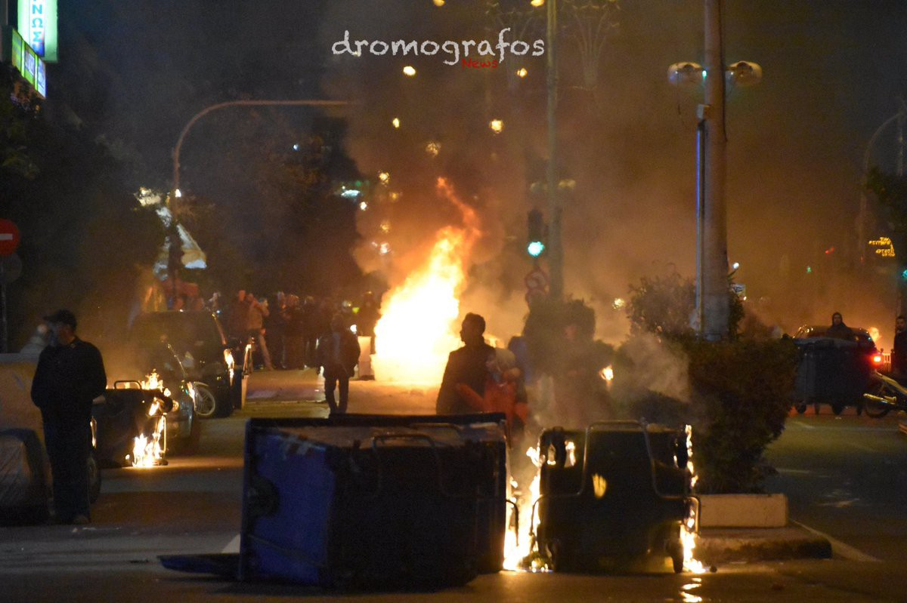
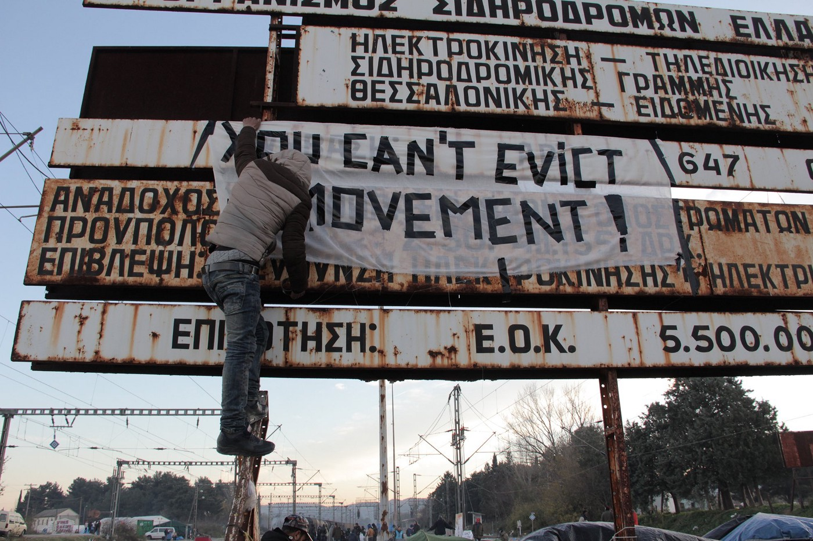
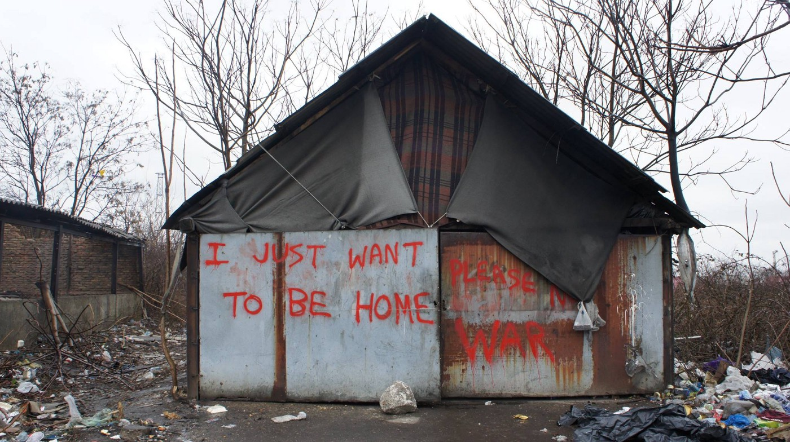

### AYS DAILY NEWS DIGEST 13/03/17 — Red Cross shamelessly prompts raids on refugee\-run squats in Athens

#### Feature

Police have raided and evicted the residents of two squats in Athens, one with more than 120 refugee residents, including children and people with medical conditions\. This action prompted massive calls for solidarity and protests all around the city\.

The raids were precipitated by the Red Cross, which owns the buildings in question, as they wished to retake control of the properties to rehouse unaccompanied child minors\. The move is wildly unethical and even contrary to common sense, as the Red Cross is prompting the eviction of refugees to make room for another group of refugees\. This makes little sense given the number of empty properties which can be found in Athens\.

The raids were conducted at around 5 in the morning\. The first one was in Acharnon squat, Alkiviadou Street, which has been occupied since February of this year\. The second was in Villa Zografou, one of the oldest squats in the Exarchia area\.

Residents in both buildings, including 129 refugees mostly from Syria, were arrested and taken to the police station in Petrou Ralli street\. Among those detained are people who need medical attention: two pregnant women, one diabetic, one person with epilepsy, one person with heart problems and high blood pressure, and others\. Acharnon squat was used mostly for people with some kind of medical condition\.

People with Greek passports and European permits were released from detention soon after the arrest, but even late in the evening refugees were still being held\. We have been told that those who can provide the address of their temporary accommodation will be set free\. Around 50 people have been released thus far, and again volunteers and activists helped them to find accommodation\. Apparently, alternative accommodation was offered in some of the camps, but many people refused to take this option\.

People who do not have regular papers will be taken tomorrow for registration and then sent to detention centers\. Others will be sent to camps around Athens\. It is not clear which ones, since most of the camps in this area are overcrowded\.

The people who were held by the police were also denied right to speak to a lawyer, even though some volunteer lawyers were in the front of the building offering their services\. One person inside the police station sent a message to the Khora team saying that she was told she doesn’t have the right to see a lawyer since, “she isn’t being detained, just ‘held back’ before being referred to a camp\.” People inside the station were sleeping on benches, chairs and on the floor inside\.

A refugee in custody sent this picture to volunteers\.

There are more than 10 squats in the Exarchia area, housing around 3,000 refugees in total\. Acharnon was the first autonomous and unmediated squat, organized by refugees without the presence and participation of local activists\. It was a space of immigrants and refugees by themselves for themselves\.

The occupied park and castle of Villa Zografou in the Zografou area has existed since 2012\. Previously, the state put pressure on all residents in squats, as well as the activists who are supporting them, by not allowing the distribution of cash cards\. Big organizations who are taking part in this distribution complied without objection, which left many families and lone refugees without any material aid\. Some of the organizations in question have not reacted to today’s events\.

The raids prompted a huge protest in the streets of Athens early in the evening, with over 2,000 people marching in solidarity\. Police “greeted” them with teargas\. Late evening protests turned into clashes with police\.

Photo Credit: NoBorders

AYS stands in solidarity with those who were evicted and taken into custody last night\. We strongly condemn the police’s actions, bearing in mind that the people who are living in squats are in need of shelter and help\. It is estimated that around 3,000 people in Athens are living in squats, where living conditions are much more humane that in most of the government\-run camps or housing projects\.

\(We thank friends from the [Khora](https://www.facebook.com/KhoraAthens/?hc_ref=SEARCH) team for the extensive information provided for this report\. \)
#### Syria
### Syrian doctor killed in regime airstrike

It was reported today that Doctor Hasan Hariri was killed on Sunday\. Dr\. Hariri’s death came as the result of the Syrian regime’s airstrikes on the city of Dera’a, the epicenter of the movement against the Syrian government\. Dr\. Hariri had previously lost 7 of his children to barrel bomb attacks by the government\.
#### Greece
### Turkish nationals seeking political asylum to go to court on Thursday

Four Turkish nationals of Kurdish descent landed on a Greek island last week seeking political asylum\. Aboard their boat was also a man from Afghanistan\. All five are currently being detained on Chios and are scheduled to head to court on Thursday to determine their future\. The men have stated that they are afraid of repercussions should they be returned to Turkey\.
### Rumors\+Answers releases an edition covering healthcare in Greece

As refugees have notorious difficulties accessing healthcare, the good people at Rumors\+Answers have [devoted an issue](https://newsthatmoves.org/en/rumours-60-health-special/) to explaining how refugees can see a doctor all across the country, whether at a hospital or with an NGO such as MSF or the Red Cross\.
### Thought\-provoking book of photojournalism and prose goes on sale to benefit Khora

### International protection appointments system revamped

The Skype schedule for those seeking to make an appointment with the asylum office has been revamped, and times have been designated for speakers of each of the main languages to schedule their appointment\. Information may be found [here](http://asylo.gov.gr/en/wp-content/uploads/2017/03/Skype-announcement-13.3.17-2.pdf) \.
### Numbers

The Greek government’s detailed numbers for the islands may be found [here](http://mindigital.gr/index.php/%CF%80%CF%81%CE%BF%CF%83%CF%86%CF%85%CE%B3%CE%B9%CE%BA%CF%8C-%CE%B6%CE%AE%CF%84%CE%B7%CE%BC%CE%B1-refugee-crisis/1046-summary-statement-of-refugee-flows-to-eastern-aegean-islands-13-03-2017) \. According the report, there are currently 14,204 refugees on the islands, and a total of 62,385 in Greece as a whole\.
#### Macedonia
### Residents of Vinojug camp in Gevgelija relocated

The Vinojug camp, home to over 150 refugees, was emptied of its residents on Sunday March 12, and only 8 refugees remain\. A total of 1,400 refugees, most of whom are from Afghanistan, continue to be stranded in the country\. Read more [here](http://legis.mk/news/2288/the-last-refugees-left-the-camp-vinojug-gevgelija) \.
#### Serbia

A refugee dwelling in Belgrade\. Photo Credit: Matt Frank

#### Bosnia
### Three refugees arrested attempting to enter Bosnia

The refugees, two Indians and one Pakistani, were captured along the train tracks at the Raca crossing point\. The arrest highlights the increasing importance of Bosnia to refugees\. Although Bosnia was always part of the refugees’ route to Western Europe, traffic through the country has been relatively scarce in comparison to its neighbors Serbia and Croatia\. Bosnia is not an EU country, and is thus far less desirable\. However, in light of recent events perpetrated by Hungarian and Serbian authorities and the deteriorating condition of refugees living there, more refugees are making the decision to go through Bosnia\.
#### Austria

People protest the Austrian government’s decision to deport an unknown number of Afghan refugees\. Photo Credit: Hans Breuer
### The Austrian government has deported an unknown number of people to Afghanistan

Activists staged a demonstration against this decision, which is the result of the EU’s official policy that Afghanistan is a safe country of origin\. Afghan refugees all across the EU find themselves worried by the increasing number of deportations taking place\. Needless to say, Afghanistan is far from a safe country\.

The UN reports that a total of 26,089 people in Afghanistan were forced to flee their homes because of the ongoing conflict\. A total of 653,000 civilians were forced to flee in 2016, and the UN’s prognostications for this year look nearly as grim\. They expect that around 450,000 people will become internally displaced\. Much of Afghanistan is a war\-zone with numerous factions, especially the Taliban, seeking to wrestle power from the central government in Kabul\. The European Union’s shameful classification ignores the reality on the ground in the country, and ignores the factors that prompt so many people to flee\.
#### France
### Refugee attempting to reach the UK sustains head trauma, is killed

A 20 year old Afghan refugee died on Saturday\. He was living at the Dunkirk camp, and in the early hours of the morning got inside a lorry to go to the UK\. The truck was actually going to Belgium\. Upon realizing this, he jumped off the lorry, hitting his head severely\. He managed to reach the camp before he lost consciousness\. He was taken to the Dunkirk hospital and then transferred to a Lille hospital, but by the time that he was taken there, he was already declared brain dead\. Thus, another victim of the European border regime has been lost\.
### France to agree to take 500 Syrian and Iraqi refugees

An agreement will be signed tomorrow which will see France taking in 500 Iraqi and Syrian refugees currently residing in Lebanon\. The people selected are to be some of the most vulnerable, namely unaccompanied child refugees and women with children\.
### Calais organization reports on the continued interference of authorities into the affairs of refugees as well as to stifle aid\. Donations are needed\.

#### General
### IOM publishes report on refugee flows into Europe

The International Organization for Migration has published [its report](http://migration.iom.int/docs/Monthly_Flows_Compilation_No3_10_March_2017.pdf) on refugees’ movement into Europe for the month of February\. As of February 28, we have seen a total of 17,479 arrivals into Europe in 2017, 16,920 of them arriving by sea and 559 arriving by land\. The bulk of the refugees have come through the Mediterranean route, with 13,439 arrivals to Italy, a 48% increase from last year’s number\. In the same period, 2,611 have arrived in Greece, a 98% decrease from last year\.

The full report contains many more telling details about the crisis as it currently stands, including figures on relocations and the number of people stranded by country\.

[http://statewatch\.org/analyses/no\-310\-9th\-report\-relocation\.pdf](http://statewatch.org/analyses/no-310-9th-report-relocation.pdf)

_Converted [Medium Post](https://areyousyrious.medium.com/ays-daily-news-digest-13-03-17-red-cross-shamelessly-prompts-raids-on-refugee-run-squats-in-c20a7dc42ec2) by [ZMediumToMarkdown](https://github.com/ZhgChgLi/ZMediumToMarkdown)._
