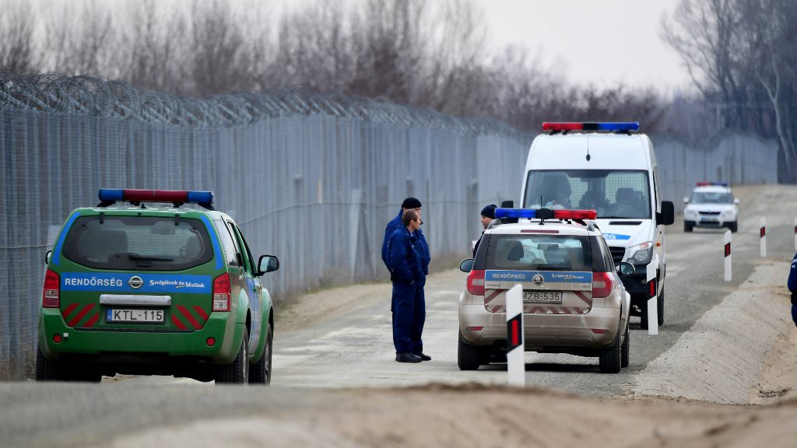

### ASYLUM CHANGES in Hungary: Update in English, Farsi, Arabic, French\!
#### **All asylum seekers entering Hungary legally through the Transit Zone will be detained** in a container camp at the Hungarian border with Serbia\. This includes families, unaccompanied minors above the age of 14, single women and men\. More languages below\.

Please consider the following changes carefully, when planning to enter Hungary: The asylum law in Hungary will change in March 2017\. **All asylum seekers entering Hungary legally through the Transit Zone will be detained** in a container camp at the Hungarian border with Serbia\. This includes families, unaccompanied minors above the age of 14, single women and men\. Unaccompanied children under the age of 14 will be brought to an open facility in a different part of the country\. **Detention will last for the whole duration of the asylum procedure\.** In practice, the asylum procedure in Hungary lasts 4 to 9 months\. There will be no legal way to oppose detention and there will be no option for bail out \(bail out = paying money to go out\) \.

It is possible to leave the Transit Zone towards the Serbian side of the fence, but that means that your asylum application will be stopped and you cannot enter again \(only when you register and wait again for entry to the Transit Zone, but then your chances for a positive decision are even smaller\) \.

If you decide that you still want to enter Hungary, think about the following things: Before you go to the border or enter the Transit Zone, inform your family and friends that you go there\. Inside the Transit Zone you will most often not have internet access and no access to phone credit\. When coming to the border, **make pictures of all papers and what happened to you and save them online** , in an email account or a cloud, so that your pictures are not lost if your phone gets taken away\! Pictures can be important to prove your story\. Write the most important phone number of a friend or family member to your skin so that in case of loosing your phone you can still contact somebody later on\.

**Asylum application process:**

If you want to apply for asylum in Hungary, you need to **prove that Serbia is not a safe country for you** \. If you cannot prove that Serbia is not a safe country to ask for asylum, your application will be rejected\. You can prove that Serbia is not a safe country by showing that the state is not able to uphold basic human rights\. The following are reasons, why Serbia is not a safe country for refugees and asylum seekers\. Serbia is not safe for you if…

…Serbia does not allow you to register an asylum application and enter a camp\.

…Serbia does not provide you with basic needs of shelter and food\.

…you do not get access to basic health care\.

… if you are forced to sleep on the street without shelter, food and basic health care, which can expose you to further threats of sexual, racist or other violent assault\.

…Serbian police is mistreating you\.

…Serbian authorities are overwhelmed and do not have the capacity to care for all asylum seekers according to international human rights standards\.

…Serbia does not have enough facilities and resources to uphold international human rights standards\.

**In the words of international human rights this is called inhuman and degrading treatment, which proves that Serbia is not a safe country\.**

When you apply for asylum in the Transit Zone, you are represented by a state lawyer for free\. But you can also **ask for an independent lawyer from the Hungarian Helsinki Committee** for free\. Her name is Dr\. Timea Kovacs\. You can **write an email to her address: [drtimeak@gmail\.com](mailto:drtimeak@gmail.com)** \. Or you can **tell a person from UNHCR that you want help from a lawyer from the Hungarian Helsinki Committee** , they will put your name on a list and forward it to Timea Kovacs\.

Interviews and documents should be translated to a language that you can fluently understand\. If you cannot read, all documents should be read to you in a language that you can understand\.

**Push back from Hungary:**

According to the new law every person irregularly entering and staying in Hungary \(no visa, no residence permit\) — this applies to the entire Hungarian territory — will be brought back to Serbia through the fence, with no possibility to apply for asylum\. The only option to apply for asylum is through the Transit Zones\.

**Inadmissibility:**

Inadmissibility means that Serbia or your home country is considered a safe country, which means that you are not allowed to apply for asylum in Hungary at all\. In this case, you have **only 3 days \(calendar days\) to appeal** against the decision\. Make sure that in your appeal you mention all the reasons why Serbia is not a safe country\. If your appeal fails, you will be pushed back to Serbia without consent of the Serbian authorities\.

**Negative asylum decision:**

If at the end of the asylum process your application is rejected \(=negative decision\), you have **only 8 days \(calendar days\) to appeal** against the decision\. If your appeal fails, you will be pushed back to Serbia without consent of the Serbian authorities\. If you do not agree to go back to Serbia, you will be taken to an immigration jail to be deported to your home country\.

Hungarian authorities will try to make you pay for your stay in the Transit Zone, if you are being rejected and sent back to Serbia\. **Bring only little amounts of money for small items, food and phone\-credit with you, so that large amounts of money cannot be taken from you\.**

If the Hungarian asylum authorities see that you are not cooperating with them, they can decide to stop your asylum procedure and push you back to Serbia\. You cannot appeal this decision\!

**Positive asylum decision:**

If you get a positive asylum status, you will be able to stay within Hungary\. And you can move within the Schengen Zone \(European Union\) for up to 90 days like EU citizens\.

**Fingerprints:**

Fingerprints from Serbia are not a problem in Hungary, which is part of the European Union\. If you have been fingerprinted in Greece, Bulgaria, Italy or Spain, Hungary will try to deport you to these countries\. Only if you can prove that these countries are not safe through an appeal there is a chance that you will not be deported\.

**Return to country of origin:**

Also if you want to go back to your home country and withdraw the asylum application you will be placed into immigration detention until the deportation is done \(=prison; can last up to one year\) \.
### **خبرهای جدید در مورد قوانین پناهندگی در مجارستان**
#### **مارچ ۲۰۱۷**

پیش از عبور از مرز مجارستان اطلاعات پیش رو را به دقت در نظر بگیرید: قوانین پناهندگی در مجارستان در ماه مارچ تغییر خواهند کرد\. طبق این قوانین **همه ی پناهجویانی** که به طور **قانونی** و از طریق **مناطق عبور** \(ترانزیت\) وارد مجارستان میشوند **بلااستثناء دستگیر و به کمپهای صحرایی در مرز مجارستان و صربستان منتقل میشوند** \. توجه داشته باشید که حتی خانواده ها، نوجوانان بالای ۱۴ سال، زنان و مردان مجرد به این کمپها منتقل میشوند\. کودکان زیر ۱۴ سال اما به کمپ های باز در شهرهای دیگر منتقل میشوند\. **در طول مدت پروسه پناهندگی شما در این کمپ ها زندانی خواهید بود\.** توجه داشته باشید که طول مدت پروسه پناهندگی در مجارستان بین ۴ تا ۹ ماه است\. همچنین به طور قانونی هیچ ارگان و نهادی قادر نخواهد بود برای شما وثیقه بگذارد و یا شما را از زندان خارج کند\.

شما میتوانید از درب رو به صربستان از این زندان خارج شوید، اما خروج بدین معناست که تقاضای پناهندگی شما پس گرفته میشود و دیگر اجازه ی بازگشت به زندان را ندارید \(مگر اینکه مجددا در صف مناطق عبور منتظر بایستید و پروسه پناهندگی را از نو آغاز کنید که در این صورت شانس شما برای گرفتن پناهندگی به شدت کمتر خواهد شد\) \.

اگر با تمام این تفاسیر تصمیم دارید که در مجارستان تقاضای پناهندگی دهید موارد زیر را در نظر بگیرید: پیش از ورود به مناطق عبور و پیش از ورود به خاک مجارستان به خانواده و دوستان خود خبر دهید\. توجه داشته باشید که در مناطق عبور و در زندان دسترسی شما به تلفن و اینترنت کم خواهد بود\. پیش از ورود به مجارستان از اطلاعات مربوط به دلایل پناهندگی خود عکس بگیرید و عکس ها را در ایمیل و یا در حافظه های مجازی اینترنتی قرار دهید چرا که موبایل و وسایل شخصی شما از شما گرفته میشود\. داشتن مدرک برای توضیح دلایل پناهندگی مهم است\. همچنین شماره تلفن هایی که برایتان است مهم را روی پوست خود بنویسید\.

**پروسه مهاجرت:**

پیش از اینکه درباره ی علل خروج خود از کشورتان صحبت کنید، شما باید اثبات کنید که صربستان کشور ناامنی برای شماست\. چنانچه موفق به ارائه مدارک کافی برای اثبات ناامن بودن صربستان نشدید درخواست پناهندگی شما رد میشود\. یکی از راههای نشان دادن اینکه صربستان برای شما امن نیست، گفتن این است که صربستان قادر و آماده کمک به پناهندگان نیست و حقوق اولیه انسانی شما در آن نادیده گرفته میشود\. از دلایل دیگر میتوان به موارد زیر اشاره کرد:
- صربستان درخواست پناهندگی کسی را نمی پذیرد و کسی را در کمپ راه نمیدهد
- صربستان نیازهای اولیه همچون جای خواب و غذا را برآورده نمیکند
- صربستان خدمات درمانی ارائه نمیدهد
- نداشتن جای خواب، غذا و خدمات درمانی به معنای بی خانمان شدن و مورد حملات نژادی و سوء استفاده های جنسی قرار گرفتن است
- پلیس صربستان رفتار نژادپرستانه دارد
- تعداد پناهندگان در صربستان بسیار زیاد است و دولت در صربستان توانایی کمک کردن به پناهندگان را ندارد
- صربستان دارای کمپ و یا امکانات کافی برای برآورده کردن استاندارهای جهانی حقوق بشر نیست

**با توجه به قوانین جهانی حقوق بشر، محیط صربستان برای پناهجویان غیر انسانی و ناسالم است و از اینرو صربستان کشور امنی برای شما نیست\.**

زمانی که در مناطق عبور درخواست پناهندگی میدهید، وکیلی دولتی به طور رایگان به شما داده میشود\. اما شما میتوانید از اداره ی غیر دولتی **هانگرین هلسینکی کامیتی \(Hungarian Helsinki Committee\)** نیز تقاض وکیل کنید\. وکلای این اداره به مراتب بهتر و کارکشته تر هستند\. برای درخواست وکیل از این اداره به Dr\. Timea Kovacs ایمیل بزنید \( [**drtimeak@gmail\.com**](mailto:drtimeak@gmail.com) \) و یا از یکی از کارکنان **کمیساریای عالی حقوق بشر** \(یو ان اچ سی آر\) تقاضا کنید که با **هانگرین هلسینکی کامیتی** تماس بگیرند\.

مصاحبه و کاغذهایی که به شما داده میشود باید برای شما ترجمه شود\. اگر این کاغذها ترجمه نشده بود باید برای شما خوانده شود\.

**پس فرستادن:**

در صورت ورود غیر قانونی به خاک مجارستان \(بدون ویزا و یا کارت اقامت\) شما به صربستان پس فرستاده خواهید شد\. شما تنها میتوانید از طریق مناطق عبور تقاضای پناهندگی کنید\.

**عدم پذیرش درخواست:**

عدم پذیرش درخواست پناهندگی بدین معناست که مجارستان، کشور صربستان و یا کشوری که از آن فرار کرده اید را امن بشمارد\. در این صورت شما اجازه ی درخواست پناهندگی در مجارستان را نخواهید داشت\. شما تنها **۳ روز وقت خواهید داشت** که نسبت به این تصمیم اعتراض کنید\. توجه داشته باشید که در زمان اعتراض دلایل ناامن بودن صربستان را ذکر کنید\. اگر تقاضای مجدد شما نیز رد شد، شما را به صربستان پس خواهند فرستاد\.

**جواب منفی:**

اگر در پایان پروسه پناهندگی به شما جواب منفی داده شد، شما **۸ روز وقت دارید** که نسبت به این تصمیم اعتراض کنید\. اگر تقاضای مجدد شما نیز جواب منفی گرفت شما را به صربستان پس خواهند فرستاد\. اگر از رفتن به صربستان خودداری کنید، مجارستان شما را به زندان موقت منتقل خواهد کرد تا به کشورتان دیپورت شوید\.

**از آوردن پول به داخل مناطق عبور و یا زندان خودداری کنید\.** دولت مجارستان بابت اقامت شما در زندان از شما پول کم خواهد کرد\! از آوردن وسایل قیمتی خودداری کنید\.

**جواب مثبت:**

در صورت اخذ جواب مثبت شما میتوانید در مجارستان ساکن شوید\. شما همچنین میتوانید مانند شهروندان اروپایی در منطقه شنگن سفر کنید\.

**انگشت نگاری:**

اگر از شما در یونان، بلغارستان، ایتالیا و اسپانیا انگشت نگاری شده باشد، مجارستان سعی میکند شما را به این کشورها پس بفرستد\. شما تنها از طریق اثبات اینکه این کشورها برای شما امن نیستند میتوانید از پس فرستاده شدن جلوگیری کنید\.

**بازگشت به کشور زادگاه:**

اگر تصمیم گیرفتید که از خیر پناهندگی بگذرید و به کشورتان برگردید، دولت مجارستان شما را تا زمان پس فرستادن به زندان مهاجرین منتقل خواهد کرد \(این مدت زمان میتواند حدود ۱ سال به طول بیانجامد\)
### **\! \! \! هام وجديد — — معلومات عن إجراءات اللجوء في المجر — — هام وجديد \! \! \!**

**مارس 2017**

يرجى النظر في التغييرات التالية بعناية عند التخطيط لدخول المجر: سيتغير قانون اللجوء في المجر في مارس 2017\. **حيث** **سوف يتم احتجاز طالبي اللجوء الذين يدخلون المجر قانونيا من خلال منطقة العبور \(Transit Zone\) \.** سوف يتم احتجازهم في مخيم تجميعي \(container camp\) على الحدود المجرية مع صربيا\. وهذا يشمل الأُسر، والأفراد من الرجال والنساء، والقصّر فوق 14 سنة غير المصحوبين بذويهم\. أما الأطفال الذين تقل أعمارهم عن 14 سنة والغيرمصحوبين بذويهم فسيتم نقلهم إلى مرفق مفتوح في جزء مختلف من البلاد\. سوف تستمر فترة الاعتقال حتى تنتهي إجراءات اللجوء بالكامل\. عمليا، تستغرق إجراءات اللجوء إلى المجر من 4 إلى 9 أشهر\. لن يكون هناك طريقة قانونية لمعارضة الاعتقال ولن يكون هناك أي خيار لدفع المال من أجل الخروج\.

من الممكن أن تغادر منطقة العبور نحو الجانب الصربي من السور، ولكن هذا يعني أنه سيتم إيقاف طلب اللجوء الخاص بك ولن يمكنك الدخول مرة أخرى \(إلا إذا قمت بالتسجيل والانتظار مرة أخرى للدخول إلى منطقة العبور، ولكن في هذه الحالة ستضعُف فرصة قبول طلبك\) \.

إذا كنت لا تزال تريد دخول المجر، فكر في الأمور التالية: قبل أن تذهب إلى الحدود أو تدخل منطقة العبور، قم بإبلاغ العائلة والأصدقاء أنك ذاهب إلى هناك\. داخل منطقة العبور، لن يمكنك في الغالب الاتصال بالإنترنت أو شراء مكالمات هاتفية\. عندما تأتي إلى الحدود، قم بتصوير جميع أوراقك وما حدث لك واحفظ الصور على الإنترنت، في حساب بريد إلكتروني أو حساب تخزين ملفات، بحيث لا تضيع الصور الخاصة بك إذا أخذوا منك هاتفك\! قد تكون الصور هامة لإثبات صحة قصتك\. اكتب على جسدك رقم هاتف أهم صديق أو قريب بحيث تستطيع الاتصال به في وقت لاحق في حالة فقدان هاتفك\.

**عملية طلب اللجوء:**

إذا كنت ترغب في التقدم بطلب للجوء إلى المجر، ستحتاج إلى إثبات أن صربيا ليست دولة آمنة بالنسبة لك\. إذا لم تتمكن من إثبات أن صربيا ليست بلدا آمنا لأغراض اللجوء، سيتم رفض طلبك\. يمكنك إثبات أن صربيا ليست بلدا آمنا من خلال إظهار أن الدولة غير قادرة على احترام حقوق الإنسان الأساسية\. وفيما يلي بعض الأسباب لماذا صربيا ليست بلدا آمنا للاجئين وطالبي اللجوء\. صربيا ليست آمنة بالنسبة لك إذا …

… لم تسمح لك بتسجيل طلب اللجوء والدخول إلى مخيم\.

… لم توفر لك الاحتياجات الأساسية من المأوى والغذاء\.

… لم يمكنك الوصول للرعاية الصحية الأساسية\.

… إذا أجبروك على النوم في الشارع دون مأوى أو غذاء أو رعاية صحية أساسية، وهو ما يمكن أن يعرضك لمزيد من التهديد بالاعتداء العنيف أو الجنسي أو العنصري أو غيرهم\.

… إذا أساءت الشرطة الصربية معاملتك\.

… إذا كانت السلطات الصربية مغرقة في العمل وليس لديها القدرة على رعاية جميع طالبي اللجوء وفقا للمعايير الدولية لحقوق الإنسان\.

… إذا لم يكن لدى صربيا مرافق وموارد كافية لدعم المعايير الدولية لحقوق الإنسان\.

**هذا يسمى، على حد تعبير منظمات حقوق الإنسان الدولية، معاملة مهينة ولاإنسانية، وهو ما يثبت أن صربيا ليست بلدا آمنا\.**

عند التقدم بطلب للحصول على حق اللجوء في منطقة العبور، يقوم محامي الدولة بتمثيلك مجانا\. ولكن يمكنك **أيضا** أن تطلب محامية مستقلة ومجانة من لجنة هلسنكي المجرية \(Hungarian Helsinki Committee\) \.اسمها هو الدكتورة تيميا كوفاكس\. يمكنك إرسال بريد إلكتروني إلى عنوانها: drtimeak@gmail\.com\. أو يمكنك أن **تقول لأحد أعضاء مفوضية الأمم المتحدة السامية لشؤون اللاجئين أنك تريد مساعدة محام من لجنة هلسنكي المجرية،** وسوف يضعوا اسمك على قائمة ويحيلوها إلى تيميا كوفاكس\.

يجب أن تُترجم المقابلات والوثائق إلى اللغة التي يمكنك أن تفهمها بطلاقة\. إذا كنت لا تستطيع القراءة، يجب قراءة جميع الوثائق لك بلغة تفهمها\.

**الإبعاد من المجر:**

وفقا للقانون الجديد، كل شخص يدخل ويبقى في المجر بشكل غير منتظم \(من غير تأشيرة، ومن غير تصريح الإقامة\) — وهذا ينطبق على الأراضي المجرية بالكامل — سوف يتم إبعاده إلى صربيا خارج السور، وسيتم رفض طلباته للجوء في المستقبل\. الطريقة الوحيدة لطلب اللجوء هي من خلال منطقة العبور\.

**عدم قبول طلب اللجوء:**

عدم قبول طلبك يعني أن صربيا أو بلدك بلدا آمنا، وهو ما يعني أنه غير مسموح لك بتقديم طلب للحصول على حق اللجوء في المجر على الإطلاق\. في هذه الحالة، يكون لديك **3 أيام فقط \(من الأيام العادية\) لاستئناف** القرار\. تأكد أن تذكر في طلب الاستئناف جميع الأسباب التي لا تُعتبر صربيا بسببها بلدا آمنا\. إذا فشل الاستئناف الخاص بك، سيتم إبعادك إلى صربيا دون موافقة السلطات الصربية\.

**القرار السلبي في طلب اللجوء:**

إذا تم رفض طلبك للجوء \(= قرار سلبي\) في نهاية العملية، سيكون لديك 8 أيام فقط \(من الأيام العادية\) لاستئناف القرار\.إذا فشل الاستئناف الخاص بك، سيتم إبعادك إلى صربيا دون موافقة السلطات الصربية\. إذا كنت لا توافق على العودة الى صربيا، سوف يتم نقلك إلى سجن الهجرة تمهيدا لترحيلك إلى بلدك\.

إذا تم رفض طلبك وتقرر إبعادك إلى صربيا، ستحاول السلطات المجرية دفعك إلى أن تدفع مقابل إقامتك في منطقة العبور\. **احمل معك فقط كميات صغيرة من المال من أجل شراء أشياء صغيرة، مثل الغذاء ومكالمات الهاتف، وذلك حتى لا يمكن مصادرة كميات كبيرة من أموالك\.**

إذا رأت سلطات اللجوء المجرية أنك غير متعاون معهم، فلها أن أن تقرر وقف إجراءات لجوءك وإبعادك إلى صربيا\. لا يمكنك استئناف هذا القرار\!

**القرار الإيجابي في طلب اللجوء:**

إذا قررت السلطات قرارا إيجابيا في طلبك، ستكون قادرا على البقاء في المجر\. ويمكنك حينئذ التحرك داخل منطقة شنغن \(الاتحاد الأوروبي\) لمدة تصل إلى 90 يوما مثل مواطني الاتحاد الأوروبي\.

**بصمات الأصابع:**

إذا أخذت صربيا بصماتك، فلن يشكل ذلك مشكلة في المجر، فالمجر جزء من الاتحاد الأوروبي\. لكن إذا تم أخذ بصماتك في اليونان أو بلغاريا أو إيطاليا أو إسبانيا، فستحاول المجر ترحيلك إلى هذه البلدان\. لكن لن يتم ترحيلك إلى هذه البلدان إذا استطعت، في استئنافك للقرار، إثبات أن هذه الدول غير آمنة\.

**العودة إلى بلد المنشأ:**

إذا كنت ترغب في العودة إلى وطنك وسحب طلب اللجوء، فسيتم وضعك في مركز يحتجز المهاجرين حتى يتم ترحيلهم \(= وهو سجن، قد تصل مدته إلى سنة كاملة\) \.
### **NOUVEAU — — Information sur l’Asile en Hongrie**
#### **Mars 2017**

Si vous envisagez d’entrer en Hongrie, prenez en considération les modifications suivantes : La loi sur l’asile en Hongrie sera modifiée en mars 2017\. **Tous les demandeurs d’asile entrant en Hongrie légalement, en passant par une zone de transit, seront détenus** dans un camp de conteneurs à la frontière hongroise avec la Serbie\. Ceci concerne les familles, les mineurs non accompagnés âgés de plus de 14 ans, ainsi que les hommes et femmes célibataires\. Les enfants non accompagnés de moins de 14 ans seront amenés dans un établissement ouvert dans une autre région du pays\. **La détention dure toute la durée de la procédure d’asile\.** Dans la pratique, la procédure d’asile en Hongrie dure entre 4 et 9 mois\. Il n’existera aucun moyen légal de s’opposer à la détention et il n’y aura pas de possibilité de liberté sous caution \(liberté sous caution = payer de l’argent pour sortir\) \.

Il est possible de quitter la zone de transit par le côté serbe de la barrière, mais cela signifie que votre demande d’asile sera interrompue et que vous ne pourrez plus rentrer en Hongrie \(à moins que vous ne vous inscriviez et attendiez de nouveau afin d’entrer dans la zone de transit, mais vos chances d’obtenir une décision positive seront encore plus réduites\) \.

Si vous décidez tout de même d’entrer en Hongrie, prenez en considération les choses suivantes : Informez votre famille et vos amis de votre décision d’aller à la frontière ou d’entrer dans la zone de transit\. Une fois à l’intérieur de la zone de transit, vous n’aurez généralement pas accès à Internet ni la possibilité de recharger votre téléphone\. Lorsque vous arrivez à la frontière, **prenez en photos tous vos papiers ainsi que toutes les preuves de ce qui vous est arrivé et enregistrez\-les en ligne** , dans votre messagerie ou dans un cloud, afin que vos photos ne soient pas perdues si votre téléphone est confisqué \! Ces photos peuvent être importantes pour prouver votre histoire\. Ecrivez sur votre peau le numéro de téléphone d’un ami ou d’un membre de votre famille afin de pouvoir les contacter en cas de perte de votre téléphone\.

**Procédure de demande d’asile :**

Si vous voulez faire une demande d’asile en Hongrie, vous devez **prouver que la Serbie n’est pas un pays sûr pour vous\.** Si vous ne pouvez pas prouver que la Serbie n’est pas un pays sûr pour demander l’asile, votre demande sera rejetée\. Vous pouvez prouver que la Serbie n’est pas un pays sûr en montrant que l’Etat n’est pas en mesure de défendre les droits humains fondamentaux\. Les raisons suivantes expliquent pourquoi la Serbie n’est pas un pays sûr pour les réfugiés et les demandeurs d’asile\. La Serbie n’est pas sûre pour vous si …

… La Serbie ne vous permet pas d’enregistrer une demande d’asile et d’être logé dans un camp\.

… La Serbie ne vous subvient pas à vos besoins essentiels en matière de logement et de nourriture\.

… Vous n’avez pas accès aux soins de santé de base\.

… Si vous êtes forcé de dormir dans la rue sans abri, sans nourriture et sans accès aux soins de santé de base, ce qui peut vous exposer à des menaces d’agression sexuelle, raciste ou d’autres formes de violence\.

… La police serbe vous maltraite\.

… Les autorités serbes sont débordées et n’ont pas la capacité de prendre soin de tous les demandeurs d’asile conformément aux normes internationales relatives aux droits humains\.

… La Serbie n’a pas les moyens et les ressources nécessaires afin de respecter les normes internationales relatives aux droits humains\.

**Selon les normes internationales sur les droits de la personne, ce traitement est considéré comme inhumain et dégradant, ce qui prouve que la Serbie n’est pas un pays sûr\.**

Lorsque vous demandez l’asile dans la zone de transit, vous êtes représenté gratuitement par un avocat fourni par l’Etat\. Mais vous pouvez également **demander gratuitement un avocat indépendant du Comité Helsinki Hongrois** \. Son nom est Dr\. Timea Kovacs\. Vous pouvez lui **écrire un email à cette adresse : drtimeak@gmail\.com** \. Ou bien, vous pouvez **expliquer à une personne du Haut Commissariat aux Réfugiés \(UNHCR\) que vous voulez l’aide d’un avocat du Comité Helsinki Hongrois** \. Ils ajouteront alors votre nom à une liste et l’enverront à Timea Kovacs\.

Les entrevues et les documents doivent être traduits dans une langue que vous pouvez facilement comprendre\. Si vous ne pouvez pas lire, tous les documents doivent vous être lus dans une langue que vous pouvez comprendre\.

**Refoulements depuis la Hongrie :**

Selon la nouvelle loi, toute personne entrant et séjournant de manière irrégulière en Hongrie \(sans visa ni permis de séjour\) sera renvoyée en Serbie par la barrière, sans possibilité de demander l’asile\. Cela s’applique à l’ensemble du territoire hongrois\. La seule option pour demander l’asile est d’entrer par les zones de transit\.

**Inadmissibilité :**

L’inadmissibilité signifie que la Serbie ou votre pays d’origine est considéré comme un pays sûr, ce qui signifie que vous n’êtes pas autorisé à demander l’asile en Hongrie\. Dans ce cas, **vous n’avez que 3 jours \(ouvrés\) pour faire appel** de la décision\. Assurez\-vous que, dans votre appel, vous mentionnez toutes les raisons pour lesquelles la Serbie n’est pas un pays sûr\. Si votre appel échoue, vous serez renvoyé en Serbie, même sans le consentement des autorités serbes\.

**Décision d’asile négative :**

Si à la fin du processus d’asile votre demande est rejetée \(= décision négative\), **vous n’avez que 8 jours \(ouvrés\) pour faire appel de la décision\.** Si votre appel échoue, vous serez renvoyé en Serbie, même sans le consentement des autorités serbes\. Si vous n’acceptez pas de retourner en Serbie, vous serez amené dans une prison pour immigrants afin d’être expulsé vers votre pays d’origine\.

Si votre demande d’asile est rejetée et que vous êtes renvoyé en Serbie, les autorités hongroises tenteront de vous faire payer pour votre séjour dans la zone de transit\. **Ne prenez avec vous que de petites sommes, de la nourriture et du crédit téléphonique, de telle sorte que d’importantes sommes d’argent ne puissent pas vous être soutirées\.**

Si les autorités hongroises de l’asile considèrent que vous faites preuve d’un manque de coopération, elles peuvent décider d’arrêter votre procédure d’asile et de vous renvoyer en Serbie\. Vous ne pouvez pas faire appel de cette décision \!

**Décision d’asile positive :**

Si vous obtenez une réponse positive à votre demande d’asile, vous serez en mesure de rester en Hongrie\. Vous pourrez vous déplacer dans la zone Schengen \(Union européenne\) pour un maximum de 90 jours, tout comme les citoyens de l’UE\.

**Empreintes digitales :**

Les empreintes digitales prélevées en Serbie ne posent pas de problème en Hongrie, qui fait partie de l’Union européenne\. Si vos empreintes digitales ont été prélevées en Grèce, en Bulgarie, en Italie ou en Espagne, la Hongrie tentera de vous expulser vers ces pays\. Votre seule chance de ne pas être expulsé consiste à faire appel et prouver que ces pays ne sont pas sûrs\.

**Retour dans le pays d’origine :**

Par ailleurs, si vous souhaitez retirer votre demande d’asile et retourner dans votre pays d’origine, vous serez placé dans un centre de rétention jusqu’à l’expulsion \(= en prison, ce qui peut prendre jusqu’à un an\) \.

_Converted [Medium Post](https://areyousyrious.medium.com/asylum-changes-in-hungary-update-in-english-farsi-arabic-french-4df3aee05ffe) by [ZMediumToMarkdown](https://github.com/ZhgChgLi/ZMediumToMarkdown)._
