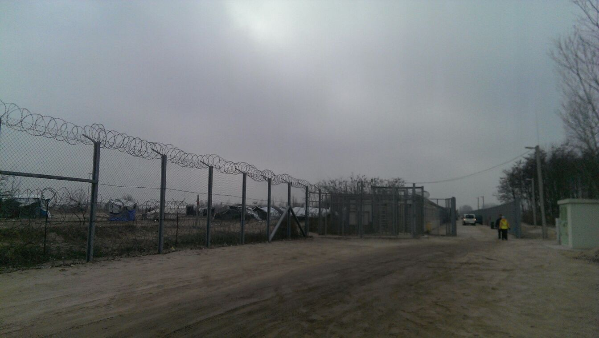

### AYS DAILY NEWS DIGEST 14/03/17: Volunteers jump in as authorities fail to do their job

_People evicted from squat moved to other squats / New arrivals in Nea Kavala / ECHR slams Hungary — what’s the consequence? / Several reports of inhuman deportations to Afghanistan / UK Home Office releases new guidlines for Dubs Scheme / MSF reports on health issues of people after the Turkey deal_

 \.](assets/3ee2f9bdf5da/1*6nkbi8rivadImyWwKZd__g.jpeg)

After the forced eviction, riot police throw all the personal belonging of refugees our on the street\. Refugees risk their lives to enter EU to escape war and terror, with the hope for better days\. Photo by [Marios Lolos\. Art Against](https://www.facebook.com/artagainstproject/posts/1309427632440001) \.
### Feature

Following the raids on squats and the evictions, some 60 people have been moved to other squats, after spending hours in police station and rejecting the offer to be transferred to one of the camps nearby Athens\. Many experienced life in camps before, and they choose no to go back but rather to rely on alternative accommodation, mostly in squats\. City Plaza, as well as other squats, took them in, and volunteers and activists found emergency shelter for everyone else\.

Those with no papers were taken to a detention centre Minidi to process their registration\.

People who lived in squat came back to pick up there belongings day after the raid, but were prevented by the police\. Last night they could not take almost anything, only to found their stuff on the street day after\. People tried to pick up stuff from the pile, some managed to find some things, some not, but police decided to stop that at certain moment and to throw all the stuff in garbage bins that were taken away\. All the stuff are personal, including documents, and for many people this is another huge lost\.

](assets/3ee2f9bdf5da/1*UDAMl8MbsNS-TSgDNtyzXw.jpeg)

People returning to the raided squats\. Photo by Marios Lolos\. [Art Against](https://www.facebook.com/artagainstproject/)

The Acharnon squat, Alkiviadou Street, was raided after the Red Cross, that own the place, claimed it\. This is, unfortunately, another example among many of authorities and large INGOs failing to treat people in need appropriately\. Police raided the squat and detained some of the residents, including vulnerable ones\.

](assets/3ee2f9bdf5da/1*6VZn3s0Ahp6H95jbdm9uNA.jpeg)

People trying to find their belongins\. Foto: [Khora](https://www.facebook.com/KhoraAthens/photos/a.534472740058672.1073741829.531581440347802/674494056056539/?type=3&theater)

Once again, AYS strongly condems the raids and how authorities treated the residents\. There was no intention to find any solution to shelter the people\. They did not take care of their well being\. Neither did the Red Cross, which wanted to replace the residents with unaccompanied minors\. The only reason to replace one vulnerable group with another is indeed for economical reasons\.

We stand in solidarity with the victims of this raid and the citizens who stood up yesterday for human rights\.
### Greece

Some of the people from the squat could be taken to the new camp Thiva, north of the Athens, inagurated by the migration Minister Yiannis Mouzalas on Tuesday\. The capacity of this place is 3000, but for now will accomodated around 700 people, mostly from Elliniko camp, the old airport and stadium\. IOM representative came with the minister to open the camp\. The minister said that the center is offering “dignified” conditions to people, which is hard to beilive\.

The camp is former spinning mill and some 2 million euros were used to renovate the place, money that could be used to pay humane accomodation to people who spent the wintter under tents and coridors or abandoned stadium\. The center now has 65 prefabricated buildings that can host eight people each, with more structures to go up soon\. The camp has common bathrooms and classrooms, and Doctors of the World will set up a surgery\.

People from Elliniko are waiting to be transfered for months, protesting and demanding their right\. Conditions they are living are scary, which is comfired by the UNHCR report for the period February 27th \-March 5th\. The UNHCR concludes they are “concerned about an increase in sexual and gender\-based violence \(SGBV\) cases in the Elliniko sites where the security situation has been volatile\. During the reporting week, seven survivors were counselled and assisted by UNHCR and partners\.

Many residents complained of high levels of anxiety, anger, and depression, too\.

Nevertheless, the new camp does not appear on the current list of camp sites of [Greek government](http://mindigital.gr/index.php/%CF%80%CF%81%CE%BF%CF%83%CF%86%CF%85%CE%B3%CE%B9%CE%BA%CF%8C-%CE%B6%CE%AE%CF%84%CE%B7%CE%BC%CE%B1-refugee-crisis/1050-summary-statement-of-refugee-flows-14-03-2017) or the updated [UNHCR camp](https://data2.unhcr.org/en/documents/download/54465) sites list\. The camps still in waiting are: Cherso, Serres, Pieria \(Petra\), Kavala, Drama, Sindos, Vagiohori, Katsikas, Tsepelovo, Giannitsa, Larissa, Oreokastro, Kalohori, Sindos\-Frakapor\. Some of these places were evacuated over the last couple of months, but to some people from the islans are being sent\.

Following a drop of several hundred people, who were transferred to houses and hotel rooms, the Nea Kavala camp in Polykastro, Northern Greece, saw an increase of the numbers again\. While the first group left fast, the We Are Here Community Center prepared a welcome meeting for the new arrivals and offered activites while people registered with Red Cross and got basic equipment\. Volunteers keep their activities in the camp running and offer the residents some entertainment\.

](assets/3ee2f9bdf5da/1*i7jlD1a6Xpgaeo_oCxSYRA.jpeg)

Volunteers entertain kids in Nea Kavala\. Credits: [We Are Here Community Center](https://www.facebook.com/WeAreHereCentre/posts/1964718640416398)

[Spirou Trikoupi 17](https://www.facebook.com/spiroutrikoupi17/?fref=nf) squat is in need of the following items\. If you can support them, please get in touch with them on Facebook:
- baby powder milk n\.1, n\.2 and n\.3
- diapers \(sizes 3, 5\)
- milk \(powdered and liquid\)
- black tea
- nescafe/instant coffee
- olive oil
- vegetable oil
- sugar

#### Islands

On Chios 19 people were registered until morning\.

In a new [report](https://www.msf.org.uk/article/eu-turkey-deal-migrants-and-asylum-seekers-are-paying-price-their-health) MSF pointens on how the health of protection seekers in Greece and the Balkans is being impacted by the Turkey deal\.

_“They are losing any hope that they will find a safer, better future than the one they fled,_ ” said Jayne Grimes, MSF Psychologist on Samos\. During the last months there have been increansingly reports of Post Traumatic Stress Disorder, depressions, hunger strikes, clashes and even suicide attemps, what MSF confirms in its report\. During the cold winter at least five people in Greece lost their lives because of the poor conditions and authorities failing to provide adequate shelter\.

A Drop in the Ocean wants to create some space in its warehouse to receive a new, needed delivery\. If you are willing to take some of their overstock, please contact their manager Sarah Unsworth \(phone: 0030 694 650 9554, E\-Mail sarah\.c\.unsworth@gmail\.com\) \. They have:

Babies and Childrenswear:
\-Childrens winter hats \(500\)
\-Childrens\` socks \(400\)
\-Babies One piece \(oneises/bodies\) 0–2 months \(400\)
\-Babies One piece \(oneises/bodies\) 3–6 months \(400\)
\-Babies One piece \(oneises/bodies\) 7–12 months \(200\)
\-Babies One piece \(oneises/bodies\) 13–18 months \(100\)
\-Baby Carriers \(120\)
\-Mixed baby clothes 0–2 years \(sweaters, short sleeved tops, long sleeved tops, leggings, trousers, dresses\) \(2000\)
\-Mixed childrens clothes 2–6 years sweaters, short sleeved tops, long sleeved tops, leggings, trousers, dresses
Female:
\-Female jumpers/sweaters Small \(150\)
\-Female jumpers/sweaters Medium \(200\)
\-Female jumpers/sweaters Large/XL \(100\)
Male:
\-Long sleeved top Medium \(300\)
\-XL Sweatpants \(50\)
\-Button up shirts L/XL \(100\)
Unisex Adult:
\-Adult Rain boots — sizes 39–44 \(250\)
\-Adults winter hats \(400\)
Non\-Food:
\- Nappies/Diapers 5 packs of every size
\- Sleeping bags \(10\)
\- Blankets \(50\)

If you are able to make use of some of these items please can you let her know the following:
\-Contact name, phone number and shipping address for your organisation
\-How many items you can make use of
\-Preferred shipping company
\-If you would like them prepared in any way for shipping/sorting\.

[Volunteers on Crete report](https://www.facebook.com/groups/mazaraki/?multi_permalinks=602780506579745&notif_t=group_activity&notif_id=1489410095406754) about hard conditions who land on the island\. They barely receive medical attention and hardly can apply for asylum\. The regional asylum office has not opened yet even though it was supposed to in December 2016\.
### Hungary

The European Court of Human Rights \(ECHR\) today made in important ruling against the Hungarian government\. In the case of two Bangladeshians they decided, that it was unlawful to send them back a transit center at the Serbian border in September 2015 and detained there for 23 days\. The judges see a risk, that the people will be returned to another country from there, where they will be detained or face inhumane treatment\. Hungary was sentenced to pay the two victims a compensation of 10\.000 Euros and 8, for costs and expenses each\. The full text can be found [here](http://hudoc.echr.coe.int/eng-press#%20) \.

Transit zone between Serbia and Hungary\. Credits: Signal of Solidarity

It is assumed, that this ruling also indicates, that the recently decided border restrictions are unlawful, too\. Therefore it could not take into effect\. According to AYS [figures](https://docs.google.com/spreadsheets/d/1xWVKJMQ3z90m8CsZMNFC7TAyjRgA3puRHFbwZ8YIjUk/edit#gid=216833932) , only in 2017 more than 300 people have been intercepted by Hungarian police and assumably sent back unlawful to the transit zones\.

People in prison BMH MOBK 5600 BEKESCSABA UT 10 KETEGYHAZI, continue their strike\. As we reported earlier, refugees are inprisoned there for six months ago and do not know their destiny\. Their representative send us message saying that most of the refugees inside are in a very dire conditions, need medical attention, and several tried to comite suicide over the last couple of weeks\.
### Austria

An 18 year old boy has been deported from Vienna to Afghanistan yesterday\. As volunteers report, he has nowhere to go\. There is an unkown uncle, who lives with eight children on small space and can’t shelter him\. Around 100 people and friends made online statements against the deportation or protested at the airport\. They will open a donation account in order to support him the next days\.

There is an increase of reports of deported Afghans being abandoned after their return\. The offers by IOM and other official organizations don’t match the basic needs of the people like shelter or food\. With a small pocket money they have to try to survive but a still dependent on friendly people on the ground and remote volunteers who provide mental and financial support\. The Afghan authorities do not seem to care about the forced returnees and the organizations which promised the deporting countries to support them fail to do their job\.

That it is possible to stop at least some deportations was shown today in Roissy, France\. Locals distributed flyers at the terminal, asking passengers of the flight to protest against being with the person to be deported in the plane\. As some started protesting, the captain refused to transfer him\. The full story in French can be found [here](https://www.facebook.com/notes/collectif-la-chapelle-debout/la-bataille-de-farhad-%C3%A0-roissy-histoire-dune-petite-victoire/441754639490812?hc_location=ufi) \.

There are protests against deportations and inhuman treatment of protection seekers all over Europe\. Check our [weekly summary](https://medium.com/@AreYouSyrious/this-weeks-solidarity-events-in-europe-20bd2088f697#.ky470v2re) to see, where you can stand up for human rights in your area\.
### Italy

As of today 15\.852 people have arrived in Italy this year, including 2\.230 unaccompanied minors\. Most of the people are from Guinea and Nigeria\.
### Norway

Another assumably unlawful deportation to Afghanistan has been recorded in Norway today\. As [Afghanistan Migrants Advice & Support Org](https://www.facebook.com/Afghanistan-Migrants-Advice-Support-Org-195295217167437/) reports, authorities have sent back an 17 year old asylum seeker who is mentally ill\. Aswell as the others he has nowhere to go in Afghanistan and noone to take care of him\.

](assets/3ee2f9bdf5da/1*Rr398TRKA8R-ADXARoDLnQ.jpeg)

Deportation Update Norway\. Credits: [Afghanistan Migrants Advice & Support Org](https://www.facebook.com/Afghanistan-Migrants-Advice-Support-Org-195295217167437/)
### UK

The Home Office has updated its criteria on the Dubs agreement, [Help Refugees reports](https://www.facebook.com/groups/1652972374920129/permalink/1826586400892058/) \. For the 150 remaining children which should be taken into the UK by the end March it published new guidelines\. They no longer restrict eligibility to children from Sudan and Syria and further will be accepting referrals from the authorities in France, Greece and Italy for eligible children leaving the onus on host countries\. Nevertheless Help Refugees is concerned, how 150 out of the tenthousands of children will be chosen\.
### General

While deported Afghans face a cruel situation after arriving in Kabul, IOM has launched a four\-year, 18 million Euro project with funding from the European Commission’s Directorate\-General for International Cooperation and Development \(DG DEVCO\) to support returnees and host communities across Afghanistan\.

“Our joint collaboration under this project marks a critical and much needed step towards providing longer\-term, sustainable, income\-generating solutions and livelihoods for returnees,” said Laurence Hart, IOM’s Chief of Mission and Special Envoy in Afghanistan, speaking at today’s signing event in Kabul\.

With people being homeless, seen as criminals and foreigners by the native community, injured by terroristic attacks they have fled before, it will be hard to support them in any way to build up a new life in Afghanistan\. AYS is concerned, that this maybe will create a few well\-payed jobs at IOM\. But as the efforts by now are very limited, the project will again not meet the needs of the people\. Further we stress, that deportations to Afghanistan are no solution and no money will create a safe environment for the people\.

_Converted [Medium Post](https://areyousyrious.medium.com/ays-daily-news-digest-14-03-17-volunteers-jump-in-as-authorities-fail-to-protect-people-3ee2f9bdf5da) by [ZMediumToMarkdown](https://github.com/ZhgChgLi/ZMediumToMarkdown)._
