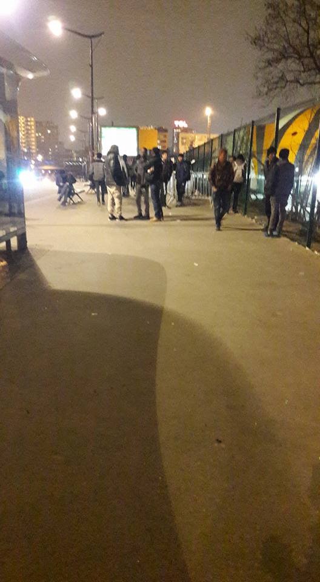

### AYS Daily Digest 15/03/17: After March 15 possible deportations to Greece
#### Pressure builds up on Greece by the member states who didn’t keep side of their part of the bargain \| Turkey having second thoughts about the Deal \| Hungary introduces obligatory detainment for all \| Refugee protests in Italy \| France keeps returning people to danger; Volunteers and help needed in Calais and Paris \| Germany thinking of returning people to Greece, while deporting Afghans to certain danger \| MSF urging all sides in Syria to allow aid to come through

by Anthony Garner
### Feature — Will there be Dublin returns to Greece?

On December 8 2016, the [EC officially](http://europa.eu/rapid/press-release_MEMO-16-4253_en.htm) recommended that, starting on March 15, the European countries \(EU, Norway & Switzerland\) should be able to send asylum seekers who traveled through Greece back to Greece\. Some governments \(Germany, Austria and Belgium\) have said that they plan to implement this and it’s very likely that other countries will follow\. However, they did mention gradual returns, applying the decision primarily to the ones who arrive after this date and not including unaccompanied minors or others that are considered vulnerable at that point\. In general, it is unclear how and if these recommended returns will be put into practice and how \(not to mention — why?\) \.

The often mentioned Dublin III refers to [the agreement](http://eur-lex.europa.eu/LexUriServ/LexUriServ.do?uri=OJ:L:2013:180:0031:0059:EN:PDF) establishing the criteria and mechanisms for determining the Member State responsible for examining an application for international protection\. It places the responsibility of processing asylum seeker claims on the country where the asylum seeker\(s\) first entered\.
Although Dublin III should “guarantee effective access to the procedures for granting international protection and not to compromise the objective of the rapid processing of applications for international protection”, it has so far turned out to be one of the key excuses for deportations, purposely delaying unaccompanied minors’ procedures \(so they could be deported once they turn 18\) and reasons why people in question end up on the illegal side of migration through Europe\.

The recommendation by the EC that countries should introduce Dublin III scheme also to Greece \(that was stopped in 2011\) was made on the premises that the EU countries would fulfill their obligations regarding the relocation scheme\. Only about 9,600 people have so far been relocated from Greece to other EU states\. \(Austria, Hungary, and Poland have so far refused to accept people as a part of the relocation program\. \) Nevertheless, this would not be the first time the EU member states have selectively followed the common decisions\.

Even the EU migration [commissioner does not have a clear answer](https://euobserver.com/migration/137098) as to if, when and how this recommended and announced returns plan will be put into action\. Another option is that he does, but the answer is linked to some of the rather [bizarre statements](http://dailyhellas.com/2017/03/15/eu-to-open-migration-centres-in-africa-because-europe-needs-6-million-migrants/) given about summing up refugees in a specific area\.

[Mobile Info Team](https://www.facebook.com/mobileinfoteam/?fref=nf) will keep following everything regarding the possible changes that will be implemented in the asylum system of the European countries that have announced returns post March 15\. They have summed up several important things to know \(translations available [here](https://www.facebook.com/mobileinfoteam/posts/1929253250636728:0?hc_location=ufi) \):

> 1\. it should not affect the vast majority of people who have already applied for asylum in another European country
 

> 2\. it will not affect people who move from Greece in a legal way, such as relocation or family reunification
 

> 3\. it will not affect vulnerable people in the beginning, including unaccompanied minors
 

> 4\. it will be gradual\. In the beginning, only small numbers of people will be returned
 

> 5\. it will affect people who enter Greece after this date and then travel onwards illegally
 

> 6\. If someone is told they will be returned to Greece, they have the right to appeal that decision\. They should contact a lawyer immediately to get help, as there will be a time limit on doing this 

> Explicitly excluded from such returns will be vulnerable asylum applicants, such as unaccompanied minors\. Applicants who were present in other EU nations before March 15 will “in most cases” still have their claims processed in those nations\. 

A detailed and useful [info sheet](http://legis.mk/news/2289/dublin-iii-returns-to-greece) by [we2eu](http://w2eu.info/) in several languages contains information about the possible scenarios, different reasons/cases of deportation, possibilities a person in such situation has and some practical tips and advices for anyone who is facing potential deportation back to Greece\. Also, listed are countries that have already announced to re\-start returns\.

At this point, people who have been waiting for a year in difficult living conditions in the camps of Greece, are fearing every time a real or fictional decision is spoken about, each time a “crucial date” like this one is mentioned as a possible worsening of their odds in the fight for a peaceful and safe place to continue their lives\. Where should the people who are still fleeing the dangerous areas go after these fixed dates? What can be provided to them in a country that has been lacking capacities to host the people already staying there? Will the EU states be quicker in implementing this action than in respecting the relocation scheme?

With politicians failing to make a change in the areas where people are fleeing from; with countries failing to show solidarity and properly, quickly and fairly relocate the people according to their own agreement; with governments working fiercely to share or transfer responsibilities to another country and with so many different organizations and officials daring to still cover up sometime questionable judgements with higher policies and labels like “vulnerable” etc\., is it possible that only refugees are the ones expected to respect _the deal_ ?
Everyone is vulnerable — most of all, the trust\.
#### TURKEY
### “Re\-evaluating” the Deal

Turkey has partially [suspended](http://orf.at/stories/2383526/) the refugee agreement with the EU\. At present, no refugees are withdrawn from the Greek islands, said the Turkish Foreign Minister Mevlüt Cavusoglu today\. The main reason for this, according to him, is the lack of visa\-free travel for the Turks in the EU, interpreting that as the Union’s not respecting of their side of the deal\. There are a lot of [doubts about these potential “threats”](http://www.keeptalkinggreece.com/2017/03/15/real-or-empty-threat-will-turkey-send-a-new-wave-of-refugees-to-europe/) from the Turkish side\.

According to the latest official statistics, 110 people have been returned to Turkey from the Aegean islands in 2017\.
In spite of the decision for Turkey to “ re\-evaluate” the land\-passage aspects of the EU\- Turkey deal, he also said that Turkey would not reopen its Aegean border\.
#### MEDITERRANEAN

 assisted more than 100 refugees\. [\#TogetherForRescue](https://www.facebook.com/hashtag/togetherforrescue?source=feed_text) ” \(Photo: [SOS MEDITERRANEE](https://www.facebook.com/SOSMEDITERRANEE/?fref=nf) \)](assets/b264c14002c2/1*_RCmGOCFPrR6WW8dsHydRQ.jpeg)

**85 people safe\!** 
“Yesterday we pulled 85 people into safety from a rubber dinghy\. Also our friends from Proactiva Open Arms and [Jugend Rettet e\.V\.](https://www.facebook.com/JugendRettet/) assisted more than 100 refugees\. [\#TogetherForRescue](https://www.facebook.com/hashtag/togetherforrescue?source=feed_text) ” \(Photo: [SOS MEDITERRANEE](https://www.facebook.com/SOSMEDITERRANEE/?fref=nf) \)
#### GREECE
#### Arrivals

41 people were officialy registered on Samos this Wednesday morning\.
#### Lesvos

[ART Angels Relief Team](https://www.facebook.com/ARTMusicTeam/?ref=page_internal) is looking for volunteers to join them on Lesvos\. Specifically, they are in search of \(preferably experienced\) musicians \(flute, recorder, violin, double bass, percussion and traditional instruments\), art and music therapists\. If you’re interested, contact them on: artangelsreliefteam@gmail\.com

 organize a Visual Storytelling photo workshop on Lesvos](assets/b264c14002c2/1*UqBS8jlWrog42-GwEA23wA.jpeg)

[Dispaced Designers](http://www.displaceddesigners.org/projects/) organize a Visual Storytelling photo workshop on Lesvos
#### Chios

The [Chios Eastern Shore Response Team — CESRT](https://www.facebook.com/chiosesrt/?ref=page_internal) have been trying out a new system of clothes distribution that has proved very efficient and through the 3 phases of the plan — assessing the needs, preparing at the warehouse and careful distribution — they have managed to supply residents of the Souda camp with needed clothes in under 5 weeks\.

> The aim of this system was to give people the time and attention needed to receive things they actually wanted in a dignified manner that difused the tension and chaos of past distribution methods\. Furthermore, it has provided us with the opportunity to identify specific gaps in the needs of the camp which we have the opportunity to address in the coming weeks\. 

If you would like to join CESRT, they are currently looking for long term volunteers who could stay on Chios for 2–3 weeks onwards, and who have a Police Check/ Working with Children’s Check from their home country\.
Contact them for more information\.
#### Thessaloniki

[Micropolis social space for freedom](https://www.facebook.com/micropolisocialspace/) is hosting German classes that will start this Friday, at 19h on the 2nd floor of the Micropolis\.
#### SERBIA
#### [Info Park](https://www.facebook.com/infoparkserbia/) is marking 1,5 year anniversary

“In tunes of Afghan music and smell of fresh dates, Info Park, a unique refugee support project in Belgrade, Serbia, is celebrating its 1,5 birthday today\. There are plenty of reasons for celebration since Info Park assisted more than 150,000 refugees in its first 18 months, out of that more than 115,000 in Belgrade, 15,000 in Dimitrovgrad and 30,000 in Preševo — before closing of the so called Balkan route\.” They are still \(pro\)active, read their story [here](https://www.facebook.com/infoparkserbia/posts/1248887715165490?hc_location=ufi) \.
#### Borderfree Association looking for volunteers

 \)](assets/b264c14002c2/1*XUGjN2kOpAHeA0JjS6XFMQ.jpeg)

Building a school in Preševo Bujanovac \(Photo: [Borderfree Association](https://www.facebook.com/borderfreeassociation/) \)

> Do you have at least one week of time?
 

> Are you minimum 20 years old?
 

> Do you speak English?
 

> You are uncomplicated, flexible, and a teamplayer?
 

> We are looking foreward to hearing from you:
 

> Info@Border\-Free\.Ch 

#### HUNGARY
### Important changes in the asylum system in Hungary

> All asylum seekers entering Hungary legally through the Transit Zone will be detained in a container camp at the Hungarian border with Serbia\. This includes families, unaccompanied minors above the age of 14, single women and men\. 

**Detention will last for the whole duration of the asylum procedure\.** In practice, the asylum procedure in Hungary lasts 4 to 9 months\. There will be no legal way to oppose detention and there will be no option for bail out\.
Read carefully the [entire information](https://medium.com/@AreYouSyrious/asylum-changes-in-hungary-update-in-english-farsi-arabic-french-4df3aee05ffe#.gbn9usqy9) about this\.
#### ITALY
### Doctors needed on the shores of Ventimiglia

Efirmera team [reports](http://effimera.org/malati-confine-amelia-chiara-trombetta-antonio-curotto/) from Ventimiglia saying that the Red Cross centre is reopened for 50 people after a month closure\.The number of people arriving is decreasing but the number of people living on the coast is rising\. Those hosted in churches are assisted in terms of health problems two hours every day and the doctors can be reached on the phone\. Another ambulance with volunteers is organized by Caritas two mornings per week\. However, they need doctors volunteering to visit the people on the river bank\. For a few days, these people assisted by a group of Scottish doctors who set up a mobile unit\. After Calais, Paris and Ventimiglia, they will head to Como\. We are told they have been controlled by the police, who informed them of an alleged decision by the mayor forbidding any contact with the refugees; moreover, this document would have informed them that in Italy it is not possible to practice health care in the street\. The doctors team did not leave, though\. “MSF has been of great support, we kept regular contacts with them while operating at the Red Cross Centre, in terms of establishing contacts with the hospital departments and with the institutions, along with the services to the pregnant woman\. A psychologist and some mediators will shortly be available too\.”
#### Trento

In the meantime, some hundred asylum seekers gathered in front of the Residenza Fersina, a refugee centre in Trento demanded to speak to the responsible officials to tell them their demands and reasons for peaceful protest\. They urged for faster asylum procedure, shorter time spent in the facility that hosts 250 people in rooms for 8 people, a slight change in the kind of food they get each day and some other similar requests\.

Gathered protesters in Trento © 2017 ilDolomiti\.it
#### Rome
#### “Not in my name”

Other protests are also held across Italy\. [Protesting](http://lazio.cgil.it/attivita/migranti/non-mio-nome-migranti-protestano-monte-citorio-contro-il-decreto-minniti-orlando) against possible legislation that would lead to multiplied deportation centres, that are in fact detention facilities, people also gathered in front of the seat of the Italian Chamber of Deputies in Rome, the Montecitorio\.
#### FRANCE
### Deportations to danger and life threatening circumstances continue

**Action — stop the planned deportation to Darfur\!** 
**RDV tomorrow Thursday at 7am in Roissy CDG at the terminal of the flight Qatar Airways from 9:25 am**

A Sudanese exile from Darfur is threatened with expulsion tomorrow morning \(Thursday\) \. Another Sudanese national was tortured and killed a few hours after his landing in Khartoum following his expulsion a few months ago\. More information on the planned action to prevent the deportation can be found [here](https://www.facebook.com/events/1898853833682982/?acontext=%7B%22ref%22%3A%223%22%2C%22ref_newsfeed_story_type%22%3A%22regular%22%2C%22action_history%22%3A%22null%22%7D) \.

First battle in the attempt to prevent France from deporting a young Afghan back into the reach of Talibans who have threatened him was prevented this morning at the airport in Paris\. [Here](https://www.facebook.com/notes/collectif-la-chapelle-debout/la-bataille-de-farhad-%C3%A0-roissy-histoire-dune-petite-victoire/441754639490812) is the story\.
#### Calais

There are hundreds of refugees, mostly minors, sleeping rough on the streets of Calais, Care4Calais volunteers write:

> In Dunkirk the shelters are rotting and overcrowded and just this week the police entered one of the small camps and, once again, destroyed all the refugees’ possessions\. 

They need volunteers and urgently: sleeping bags, gloves, men’s winter clothing \(size small\), men’s underwear and biscuits\.

 ‎\)](assets/b264c14002c2/1*FLCqGfxvq2D0h4Z6XKORFQ.jpeg)

“ Calais authorities are building a fence round a forest over 2m high to prevent people from sleeping in the shelter of the trees\.” \(Photo: [Rachel Mantell](https://www.facebook.com/rachel.mantell) ‎\)
### What will happen at La Linière

French Minister of Interior Bruno le Roux confirmed he wants to evict the camp that was formed after the eviction of “the Jungle”, in order “to restore public order”\. 1500 people live in the camp at La Linière at the moment\. The Mayor of Grande Synthe, who strongly disapproves the closure of the camp said that, “if there is a reason for the existence of this camp, then it’s our insufficient humanitarian response\.” Le Roux insisted the conditions are unacceptable and that the existence of the camp itself attracts even more migrants, who wish to continue their journey to the UK\. However, later today, the mayor wrote a response to the news:

> The press announces the imminent dismantling of the camp\.
 

> It is not so\. I meet the Minister of the Interior tomorrow morning to discuss the situation of the camp and the extension of the initial agreement signed between the town hall, the State and Afeji\.
 

> Mrs\. Cosse, Minister of Housing, will come to Grande Synthe to sign the convention to establish the operation of the camp\. 

#### Paris

[**La Cuisine Des Migrants**](https://www.facebook.com/lacuisinedesmigrants/?fref=nf) in Paris are changing their opening hours starting March 27th: Mon\-Wed 9–15:00\. Thursday, the Kitchen will be closed, but meals will be distributed\. They are still looking for a place to rent to be able to be open 7 days a week\.

 \)](assets/b264c14002c2/1*9EyaIBs6Oue1lfvi7FnvXQ.jpeg)

“We didn’t leave our country to sleep under bridges or on the streets for days, weeks and even months\. 
We didn’t leave our country so we could be called terrorists by some people\. We escaped​ from terrorists and terrorism, and I am one of the victims\.
Today we are facing a lot of problems\. Why?
Why aren’t we humans?
We are humans and we want to live like humans\. This is our right\.
I hope we can be given our rights as human beings\.” \(Photos&text: [Shikhali EShaqzay](https://www.facebook.com/profile.php?id=100010533642518) \)

#### GERMANY
### We know we send them back to danger, we don’t know of their whereabouts

Representatives of a political party in Germany have asked the government in parliament whether the Afghans deported from Germany can chose their residency, and whether they are in safety\. The answer said: “We don’t know anything about their whereabouts”\. That was another evidence of failure for the German government in the question of Afghan nationals requestion international protection, and another reason to stop deportations to Afghanistan, they [say](http://www.taz.de/Archiv-Suche/!5388497&s=Fl%C3%BCchtlinge&SuchRahmen=Print/) \.

■■■■■■■■■■■■■■ 
> **[MSF Syria | أطباء بلا حدود سوريا](https://twitter.com/MSF_Syria) @ Twitter Says:** 

> > .@[MSF](https://twitter.com/MSF) calls on all warring groups to allow aid to #Syria https://t.co/6tGrwWpYMr 

> **Tweeted at [2017-03-15 06:12:27](https://twitter.com/msf_syria/status/841894844326903809).** 

■■■■■■■■■■■■■■ 

_Converted [Medium Post](https://areyousyrious.medium.com/ays-daily-digest-15-03-17-after-march-15-possible-deportations-to-greece-b264c14002c2) by [ZMediumToMarkdown](https://github.com/ZhgChgLi/ZMediumToMarkdown)._
