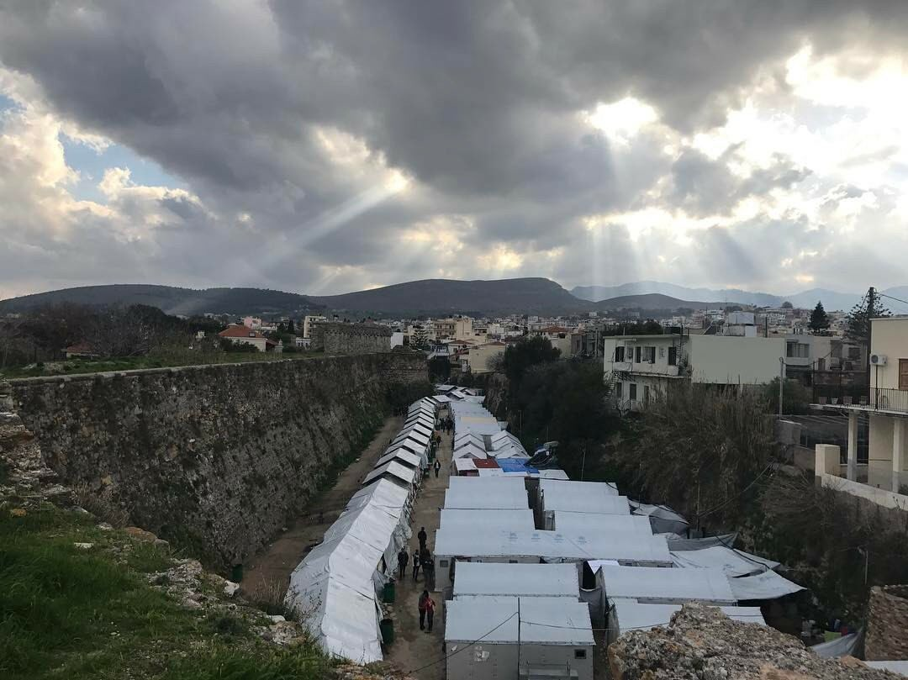
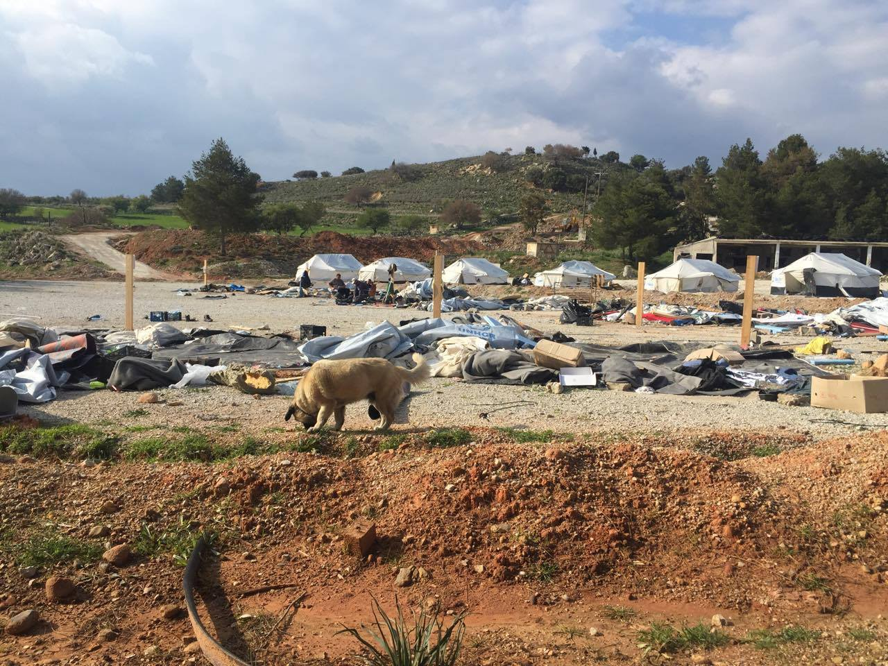
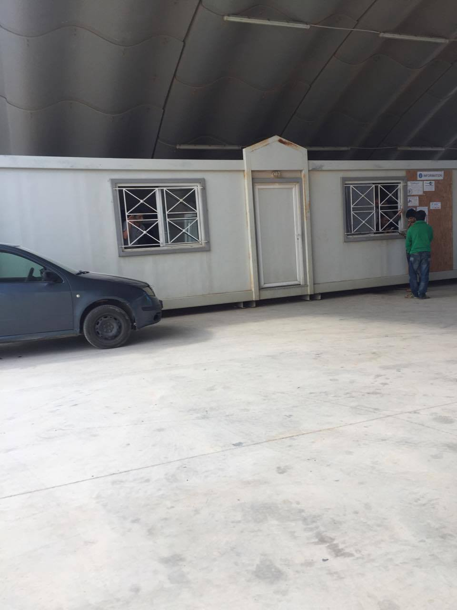
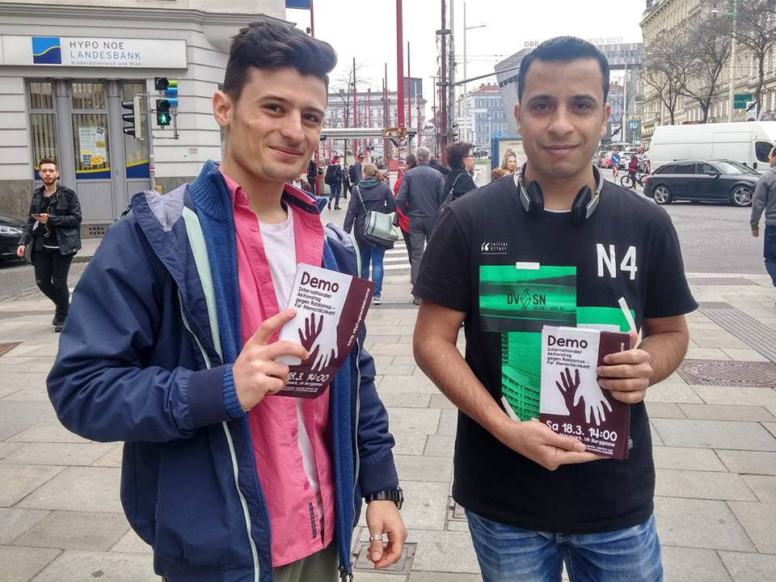
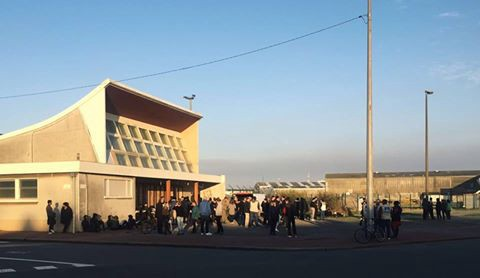

### AYS DAILY DIGEST 17\.3\.2017\. — Deporting refugees at risk of death penalty or torture

_France deports a refugee in great danger of being prosecuted in Sudan / French volunteers providing meals to refugees despite Mayor’s ban / First anniversary of the controversial EU — TURKEY deal / Worrying report from hot spot in Kos /Serbia government does not intend to increase its capacity to accommodate migrants / The Hungarian President has signed the new law detaining all asylum seekers in the transit zones_

Chios island, Greece, almost one year after the EU’s deal with Turkey to stop asylum seekers from reaching Europe\. Photo by Matthew Cassel NRC
#### Feature: By deporting Mohamed, France has failed to keep its word

Yesterday, on a regular Qatar Airlines flight, Mohamed M\. was deported from France to Sudan\. He was allegedly drugged so that he could not resist\. Mohamed is now promised a certain death, reads a statement by Alain Jakubowicz, President of LICRA and Ilana Soskin, lawyer, General Delegate of Urgence Darfour\.
 
Mohamed was born in Darfur in 1998\. He is Zaghawa, an ethnic group making up 6% of the population of Sudan and currently targeted by president Omar El\-Bashir\. Mohamed was arrested by militias under orders from the government and imprisoned in 2012\. A victim of persecution and racketeering, he fled his country at the end of 2016, taking a boat from Libya and reaching Italy and then France, where he sought refuge\. When he arrived in Paris, he was arrested, detained and forced to leave French territory\. “According to our information”, write Jakubowicz and Soskin, “the administration refused to grant him asylum because he had not respected the administrative deadline requiring him to file his application within five days of his arrival\.”

They go on to say that by deporting Mohamed, France has failed in its honor and its word\. By returning Mohamed to his executioners, it becomes the antechamber of the genocide committed by the Sudanese dictatorship\.
 
Since March 4th 2009 president Omar Al\-Bashir has been under an international arrest warrant issued by the International Criminal Court, which has charged him with crimes of genocide, crimes against humanity and war crimes, particularly against the Ovens, the Masalit and the Zaghawa, the ethnic group to which Mohamed belongs\. A few months ago, a compatriot of Mohamed was tortured and killed by the secret services of the Sudanese dictator a few hours after his landing in Khartoum\.

“The President and his government have just made a weighty decision seriously disregarding the international commitments of our country”, their statement reads\. “France is a signatory to the European Convention on Human Rights, which has for many years provided strong case law on the fact that we are prohibited from returning individuals to a country where they risk the death penalty or torture\. If Mohamed was not to survive his expulsion, those who sent him to death would bear the responsibility\.”
#### EU — TURKEY DEAL — one year on

“On 18 March 2016, EU Heads of State or Government and Turkey agreed on the EU\-Turkey Statement to end the flow of irregular migration from Turkey to the EU and replace it with organised, safe and legal channels to Europe”, [writes](https://ec.europa.eu/home-affairs/sites/homeaffairs/files/what-we-do/policies/european-agenda-migration/background-information/eu_turkey_statement_17032017_en.pdf) the European Commission\. They say in their revision that the Statement continues to deliver proof of its effectiveness on a daily basis\. The proof they give is irregular arrivals dropping by 97% and an equally substantial decrease of the number of lives lost at sea\.

> The EU has delivered on its financial commitment to support Turkey in its efforts in hosting refugees and providing support on the ground and in resettling Syrian refugees directly from Turkey to EU Member States\. Turkey has followed up on its commitment to step up measures against people smuggling and has been cooperating closely on resettlement and return\. Despite challenging circumstances, the first year of the EU\-Turkey Statement has confirmed a steady delivery of tangible results\. 

However, many international organizations have a different approach to the numerous negative aspects of the deal\. Médecins Sans Frontières released a [report](http://www.msf.org/en/article/one-year-after-eu-turkey-deal-migrants-and-asylum-seekers-are-paying-price-their-health) to expose the human costs of European policy failures\. “The deal is having a direct impact on the health of our patients, and many are becoming more vulnerable,” says Jayne Grimes, MSF psychologist in Samos\. “These people have fled extreme violence, torture and war and survived extremely dangerous journeys\. Today, their anxiety and depression is aggravated by the lack of information on their legal status and their poor living conditions\. They are losing any hope that they will find a safer, better future than the one they fled\. I often see people who contemplate suicide or self\-mutilate\.”

In a new [report](https://www.oxfam.org/en/pressroom/pressreleases/2017-03-17/eu-turkey-deal-makes-seeking-refuge-europe-mission-impossible) , The International Rescue Committee \(IRC\), the Norwegian Refugee Council \(NRC\), and Oxfam say that “the EU\-Turkey deal is playing roulette with the futures of some of the world’s most vulnerable\. It has become mission impossible for those who need it most to seek refuge in Europe”\. The report highlights major gaps in critically needed legal counselling and assistance to navigate the confusing, constantly changing asylum procedures\. For example, it was decided at a certain point that unaccompanied children could no longer prove their age with an original birth certificate; instead they were requested to present passports or national ID cards — even in cases where such documents are not issued to children under 18 years old\. As a result, asylum seekers are forced to navigate the lengthy and drawn\-out process with little to no assistance, while they are exposed to further rights violations and often appalling conditions\. Making matters worse, there are significant concerns about the expertise and quality of interviews conducted by European Asylum Support Office staff sent by EU countries to support Greece, as well as significant concerns about the lack of oversight of the process\.

Today in Berlin activists visited ESI, the ThinkTank which designed the “EU\-Turkey\-Deal”\.

Lastly, but most importantly, People’s Assembley Lesvos issued an **open letter from refugee community leaders to European government leaders** , which you can read in full [here](https://peoplesassemblylesvos.wordpress.com/) \. We are not pawns in the EU’s political negotiations with Turkey and today we stand united against your racism, opens the letter\.

> We call on the European Union heads of state to immediately stop implementing the EU\-Turkey Statement, by adopting the following recommendations: 

> Stop all deportations and returns to Turkey under the EU Turkey deal\. 

> Lift travel restrictions so that all are free to move off the islands\. 

> Invest in improving accountability for police violence against refugees and migrants rather than in increased border control, which does not stop people from seeking safety\. 

> Close Moria refugee camp\. 

](assets/a487b0613623/1*V5V_2jKYC6Hv5PCUpivQiQ.jpeg)

photo by NoBorders, see more [here](https://www.facebook.com/nobordersnetwork/posts/1332532113481344)
#### GREECE

One boat with 52 people on board was picked up off the South\-East coast of Lesvos by Frontex\. Reportedly everyone is okay, a volunteer reports\. Two [boats](https://twitter.com/hashtag/boats?src=hash) landed today on [Chios](https://twitter.com/hashtag/Chios?src=hash) carrying 66 and 64 people\. There were 60 new registrations on Chios and 14 in Samos\. The numbers of new arrivals on Chios has increased in the last weeks, write local CESRT volunteers\. One of the volunteers writes:

> Most people don’t understand that many boats arrive on the islands nearly every night, I only report the boats coming into Lesvos\. Last night so far 196 people came in on the islands, this was one post we received today\. Some disturbing news from the people from the first boat this morning\.
 

> The Turks tried to flip the boat, everyone was soaked\. They took seven men from the boat back to Turkey\.
 

> Somehow the boat managed to break loose, and continued towards the Frontex boat standing in Greek waters waiting\. Perhaps the Turkish Coast Guard did not go after the boat because Frontex was present, but we are not sure\. A boat filled with children, and this is how they try to handle it\. 

Only 47 people were relocated between the 9th and 15h of March bringing the total to 9,971: 13 to Estonia, 15 to Malta and 19 to Slovenia\.
#### Athens — The box at Koumoundourou Square

The Box — a multi\-use automotive \(van\) that contains a fully equipped kitchen, an outdoor canopy, a big outdoor tent and two space heaters will be located tomorrow from 15 to 18h at Koumoundourou Square in Athens, [writes](https://www.facebook.com/events/1729535580710338/) NGO Steps\. The Box creates a safe and heated space open to everyone, offering food, beverages, first aid, consulting and a playground\.
#### Urgent notice from the Greek Asylum Service: Katehaki open on 19th March to issue Residence Permits only

On Sunday, March 19th, the Attica Regional Asylum Office will open from 08\.00 to 16\.00\. On this day, the Attica Regional Asylum Office will deal EXCLUSIVELY with handing to beneficiaries of international protection their residence permits; nothing else\. Administrative business with the public will take place, [write](https://www.facebook.com/notes/refucomm/katehaki-open-on-the-19th-march-2017-to-issue-residence-permits-only/411652789186529) Refucomm \(text also in Farsi\! \) \.
#### KOS

The Preremoval Centre on Kos will be ready on Monday and can hold up to 150 people\. The Annex area outside the Hot Spot, where mostly Pakstanis used to live \(more than 200\), is now gone and all the tents have been taken down\. Some people went inside the Hot Spot and the rest ran away for fear of been detained\. There are reports of people sleeping in town, a volunteer reports\.

Annex, make shift camps near hots spot, where more than 200 people spent winter\. Photo AYS

The people who were taken to the hot spot have been placed in closed containers, 6 to 13 in each\. The living conditions are better than under tents in the makeshift camp, since they have running water, toilets and heating, but their freedom of movement is limited\. Additionally, police are guarding this area, and some of the officers are very hostile toward migrants\. There are reports of fights inside these containers, but the police is doing nothing to prevent or stop the violence\.

People from the annex are now moved to the closed containers\. Photo AYS

More people are applying for so called voluntary return, which is administered by IOM, but the reason for the application is that they are afraid to go back to Turkey or that the living conditions in Kos are unbearable\. Most of the applicants spent the entire winter in the makeshift camp under tents\.

**Tomorrow, Saturday 18 from 3PM to 7PM** — [March against Fascism, Racism, Austerity and the EU — Turkey deal](https://www.facebook.com/events/364263960626344/) : One year after the signature of the EU\-Turkey deal, City Plaza is calling for a European mobilization against the agreement and for a protest against racism towards refugees and immigrants\. Many organisations throughout Europe have answered the call and most of these events can be found on this [map](https://www.google.com/maps/d/u/0/viewer?mid=1clpJX1_iDx-Gici5cfdLFZcLuvU&ll=43.35453150000002%2C-2.670948400000043&z=8) \.

 all together will start at 2p\.m\. from Acharnon 78, and will join the big demonstration at 3pm in Omonoia sq\. You are all welcome to join us\! \! \! — write the City Plaza team](assets/a487b0613623/1*SUV8mwj2lCNkLJtC0mHEcA.jpeg)

The residents and solidarity people of [CityPlaza](https://www.facebook.com/hashtag/cityplaza) all together will start at 2p\.m\. from Acharnon 78, and will join the big demonstration at 3pm in Omonoia sq\. You are all welcome to join us\! \! \! — write the City Plaza team

Find more solidarity events in our list [here](https://medium.com/@AreYouSyrious/this-weeks-solidarity-events-in-europe-20bd2088f697#.5ij7oyt8i) \.
#### TURKEY
#### EU launches education programme in Turkey

The European Commission has launched its largest yet humanitarian programme for education in emergencies to encourage some 230,000 refugee children to attend school in Turkey\. The €34 million ‘Conditional Cash Transfer for Education’ \(CCTE\) project will provide bimonthly cash\-transfers as of May 2017 to vulnerable refugee families whose children regularly attend school, according to the [report](http://europa.eu/rapid/press-release_IP-17-521_en.htm) \. The project will be implemented in partnership with UNICEF and its partner, the Turkish Red Crescent in support of the Government of Turkey\.
#### BULGARIA

On average, 7 unaccompanied children seek refuge in Bulgaria daily\. In 2016 a total of 6572 children entered Bulgaria, 42% of whom were unaccompanied, [write](http://www.standartnews.com/english/read/seven_unaccompanied_children_enter_bulgaria_per_day_-12689.html) Bulgarian Standard News\. Last year a total of 6572 children entered Bulgaria, 42% of whom have arrived unaccompanied\. Currently over 450 children live in lone specialist centers, while other 17 were taken to accommodation in social services such as sheltered housing and family homes\.

46 migrants have been detained in an attempt to enter the country from Turkey in the period of March 9–16, 2017, according to data provided by the Interior Ministry, reported BGNES\.
#### SERBIA

The Serbian government does not intend to increase its capacity to accommodate migrants, [said](http://www.blic.rs/vesti/drustvo/vulin-ne-vidim-potrebu-da-se-gradi-novi-prihvatni-centar/fwvm3sm) the Minister of Labour, Veteran and Social Affairs Aleksandar Vulin, adding that he saw no need to build a new reception center in Aleksinac or any other place\.

Meanwhile, in the refugee center in Preševo there now reside 866 people, filling almost all camp capacities, and the situation is similar in the camp in Bujanovac, where there are around 200 people\.
#### HUNGARY

The Hungarian President has signed the new law, which means all asylum seekers will be imprisoned in the transit zones until their asylum claims are fully processed\. The w2eu Balkan Route Info issued a summary of the changes in the reception system, available in English, Arabic and Farsi, it can be read [here](https://live.w2eu.info/en/hungary/) \.
#### Show trials in Hungary — Help the accused

A crowdfunding campaign to help free the accused Ahmad H\., the Syrian man who got sentenced to 10 years in prison in Hungary for committing an alleged ‘act of terrorism’, can be found [here](https://www.generosity.com/fundraising/show-trials-in-hungary-help-the-accused) \. He appealed against the completely unjust decision, and that’s why he and his family now need help\. His wife hired a new lawyer, who asks for a lot of money\. The crowdfunding page has been set up to help her cover the costs\. 
The other person mentioned on the Generosity page, Yamen A\. is already out of prison\. He is in a closed detention centre now and an NGO is taking care of his case now for free\.
#### AUSTRIA
#### Fifth consecutive day of action

Activists distributed flyers, posters and stickers calling for more humane asylum policies in Vienna\.

](assets/a487b0613623/1*yM8KifdVw583f26Jj9JmhQ.jpeg)

photos by [**Plattform für eine menschliche Asylpolitik**](https://www.facebook.com/menschliche.asylpolitik/)
#### FRANCE
#### Providing meals to refugees despite the ban

Despite being banned from handing out food in certain areas of Calais, teams continue to distribute meals to displaced people living in and around the town, providing for this basic need, HelpRefugees [report](http://Since Monday teams in Calais have been distributing food from static points in the town, by daylight, for the first time since the camp closed in November. The Mayor of Calais has banned distribution in a large area surrounding the former 'Jungle' site and in the Place d'Armes, in the centre of town. Distributions have been carried out in two locations outside of this area. Refugee Community Kitchen has served on average 200 meals per day. On Tuesday about 200 meals were distributed from the static point. There was a good atmosphere but when the refugees left and walked down the street police officers checked the papers of 4 people. Two were arrested. Then Tuesday evening, after a distribution of fresh bedding and clothes, there were a further 8 arrests, where police reportedly picked people up while they were trying on items of clothing, at the edges of the group. Teams report that most of those arrested have been minors. On Wednesday the police were waiting for teams at the distribution point so they carried the distribution out in another location. The police officers didn’t follow them and about 120 hot nutritious meals were distributed. When the refugees finished their food, 4 riot police vans arrived, moving slowly enough to allow time for the refugees to go move. Unfortunately 2 of them could not move quickly enough, as they were injured. Today the distribution will take place as usual. The team will choose the location at the last minute, based on the level of police present. In the meantime there is a hearing today, in Lille, regarding the appeal that Help Refugees and 7 other associations have launched against the Mayor's recent actions which have been designed to make it difficult for associations to provide vital support to refugees living in Calais. The vast majority of those sleeping in forest, fields and other locations in and around Calais are unaccompanied minors. Utopia 56, supported by volunteers from Auberge des Migrants and Help Refugees, continue to carry out nightly outreach distributing essential aid. The most urgent needs are sleeping bags, backpacks, small and medium sized jackets, men's gloves, small joggers, fully functioning unlocked phones suitable for French SIM cards and small and medium sized hoodies. Please email calaisdonations@gmail.com if you'd like to host a collection and bring these items out to our Calais warehouse. To donate funds to help keep the warehouse hub running, adapting to the ever changing needs of the displaced people in Northern France please click here  https://mydonate.bt.com/donation/start.html?charity=127188 To donate to Refugee Community Kitchen to help them keep feeding hungry mouths in Calais and Dunkirk, click here https://mydonate.bt.com/charities/refugeecommunitykitchen) \.

Since Monday teams in Calais have been distributing food for the first time since the camp closure last November\. The Mayor of Calais has banned distribution in a large area surrounding the former ‘Jungle’ site and in the Place d’Armes, in the centre of town\.

Food distribution, photo by HelpRefugees

> Distributions have been carried out in two locations outside of this area\. Refugee Community Kitchen has served on average 200 meals per day\. On Tuesday about 200 meals were distributed from the static point\. There was a good atmosphere but when the refugees left and walked down the street police officers checked the papers of 4 people\. Two were arrested\. Then on Tuesday evening, after a distribution of fresh bedding and clothes, there were a further 8 arrests, where the police reportedly picked people up while they were trying on items of clothing, at the edges of the group\. Teams report that most of those arrested were minors\. On Wednesday the police were waiting for the teams at the distribution point, so they carried the distribution out in another location\. The police officers didn’t follow them and about 120 hot nutritious meals were distributed\. When the refugees had finished their food, 4 riot police vans arrived, moving slowly enough to allow time for the refugees to leave\. Unfortunately 2 of them could not move quickly enough, as they were injured\. 

> Today \(16\.3\. \) the distribution will take place as usual\. The team will choose the location at the last minute, based on the level of police present\. In the meantime there is a hearing today, in Lille, regarding the appeal that Help Refugees and 7 other associations have launched against the Mayor’s recent actions which have been designed to make it difficult for associations to provide vital support to refugees living in Calais\. The vast majority of those sleeping in forests, fields and other locations in and around Calais are unaccompanied minors\. Utopia 56, supported by volunteers from Auberge des Migrants and Help Refugees, continue to carry out nightly outreach distributing essential aid\. 

> The most urgent needs are sleeping bags, backpacks, small and medium sized jackets, men’s gloves, small joggers, fully functioning unlocked phones suitable for French SIM cards and small and medium sized hoodies\. Please email calaisdonations@gmail\.com if you’d like to host a collection and bring these items out to our Calais warehouse\. 

[Here](https://mydonate.bt.com/donation/start.html?charity=127188) you can donate to help keep the warehouse hub running, and [here](https://mydonate.bt.com/charities/refugeecommunitykitchen) to help [Refugee Community Kitchen](https://www.facebook.com/refugeeCkitchen/) continue feeding hungry people in Calais and Dunkirk\.

While they are waiting for the city to decide on the legality of the arrests, [Auberge de Migrant](https://www.facebook.com/LAuberge-des-Migrants-358496450338/?fref=nf) also distributed 120 meals in the city during the last 4 days, on three different locations due to police blockages\.
#### Dunkirk women’s centre needs your help

After being destroyed by fire a few months ago, thanks to donations and hardworking volunteer work the centre is up and running again but they are desperately low on supplies — [here](https://www.facebook.com/photo.php?fbid=10154923555096368&set=gm.1416245265116883&type=3&theater) you can find out many ways in which you can support them\.

_Converted [Medium Post](https://areyousyrious.medium.com/ays-daily-digest-17-3-2017-deporting-refugees-at-risk-of-death-penalty-or-torture-a487b0613623) by [ZMediumToMarkdown](https://github.com/ZhgChgLi/ZMediumToMarkdown)._
