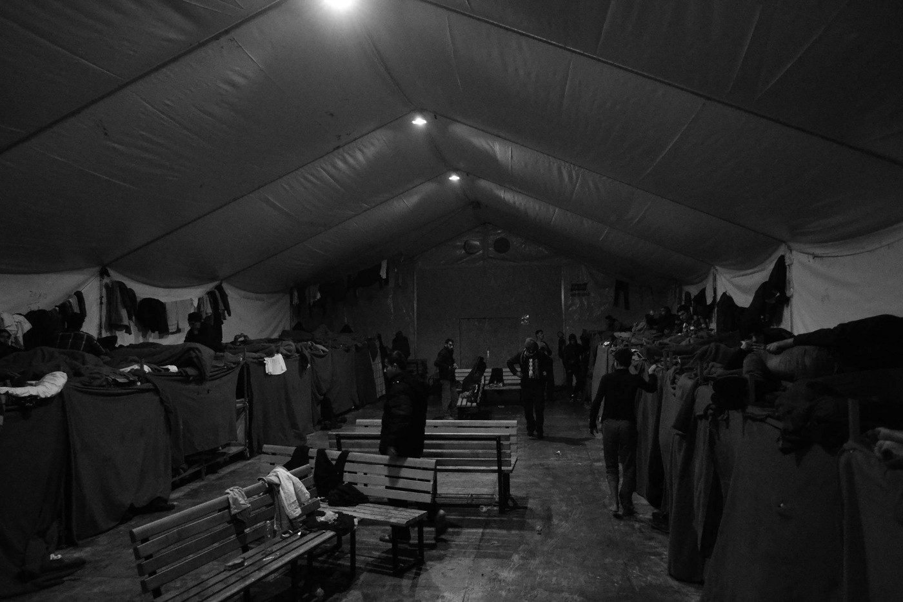
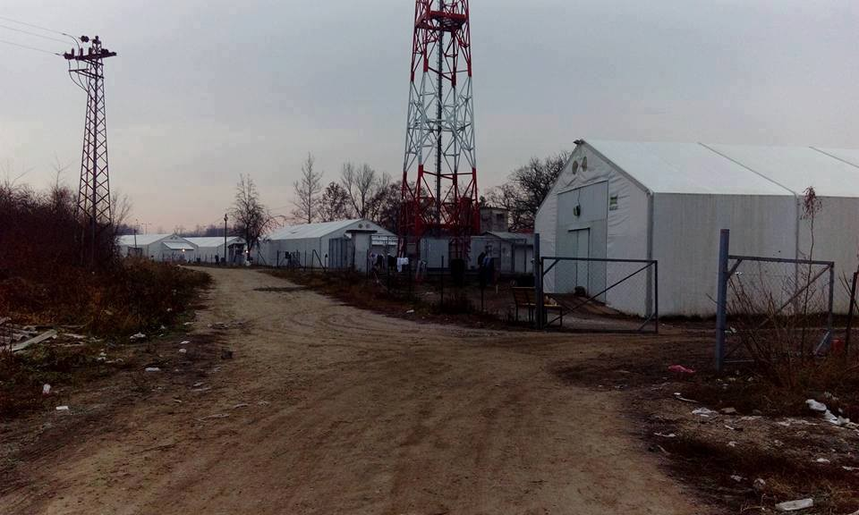
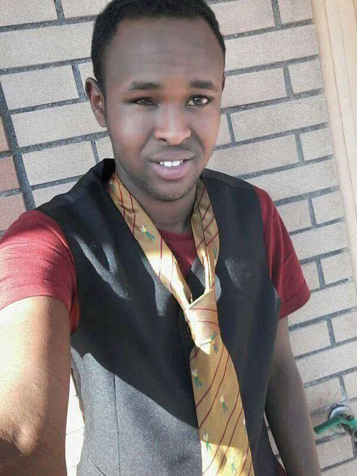
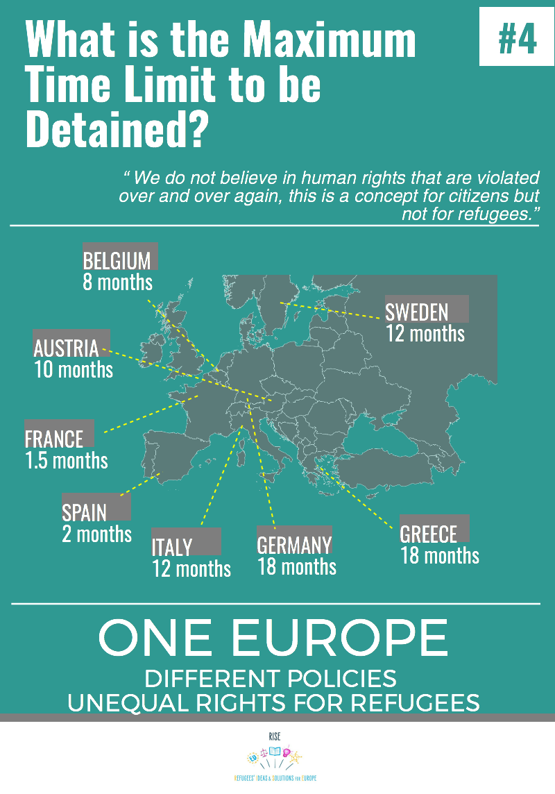

### AYS DAILY NEWS DIGEST 16/3: Where there is stagnation, there is escalation\.

Stagnation and misery in Serbia\. News on Iranian policy for refugees\. Children resorting to self\-harm and drug abuse in Greece as refugees are penned behind bars\. A child of 13 years beaten by Hungarian police\. Another life lost to policy in Italy\. Practical ways to push back against toxic political policy\. 1\.2 million Asylum Applications in EU in 2016\. UK charity needs hosts urgently\!

Adasevci Camp, Photo Credit Angel Haba Coco
### FEATURE: Serbia, where stagnation escalates into despair\.

Belgrade and all of Serbia continues to be a heartbreakingly stagnant stopping point for refugees\. Below is a translated excerpt from a [volunteer](https://www.facebook.com/photo.php?fbid=10155170243184711&set=a.82637719710.77819.588664710&type=3&theater) who recently arrived in Belgrade\.

> On this day, I met another child\. The boy in the picture, 12 years old, just arrived from Bulgaria a few days ago\. He is living in a small abandoned building by the train line, where he walks in and out through the window with his traveling friends, all minors — children who have traveled by themselves for three months from Afghanistan\. Three months in traffickers and policemen who beat and robbed them, instead of school; three months crossing deserts or forests; three months of eating only grass or nothing at all; three months without any news from family \. If they had been in school in Afghanistan they were lucky, but a school there teaches the rules of the Taliban, where one learns math not by counting cakes or marbles, but by counting weapons and bodies\. Months without affection\. 

And this desperation is not limited to the barracks

In ŠID there is about 1,000 people in Adasevci, 350 in Principovac and roughly 800 in Sid\. They are in tent halls and buildings\. There is nothing for them to do\. In 2015, Šid was on the main route toward Croatia\. Some people are still trying to use this crossing today\.

Adasevci camp, Photo Credit: Pomáháme lidem na útěku

As such, volunteers should be advised that Šid and other areas along the Serbian\-Croatian border could re\-emerge as a hot\-spot as the months go on\. All prospective scouts should take care and stay in touch with current support systems on the ground in order to get the most information before going in\.

Those interested in helping now inside the camp should get in touch with Czech Team\!

> We are Czech NGO called Pomáháme lidem na útěku \(better known as a Czech Team\) established by group of volunteers active in humanitarian aid during Migration crisis in Balkans in 2015\. We are currently working in official refugee camps in north\-western Serbia \(around Šid\) \. Our activities include distribution of hygiene products, operation of laundry room and library, leisure time activities for people in camps and night shifts \(monitoring a situation in large capacity tents with aspect of psycho\-social support\) \. We are looking for short and long term volunteers for our mission\! For more information please contact dobrovolnici@plnu\.cz\. 

Refugees in Sijenica report that rations are shameful — two boiled eggs and one hunk of bread\. Additionally, although improvements are being made to the camp, turnover is often very slow, with refugees sleeping without mattresses while waiting for new ones to arrive\. Even more disturbing are the reports of violence that go unmonitored by camp officials\. In several cases where refugees reported intra\-group violence, the response was a cold shoulder\.

> In the words of one man in a camp — they have it better in the barracks\. 

Meanwhile in Belgrade, the BelgrAID warehouse is moving forward\. Contact SoulWelders for more information\.

### IRAN

Mixed assessments have emerged of Iran’s treatment of Afghan refugees\. Although representatives from the UN have high praise for how Iran has treated its population of refugees from Afghanistan \(a community that is now four decades old\), others have more critical opinions\. In particular, Human Rights Watch has criticized Iran for providing inadequate protection to these who fall through the cracks in the system\. DW [published an in\-depth report on the current situation](http://m.dw.com/en/iran-lauded-by-un-for-hosting-refugees/a-37958945) \.

Estimates place the official refugee population residing in Iran at around one million people, with an additional two million residing there under a different status\.Those with refugee status are enrolled into Iran’s healthcare system and recently 350,000 Afghani children were given full access to school\.

Despite these encouraging signs of progress, the economic strain of Afghan refugees is becoming increasingly apparent\. It has been estimated that Afghans represented 21% of the new refugee arrivals in Europe, with many having lived in or transited Iran on their route west\. The surge in Afghans arriving in Europe has been potentially tied to Iran’s policy changes in renewing residency permits for Afghani refugees\.
### IRAQ

IOM has opened a family assistance programme center in Erbil, Iraq\.
It supports family reunion procedures to Germany for Syrian and Iraqi nationals beginning in March\.

All refugees who take part in family reunion procedures are advised to make an appointment there before going to the embassy\. Paper checks and even faster appointments and a sped\-up procedure for vulnerable cases are highly probable if they visit the centre\.

> “All applicants are asked to contact IOM and arrange an appointment prior to visiting the centre in Erbil, by sending an email to info\.fap\.iq@iom\.int\. More information is available on the FAP Facebook page: [https://www\.facebook\.com/IOM\.Family\.Assistance\.Programme/](https://www.facebook.com/IOM.Family.Assistance.Programme/) 

> For further information please contact Sandra Black at IOM Iraq, Tel\. \+9647512342550, Email: sblack@iom\.int\. Or Eleonora Servino at FAP\. Email: info\.fap\.iq@iom\.int” 

### YEMEN

A devastating situation is unfolding in Yemen, as hunger threatens 7 MILLION people\! The two\-year conflict has ended farming and blocked the import of aid into the country\. The UN says it is one of the worst situations in the world and humanitarian agencies say they are reaching an irreversible point\.

Even as the situation deteriorates and these groups call for assistance, however, we know only too well that worldwide outrage and shock about Yemen will only peak when it is too late to avert tragedy\.

> This is how it happens\. 

### GREECE

Kathimerini has reported that the majority of migrants that have recently crossed from Turkey to Greece islands are increasingly coming from Africa, specifically Algeria, Congo, Morocco, Cameroon, Nigeria, and Ethiopia\. Additionally, an increasing percentage of migrants from Pakistan and Bangladesh were reported\. This change in demographics indicates the high possibility that the pull of the black market could become even stronger in the coming years, potentially putting hundreds of thousands of refugees coming for “economic reasons” at risk\. Read more at [NewsThatMoves](https://newsthatmoves.org/en/majority-of-arrivals-in-greece-from-africa-pakistan/) \.

See this video of the people’s assembly in Mytillini that calls for TRUE solidarity\. In contrast to the endless bickering and wordplay of the European Parliament, this is indeed a breath of fresh air\.

In more disturbing news, [in a report for Reuters](http://mobile.reuters.com/article/idUSKBN16M35N) , Save the Children and Doctors without Borders have been documenting rising levels of self\-harm, drug use, and attempted suicide in children as young as nine in refugee camps in Greece\. In this sobering context, reports of new arrivals to Greece \(several dozen today alone\) bear a grim undertone, even though all are happy to see people arrive safely\.

Additionally, the context for this rising despair can be easily seen in how refugees continue to be mistreated\. In the newly\-opened reception center on Chios, new arrivals are separated from the rest of the camp via a cage\-like fence, penning them in like cattle\.

](assets/4987c5a6c09b/1*RW22JLFouBRHkCxrbyCzPQ.jpeg)

Chios Photo Credit: [Βασίλης Παχουνδάκης](https://www.facebook.com/basiles.pachoundakes)

> KHORA COMMUNITY CENTRE CALL FOR TEACHERS
 

> \- Khora community centre \(Asklipiou 80\) is in need of English teachers\. 
 

> \- Adult classes running throughout the day
 

> \- Looking for preferably long term volunteers\. 
 

> \- We will be holding a teachers induction tomorrow \(Friday 17th\) 5pm at Khora, please feel free to join\.
 

> If you are interested or know anyone who may be then please get in touch by sending a PM to John Gibb\. 

> LIGHTHOUSE RELIEF IS LOOKING FOR VOLUNTEERS\!
 

> Are you a handy woodworker, nutritionist or a social worker obsessed with knitting? Do you speak Kurdish and work in daycare? Are you a passionate hiker and climber who wants to spend a month in nature on Lesvos, cleaning and restoring the shores and greeting arriving refugees? 

> We are currently seeking volunteers for our different programs across Mainland Greece and Lesvos\! Volunteers of varied skills and backgrounds are needed\. We are especially looking for volunteers who can speak Arabic, Kurdish, Pashto and Dari/Farsi\! 

> Visit [www\.lighthouserelief\.org](http://www.lighthouserelief.org/) to read more about our programs and find out how to apply, and please help us find our skilled volunteers by sharing this post\. Thank you\! 

### **HUNGARY**

Video testimony from a boy of 13 at the Serbian\-Hungarian border, documented by Fresh Response\.

> January 2017\. A child of 13 years\. Beaten and traumatised by Hungarian border police and their dogs as he tries to cross to safety to claim asylum\. Sleeping in a festival tent on hay in an attempt to insulate from \-15 degree temperatures, flinching every time anybody goes near him\. 

> This is just one case of a wide\-scale indiscriminate system of violence, humiliation, and torture inflicted by Hungarian border police towards refugees and migrants\. 

Two Hungarian Police officers have been fined for their horrific brutality against people at the border\. Although this is a nominal step in the right direction, it appears to be just that — too little, too late as the brutal campaign against refugees and the continued drumbeat of hate speech casting refugees as terrorists continues on\.

Meanwhile, the construction of the Röszke prison camp continues, as Amnesty International notes:

■■■■■■■■■■■■■■ 
> **[Amnesty Hungary](https://twitter.com/AmnestyHungary) @ Twitter Says:** 

> > Röszke prison camp is under construction. The place where all the asylum-seekers will be held in  #Hungary. https://t.co/O1BePYC5c7 

> **Tweeted at [2017-03-16 15:54:45](https://twitter.com/amnestyhungary/status/842403775973347329).** 

■■■■■■■■■■■■■■ 

### ITALY

More tragic news from Italy as another young man was lost to suicide in the wake of deportations, pushbacks, and lack of free movement\. Baobab experience reports:

> “Pomezia, a man has been found hanged\. A young man died\.” As of last night, that young man has a name: Maslax\. He was from Somalia and he was 19 years old\. Baobab encountered him last summer, when we were in the street in Via Cupa with our tents\. He was with us during several clearing episodes and identifications, including the one that occurred on 8 October in Via Tempesta, when they prevented him from participating in the Peace Run because someone at the police headquarter wrote his name wrong\. 

> He left Italy and rapidly arrived in Belgium, but then was shortly sent back to Italy, to a receiving centre in Pomezia\. He wrote to us and looked deeply for us, the time there passed by too slowly — “slow life, sister”, he wrote\. He said he wanted to stop by and meet us in Piazzale Spadolini\. 

> Now, the authorities are trying to clarify the incident by examining the corpse at Policlinico Tor Vergata\. Again, they are missing the forest for the trees\. We already know what happened; it is the same for thousands of migrants\. They run away from their country because the situation there is unbearable\. They leave their home, connections, roots, and face a terrible voyage which marks them forever, if it does not kill them with violence and inhumanity\. They arrive in Europe where they are processed and closed into centres waiting, most times without mediators, without legal nor psychological assistance, never really seen\. So they run away, they reach another unwelcoming country, but one that may nevertheless represent their final goal, a new place start over again\. But according to Dublin Agreement, they are sent back where they had been processed the first time, in Italy, where they get hosted again in a receiving centre\. More months of waiting, isolated and futureless\. 

> This is another death we are directly responsible for, we Europe: after millennia of migration, how is it still not clear to us that such flows cannot be stopped with naval blockades, with the opening of new CIE, with expulsions, that there should be laws to include the arriving migrants, to make their travelling easier, because we are all citizens of the same world, even when there is no economic interest? 

> We are guilty for this death, like the deaths in the Libyan prisons, in the desert, during the voyages in the sea, or while crossing borders\. Indifference can be deadly\. 

Rest in Peace, Maslax\. Photo courtesy of Baobab Experience

A new protest has organized by Romaccoglie at Monte Citorio, against the Minniti\-Orlando Decree, “Urgent dispositions to speed up the procedures related to international protections, and to tackle the illegal migration,” as well as to ask the parliament to prevent its conversion to law\.

According to Roberto Giordano, secretary of the workers’ organization CGIL Lazio, it is not possible to modify the decree, because its central philosophical underpinnings draw from the worst primordial instincts currently emerging from the social fabric of this country\. He stated that the decree seeks to leverage security into repression, and all the main elements of the decree refer to this\.…

Yesterday, CGIL met parliament representatives and they expressed their frustration on the subject\. They asked representatives to vote against the decree and attempt to modify the core of the law, an admittedly difficult mission\. \(For more, check out this [news article\.](http://lazio.cgil.it/attivita/migranti/non-mio-nome-migranti-protestano-monte-citorio-contro-il-decreto-minniti-orlando) \)

And finally, a glimmer of hope, as the first family reunification case in Ventimiglia in which a person will be allowed to rejoin his family in Finland\.

> For the first time, in Ventimiglia, thanks to the service Restoring Family Links \(Rfl\), the Italian Red Cross, which manages the migrant reception center, has been able to reunite a Sudanese immigrant \(28 years old\), Abakr Hamid and his wife Rahama , living in Finland since a few months and who is expecting a baby\.
 

> Restoring Family Link is a service which give refugees the possibility to get in touch with family members throughout the world\. 
 

> Italian Red Cross, Caritas and Terra des Hommes worked on the bureaucratic procedures and finally Hamid got the necessary visa to join his wife in the city of Vaasa\. 

### GENERAL

Photo courtesy of AsyluminEurope\.org

On March 18th, a Europe\-wide march protesting Racism, Fascism, Austerity and the EU — Turkey deal, will be occurring in over 25 cities\. The march will seek to affirm that refugees are still welcome in Europe\. For more information, and to see if it is coming to a city near you, go [here](https://enoughisenough14.org/2017/03/16/18m-map-global-action-day-against-racism-fascism-austerity-eu-turkey-deal/) \! Get out of bed and into the streets\!

Another way to get involved is to sign [this petition](https://www.thunderclap.it/projects/54314-end-eu-alternative-facts) sponsored by MSF protesting the EU\-Turkey deal\. There are only a few days left\!

> Twelve months ago the European Council stated that the EU\-Turkey deal, which rewards Turkey for “stemming the flow” of migrants and refugees and accepting those forcibly returned from Greek shores, would offer “ _migrants an alternative to putting their lives at risk_ ”\. 

> But one year later men, women and children are now either **trapped in unsafe zones** outside of Europe unable to flee, **forced to use even more dangerous smuggling routes** to reach Europe or **trapped in overcrowded “hotspots” on the Greek islands** and losing all hope for the future\. 

> Despite the human consequences, European leaders are heralding the EU\-Turkey deal’s “positive results”, its “continued trend of progress” and its “steady delivery of results”, acknowledging only some “challenges” along the way\. **These are alternative facts\.** 

> **On the occasion of the one year anniversary of the EU\-Turkey deals, MSF calls on the EU and its Member State leaders to radically review their approach to migration and ensure a swift end to the senselesssuffering of the thousands caught in the nightmare of the EU\-Turkey Deal\.** 

Statistical analysis and figures have been published comparing the number of asylum applications received in 2015 to those in 2016\. Although the number of applications in 2016 was lower, it was only by around 92,000, coming in at 1\.2 million\. Again the leading nationalities applying for asylum were Syrian, Iraqi, and Afghani\.

This number is nearly double what was received in 2014\. An interactive information graphic can be found [here](http://ec.europa.eu/eurostat/news/themes-in-the-spotlight/asylum2016) , and a full statistical report can be found [here](http://ec.europa.eu/eurostat/statistics-explained/index.php/Asylum_statistics) , for the brave\.
### UK

Refugees at Home has until the end of the week to find hosts for ten refugees\! Please share information on this urgent need\! Here is information on Refugees at Home from Help Refugees:

> As a host, you’ll offer a bed and a chance for the guests to catch their breath ready for their next step in building a new life here in the UK\.
 

> Stays really vary from 1 night to over a year, but what they really need is people in or near urban centres who will take men for a month plus\.
 

> Most guests will be men, as they are more likely to be assessed as ‘not priority need’ — but they are very vulnerable on the streets, and a host placement helps with integration and language skills, as well as being very rewarding for the host\. It’s no exaggeration to say hosting really does transform lives\. 

To get involved, click [here](http://www.refugeesathome.org/) \.

_Converted [Medium Post](https://areyousyrious.medium.com/ays-daily-news-digest-16-3-where-there-is-stagnation-there-is-escalation-4987c5a6c09b) by [ZMediumToMarkdown](https://github.com/ZhgChgLi/ZMediumToMarkdown)._
