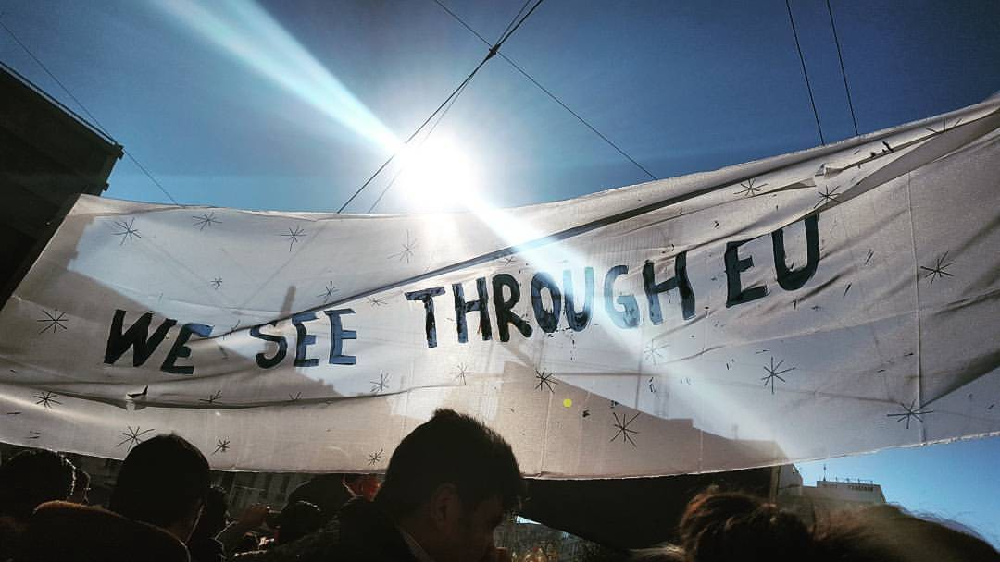
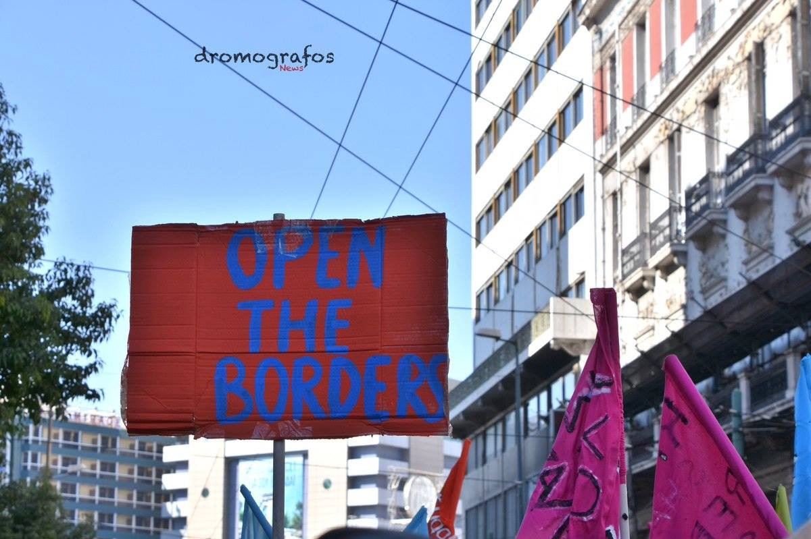
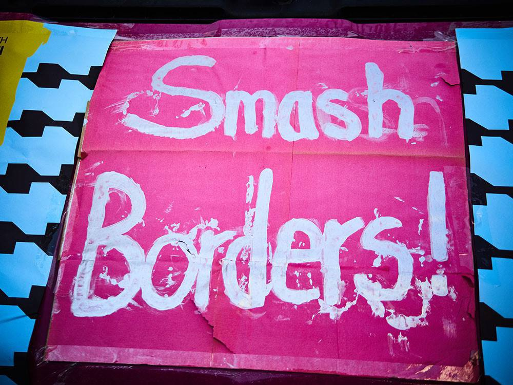
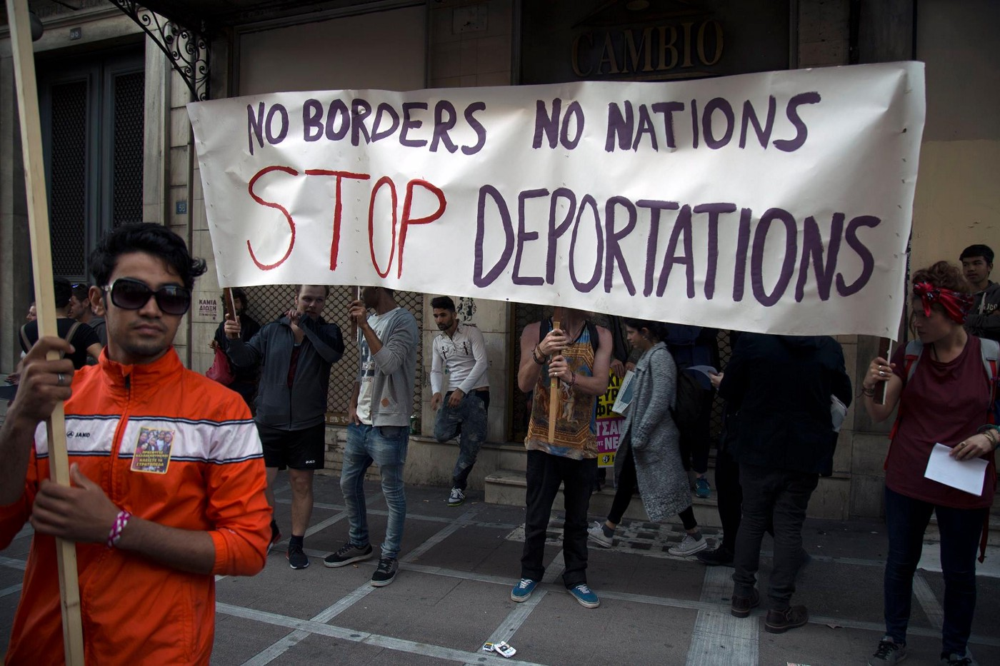
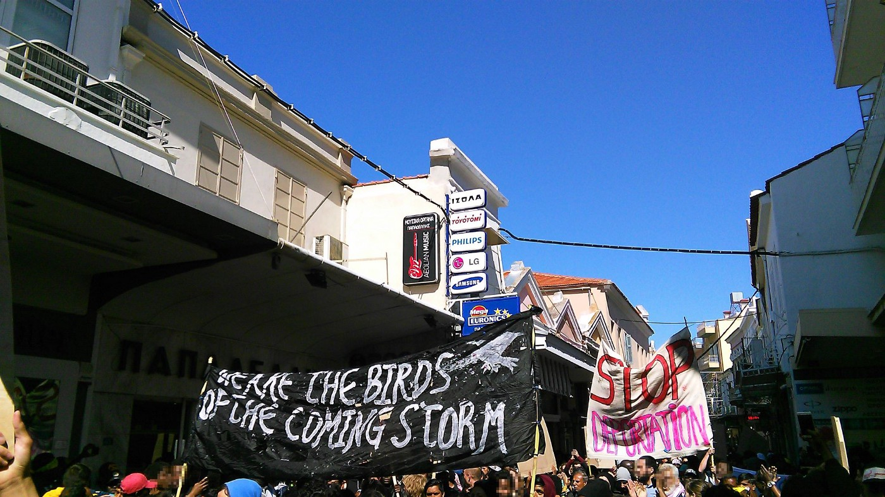
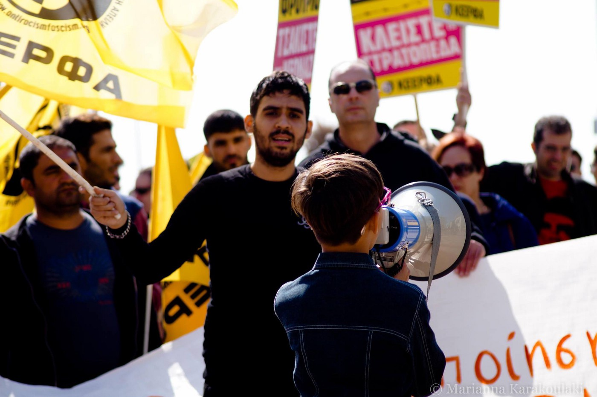
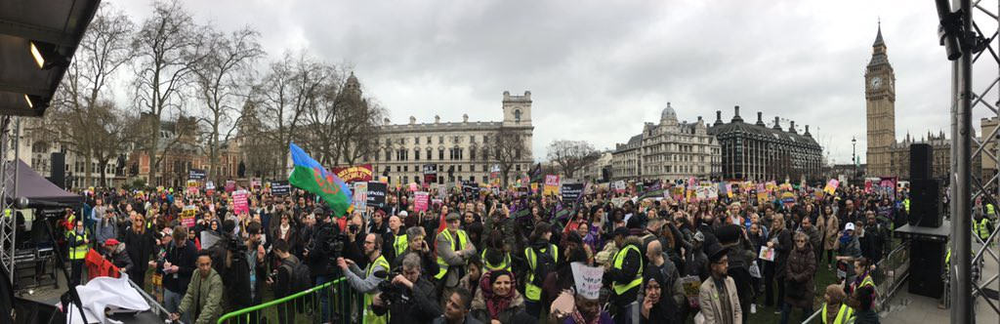
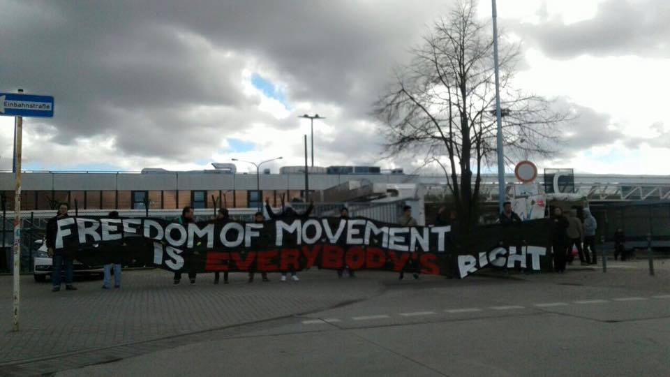
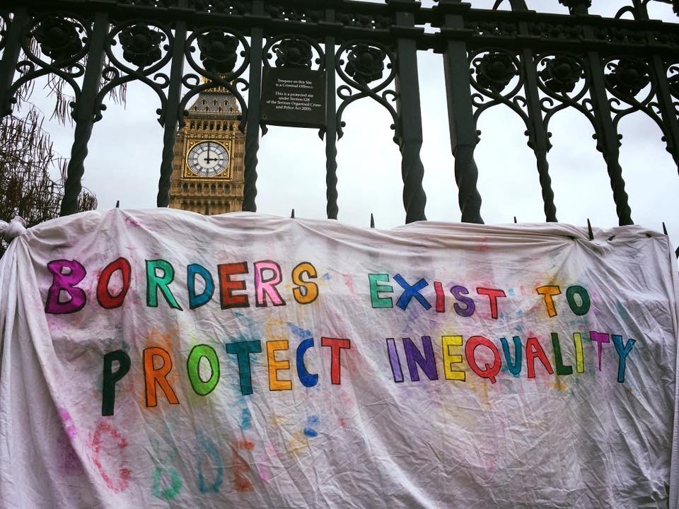
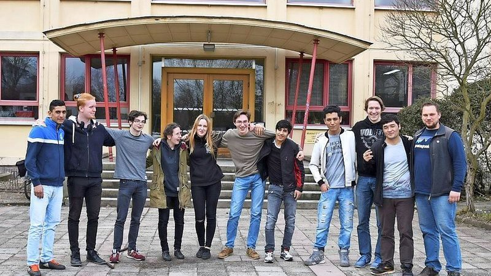

### AYS DAILY DIGEST 18/03/2017: More than 200 new arrivals to Greece

_“Article 33 of the Geneva convention on refugees states: “No contracting state shall expel or return a refugee in any manner whatsoever to the frontiers of territories where his/her life or freedom would be threatened on account of his/her race, religion, nationality, membership of a particular social group or political opinion\.”_

Any EU\-Turkey deal protest in Athens\. Photo by Licia Shirin Conn
### FEATURE
#### Enough is enough\!

Tens of thousands of people all around Europe went out on the streets today to repeat that EU — Turkey deal is not what they want\.

The deal was signed on March 18 and became operation two days after, but since the very beginning, it is surrounded by criticisms coming from human rights groups, activists and even academics\. It did not help\. Even more, EU leaders are planing to replicate this type of deal with other countries, like Libya, Sudan and Niger\.

The deal opened the doors for the closing of the so called Balkan Route, leaving thousands of people stranded in Greece\. They are forced to apply for asylum in the country they do not want to build their future, or to wait for relocation to other country in EU or reunification with their families\. IN some cases, they wait for more than year while living in hard to describe conditions\.

The deal allowed creation of so called hot spots on Greek islands where people are kept in detention like conditions, prevented from going to mainlands\. The most notorious one is Moria, Lesvos\. Their voices have to be listened\.

The EU is satisfied that the deal stopped arrivals in big numbers, while being ignorant about all the problems that were created because of the deal\.

Citizens of Europe are reminding their governments about the solidarity and human rights that are, or should be, in the core of European values\. Sea\-watch activist Philip Hahn, who was at Lesvos, sums it up perfectly: _“We Europeans stick to a deal that puts refugees at risk and betrays European values at the same time\!”_

Athens today\.

Lesvos and Thessaloniki\.

If you are still not convinced about how wrong this deal is, here is simplified explanation

[")](https://www.facebook.com/medicossinfronteras.ong/videos/10155469211929672/)

Protest agains EU\- Turkey deal joined the anti racism day demos all over Europe\.

### Syria
#### Evacuation from Homs

While European leader are considering how to seal the borders, people in Syria are still forced to flee their homes\. Today, thousands of people have begun leaving city of Homs\. According to some sources, about 15,000 people will be granted safe passage out of the city and be relocated to Syrian\-Turkish border\.

In the meantime, Turkish government continue with threats of opening the borders toward Europe\. So far, it is only political game but it is hard to predict what can happen in the future\.
### Mediterranean
#### 25 people rescued from the sea

Late Saturday evening, MSF, SOS Med France and Aquarius has rescued 25 very relieved people, including a pregnant lady, from a tiny overcrowded boat\.

Photo MSF
### Turkey

When in Turkey, many refugees are facing extremely bed living conditions\. Not much information are available\. Freelance Journalist Thomas Epitaux\-Fallot went on the ground and spend several days filming and talking to people\.

More about living conditions in Turkey you can read in [our special report](https://medium.com/@AreYouSyrious/ays-special-from-turkey-the-kimlik-is-the-issue-20d0f5e7efa1#.bosw8aosp) \.
### Greece
#### New arrivals

More people arrived today to Greek islands, and were immediately taken to detention, in some cases with no possibility to get dry clothes from volunteers\. Today, 102 new arrivals were registered on Chios, from two boats\. Over the last 48 hours, more than 280 people arrived to the island\. [CEST group](https://www.facebook.com/groups/421759534684819/permalink/605097043017733/) at Chios need help to keep up helping to new arrivals and those on the islands, where many people are still living in tents\.

According to the official figures, most of the people who arrived this year to Greece are from Syria \(39,8 percent\), but more people from African countries are arriving every day\. In Lesvos, Moria, currently most of the residents are from Congo and other African countries\.

In the meantime, more people have been relocated from the islands to mainland and sent to live in camps\. This is also very slow and complicated process, which results in moving people from one camp to the other, and not even one of the existing camps is suitable place for dignified life\.

However, there are groups of supporters who are doing their best to make these places less bed for life\. Today, 82 people arrived to Alexandreia camp\. [Refugee Support Greec](https://www.facebook.com/RefugeeSupportGreece/) e group reports that they got only one day notice before these new arrivals, but they managed to clean and tidy caravans where people will live now\.
### Serbia
#### New places for refugees in Serbia

Serbian first Deputy Prime Minister and Minister of Foreign Affairs announced the beginning of the construction of 40 apartments for refugees in Sremska Mitrovica\. This is part of the “second sub\-project” that includes the purchase of 250 village houses, construction of 200 apartments, construction of 120 prefabricated houses and allocation of 330 packages of construction material — a total of 900 housing solutions, he said\. He also said that simultaneously with the construction of apartments in Sremska Mitrovica, the construction of flats starts in Krusevac and Paracin, and that construction of buildings with 20 apartments in Vrsac and Prokuplje will start by the end of May, and then in Bajina Basta, Sid, Sabac and Kikinda\.
### France
### Makeshift camps

Refugees and migrants in France continue creating make shift camps as the only solution they find in this country\. One is in Cherbourg where about 20 people are living, including unaccompanied minors\. Only one person is helping them by delivering food and wood\.

[Dunkirk Refugee Children’s Centre](https://www.facebook.com/dunkirkrefugeechildrenscentre/) needs supplies for their education and activity programmes at the camp\. if you can help, please email [dunkirkchildrenscentre@gmail\.com](mailto:dunkirkchildrenscentre@gmail.com) to organise\. List of supplies you can find on their FB page\.
### Germany
#### New generation of Europeans

Brave new generation is born in Germany\. Group of high school students from the Waldorf school in the eastern city of Cottbus, initiated campaign to keep their new Afghan classmates\. They are trying to raise money to fight the legal case of the three Afghan teenagers, who could be deported back to their country\.

Different generation

_“We’re campaigning TOGETHER for our classmates, who have become a big part of our school community, and we can’t just let them go,”_ said the school’s [online petition](https://www.change.org/p/stoppt-die-abschiebungen-unserer-afghanischen-mitschüler-bmi-bund) , which has gathered nearly 50,000 signatures and is addressed to German Interior Minister Thomas de Maiziere and the Brandenburg state parliament\.

Three students received deportation order and have one month to leave\. However, they appealed the decision and have time to await the results\. The explanation behind the decisions for deportation is that they cannot be categorized as refugees because they are coming from “safe country”\.

_Converted [Medium Post](https://areyousyrious.medium.com/ays-daily-digest-18-03-2017-more-than-200-new-arrivals-to-greece-2a65cee782a1) by [ZMediumToMarkdown](https://github.com/ZhgChgLi/ZMediumToMarkdown)._
