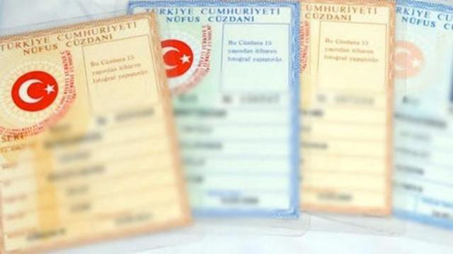

### AYS SPECIAL FROM TURKEY: _The Kimlik is the issue_

_There are many things that can be said about the Turkey EU deal\. But one thing that is certainly true is that this deal was one in which the Turkish government accepted the responsibility to care for refugees, the majority of whom are Syrian, within their borders\. Whilst clearly important, it is even more so than most people realise\._

One of the biggest problems facing Syrians here is that they are not legally considered refugees by the authorities\. Turkey has applied [“geographic limitations”](https://www.hrw.org/reports/2000/turkey2/Turk009-10.htm) to the “1951 convention of the status of refugees”\. Essentially, Europeans can be refugees in Turkey but Syrians and people from other Middle Eastern countries cannot\. This means that every right afforded to Syrians beyond those of “guests” must be fought for and then granted by the state\. The biggest issues encountered by refugees living here are:
- Access to education;
- Access to healthcare;
- The ability to work legally, with protections from exploitation and abuse\.

The Turkish authorities have made some provisions and legal changes to assist refugees living here\. For example in January 2016 employment law was changed to allow Syrians to work legally within Turkey, but [6 months later fewer than 0\.1%](https://eblnews.com/news/europe/turkey-grants-work-permits-5500-syrians-2016-ministry-says-28357) of the [2,910,281](https://data.unhcr.org/syrianrefugees/country.php?id=224) Syrians in Turkey had been granted a permit\. Syrian children can also legally access Turkish state education, but the many problems involving language barriers, inability to transport children to schools, and lack of school places mean that [40% of Syrian children in Turkey have no access to education](https://www.unicef.org/media/media_94417.html) \. \(There has been a 50% increase in enrolment of Syrian children in school in the last 12 months but these problems must continue to be tackled by the state\) \.

[Arguably the biggest issue here is proper access to healthcare](https://yaleglobalhealthreview.com/2016/11/06/the-plight-of-syrian-refugees-in-turkey-a-global-health-crisis/) and by extension registration for Kimliks\.
#### Facts of daily life

A Kimlik is a turkish ID card, it grants access to many social services such as health care\. Without a Kimlik Syrians are entitled only to emergency healthcare, with a Kimlik Syrians can access the Turkish healthcare system in full, barring practical problems like language barriers\. In theory this sounds like people have all the access they need\. In reality the problem is far from solved\. The rights conferred by the Kimlik only apply in the province that the Kimlik was granted\. This means that a Syrian with a Kimlik granted in Orfa only has access to emergency healthcare in Izmir\.

To understand why this is a problem one must understand the facts of daily life for Syrian refugees in Turkey\. The majority of people living outside of the large cities earn a living doing seasonal agricultural work, working with no permits, thus no legal protection against exploitation and abuse\. These people have to follow the work, they will travel across the country and across provinces\. For long periods of time the search for work will force people to travel out of the province in which they are registered, leaving them without access to proper healthcare\. The same applies to education\.

In the last 12 months there have also been changes to Kimliks three times, at the moment those with old Kimliks have to reapply for an updated version or they will lose the already limited access to social services they currently have\. There is an ever changing number of hurdles to negotiate and long periods in which backlogs in administration means that new applications do not get processed, denying access to essential, life saving services\.
#### Sense of fear

Further problems arise when looking at the organisations contracted to provide assistance to refugees in Turkey\. Since the coup attempt last July the [political climate in Turkey has changed](https://www.nytimes.com/2017/03/15/world/europe/a-message-from-turkey-a-nation-under-pressure.html) \. Thousands of state employees have lost their jobs in purges and [just last week Mercycorps, an UN affiliated NGO was shut down](https://www.nytimes.com/2017/03/08/world/middleeast/turkey-syria-mercy-corps.html?_r=0) amidst accusations of a “technical problem” regarding registration in the country\. Other very well known organisations have had their work severely limited by government involvement\. Very few aid organisations have any real access to Syrians living in informal rural camps\.

There is a sense of fear of government here and there is a corresponding fear of programs being shut down and organisations being evicted\. Thus while the solutions to the problems here must include government on almost every level, seeking that change can prove very dangerous to the continued work of organisations\. This fear is being compounded by the [upcoming referendum](http://www.reuters.com/article/us-turkey-politics-constitution-idUSKBN15Q0BK) in which refugees are a very divisive political issue\.

Turkey is now home to almost 3 million registered Syrian refugees\. For any government to provide for such a rise in population of people that do not speak the native language would be a monstrous challenge and one in which European governments have also been left wanting, despite dealing with many fewer people\. Whilst there have definitely been improvements in the legal status, protections and rights of Syrian refugees granted by the Turkish authorities, there are many problems remaining\. A huge issue here is that those provisions made for people do not reflect the reality of how they have to live\.

There is a clear disconnect between the problems people are facing and the manner in which solutions have been provided\. Access to healthcare and education is improving, but these solutions rely on people settling in one province\. The fact is that limitations on the work available to people means that many do not have the option to settle in one place, they must follow the work to survive, but following the work means they have to leave the province that provides their social services\. For this to change there needs to be a systematic change in the provision of services\. There must be an attempt to understand the realities of life for the many transient people here and create solutions that work for them\. Kimliks are the key to these services and as such they are also a large hurdle in the lives of Syrians here\.

The problems in the geographic limitations that apply to people as a result of the kimlik process mean that any improvements in people’s access to services are plagued by fundamental misunderstandings of the reality of life for people\. This calls into question the ability of the Turkish authorities to properly provide the conditions of life that the Turkey EU deal was meant to secure, for which billions of Euros have been allocated\.

_\(By an independent volunteer in Izmir\)_

_Converted [Medium Post](https://medium.com/are-you-syrious/ays-special-from-turkey-the-kimlik-is-the-issue-20d0f5e7efa1) by [ZMediumToMarkdown](https://github.com/ZhgChgLi/ZMediumToMarkdown)._
