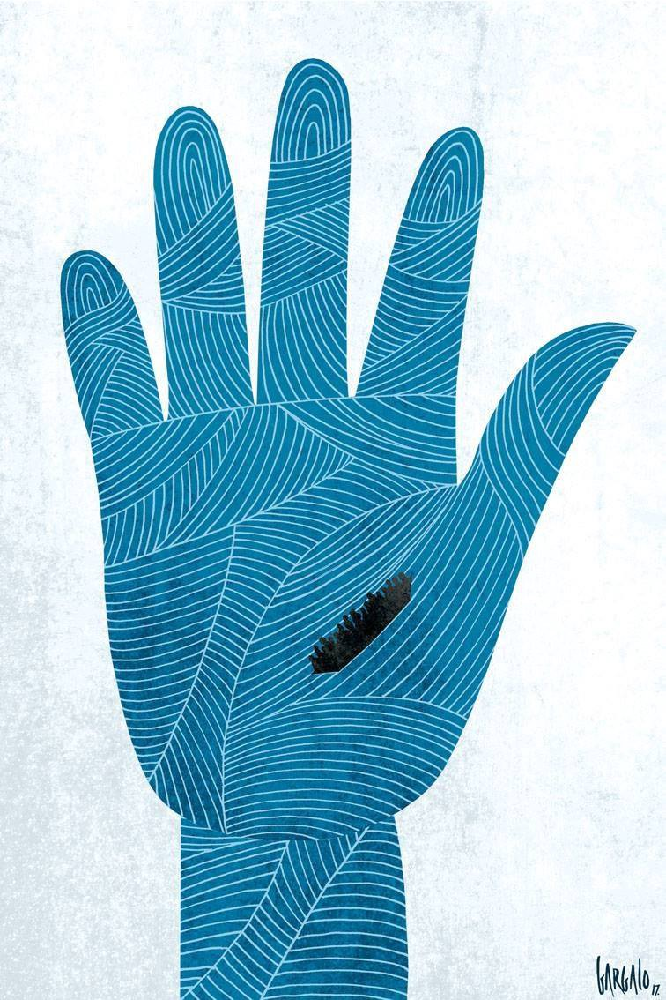
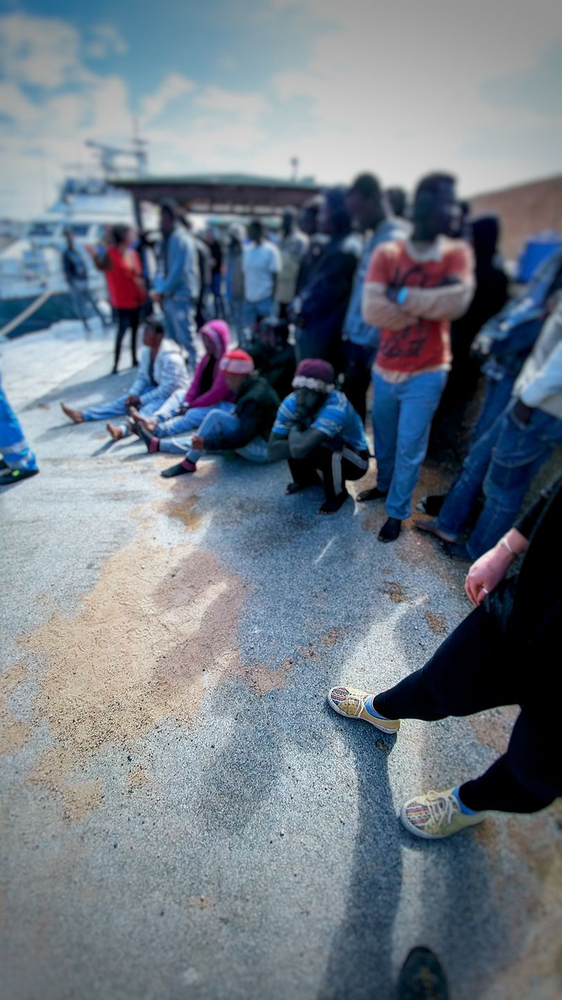
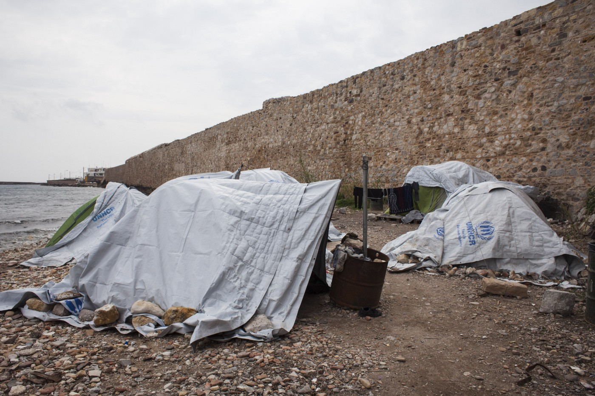
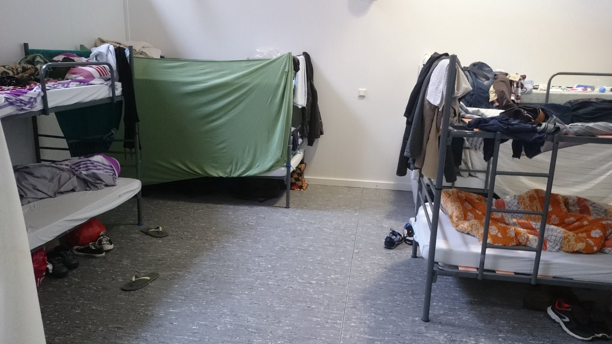
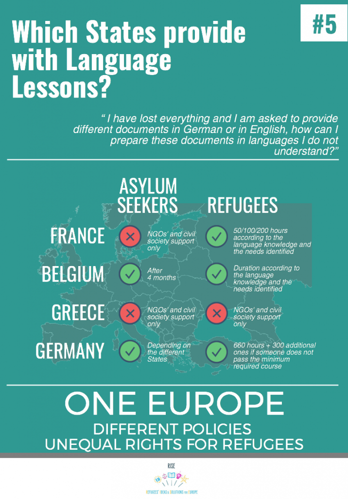

### AYS DAILY DIGEST 20/03/2017: While EU is preparing a new deal, more people arrive in Italy every day

_Over 1000 people arrived in Italy today // Increase of new arrivals in Greece // People stranded in Serbia want to go back to Greece, Turkey or their countries or origin after the new law in Hungary // Conditions in camps in Germany not much better than in Greece_

Refugees in the Mediterranean\. By Vasco Gargalo \(Art Against\)
### Feature
#### New deal, new humanitarian nightmare?

This morning, around 9\.30, 116 people, including 15 women and a 5 year old child, landed in Molo Favarolo, Lampedusa\. By the end of the day, 560 people arrived\. They are from Cameroon, Ghana, Côte d’Ivoire, Gambia, Nigeria, Senegal, Guinea Bissau\.

By Mediterranean Hope\.

Late this evening, 946 people were saved by Aquarius and on their way to Catania, Sicily\.

Yesterday, March 19, 3,000 people were rescued\. This increase is, according to some sources, due to the good weather\. All of the new arrivals will try to continue their journey, once they rest\. However, in Italy, the situation for migrants and refugees who are coming is not improving\. There is hardly any accommodation for people, not enough volunteers, and the state is not in the capacity to take care of all the people who are arriving almost daily\.

Our friends from Boabab in Rome, in the Spandolini square, are reporting that last night, 34 people were sleeping rough in Rome\. More people are on the streets of Italian cities\. Volunteers are reporting that in Pordenone people are also sleeping rough on the streets, while police are taking their blankets and sleeping bags \(Paris style, we would say\) \. Caserma Monti, one of the places where refugees reside, is full and no more people are taken in\.

From January until mid\-March, over 18,000 people arrived, which is the increase from the same period last year \(13,825\) or a year before \(10,075\) \. Most of the people are coming from Guinea, Nigeria and Ivory Coast\. Previously, most of the people who arrived were from Syria and Eritrea, but this changed from the second half of the last year\.

Among new arrivals to Italy are 2,230 unaccompanied minors\.

The route they are taking, through Libya, is considered particularly dangerous and where they easily become victims of different criminal groups\. People are kept as slaves, beaten up, and becoming victims of rape and sexual violence\.

In the meantime, the EU is trying to seal deals with North African countries, including Algeria, Tunisia, and Libya, to stem the flow of refugees\. These deals should mirror the one with Turkey that is perceived by many who are working in the field as a failure\. \( [Read AYS special report on EU\-Turkey deal](https://medium.com/@AreYouSyrious/ays-special-living-in-humanitarina-nightmare-965c9c3f4a1d#.xfga8nguz) \)

As part of the deal, Italy and the EU will fund camps in Libya, and the U\.N\. agencies will help manage them, the scenario we can already see in Greece\.

In Italy, like in Greece, hot spots are created where refugees are registered\. There are two places for hot spots — Sicily or Calabria\. Once they arrive there, they have to undergo medical checks\. People considered to belong to vulnerable groups are transferred to one of the over 2,000 reception centers all over the country\.

Refugees who are caught by the Libyan Coast Guard are taken back to Libya and held in detention centers there\.

At the same time, as the best possible answer to what is happening, IOM and Italian government are spending money on the campaign in Africa aiming “to inform would\-be migrants about the dangers of heading to Europe via the Mediterranean Sea”\. The campaign is organized in 15 countries, through social media, radio and television advertisements\. Additionally, Italy launched a 200 million\-euro fund from the EU “to help African countries control their borders”\.

For the next week, a meeting between European and North African countries is announced during which the way to fight people smuggling will be discussed\.
### Greece

With the good weather, the number of arrivals to Greece is slowly increasing\. Today, 56 new arrivals were registered on Lesvos and 25 on Chios\. The UNHCR registered 3,369 new arrivals in Greece by March 19th\. Currently, according to the Northern Aegean General Police Directorate, 3,485 asylum seekers are registered on Lesvos, 3,541 on Chios and 1,733 on Samos\.

Volunteers from Chios are reporting that hot spot Vial is full of people, as well as camp Souda, where people still sleep in tents\. Those who have been waiting there for over a year to cross, are becoming more depressed, not seeing a way to leave this island where many are stranded for over a year, living in camp under tent\.

Local media in Greece are also reporting about the increase of new arrivals saying that 566 people arrived at Lesvos, Samos, and Chios since last Thursday\.
### New Rumors are out with some important information\. Share it\!

[A Drop in the Ocean](https://www.drapenihavet.no/en/we-need-volunteers-immediately/) needs volunteers from 24th of April in Athens, and in Nea Kavala in Northern Greece immediately\.

> “As a volunteer in A Drop in the Ocean you will work directly with residents in the refugee camps we are present\. The work consists largely of distribution of food, clothing and other necessary items\. Volunteers must be able to work in Greece for at least ten days\.” 

If you are interested, register a profile on My Profile or write to them at [connie@drapenihavet\.no](mailto:connie@drapenihavet.no)

[A Spanish company, that works with cardboard](http://www.elmundo.es/comunidad-valenciana/alicante/2017/03/19/58cd6b35ca47419f2c8b4617.html) , is sending baby beds to orphanages in Aleppo and Idlib, and to camps in Greece, Serbia, and Hungary\.

Additionally, the “Elche platform for helping refugees” from Spain sent a container with 100 tons of food, shoes and hygiene products to the Thessaloniki\.
### Bulgaria

According to data gathered by the [Bulgaria Border Monitoring](http://bulgaria.bordermonitoring.eu/statistics/) , currently, there are three detention centers in this country: one in Busmantsi, one Lyubimets and one in Elhovo\.

In February 2017, the current number of people who were living in “closed\-type“ centers was 984\.

Also, there are six refugee centers, three in Sofia and three in the rest of the country\.
### Serbia

[Info Park](https://www.facebook.com/infoparkserbia/) issued a statement on Monday drawing the attention to the fact that newly announced conditions for asylum seekers in Hungary “directly affect their prolonged stay in Serbia, leading up to new commitments and an increased responsibility for the situation in the centers across the country\.”

> “The atmosphere among the refugee and migrant population is becoming more depressed: the authorities and civil society organizations working with migrants face rising challenges and handling this situation will be one of the priority tasks for this year\. Integration processes are taking place in the shadows of mutual consensus: refugees are not interested in staying in Serbia, and public authorities show little enthusiasm to steer them in this direction\. In such discouraging conditions, it is difficult to implement serious programs of cultural, social and economic integration of refugees\.” 

Many people who are in Serbia would like to go back to Greece, Turkey or their country of origin, and many will be forced to trust smugglers to do that\.

> “Due to continuous rise of the refugee population in Serbia during the first year of the “closed” Balkan route, there is little reason for optimism even in 2017\. The nature of the terrain and border security capacities clearly indicate that the borders cannot be sealed, benefiting only the stronger activity of the smuggling groups\. At this point, the entire dynamics of departures and arrivals in Serbia is in the hands of smugglers and, as long as it is not suppressed, it will hamper the decrease of illegal entries\.” 

### Hungary

[The government announced](https://dailynewshungary.com/hungary-appeal-strasbourg-courts-ruling-bangladeshi-asylum-seekers/) they will appeal the first\-instance ruling by the European Court of Human Rights \(ECtHR\) finding the state for wrongly detaining and deporting two Bangladeshi asylum\-seekers in 2015\.

The Court ruled last week that by taking this measure, Hungary had violated the European Convention on Human Rights\. The court ordered that Hungary has to pay to the petitioners 18,705 euros each in compensation and legal fees\. This ruling could pave the way for every asylum seeker in Hungary to seek recourse in Strasbourg\.

According to the official numbers, a total of 7,204 people had tried to enter Hungary so far this year\. Out of this number, 4,472 were arrested and 2,740 pushed back\. At the same time, 1,134 asylum applications were submitted, while 54 applicants have been granted international protection, 13 refugee status, 36 have been given subsidiary protection and 5 have been granted ‘tolerated stay’ status\. The authorities have launched legal proceedings against 35 people on suspicion of human smuggling so far this year\.

Meanwhile, the construction of the new detentions centers is going on\. Officials in open transit camp in Subotica, Serbia, are very critical of the way how Hungary is treated, applicants warning that people who are waiting are tired, angry and need to move away from where they are\.
### Germany

Many refugees who are stuck in Greece, or elsewhere in the Balkans, are hoping to get to Germany\. However, those who arrived are in some cases disappointed with living conditions and the treatment they received upon arrival\. [Ali Borsan](https://medium.com/u/b2547dd4a88e) , who lived for almost a year in Nea Karvala camp, was relocated to Berlin at the beginning of march\. He claims that he lives in a camp where no privacy exists\. _“It is impossible to find a place or time to read, study, or to get some quiet time to think, to learn something, or to cry,”_ he twits\. In another one, Ali writes: _“Don’t build big hopes on relocation results\. Now we are in a camp same as Nea Karvali camp\. You can’t change anything\.”_

New camp in Berlin where Ali lives after almost a year in Nea Krvala\.

We wish him, and all the others, strength, and patience\.
### General

RISE \(Refugees Ideas and Solution for Europe\), a network operating across 14 countries in Europe, initiated campaign which aims “at revealing the differences between refugees’ rights across Europe\.”

Through a series of informative posters, they will try to draw attention to the worrisome situations refugees face but also to solutions and best practices that exist\. This is the poster about language lessons provided in different states for refugees\. To learn the language is the first step toward the integration\.

_Converted [Medium Post](https://areyousyrious.medium.com/ays-daily-digest-20-03-2017-while-eu-is-preparing-new-deal-more-people-arrives-in-italy-every-day-514b9c6361c) by [ZMediumToMarkdown](https://github.com/ZhgChgLi/ZMediumToMarkdown)._
