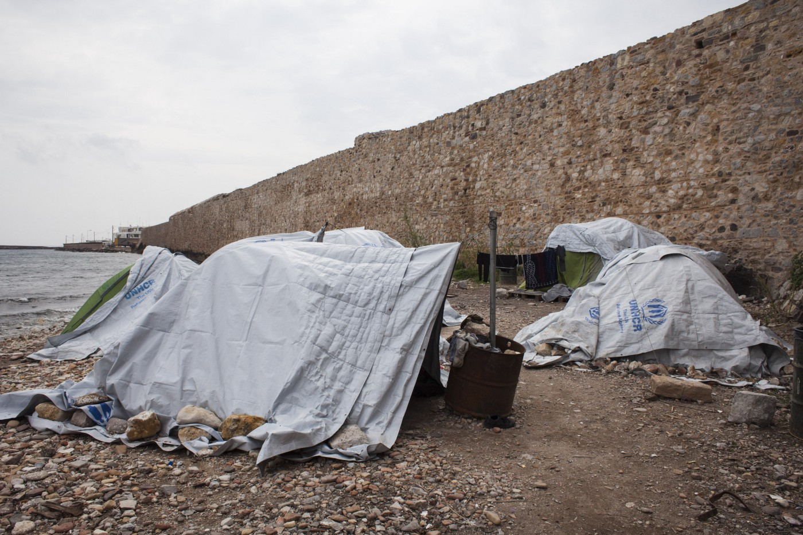
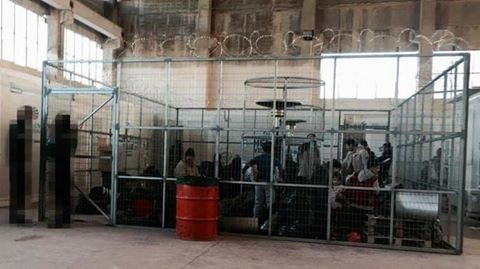
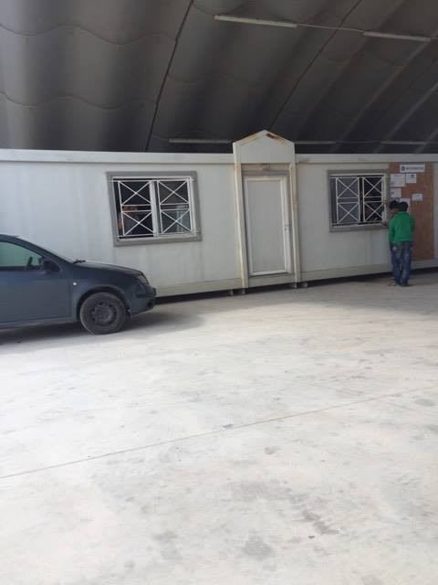
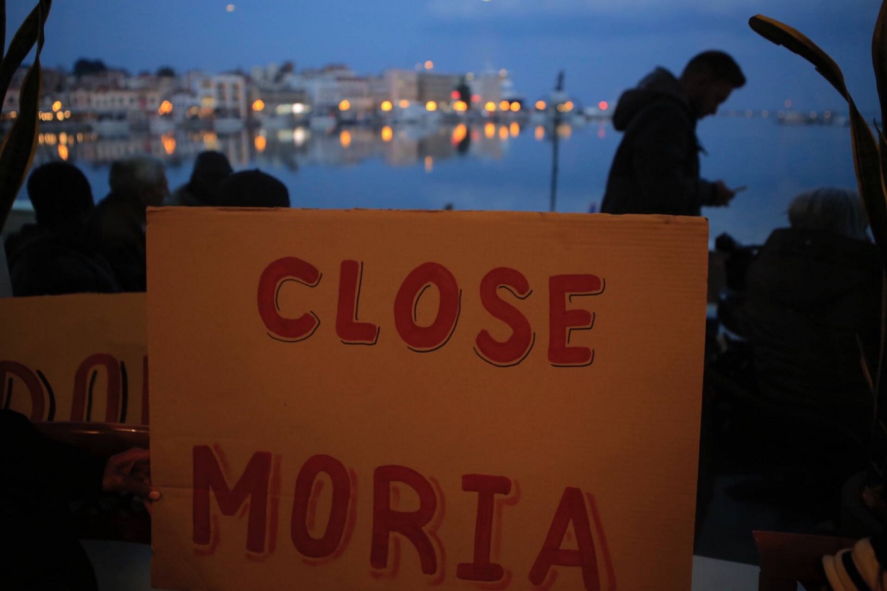
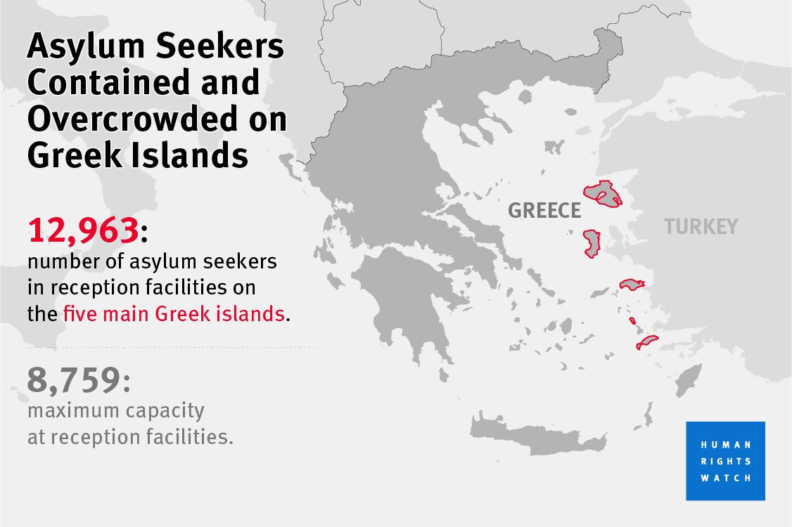
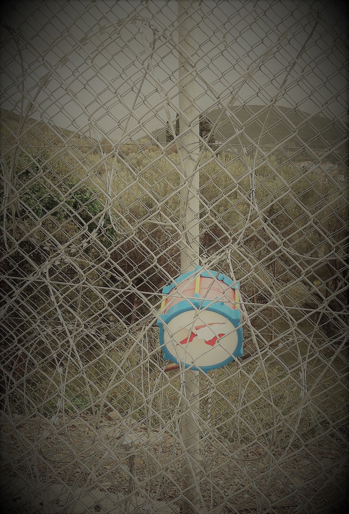
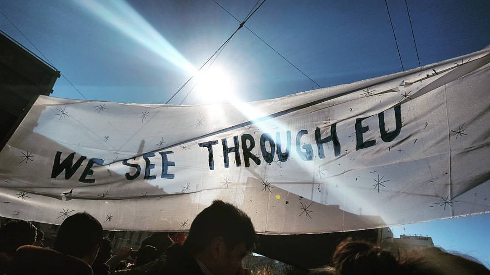

### AYS SPECIAL: Living in humanitarian nightmare

_The EU — Turkey deal created reality in which nobody feels safe\. The consequences are violation of basic human rights and total abondonment of solidarity\. While people all over Europe keep repeating that the deal is not what they want, their leaders keep praising the deal because it decreased the number of arrivals on European soil\. Europe became fortress more than even in the recent history_

Year after EU — Turkey deal, people at the Greek islands are left to live in unbearable conditions often treated in inhumane way\. Photo by Mathew Cassel\.

Exactly one year ago, on March 20, 2016, the EU\-Turkey deal came into force creating the situation which [the Women Refugee Commission](https://www.womensrefugeecommission.org/images/zdocs/EU-Turkey-Refugee-Agreement-Failing.pdf) \(WRC\) describes as “ _a humanitarian nightmare_ ”\. Over the last year, day after day, AYS published testimonies about devastating effects this deal has had on human lives\. The same was reported by a number of volunteer and activist groups, as well as human rights advocacy groups as [Human Rights Watch \(HRW\) that concluded](https://www.hrw.org/news/2016/11/14/qa-why-eu-turkey-migration-deal-no-blueprint) that the agreement “ _has set a dangerous precedent by putting at risk the very principle of the right to seek refuge_ ”\.

However, the European Commission remains ignorant considering the deal to be effective because it decreased the number of people who are arriving to European soil\. In their reports, EU leaders often ignore reality, and the mainstream media all over Europe are following this attitude\. Closed borders, degrading refugee camps, often suicides and detention like facilities, are like nonexistent in the the picture of Europe today\.
#### Detention instead of safety

The deal was signed with the aim “to stem migration and refugee flows” to Europe\. To achieve this goal, the EU made Turkey accept the return of all asylum seekers who traveled through this country and came to Greece by sea, in exchange for billions of Euros in aid, visa liberalization for Turkish citizens and revived negotiations for Turkish accession to the EU\.

The deal also provides for the resettlement of one Syrian refugee from Turkey for each Syrian returned to Turkey\. Some human rights organizations, are claiming that this part of the deal has created “f [_irst and second class refugees_](https://www.womensrefugeecommission.org/images/zdocs/EU-Turkey-Refugee-Agreement-Failing.pdf) ,” with a privileged route to resettlement for Syrians only, fast\-tracked registration and prioritized aid deliveries\. _“Other nationalities may easily languish in legal limbo if returned to Turkey and may not be deemed eligible for international protection under Europe’s relocation schemes,”_ the report claims\.

The fact is that the numbers of crossings of the Aegean since the deal remained lower than before and amounts to 90 daily arrivals in average, compared to 10,000 in a single day in October 2015\. So far, 1,187 returns from islands to Turkey have been registered\. In order to help Greece, the number of EU countries agreed in 2015 to relocate 66,400 refugees from Greece, but the process is very slow and so far only 10,004 people are relocated to other countries\. The European Commission considers that it should now be feasible to transfer all eligible relocation applicants by September 2017\. To achieve this goal, at least 3,000 people should be relocated monthly\.

In order to facilitate implementation of the EU\-Turkey deal, EU engaged in costly humanitarian response scheme \(another one\)which, [by estimates made by Refugees Deeply](https://www.newsdeeply.com/refugees/articles/2017/03/06/the-refugee-archipelago-the-inside-story-of-what-went-wrong-in-greece) , includes $803 million sent to Greece since 2015\. One senior aid official estimated that as much as “$70 out of every $100 spent” had been wasted\.

Since the EU\-Turkey deal was signed, over 30,000 people arrived to Greece\. All of them were automatically put in so\-called hotspots, that are run like [detention centers](https://medium.com/@AreYouSyrious/ays-special-from-migrant-crisis-to-detention-crisis-84941596fa26#.xr9gbojnb) \. A week before the first anniversary of the deal, photos from one of the hotspots emerged in public showing that people are treated in a most degrading way, held in a cage like constructions, wiht limited freedom of movement\. This is picture from Vial at Chios\.

People in Chios waiting to be “processed” are held in these cage\-like constructions, with limited freedom of movement\.

The situation is not much better at other places\. In Kos, people are held in containers, guarded by rude police officers and with very limited freedom of movement\.

Moria, Lesvos, is described by many as a nightmare for all the residents, and some of them have lived there for a year\.

By Vassilis Mathiokadis\.

People have to stay in these centers for at least 25 days, and there is not an exception to the rule\. Children, unaccompanied minors as well as sick people or pregnant woman, are also forced to stay there\. After the initial screening, they are moved to containers or tents in one of the camps and have to stay there until admitted to the asylum system\.

In order to leave an island, a person has to prove to be “vulnerable” or to get their asylum processed\. So far, some 10,000 people were allowed to leave\. Less than 900 people have been deported to Turkey under the agreement so far\. Many people are trying to escape, putting themselves in danger\.

This is the rule imposed by the European Commission with the idea to stop people from traveling further on to Europe\.

HRW
#### People treated like animals

Those who were already on the mainland, over 55\.000 when the deal was signed, were placed in camps all over Greece\. Most of the camps were constructed after the deal, and under the pressure of the closed borders\. Until today, nobody knows how many camps there are in Greece\. The migration ministry claims that there are around 40, while the UNHCR number is around 50\. Nevertheless, some were evacuated during the winter, some reopened recently, while new camps are created and getting ready to accept people from islands\.

Additionally, an unknown number, several thousand are assumed, are living in squats or on the streets mostly in Athens and Thessaloniki\.

Camps are usually placed in remote areas, run by police or army, and for a very long time, \(in some cases deep in December\) people were living under tents, despite freezingly cold winter\. Food is the constant reason of complaints, but not much has been done to improve the quality\. As residents in some of the camps told AYS activists in the field, they are treated like animals, deprived of dignity and rights\.

Photo by No more borders, no more tears\. Samos\.

Half of the residents in the camps are women and children, many alone, hoping to reunite with their families in European countries\. [The process of reunification is slow and complicated, and in some cases, families remain separated for over a year](https://medium.com/@AreYouSyrious/slow-reunification-process-leaves-family-separated-for-a-long-time-185e5835e73d#.uobm2jjg5) \.

The deal did not stop the arrivals, neither the borders restrictions that came after the deal took place\. The UNHCR concluded that the increased border restrictions impact is that people continued to move, but taking more diversified and dangerous journeys\. AYS reported on several occasions about dangers people face on the route while dealing with the mafia that is running smuggling chains in the Balkans and the rest of Europe\. Additionally, we reported on pushbacks by border police, which in some cases, like in Hungary, Macedonia, or Croatia, is brutal\.

### Endless misery

Refugees who are stranded in Greece, lack information about their options, status, and rights\. In most of the cases, the most reliable legal advices are provided by the volunteers or activist\. Groups of lawyers, local and international, are trying to provide even legal help\. The same is with quality medical health, psychological help, education, food, clothing… where instead of the institutions, or big INGOs \(with the exceptions\) are trying to help\.

Nevertheless, for independent volunteer groups and activists, endless and senseless rules, often create problems to deliver much\-needed assistance\.

The most worrying part is severe depression people living on islands, but also in camps in the mainland, are trying to cope with\. Some just give up\. Only during the winter time, 11 suicides and suicide attempts were reported on islands\. Recently, [Save the Children issued a very disturbing report](http://www.savethechildren.org/atf/cf/%7B9def2ebe-10ae-432c-9bd0-df91d2eba74a%7D/FINAL%20REPORT_EU%20TURKEY%20DEAL_%20A%20TIDE%20OF%20SELF-HARM%20AND%20DEPRESSION_MARCH%202017[1].PDF) about children in camps who are cutting themselves, attempting suicide and using drugs to cope with “ _endless misery_ ”\.

> “Their mental health is rapidly deteriorating due to the conditions created as a result of the deal,” the report said\. According to this organization, living conditions in camps are “degrading” and “detention\-like\.” 

The same conclusion is stressed by the experts who are working with trauma, and who claims that the deal, as well as closed borders, are seriously [damaging for mental health](https://medium.com/@AreYouSyrious/closed-borders-are-damaging-our-mental-health-cf810a93d45b#.b09udou9w) \.

One of the most vulnerable categories are women\. Over the last year, AYS recorded many complaints about sexual harassment in different camps, and little to nothing has been done to prevent this\. One of the most notorious places is camp Softex in the north, but recently UNHCR reported about sexual harassment in Elliniko camp where over 1,000 people are living\.

Women’s toilet in Elliniko, on of four stadiums turned into refugee camps\. It is unsanitary and not safe\. Photo AYS

WRC finds that toilets and showers are particularly unsafe areas where women describe men loitering outside\. Their freedom of movement is affected in these closed areas where the situation for everyone is terrible and tense\.

It is estimated that 10 percent of refugee women in Greece are pregnant\. WRC reports that they do not have proper services for neonatal and postpartum mothers and their children\. The Pleiades law group led by Electra Leda Koutra,in cooperation with Human Rights in Childbirth and with the support of AYS volunteers, [conducted an research](https://medium.com/@AreYouSyrious/ays-22-10-refugee-mothers-cut-open-stitched-up-and-sent-back-to-filthy-camps-22c5bfcfb838#.yobzyf8ti) only to find out that many refugee women are forced to undergo C\-section, even if they are perfectly capable of delivering their babies naturally\.
### Profit for smugglers

People who stayed in Greece, even though it was never their final destination, are forced to apply for asylum\. Some of them, faced with difficult living conditions and the reality of everyday life in one of the poorest EU countries, are deciding to go back to their home countries\. Other are finding smugglers and paying insane amounts of mony only to leave Greece and the Balkans\. As borders are getting tighter, the smuggler are making more money\.

According to AI, between 20 March 2016 and 31 January 2017, 548 people returned home from the Greek islands, and 865 went to Turkey\. [AI concludes](http://www.amnesty.eu/content/assets/Reports/EU-Turkey_Deal_Briefing_Formatted_Final_P4840-3.pdf) how “ _it is clear that the reasons why individuals and families agree to voluntary returns after arduous and costly journeys vary considerably\. Despair at the dwindling prospect of ever reaching Europe is certainly one of them\._ “

Recently, [Doctors Without Borders \(MSF\), released an report](https://www.msf.org.uk/sites/uk/files/msf-report_english_eu-turkey-deal-anniv_high_res.pdf) calling on the EU and member state leaders _“to radically change their approach to migration and ensure a swift end to the unnecessary suffering of the thousands caught in the consequences of the EU\-Turkey deal”_ \. The report concludes that “ _the deal is having a direct impact on the health of our patients, and many are becoming more vulnerable\.”_ No reaction from the EU leaders so far\.

The MSF psychologists in Lesvos saw a two\-and\-a\-half\-fold increase in the percentage of patients with symptoms of anxiety and depression and a threefold increase in the percentage of patients with Post Traumatic Stress Disorder\.

_“The EU\-Turkey deal sent a message that protection for refugees can be commodified, outsourced, and deflected\. It arguably serves as cover to beleaguered countries that have been hosting hundreds of thousands of refugees for years to withdraw their hospitality,”_ the Women’s Refugee Commission\.

Despite all this, [the EU is planning a new similar deal with Libya](http://www.globaljustice.org.uk/blog/2017/mar/13/eu-turkey-refugee-deal-one-year-and-still-disaster) , that can have even more disastrous consequences having in mind that people in this country are often exposed to torture, forced labor, and sexual violence\.

Unlike leaders, people in Europe still believe in solidarity\. Thousands are volunteering in Greece, and other countries, trying to help and show that refugees and migrants are welcome\. They are creating one different reality, and making space for a new Europe that will emerge, hopefully, with new generation\.

Photo by Licia Shirin Conn\.

_Converted [Medium Post](https://medium.com/are-you-syrious/ays-special-living-in-humanitarina-nightmare-965c9c3f4a1d) by [ZMediumToMarkdown](https://github.com/ZhgChgLi/ZMediumToMarkdown)._
