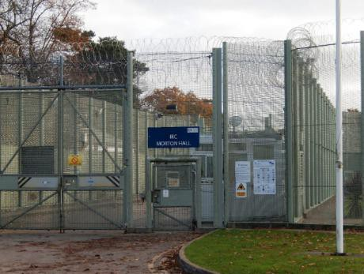
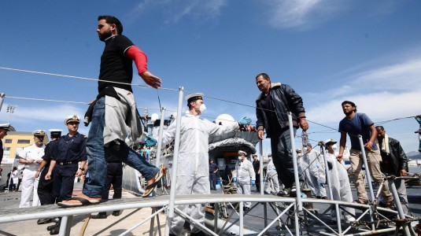

### AYS DAILY DIGEST 21/03/2017: Failure of institutions puts children in jail for weeks

More than 6000 people rescued in the last few days on central Mediterranean // Nea Kavala becomes more and more multicultural // Macedonia extends emergency state // Mental health deteriorates in Belgrade // Calls for a protest on the Hungarian\-Serbian border // commemorating a fatality one year after and protesting against killer borders in Italy

](assets/8156fe4f0f85/1*pKnA_hLll92EXu2an8tu8Q.jpeg)

Credits: [**NGO Praxis Serbia**](https://www.facebook.com/NGO-Praxis-Serbia-371052492962101/?fref=nf)
### Feature

A recent inspection revealed that some children have been in a dangerous and prison\-like UK immigration removal centre among adult men\. One child was held for **151 days** whilst others were detained **12 and 36 days** at Morton Hall Immigration Removal centre, in Lincolnshire\.

The details were published today and according to [openDemocracyUK](https://www.opendemocracy.net/uk/shinealight/clare-sambrook/morton-hall-HMIP-immigration-detention-child-safeguarding) and relate to a surprise inspection done by HM Inspectorate of prisons last November\. This report states that procedures for safeguarding children who visited the centre were “not properly implemented”\. Reportedly a detainee with convictions for offences against children and who had been held at the centre for several months was only added to the list during our inspection while, in theory, visits staff should be made aware of detainees who posed a risk to children\.

Refugees are detained in a prison\-like camp

There is also evidence of very bad mental issues among the residents as nearly half the detainees told the inspectors they felt depressed or suicidal on arriving at Morton Hall\. Incidents of self\-harm had tripled since the inspectors’ last visit in March 2013, and there’d been one self\-inflicted death\. In 2016 alone 4 detainees narrowly escaped fatal or serious injuries as a result of tying ligatures and there were 16 incidents of fires in cells and communal areas\.

**Despite all this Morton Hall had no strategy for reducing self\-harm\.**

Inspectors also reported bad inefficiency by the Home Office as in one case **facts supporting release of a detainee were omitted** in a review by some caseworkers and in another case the department took 7 months to decide on an application\.

The latest inspection also found that there was a big increase in cases where force was used against detainees and that there was no available evidence to show these measures were necessary of effective\. The institution also continues to lock up men overnight which was objected by inspectors before and that already led to the death of a young man\. Rubel Ahmed was found hanging in his cell in 2014 when he was 26 years old\.

**Detention centre rules required “a relaxed regime”** with “as much freedom of movement and association as possible consistent with maintaining a safe and secure environment” but instead what **applicants find is razor wire fences, batons drawn, a punitive “rewards system”, and men locked up overnight\.**

Immigration centers do not host criminals and shouldn’t treat people as such\. I will most likely lead to serious cases of depression and other mental health problems that could easily be avoided if the asylum procedure was conducted fairly and protected especially the most vulnerable\.
### Mediterranean Sea

Yesterday, 1,800 migrants have been rescued in front of the Libyan coasts, during 15 rescuing operations coordinated by the Italian coast guards\. The migrants have been transferred from dinghies and boats to the Spanish ship Canarias, within the mechanism Eunavformed, to a MSF ship and to some trade boats and patrol boats\. Meanwhile, coast guard’s CP 940 Dattilo took onboard 1\.477 migrants rescued in 7 operations: 747 were riding a boat, 82 a smaller one, the others on five dinghies\. **These arrivals take the numbers of the last few days over 6000** and as the weather gets better more are expected to be found in the sea\.

So far, over 23,000 people arrived in Italy in 2017, 40 percent more than the ones in the same period in 2016\. The unaccompanied children included are over 2,200 \(while they totaled 25,000 in the whole 2016\) \. Lombardy is the region hosting more migrants\. Last Sunday, 3,300 people were rescued, coming from Guinea, Nigeria, Ivory Coast and Bangladesh\.

Credits: Giornale di Sicilia
### Greece

Today we bring you sad news from Greece as one old Syrian refugee died waiting for family reunionification\. HRW reported about her case:

> Fatima, 62 years old, fled persecution and the destruction of her city of Aleppo, Syria, with the dream of reuniting with her daughter and grandchildren in Germany\. She survived the treacherous journey to Greece, but border restrictions in the Western Balkans stranded her there\. She died last week in Athens, still waiting to reunite with her family\. 

> As with many of the older asylum seekers we interviewed in Greece, Fatima, a slight woman wearing a flowered silk scarf and delicate gold\-framed glasses, deeply desired to have her family around her again\. 

> “I miss gathering in the evening after jobs and school\. It will be the best day of my life to gather all my children and all eat together again,” she told in a wavering voice, through some tears, in December 2016\. 

> She invested much of her life’s work in her children\. 

> International human rights and European Union law supports family reunification in cases like Fatima’s\. An EU regulation that sets out which state is responsible for examining an asylum claim, called the Dublin III Regulation, states that when an older person depends on the assistance of a child or sibling who legally resides in an EU country, the “Member States shall normally keep or bring together the applicant with that child\.” 

> Yet when Fatima, who had multiple chronic illnesses, told Greek officials that she wanted to be reunited with her daughter — who had given her much\-needed care in Syria — she was told that she could not apply for family reunification but only for relocation\. They did not explain why\. She did as she was told, but under the EU relocation plan, she could have ended up in any EU country rather than with her daughter\. Other older asylum seekers in Greece told us that they encountered the same problem\. 

> Separated from her daughter, unable to return to Syria and her hope of family reunification hampered by a flawed process, Fatima was stuck in Greece\. Last week, she died, far away from both her home and her daughter\. Other older asylum seekers in Europe have also died before reaching their final destination since the onset of the Syrian refugee crisis\. 

> European countries should live up to their commitments on family reunification, and the European Commission should remind them that this should be a priority for older refugees\. Otherwise, many more older refugees will pass away without realizing their dream of being united with loved ones\. 

#### Numbers

Registrations on the islands as for today were:

Lesvos: 39

Chios: 29

Samos: 16

Kos: 9

**Total: 90**
#### Kilkis

Nea Kavala camp in the north of Greece is getting more and more multicultural since the transfers from the islands began\. Volunteers at the site report that all the refugees taken there were from Moria camp in Lesvos and the nationalities are Syria \(247\-majority\-55 in flats and other 7 planned\), Iraq\(18\), Palestina\(15\), Eritrea\(13\), Sudan\(4\), Congo\(19\), Nigeria\(4\), Uganda\(2\), Kamerun\(1\), the Comoros\(1\), Sierra Leone\(2\), Mali\(1\), Eritrea\(13\), Ethiopia\(4\), Afghanistan\(20\), Haiti\(2\) and 4 stateless persons\. **The total number for the camp at the moment is 358** \. Most of them are single persons\.
#### Athens

The [**Refugee Info Bus**](https://www.facebook.com/RefugeeInfoBus/?ref=page_internal) is getting refurbished for the next part of their mission supporting refugees in Athens with information, education, and internet access\. The red mini van has now been fitted with a new electronic system, wifi system, and is insulated to protect from the hot Greek sun\. Now for the drive over to Athens, where they will be back on the ground within the week\.

](assets/8156fe4f0f85/1*W9p_mqc--70-W2ZxAMLOjA.jpeg)

Picture by [**Refugee Info Bus**](https://www.facebook.com/RefugeeInfoBus/?ref=page_internal)

[Hope Cafe Athens](http://Hope Cafe. Refugee Soul Food.) in need of donations:

_The responce for food packs has been overwhelming to say the least\._ 
_Last week we registered over 500 families living in difficulties \(not in camps\) in Athens\._ 
_Yesterday another 30 new arrivals from the Islands and Thessaloniki registered\. Some families as big as 12 members\. All recieved an initial food pack, toiletries and Nappies and Milk specific to their needs\._ 
_We have stock at the moment to last two days\._ 
_Nothing is harder than sending families away empty handed when they are desperate for our help\._ 
_We have already downsized foodpacks due to demand\. Help us feed those who are not hungry by choice\._ 
_Where else can they go ?_

You can support the by [Paypal](http://info@hope-cafe.org) , though this [link](https:/www.gofundme.com/Kerrielesvosgreece) or bank transfer\.

[**RefuComm**](https://www.facebook.com/refucomm/?ref=page_internal) shared a video with an explanation about the asylum in Greece for speakers of Tigrini ትግርኛ which you can find [here](https://youtu.be/X0dvBWxlDNQ) \.
#### Islands

[**Advocates Abroad**](https://www.facebook.com/advocatesabroad/?fref=nf) is making a complaint protesting against the caging of refugees recently seen in pictures from Vial hotspot\.

> We just filed our newest \(and 10th\) complaint to the Greek Ombudsman, this time regarding the horrific use of a cage to detain new arrivals in the Vial hotspot\. 

> The complaint noted the caging of children with strange adults for hours, without heat or blankets or spare clothes provided for these new arrivals, still soaking wet from the Aegean Sea\. 

**Rhodes:** First time in a long time we get information from this island\. Volunteers report that in Rhodes there are at the moment 120–140 people, police talks about more, about 350\. The situation in prison changes every time\.

> We cook for 80–100 people, it depends on our supplies\. There are prisoners in 3 places in Rhodes and in Kastelorizo\. There is independent accommodation for 30–40 refugees at the moment, where we bring cooked meals and food parcels for them to cook by themselves\. 

[\#OasisRhodes](https://www.facebook.com/hashtag/oasisrhodes?hc_location=ufi) group **needs volunteers in may and june** , and supplies to be able to continue cooking for people\. You can also contact them on [facebook](https://www.facebook.com/Rhodes.supports.refugees?hc_location=ufi) \.

**Summer school on Lesvos**

The Sixth International Postgraduate Summer School ‘CULTURES, MIGRATIONS, BORDERS’ organized by the Department of Social Anthropology and History of the University of the Aegean and the Institute of Migration and Ethnic Studies of the University of Amsterdam will take place on the island of Lesvos, Greece, from 4 to 13 July 2017\. The Summer School aims at bringing together students and researchers in humanities and social sciences with an interest in border and migration\. The program is designed to combine theoretical instruction by renowned instructors with various on\-site activities\. For more information follow the [link](https://summer-schools.aegean.gr/MigBord2017) and to apply please fill in the registration form [here](https://summer-schools.aegean.gr/MigBord2017/Application-Form) \.
### Macedonia

Macedonian authorities have extended the State of Emergency until July 30th, 2017, allowing fences to remain along the Macedonian \-Greek border and continue with military and police patrols along the frontier\. Security along the Macedonian\-Greek border has also been reinforced since February 3rd, 2017\.

Reportedly 39 officers from the European Border and Coast Guard Agency \(Frontex\) are patrolling the Greek side of the border, a spokesperson from the Macedonian Ministry of the Interior told News That Moves\.

People irregularly entering Macedonia can no longer ask for asylum in the country, based on the amended Law for Asylum and temporary protection that has been enforced since April 4th, 2016 unless they were already hosted in reception centres\.
### Serbia

There are increasing reports of mental heath issues in Belgrade\. With the days, weeks and months passing without much hope of being able to move from the terrible conditions they live in and being aware of more and more restrictions being imposed by European countries, some refugees are reportedly becoming more depressed\.

Volunteers are reporting these situations but also their efforts to improve the spirits of refugees:

> Hey all: In the barracks in Belgrade, where many migrants are staying we are in need of: 

> mental health support such as psychologists with experience in working with young adults and minors with trauma, therapists \(all kinds are welcome like art, music, dance and any other therapists\), massage therapists, physical therapists, herbalists and english teachers\! \! \! 

> Definitely is wonderful if volunteers have minimum of two weeks to stay but ideally one month\! Takes time to learn the situation, adapt and build trust\! \! \! 

Contact [here](https://www.facebook.com/groups/1157057194369287/permalink/1354759497932388/) \.

[**Calor português para os refugiados**](https://www.facebook.com/calortuga/) group has been very busy doing activities and trying to keep the guys at the barracks busy:

> Here at the barracks the days are very busy\. The cold is gone but the psychological state of refugees is getting worse\. It’s becoming more and more the frustration and despair and there’s many cases of depression\. Apart from our normal work, now we are trying to start activities that keep refugees busy and away from bad thoughts\. Team work between the different groups is essential and is going really well\. Some news are: 

> We have helped our doctors and independent nurses with some products for the “medical” post that is set up in the abandoned warehouses\. A special thank you to Angela Guedes who offered us the Tensoplast that was missing and is expensive in Serbia\. 

> About 9 days ago a project started by SoulWelders, where every day we take 18 refugees to a local pool where they can swim and relax for 1 to 2 hours and take a hot shower\. It is a project much appreciated by them\. This project costs about € 41 per day, so donations are accurate and welcome\. A special thank you to Helga Miguel whose donation allowed 3 days of swimming \(54 refugees\) and the purchase of 6 bathing shorts needed for this project \(and 4 more soccer balls for the youngest ones here\) \. 

> This morning we started our project: 30 minutes of daily morning exercise\. It is about 30 minutes with simple functional exercises\. At the premiere today we had about 16 refugees to attend and many spectators, but tomorrow we believe that many of the spectators will also participate\. We need some donations to buy materials \(pins, some mattresses, etc …\) 

> Thank you all\! 

To support this group follow the [link](https://www.paypal.me/calorTuga) or contact them on facebook\.

](assets/8156fe4f0f85/1*VbJt3-5CJTK0iEcuT_koyA.jpeg)

Credits: [**Calor português para os refugiados**](https://www.facebook.com/calortuga/)

](assets/8156fe4f0f85/1*sfZVnTcQIJXNvbqwTbIf8Q.jpeg)

Credits: [**Calor português para os refugiados**](https://www.facebook.com/calortuga/)
### Hungary

[MigSzol Csoport](https://www.facebook.com/migszolcsoport/) is calling for a protest on the Hungarian\-Serbian border on [Horgoš / Röszke Border Crossing](https://www.facebook.com/pages/Horgo%C5%A1-R%C3%B6szke-Border-Crossing/211341978895359) on the Hungarian side\. This will take place on the 15th of April\. They are protesting against violence, push\-backs and detention of asylum seekers by the Hungarian authorities\. For more information please follow the [link](https://www.facebook.com/events/1321782624534459/) \.
### Italy

A hundred people met yesterday afternoon in Balerna and marched up to San Giovanni in Como, to commemorate the death of the young guy from Mali killed electrified on the train roof trying to cross the border\. This barrier doesn’t allow hundreds of thousands of people to cross it, they are walls for human beings denying the necessary documentation\. San Giovanni was chosen to represent both the institutions’ incompetency in managing the migrants flows, and the humanitarian efforts to fill this gap\.
Further on the procession moved to Sant’Eusebio church, where people celebrated prayers in both Christian and Islamic rite\. Two organizations from Switzerland, Senza Voce and Posti Liberi, participated too\. Among the news spread, the one about the border’s stronger controls, which will send back any migrant coming from Italy\. Moreover, activist Flavio Bogani reminded that Sant’Eusebio dormitory and “emergenza freddo” dormitories will be shut down in two weeks\. Meanwhile, Combonians announce that a building at Caritas has been available for two months to host around 60 migrants, but the proposal has not been accepted yet\.
The participants agreed on a common effort \(Italy and Switzerland\) to bury the border’s victim with dignity, asking Como and Balerna municipality to bear at least the burial costs\.

At the same time, we get new that another refugee died trying to cross the border at Ventimiglia\. This new tragedy happened in the border between Italy and France\. The lifeless body of a migrant was found in the “Passo della morte”, between Ventimiglia and Menton behind the border of Ponte San Luigi\.
Sunday another refugee had reported the fall of an African immigrant and today there was the tragic confirmation of what was told\. Around 13 of the French border police have found the body of the man who was then recovered from the helicopter Dragon 06\. The case is now being investigated to find the circumstances of the death: accidental cause is the most likely\.
### France

According to volunteers on the ground, the number of displaced persons in/around Calais is increasing\.

Our friends at [Refugee Community Kitchen](https://www.facebook.com/refugeeCkitchen/) , who we have worked with in Calais since November 2015, are responsible for purchasing all the food distributed in the free shops in Dunkirk, which enable people to cook for themselves\.

They also purchase ingredients for and prepare all the hot food distributed by RCK, Utopia, Auberge and Help Refugees in and around Calais as well as at the hot food points in Dunkirk\.

As the number of displaced people in Calais increases so does the number of meals RCK are preparing every day\. Those sleeping rough in Calais are mostly teenagers so providing healthy, hearty meals is one way we can try to prevent malnourishment and illness\.

Here is a [list](https://docs.google.com/document/d/1Byxq9mQj3bPvq5WRxRZHfApBqTGGMVmjxq34Maspqa4/edit) of the needed items\.

Please contact the team [here](http://refugeecommunitykitchen@gmail.com) to arrange delivery and click here for [donations](https://mydonate.bt.com/charities/refugeecommunitykitchen) \.

_Converted [Medium Post](https://areyousyrious.medium.com/ays-daily-digest-21-03-2017-failure-of-institutions-puts-children-in-jail-for-weeks-8156fe4f0f85) by [ZMediumToMarkdown](https://github.com/ZhgChgLi/ZMediumToMarkdown)._
