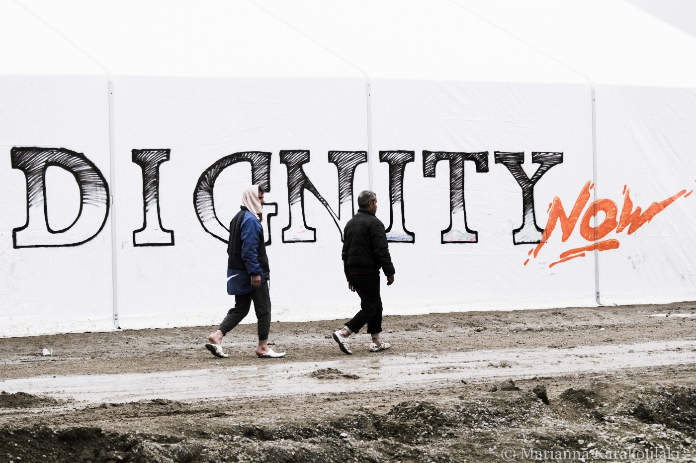

### DEBATE: What to do when volunteers become lackeys of authorities?
#### Our voices are being silenced\. It’s not just by authorities who have and still want to arrest us but by fellow volunteers, who are slowly emulating and sucking others into the very hierarchical structures and operational ways of INGOs they once claimed to detest\. They fear speaking out, content with just delivering basic aid, celebrating their work, competing for donations, but neglecting their responsibility as witnesses\.

Photo: Marianna Karakoulaki

**_Our friends from Shoufu collective have asked us to publish this opinion piece, hoping it could start a much needed dialogue about changes within volunteer community\. As their concerns are similar to concerns of many other volunteers we’ve talked to, including some of our own staff members, we are looking forward to hearing your thoughts\. AYS_**

It’s been over two years since an unprecedented number of international volunteers descended on Greece, the Balkans, France and the other places that have been impacted by this man\-made humanitarian catastrophe\. Calais, once a shelter to thousands, lies in ashes; its prisoners condemned to the forests and the streets of Paris\. All over the Balkans, bigger fences and smaller cells are being built for all those that dare to cross these ‘closed’ borders\. Police brutality has been consistently reported on the Serbian/Hungarian border\. In Greece, the hopelessness of thousands, trapped in camps on islands and mainland, is resulting in violence and increasing suicides\. International volunteers have done much to document and report from the ground these atrocities and blatant breaches of human rights committed against our fellow human beings\.

Collectively, we have been on the ground since little Aylan’s body washed ashore\. We can’t make Europe open its borders but we’ve made little differences to many people’s lives, and in some cases, saved them from the sea — showing humanity at its best\. The solidarity movement has been a remarkable example of people power and the triumph of civil society — of you and me, ordinary citizens\.

However, it was upon our recent trip to Chios that we were left with a feeling of distaste\. Not just at the inhumane conditions imposed by Europe but ourselves, but our own role as volunteers\.

It’s for all of us that we are writing these words\.
We have often been encouraged to cooperate with authorities in order to continue providing basic aid\. However, as we fill gaps left by humanitarian actors and take on the state’s responsibilities, cooperation can seamlessly slide into complicity in systematic violations of human rights\. For instance, when we agreed to distribute blankets and tarps during the winter, weren’t we enabling authorities to keep holding people in flimsy summer tents without electricity or heating? When we spend on items that the INGOs are supposed to provide, are we best utilising the money entrusted to us by friends and family back home?

Instead of collectively taking a stand against the inhumane and degrading response, we let ourselves become lackeys of the INGOs and authorities\.

As witnesses to repeated breaches of human rights, we believe in the responsibility to document and to speak out against the mistreatment and negligence we repeatedly witness but often refuse to expose for fear of losing our presence\. To remain silent is in direct conflict with all we came here to do and only perpetuates the current climate of impunity\.

Our voices are being silenced\. It’s not just by authorities who have and still want to arrest us but by fellow volunteers, who are slowly emulating and sucking others into the very hierarchical structures and operational ways of INGOs they once claimed to detest\. They fear speaking out, content with just delivering basic aid, celebrating their work, competing for donations, but neglecting their responsibility as witnesses\.

The very same have repeatedly refused to make a collective stand and seem more interested in promoting their work than the malpractices and breaches happening daily\. Who as every day witnesses have the power to document but wilfully neglected their responsibility as observers of the crisis\.

What is more, we are seeing arguments rooted in the issue of speaking out culminating in professionalism being sacrificed, while the hierarchical format allows for decisions that don’t best benefit those we are here to support\.

At times it seems as if we have forgotten that our permission to operate derives from the consent of the people we’ve come to help\. Yet, we rarely involve refugees in the choices we make and in our interactions they are reduced to passive recipients of our “assistance”\. To distance ourselves from the people removes us from understanding their will\. Instead, amidst the smiling selfies with orphaned children and pats on our backs, all too often we hear volunteers celebrate their ‘amazing experience’\. It is not a social badge of honour for you to wear or post on your Facebook when you go home\. It is not about the amazing volunteers\. This is not amazing, it will never be amazing\. This is a tragedy\. And we’re a part of it\.

We do not claim to have the answers\. But the absence of a conversation endangers the very essence of what made volunteers different to those actors who consistently fail to fulfil their humanitarian mandate\. It is our flexibility, independence, creativity, and above all a sense of injustice that has allowed us to build rescue teams, schools, kitchens, women’s shelters or legal teams; to provide immediate and effective support to vulnerable persons abandoned in the squalor of the camps, and ever more importantly, establish a record of accountability\. In short, it endangers the unique work of independent volunteers\.

Our hands are not tied, if we don’t want them to be\.

In this tragedy we are all inadvertently political actors\. By already being willing to help, you have taken a political stand\. We mustn’t forget many of the refugees who have become our friends, in many cases our co\-volunteers, came here because they told the truth, they fought for freedom, against repression\. For us not to do the same is simply a dishonour to them\.

This is a call for all volunteers involved in the refugee crisis to recover the spirit of questioning, the one that brought us to support those Europe shut out\. At times, maybe the answers will be uncomfortable, lead us to fundamentally change how we work, or even question our own existence\.

The time has come to demand accountability from the authorities and support integration, psychosocial, legal or media projects that truly empower the refugee community\.

_Shoufu — Long term and returning volunteers since 2015_

_Converted [Medium Post](https://areyousyrious.medium.com/debate-what-to-do-when-volunteers-become-lackeys-of-authorities-765b45e561f8) by [ZMediumToMarkdown](https://github.com/ZhgChgLi/ZMediumToMarkdown)._
