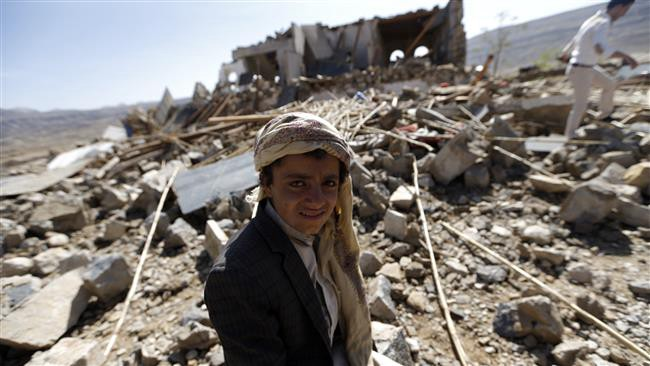
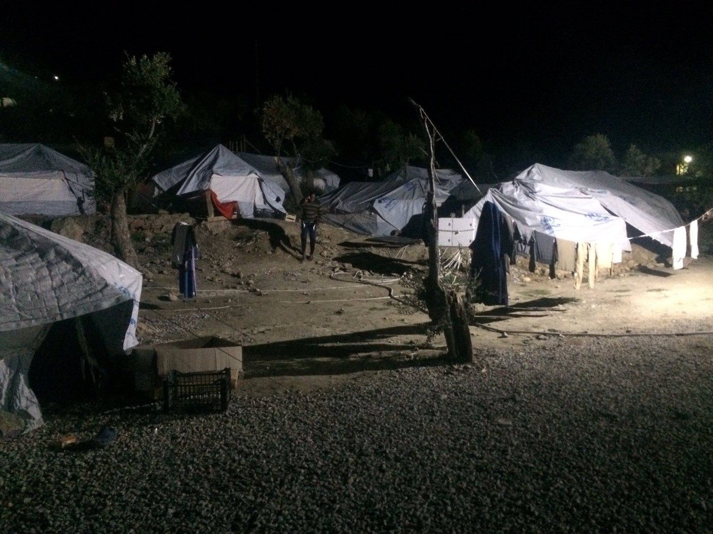
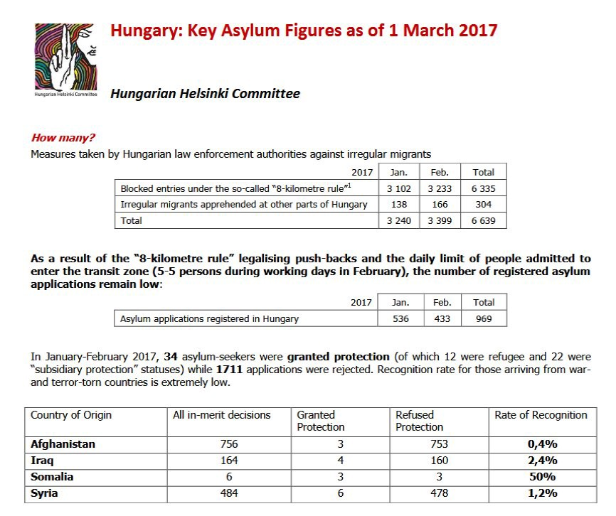

### AYS DAILY DIGEST 25\.03\.2017 — UN backtracks on statements, halves civilian deaths incurred over course of the war

The result of a Saudi airstrike on Sana’a, Yemen, February 16, 2017\. Photo Credit: AFP
#### Feature

[The UN reported](http://www.ohchr.org/EN/NewsEvents/Pages/media.aspx?IsMediaPage=true) that an average of 100 civilians are killed monthly as a result of the war in Yemen unleashed by the Saudi government and its coalition\. The UN said that 4,773 civilians have been killed and 8,272 were injured, most of them at the hands of the Saudi coalition\.

This contradicts previous UN statements by Jamie McGolderick, who [stated in January](http://www.independent.co.uk/news/world/middle-east/yemen-civil-war-civilian-death-toll-10000-killed-40000-injured-conflcit-un-reveals-a7530836.html) that 10,000 civilians have been killed in the war and 40,000 were injured\. Even then, McGolderick said, these figures are likely an underestimation\. This number is based on counts released by health facilities, and the likelihood is high that the real figure may be yet larger\.

Even these figures do not capture the full horror of the war, as Saudi Arabia is currently imposing a blockade on the country, which is almost entirely dependent on imported food\. Malnutrition is rampant in the country, as attested by the numerous photographs of famished people with barely any fat left in their bodies\. 17 million of those are considered food insecure, and seven million Yemenis face starvation\. These images are rarely shown in the Western media, as the governments of the US, UK, and France treat Saudi Arabia as an ally, have sold billions of dollars worth of weapons to be used for the war effort \(although the US has halted sales as of December\), and in the case of the US, sends officers to directly aid in the logistics and planning of attacks\.

In upholding its blockade, the Saudis have inflicted irreparable harm\. This week, the story most reflective of this violence was an attack on a boat carrying 32 Somali refugees, who were attempting to return to their homeland\. The attack was carried out by an Apache helicopter, and all of those on board were killed\.

The UN’s backtracking represents a dangerous trend of minimizing the crimes of the Saudi regime\. It is unknown what exactly prompted such a response by the organization, but the goal is clear: to minimize the violence that has turned Yemen into hell for the past two years\.
#### Afghanistan
### One\-third of children in Afghanistan unable to attend school

Save the Children reported that a third of the children of Afghanistan are unable to attend school\. 3\.7 million children are thus put at risk for numerous problems, from child marriage to recruitment by armed groups\. There are a number of factors responsible for this problem, chief among them is ongoing war in many parts of the country and the widespread poverty that forces young children to work just to feed the family\. Save the Children also estimates that 400,000 children will be forced to drop out of school this year alone\.

The problems faced by Afghanistan are compounded by Pakistan’s forcible deportation of the Afghan refugees who have lived in the country since the Soviet Union’s war in the country, circa 1980–88\. 600,000 Afghans were expelled in 2016, and it is expected that an additional one million will join them in 2017\. The children of “returnees” \(the term itself is laughable, as many of those returning have lived in Pakistan their entire lives\) are even more at risk, as their parents are often unable to find jobs\.

In light of all of this, it becomes more and more absurd that the EU continues to classify Afghanistan as a “safe country”\. Because it is ostensibly safe in their homeland, Afghan refugees have a more difficult time getting asylum\. Many live in fear that they may be deported\. This is the very fear recently led to a wave of suicides by youth in Sweden\.
#### Iraq
### Nearly 4,000 civilians killed in Mosul since mid\-February\. This week’s violence leads to pause in the offensive\.

An Iraqi military source reported that 3,864 civilians have been killed since mid\-February in the operation to retake West Mosul from the grasp of ISIS\. An additional 22,000 injured refugees fleeing Mosul have made their way to refugee camps and field hospitals\. 10,000 homes were also reported destroyed in the same period\.

This week has been particularly deadly the civilians of Mosul\. On Wednesday, 43 civilians were reportedly killed in an airstrike by the coalition, supposedly done “in error”, according to an officer of the Iraqi military\. Then, on Thursday, an airstrike killed 237 civilians while bombing two residential compounds in the city\. These figures constitute the single greatest number of people killed by the US military in a single attack\. Attacks with civilian casualties of such caliber have not been seen since the Vietnam War\. An Iraqi special forces officer, speaking to the New York Times, said that there has been a significant relaxing of the coalition’s rules of engagement since the inauguration of Donald Trump as president\.

The high rate of civilian casualties this week has led to a spokesman of the Iraqi government saying that the push to recapture the rest of Western Mosul will be temporarily suspended\. A statement by the army said that future attacks against ISIS will be carried out by ground forces trained for urban combat\. With 600,000 civilians remaining under ISIS\-controlled areas, one can only hope that they keep their promise\.
#### Syria
### Suspected gas attack in Northern Hama leaves one doctor, at least one patient dead

Dr\. Shajul Islam, a British doctor currently in Syria, has posted a video showing a patient who was reportedly the victim of a gas attack in Lataminah\. He has passed away\. A [link to a fundraiser](http://www.totalgiving.co.uk/mypage/medicalappeal4syria) was posted to purchase protective clothing so that doctors can continue to operate in such conditions\.
### Airstrike on prison in Idlib leaves at least 16 people dead

An overnight airstrike on a prison in rebel\-held Idlib was reported by SOHR\. The strike took place in the early hours of Saturday morning, and the dead included both prisoners and prison guards\. SOHR added that prisoners were reportedly shot dead while attempting to flee during the attack\.
### Rebel evacuation in Homs postponed until Monday

After a deal was struck between the rebels and the Assad regime which allowed the former to leave, it will be pushed back to Monday, according to officials\. Evacuations for rebels and their families began last week, and the evacuation is expected to be the largest one thus far\. An estimated 10,000 to 15,000 are expected to leave Al Waer in the following weeks, to go to other rebel\-held areas\.
#### Greece

People continue to sleep in shabby tents in Moria\. Photo Credit: NoBorders
### Refugee family in Athens urgently needs medical help

### Numbers

38 arrivals reported today in Chios
#### Hungary
### Hungarian Helsinki Committee releases new numbers on asylum seekers in Hungary

#### Austria
### Deportation to Afghanistan to take place on March 29

The flight is supposed to take place at 1:30 in the morning, with an unknown quantity of people leaving from Vienna to return to their war\-torn homeland\. Please warn anybody who you think might be affected\!
#### France
### Kesha Niya Kitchen in Dunkirk to close shop in March 31 to regroup, but they still need help\!

### MSF schedules for next week in Paris

MSF is providing medical help on the week of March 27 in the following times and places:

Monday from 2pm to 6pm:
 Porte de la Chapelle after the bridge in right hand of the metro exit ligne 12

Tuesday from 2pm to 8pm:
 Porte de la Chapelle after the bridge in right hand of the metro exit ligne 12

Friday from 2pm to 8pm:
 Porte de la Chapelle after the bridge in right hand of the metro exit ligne 12
#### Italy

Today’s demonstration in Rome\. Photo Credit: Progetto20k
### Activists from Northern Italy prevented from joining demonstrations in Rome

Activists were halted by the police at the highway toll booth and prevented from joining today’s demonstration in Rome\. The incident involved 150 people traveling on three buses\. Activists from Turin had their documents confiscated and they still have not been returned\. Six of the activists who were held by police officers were released recently\. Five of them were presented with an expulsion order barring them from the city of Rome for 3 years, and one received an expulsion order for one year\. They were accused for the possession of a few t\-shirts, jackets and a smoke bomb\.
#### Sweden
### Unaccompanied child refugees to have their options expanded

Unaccompanied minors will get more possibilities to stay in Sweden\. A judicial decision by the Migration Court \(Migrationsöverdomstolen\) regarding a 17\-year old boy from Afghanistan without any family or network in Afghanistan, who had lived in Iran most of his life before coming here in 2014, will be used as a precedent\. The highest migration court decided not to return him to Afghanistan since he lacked a network there\. About half of the 24,000 unaccompanied minors that has claimed asylum in Sweden in the last two years came from from Iran, most often from refugee camps\. This new legislation will therefore affect many young persons and could also mean that a higher number will get to stay after the day they turn 18, and otherwise would have been sent back due to the expiration of their time limited residence permits\.

The Migration Agency are currently analyzing this new legislation and what consequences it might have, such as how many that will be affected and exactly what the impacts will be\.
#### Croatia

Every last Saturday of the month, the Are You Syrious Team organizes monthly birthday party in asylum center Porin in Zagreb \(birthday cake \+ present for every child that had their birthday that month\) \. With disco lights and a DJ, this is a big fiesta for all generations\.

On the photo, you can see a little part of 160 pieces of cake that were served today\.

_Converted [Medium Post](https://areyousyrious.medium.com/ays-daily-digest-25-03-2017-abea350d398e) by [ZMediumToMarkdown](https://github.com/ZhgChgLi/ZMediumToMarkdown)._
