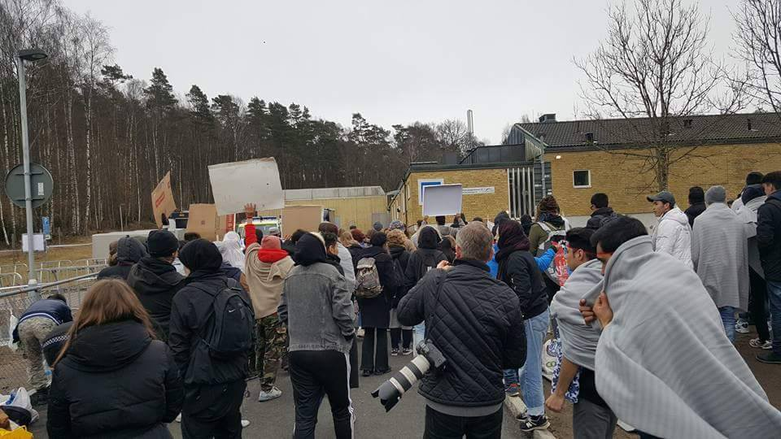
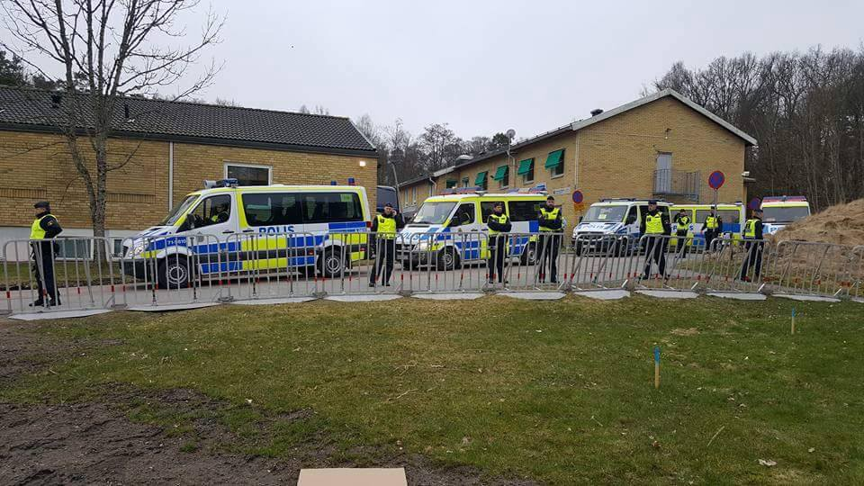
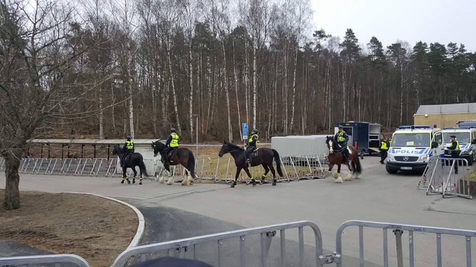
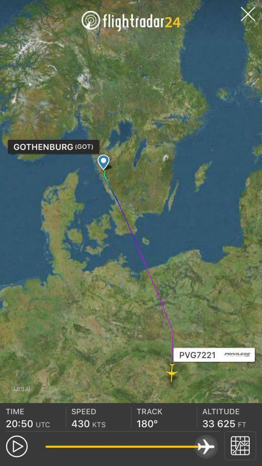
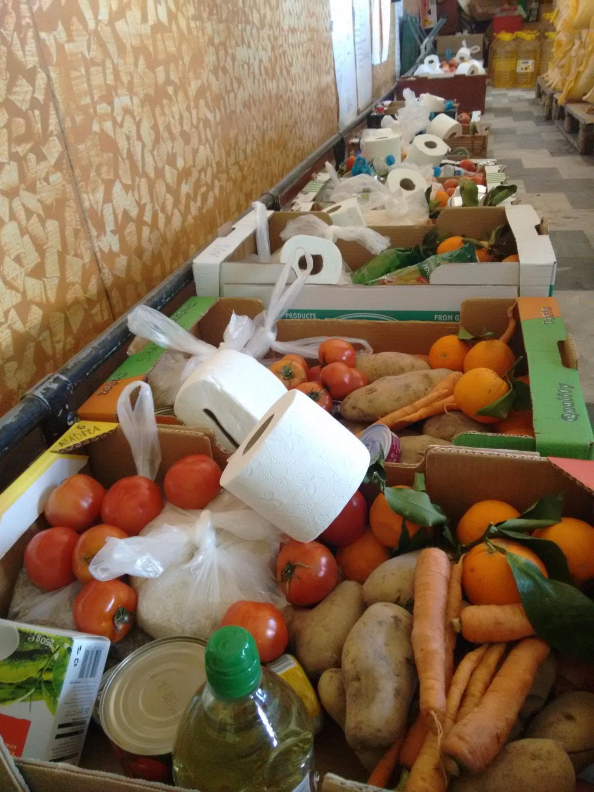
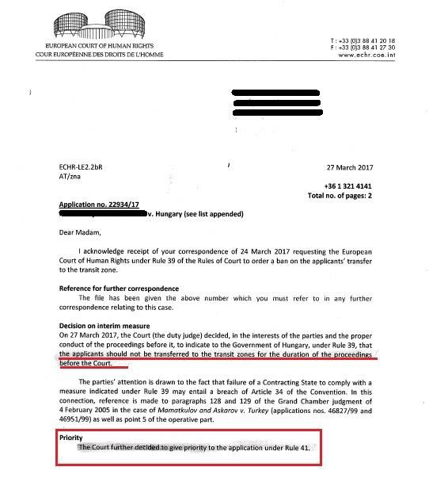

### AYS Daily Digest 28/03/17: Mass deportation day for refugees in Sweden and Austria
#### Protests against deportations in Sweden, Austria and the UK \|Police raids with arrests on Greek islands \| Hungary puts its inhuman law into practice; another court decision out against Hungary \| Austria, along with night deportations, wants out of the relocation process \| German refugee language education system put into question

 \)](assets/eb3bed5c18ec/1*ICbSf9AxzxwJRG2nHGXt9g.jpeg)

Austrians protest against deporting of the refugees and asylum seekers from Vienna, evening of the March 28 \(Photo: [Arye Wachsmuth](https://www.facebook.com/arye.wachsmuth) \)
#### FEATURE
### Europe’s silent plan for sending people off to danger unravels with mass deportations

20 Afghan nationals have been gathered in one of Sweden’s 5 detention centers in Kållered, outside Gothenburg, for tonights’ deportation\. The detention center had been shut down for visitors since the night before but protesters had gathered outside, lighting candles and holding signs\. Reportedly, the protesters were outnumbered by the police even though hundreds of both local people and those who had traveled from different parts of the country have gathered during the day\.

Photo: Lisa Yxmark

The police had set up a parameter with tape and barricades to ensure the transport and before the detainee transport arrived police horses and additional cars entered the site\.

Photos: Lisa Yxmark

5 persons out of the approximately 20 people were taken out of the deportee list after legal interventions or because their embassies would not issue travel documents for them\. The remaining 15 or so were transported by a rented tourist bus from the family owned Company Leja touring around six o’clock\. Some of the protesters followed to the Landvetter Airport and carried on with the protest there and made sure to inform people travelling from there about [the deportation](https://www.blankspotproject.se/sweden-launches-second-wave-of-controversial-afghan-deportations/) \.

At 9\.39 the FRONTEX chartered flight with Spanish luxury Aviation Company Privilege Style lifted of\.

Ironically, the people traveling back to uncertainty and danger are leaving in “Privilege Style”, a Spanish company\. The plane was heading to pick up others in Austria\.

Before heading to the deportation destination Kabul it was set to pick up additional deportees in Vienna\.

The people in detention \(additional persons may have been escorted directly to the Airport from their homes if they agreed to sign return documents\) were all male, some of them very young, although all deemed to be over the age of 18 by the migration board\. Although some of them could also have had temporary residence permits that have been retracted, for example a permit based on a work permit which will not be renewed if one fails to meet very strict requirements\.

Later tonight, we have received information that activists in Sweden and Austria have been able to stop deportation of some of those who were supposed to be deported from the mentioned countries tonight\.
#### SEA

At least **811 lives were lost** since the beginning of the year in the sea, on the dangerous way to Europe, Comisión Española de Ayuda al Refugiado reports\.

](assets/eb3bed5c18ec/1*W61RVhw8J2xkDgFIxyNEJA.jpeg)

Infographics: [**CEAR**](https://twitter.com/CEARefugio)

While under constant pressure, suspicions and blunt accusations coming from politicians, the rescue teams continue saving lives on the Mediterranean\.

■■■■■■■■■■■■■■ 
> **[MSF Sea](https://twitter.com/MSF_Sea) @ Twitter Says:** 

> > Yahya (17) was detained and tortured in #Libya and he's now on #Aquarius: "I want to write a book to tell people not to trust smugglers". https://t.co/hMNBOk6rXs 

> **Tweeted at [2017-03-28 05:31:01](https://twitter.com/msf_sea/status/846595461364568064).** 

■■■■■■■■■■■■■■ 

#### GREECE
### Police raid in Souda camp on Chios

A police raid happned at Souda camp on Chios this morning at 7\.30 on Tuesday morning\. The raid reportedly lasted for two hours and involved dozens of officers searching residents and tents in the wake of tension between rival groups \(Algerians and Afghans\) staying at the facility\.

](assets/eb3bed5c18ec/1*NkT81a_jLeFRBakml4jiIg.jpeg)

Photo: [City Plaza Squat‏](https://twitter.com/sol2refugees)

According to [media](http://www.ekathimerini.com/217203/article/ekathimerini/news/police-operation-at-chios-migrant-camp-leads-to-arrests) , the police will make at least three arrests after „the discovery of knives and other objects that could be used for violence“\. Along with the police officers, there troops of riot police and drug enforcement officers were also present on site\.

■■■■■■■■■■■■■■ 
> **[City Plaza Squat](https://twitter.com/sol2refugees) @ Twitter Says:** 

> > Police operation at #Moria #DetentionCenter in #Lesvos this morning too. #Refugees arrested &amp; moved to another #detention. #StopEuTurkeyDeal https://t.co/gsiW2hKLAl 

> **Tweeted at [2017-03-28 08:51:05](https://twitter.com/sol2refugees/status/846645810129457152).** 

■■■■■■■■■■■■■■ 

#### Prison, Food boxes, Spring on Lesvos…an update

> It is blooming everywhere on the island and the warm sun is back\. The situation here for most refugees continuous getting worse though\.
 

> People are still being arrested and imprisoned, mostly those from Pakistan, Bangladesh, Marroco, Algeria\. Police is targeting these nationalities for their low chances of getting asylum\. 

> People continue to have to fear to walk to the city to use the internet or have a coffee, fear to walk to Moria camp to renew their papers or get their cash card\. 

> Moria camp is more and more constructed like a prison…even more than before\. While the EU celebrates itself for providing winterproof shelters \(in March after the cold is over anyways…\. \) it is clear that they don’t do it to improve the well being of the people in the camp\. Much more it is another way of control\. Moria is now structured into different sections that are mostly made up by containers\. Access is only possible for people living in the section and only with a wristband they have to wear\. —read the [entire post](https://www.facebook.com/NBKLesvos/photos/a.722860677853724.1073741829.689281511211641/903345163138607/?type=3&theater) by [**No Border Kitchen Lesvos**](https://www.facebook.com/NBKLesvos/) 

### Skype call information for urdu speakers

The [Mobile Info Team](https://www.facebook.com/mobileinfoteam/?ref=page_internal) has shared some important information:
If you are an Urdu\-speaker in mainland Greece and want to get a white card and apply for asylum, the Skype account which you need to call is **aslyum\.service\.urdu** 
There is no other Skype account which you can call\. If you have been calling asylum\.service\.pakistan, please delete it and instead call asylum\.service\.urdu
It is still difficult to get an answer but calling on Skype is the only way\. Please also remember that you must call on the correct days at the correct times\. Urdu\-speakers in **Athens area** can call from **Monday to Thursday \(2pm\-3pm\)** , while Urdu\-speakers in **the rest of Greece** can call on **Mondays \(2pm\-3pm\)** , **Wednesdays \(2pm\-3pm\)** and **Thursdays \(11am\-12\)** \.
### _Opening a bank account in Greece_

The [National Bank of Greece](https://www.google.gr/maps/place/National+Bank+of+Greece,+Mela+Building/@37.9812673,23.7284315,15z/data=!4m5!3m4!1s0x0:0xb8f541786b1e6b89!8m2!3d37.9812673!4d23.7284315) confirmed to [News That Moves](https://newsthatmoves.org/en/) that you are able to open a bank account in Greece if you follow the procedure explained in detail on [their website](https://newsthatmoves.org/en/qa-opening-a-bank-account-in-greece/) \.
#### LGBT Support Group for Refugees is looking for a Project Manager

The [LGBT Support Group for Refugees in Greece](https://www.facebook.com/groups/LGBTrefugeesgreece/?hc_location=ufi) is growing and needs a new full\-time Project Manager\. This is a challenging and diverse role that involves a range of interesting tasks\. A dedicated, dynamic individual who preferably has prior experience of working with refugees and LGBT individuals is whom they need\. The candidate should also have experience of managing a team, fundraising, budgeting and must be comfortable with public speaking and have strong IT skills\. It is based in Athens, they require a minimum commitment of \(ideally\) six months\. Please contact the organization for detailed job description and details — before April 9 — on: refugeesgreece@gmail\.com
#### Farsi translator needed

The [Amurtel Greece for Refugee Mothers and Babies](https://www.facebook.com/AmurtelHellasforRefugeeMothersandBabies/?ref=page_internal) are looking for a female farsi translator to work with them in their centre in Athens\. If you know anyone who could be interested, please contact: amurtel\.gr@amurtel\.org

](assets/eb3bed5c18ec/1*9DETUWFOyTuyWUBruUCZVA.jpeg)

“Children aged 3 & 4 waiting months for processing with their families in open refugee camps in Greece” — by: [Citizens UK](https://twitter.com/CitizensUK)
#### SERBIA
#### The first day of school

 \)](assets/eb3bed5c18ec/1*sKoxXxWxMBjwMnxTz7n-Lw.jpeg)

“Do you remember your first day in school? Today we took kids refugees to their first day in new school in Serbia\! Sitting around the round table and talking about school stuff we remembered our first day\! We remember standing in line before entering this big door with our palms sweating\! We remembered our dreams and hopes wondering what these kids must be thinking about at that moment?” \(Photo: [Refugees Foundation Serbia](https://www.facebook.com/izbegliceusrbiji/) \)
#### HUNGARY
### Hungarian detention centres ready to imprison hundreds

[A statement by the interior ministry](http://www.kormany.hu/en/ministry-of-interior/news/border-protection-agencies-fully-prepared-for-entry-into-force-of-reinforced-legal-border-closure) said the country’s prison service installed 324 shipping containers at two camps, all for the purpose of detention of everyone except the unaccompanied minors under the age of 14\. As [announced](https://www.google.hr/url?sa=t&rct=j&q=&esrc=s&source=web&cd=1&cad=rja&uact=8&ved=0ahUKEwj4od2AnPrSAhUiQJoKHUerC-wQFggXMAA&url=https%3A%2F%2Fmedium.com%2F%40AreYouSyrious%2Fays-digest-28-2-hungary-to-build-that-wall-making-us-all-pay-b37ae77bd880&usg=AFQjCNHg_qOxtLb8FBizwJVh2pOpINusFQ&sig2=E-CNFWOUmZ0THFXDWHNMyA&bvm=bv.150729734,d.bGs) , all asylum\-seekers entering Hungary as well as those already in the country will be confined in camps while their applications are processed\. That includes the several hundred people who have so far been lodged in refugee camps inside the country\. That means that they face relocation to the border detention camps\.

However, after the [last court decision made in favor of the refugees](ays-daily-news-digest-14-03-17-volunteers-jump-in-as-authorities-fail-to-protect-people-3ee2f9bdf5da) , thanks to the Hungarian Helsinki Committee, another legal decision was made, prohibiting the removal to the transit zones of the eight minors and one woman\. The European Court of Human Rights [issued a temporary order](http://index.hu/belfold/2017/03/28/ejeb_kiskoru_menekult_tranzitzona_tiltas/) on Monday prohibiting their transfer, and gave the Hungarian government until April 10 to react to its concerns over conditions at the zones\.

UNICEF also [reportedly](http://budapestbeacon.com/featured-articles/strasbourg-court-temporarily-halts-transfer-8-unaccompanied-refugee-children-transit-zones/45348) declared that “the detention of children who are fleeing violence and persecution in the hopes of a better life causes a newer traumatic experience\.”

by HHC

At the meeting of the so called “Visegrad countries”, Hungary’s Prime Minister Viktor Orban said his country was further sealing its borders and tightening regulations to block access to any more migrants\.

> “A part of the 150km\-system to be built will be an optical cable fixed to the fence, which is able to detect not only those situations when someone attempts to cut the fence, but also when someone only touches or pulls it\. The devices detect people around the fence, alert the control centre either in Bácsbokod or Mórahalom, where colleagues monitor their section of the border for 24 hours per day\. At the signal, the picture from the camera where detection has happened shows up in the monitor, and those colleagues working at the control centre inform the commander of the border section concerned, who in turn sends border hunters to the given place\. The search is helped by big reflectors that are set above the cameras, so the border offenders won’t stay unobserved even in the night\. In addition, a loudspeaker informs the detected people in English, Arabic, Farsi, Urdu and Serbian, that they have reached the Hungarian state border\.” — _A statement by the [Hungarian Police](https://l.facebook.com/l.php?u=http%3A%2F%2Fwww.police.hu%2Fhirek-es-informaciok%2Flegfrissebb-hireink%2Fzsaru-magazin%2Fokoskerites-a-hataron&h=ATN-htSXB4MzcQK3OCDYSG1D4wNbzjrcce0RLnz2IenrwZiPuV9hDC-ke9nKSgjw1DdP-y6yVb1Csi06C3jixLzEOHtpIoJ4DBaZEGnv7FDO57eXTZVX4lkskDWzxQUxS_w)_ 

### Shocking lack of criticism and clarity by the European Commisioner

**_What happens in Syria can be felt in Hungary; Hungary has been part of a comprehensive and European solution; EU\-Turkey Statement continues to work so the number of arrivals in the Aegean Sea has dramatically fallen_** — all these things, and a lot [more](https://ec.europa.eu/commission/commissioners/2014-2019/avramopoulos/announcements/remarks-commissioner-avramopoulos-occasion-his-visit-budapest_en) , were said by the European Commissioner for Migration and Home Affairs, Dimitris Avramopoulos, at a [meeting](https://l.facebook.com/l.php?u=https%3A%2F%2Ftwitter.com%2FAvramopoulos%2Fstatus%2F846706075122487296&h=ATMo9mKUe39iGE7NQsfBKd8i715pV3jP5MBVQje_QEiJlqoyMOaUhWYjavR7yWgbm-df84spiqHr2FcJomv5RdRh9NErI4IToVDxuwqbR4MgKokvuna4BQeNENGczvCf8OM) to the leaders of a country that gathers para\-militia whose actions go against the basis of the EU and the Human Rights

The issue of European solidarity and how it applies to broader migration and asylum policies has left sharp divisions, with Hungary leading the way\. Still, in the midst of debates and enforcing of the EU spirit, the EC said to Hungarian leaders, among other things:

> “ Reinforcing and better protecting our external borders and working with key third countries has proven essential\.
 

> We will start the first round of negotiations of the status agreement with Serbia next month, so that the European Border and Coast Guard can also be deployed at their borders — this will be crucial for the region, for Serbia, but also for Hungary\.
 

> Hungary is one of the most European countries, with a longstanding European history and tradition, has made an enormous contribution and, at the same time, has greatly benefitted from the European project\.” 

#### ITALY

 \)](assets/eb3bed5c18ec/1*ogVHvclp7Y4kBPYUDyPI1g.jpeg)

**28 refugees** , asylum seekers, **slept on the street of Pordenone** the past night, due to overcrowded underorganized welcome facilities \(Photo: [Rete Solidale Pordenone](https://www.facebook.com/retesolidalepn/) \)
#### AUSTRIA
### Night deportations and refusing relocation

Great reactions from the citizens, activists and NGOs came after the first group deportations were announced earlier today\. People have organized a [protest](https://kurier.at/leben/kiku/kundgebung-gegen-abschiebungen/254.964.648) as some of the young asylum seekers were to be deported back to their home countries where many of their lives are under threats\. Having already been through a lot of problems that war and persecution have brought on them, these people are now facing push backs to other countries or deportations, that will surely have severe [affect on their psychological health](https://l.facebook.com/l.php?u=http%3A%2F%2Fwww.newyorker.com%2Fmagazine%2F2017%2F04%2F03%2Fthe-trauma-of-facing-deportation&h=ATNTGoy5lUuUlgtexZKT14pwn7u-D4H0TC1etCCJF-OwirfU51zdkr2Ksi-EDixYAB191w59dZ7neeljzuBe5XyF4SJ7tSqYeoWC5bcAh3a1GjufSrWE&s=1&enc=AZMpxqpoiebuiDWKZbpWFRusfsCEoLoi0HfCiulrS4xEqw-6BWcZlnDMFzWCv0jx2HPgVNR8vEgW0EBW8UXaJ0mR&hc_location=ufi) as well\.

Photo album of the night demonstration in Vienna: [here](https://www.facebook.com/media/set/?set=a.1460583230658726.1073741899.100001211886184&type=3)

Austria is currently expected to accept 2,000 people seeking asylum from Greece and Italy, as a part of the relocation system\. On the other hand, Austria is planning to pull out of the EU refugee relocation program\. 
In response, Austria is to seek an “exemption” or “postponement” from the [Europe Union \(EU\) refugee distribution program](http://m.dw.com/en/eu-unveils-reform-plans-for-refugee-redistribution/a-19167240) that requires countries in the bloc to accept a mandatory and proportional distribution of asylum\-seekers who arrive in other member nations\.

> “Austria can only choose to act outside the law, which we would find both deeply regrettable and not without consequences” — _EU commission spokesperson said_ 

The EU is considering more [changes](http://m.dw.com/en/eu-unveils-reform-plans-for-refugee-redistribution/a-19167240) in refugee related policies that will affect Dublin procedure and its application\.
#### GERMANY

Continuing earlier practice of charter deportations, Germany has today deported 15 people to Afghanistan\.
#### A fail in refugee language programs?

In an internal government showdown, the German National Audit Office has accused the Federal Labor Agency of wasting money, DW [reports](http://m.dw.com/en/refugee-language-programs-wasteful-say-german-auditors/a-38155415) \. The programme, that was based on a short time frame, was apparently inadequate \. Although the provision of entry\-level German language courses was aimed at [providing “active labor market support,](http://m.dw.com/en/when-refugees-want-to-work-in-germany/a-18737104) ” they counted language courses for children up to 13 years of age and also had some inconsistencies in finances\. 
Still, one thing is interesting to note\. As unfortunately more and more people are pushed back on accounts of Dublin III, many of whom spoke excellent German\. That is not the case in countries like Croatia, where all efforts in organizing the language lessons lay on NGOs and volunteer work\.
#### UK
### Group deportations under way in the UK as well

Volunteers and activists have blocked the non\-commercial runway at Stansted Airport tonight in an attempt to halt a mass deportation flight to Nigeria and Ghana\.

Since 2002 the Home Office has organised mass deportations\- largely to former British colonies\- every few months\. Mass deportation flights are notoriously secretive and devoid of scrutiny, departing from undisclosed locations in the middle of the night\. Every single deportee is escorted and shackled in a seat between two guards, who regularly employ the same violent restraints, the [activists say](https://enddeportations.wordpress.com/resistance-march-2017/) \.

> “Mass deportations like the one we stopped tonight are immoral, unfair and illegal\. I don’t want to stay silent in the face of mass deportations that are deliberately rushed and secretive\.” 

For photos and a more detailed text about the deportations and UK policies regarding that matter, go [here](http://www.huckmagazine.com/perspectives/activism-2/exclusive-activists-blockading-stansteds-runway-stop-deportation-flight/) \.

We strive for correct information, collaboration and fairness, so let us know if something you read here is not right\. If you have any information you want to share, feedback or correction, contact us on Facebook or write to: areyousyrious@gmail\.com

_Converted [Medium Post](https://areyousyrious.medium.com/ays-daily-digest-28-03-17-mass-deportation-day-for-refugees-in-sweden-and-austria-eb3bed5c18ec) by [ZMediumToMarkdown](https://github.com/ZhgChgLi/ZMediumToMarkdown)._
