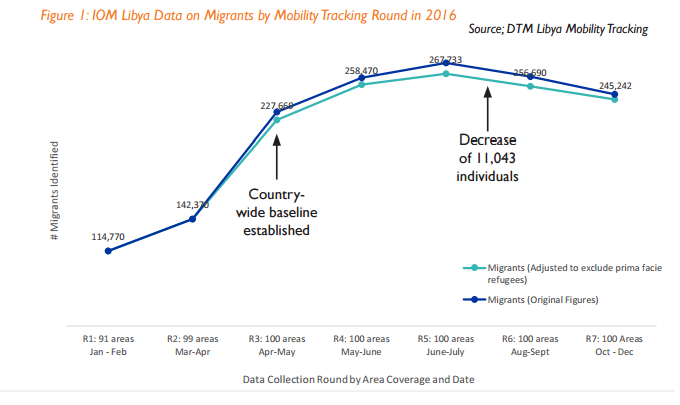
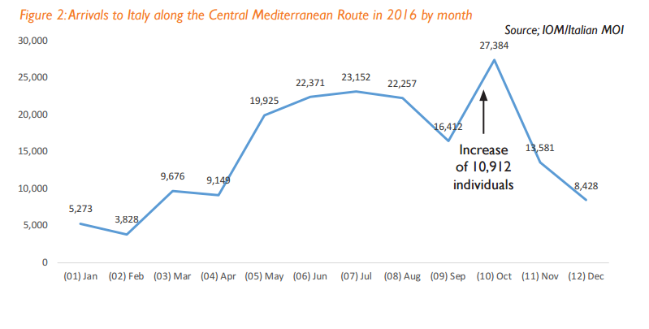

### AYS Daily Digest 29/03/17: Estimated 380,000 refugees in Libya in February
#### New feared tragedy in the Mediterranean / UNHCR messing up housing deals in Greece/ More arrivals while tensions grow on the Greek islands / Minors repealed between Italy and France / Calls against deportations in Paris

](assets/615289a1c528/1*TgT12bhnjLqraDpnyYyyrg.jpeg)

Refugees just after arriving in Lesvos\. Photo by [**Legis**](https://www.facebook.com/ngolegis/)
### Feature

Last year there were record numbers of refugees reaching Italy coming from Libya\. For that reason there has been increasing surveys in the country with the objective of finding out how many refugees are there awaiting to cross to Europe\. The Displacement Tracking Matrix \(DTM\) for Libya is a Flow Monitoring exercise being used from the start of 2016 to capture data on migration flows in the country, conducting daily assessments at Flow Monitoring Points \(FMPs\) and surveys with people in transit\. According to IOM, the data collected for these studies is triangulated with key informants and cross\-referenced by DTM’s experts and is all based on estimations\.

Between January and April 2016 DTM expanded its coverage to reach all areas and established a country\-wide baseline by May\.

As seen in the graphic, the numbers of refugees waiting to cross the Mediterranean to Italy grew enormously until about August when they had a slight decrease until the end of the year which was consistent with the rate of arrivals in Italy throughout the year\.

Comparing the two graphics it’s easy to see that a big number of crossings between September and December brought the numbers on the Libyan side down, although we can’t discard that the influx into Libya could have also slowed down during those months\.

In 2017, DTM updated the data collection methodology for Flow Monitoring Points assessments to get more details on migrants key entry, exit and transit points in Libya so data is gathered at key points where refugees gather and transit\.

The report conducted between 15 of December of 2016 and 15 of February of 2017 results of 598 assessments and gives us quite disturbing estimations about the numbers of refugees attempting to make the journey to Europe at the moment\.

**There could be 380,000 refugees in Libya** , living in very bad conditions, just waiting for a chance to make the dangerous crossing to Italy\. Most of them are likely to be adult males \(97%\) \. It’s estimated that 3% are minors and 60% of these are traveling on their own\. The study also states that most of them \(40%\) where observed in the same location for more than 6 months whilst only 19% were present less than 2 weeks\. The main nationalities are Nigeria, Egypt and Ghana\.
### Mediterranean

Sadly, today another tragedy is likely to have happened next to the Libyan coast after a boat capsized\. A Spanish military ship participating in the EU’s “Operation Sophia” to crack down on smugglers, rescued a Gambian boy, aged 16, the only survivor of the disaster\. It’s thought that 146 people could have perished today\. The vessel left on Sunday or Monday from Sabratha, western Libya, with five children and several pregnant women among those on board, the Gambian told a member of the UN High Commissioner for Refugees who met him at a hospital in Lampedusa\. According to the survivor, most of the passengers were from Nigeria, Mali and The Gambia\.

Last night another boat was found, this time with a happier end\. Proactiva Open Arms spotted a boat with about 400 refugees at 4:30 am and manage to take them all on board to safety\.

](assets/615289a1c528/1*lNLyjClBJNJuueJDqoNTuA.jpeg)

Photo by [**PROACTIVA OPEN ARMS**](https://twitter.com/openarms_fund)

A rescue team, [**Sea\-Watch**](https://www.facebook.com/seawatchprojekt/?fref=nf) **,** is looking for Arabic translators at the moment\. Other skills required are very good level of English or German and a valid passport that allows you to leave the Schengen area three times a week\. Contact them via email on sandra@sea\-watch\.org\.
### Greece

Tonight we get disturbing reports from volunteers on the ground about the handling of housing deals in NW Greece\.

**UNHCR officials in Northwestern Greece are reportedly tearing down existing housing contracts and sending people to houses out\-of\-repair\.**

During the winterization process at the end of 2016, vulnerable asylum seekers like single mothers with children from the camps in the Northwestern Greek region Epirus, e\.g\. Katsikas and Filippiada, were brought from freezing tents and living containers to hotels in the city of Ioannina\. The responsible UNHCR office signed contracts with hotel runners and smaller NGOs for ensuring everyday support\. UNHCR promised to house people in the hotels until December 2017\. But a week ago UNHCR staff came to a meeting and announced the accomodation project will be ended immediately and will transfer the residents to other housings in and around Athens by end of this Friday, 31\. March\. The first group of 47 people arrived Kamena Vourla near the city Lamia on Wednesday and found a building in very bad conditions\. Water is dripping off the walls\. People refused to leave and slept in the bus\. Others, who are still in Ioannina asked the UNHCR office for a talk, but were only replied with the sentence: **“either you will all go to the new place \(with disgusting conditions\) or you will be pushed out on the streets of Ioannina\.”** The runners of the hotels Egnatia, Lakkas and Amfithea in Ioannina, and the working NGOs Solidarity Now, Habibi Works are suddenly surprised by this unexpected situation\. The hotels have already started to improve the rooms on the ground of existing longer term contracts and have no idea how to continue\. They even offered to take less than half of the existing payment for continuing the contracts\. The responsible UNHCR staff merely answered with: “the best we could offer is to bring people again next October\.”

Today it was a busy day again on the coats of the Greek islands with reports of dozens of refugees arriving to Lesvos and Chios\.
#### Lesvos

ERCI reported today that, early this morning, a dinghy carrying 46 refugees arrived at the south shore of Lesvos carrying, 2 children and 8 women included\. They arrived at the seen straight away and provided assistance, did translations and also deployed a medical team\. Everyone was reported to be safe and sound apart from a women with just a twisted ankle\. The arrivals today were from a very diverse background, consistently with recent reports, as they registered people from Cameron, Congo, Eritrea, Egypt, Syria, Iraq, Afghanistan and Iran\.

](assets/615289a1c528/1*6lXkOJqa9ucx-5l2Jbzong.jpeg)

Photo by [**ERCI — Emergency Response Centre International**](https://www.facebook.com/ercintl/?ref=page_internal)

](assets/615289a1c528/1*qhkTVUSE12DmARyXxHUBKA.jpeg)

Photo by [**ERCI — Emergency Response Centre International**](https://www.facebook.com/ercintl/?ref=page_internal)

Please consider donating to support their work on the [link](http://www.ercintl.org/donate) or contact them directly [here](http://ERCI - Emergency Response Centre International) \.
#### Chios

Here [**Pothiti Kitromilidi**](https://www.facebook.com/pothiti.kitromilidi) ‎ reports the arrival, at 14:45, of a boat carrying 67 refugees, 25 men, 14 women and 28 children that got food, water, clothes, new shoes and even toys from CESRT volunteers\.

Despite the transfers for mainland, there are still many arrivals and on Lesvos there are still 4584 people according to official figures from the 28th of March\. On Chios the numbers are still increasing with many arrivals in the last month placing the last official figures at 3575\. In Samos there are 1983, Leros has 920 and Kos is the home of 2397 refugees according to the government\.

Today, also on Lesvos, Chios and Samos detention centres, there are reports of police raids and 16 arrests related to drugs and weapon possession in a 2\-days police operation to prevent violence in the hotspots\.

While tensions are already high inside the inhumane detention centres, new pressure came today from the staff working at these migration centres\. [Ekathimerini](http://www.ekathimerini.com/217267/article/ekathimerini/news/refugee-hotspots-in-greece-come-under-fresh-pressure) reports that workers are demanding the renewal of their contracts which are due to expire next month and 162 of them rallied outside Moria Hotspot today\.

Samos regional governor stated that if these workers abandon their jobs there will be new problems and urged the government to act quickly\.
#### Mainland

A new project in the Thessaloniki area will start in April and is looking for volunteers and support\.

> Hope Project is a community centre based in Thessaloniki, Greece aiming to equip and empower displaced children and adults through informal, creative learning programmes which include Maths, Science, English, Sports, Art and Arabic, as well as a Life Skills integration programme specifically designed for young people and adults\. 

> Eleanor Yankah and Tania De Sousa have been volunteering\. coordinating, fundraising and distributing together in Greece for the last 13 months\. The idea for Hope Project came from many conversations with the people they met during this time\. Although Hope Project is facilitated by Eleanor Yankah and Tania De Sousa, the centre will be managed entirely by the refugee community themselves, whether it’s a construction project, delivering a cooking workshop, teaching children and/or adults, overseeing the maintenance of the centre or helping with administrative duties, Hope Project believes it is integral to enable the freedom to work and to contribute towards building a community within the centre, as well as their own development and integration into society\. 

> Hope Project centre will be opening its door to the local refugee community on Monday 3rd April 2017, if you have a particular skill set you’d like to teach or interested in volunteering and/or attending, please email contact@hopeproject\.net or visit them on [facebook](https://www.facebook.com/hopeproject.net/) \. 

You can also support their work by [donating](https://www.paypal.me/HopeProject) what you can\.
### Serbia
#### Borders

Volunteers report that there are still around 1100 people in Adasevci and 320 in Principovac\. People are moving back and forward basically day and night since the weather is nice and half of the single men are trying to cross the boarder illegally\. Families are usually waiting to cross to Hungary according to their number on the list\.
#### Belgrade

MSF announced that tomorrow, on the 30th of March and probably the next day from 08:00–17:30 there will be a **mass screening for people in the barracks, in Belgrade to diagnose and treat cases of scabies and body lice** \. Groups will be brought from their rooms to be screened and treated in small groups, which will supposedly take around 10–15 minutes for people without scabies, and longer for those with it, as they will need to go for a shower at Miksalište\. All treated people will be given a change of clothes \(no jackets\) and two blankets which have been treated to prevent reinfection, in return for handing in all old blankets\. Refugees needing treatment away from the barracks will be given a red bracelet for identification\.

People will have their old clothes taken away and cleaned, and given back to them afterwards\. They will be given an ID number to match with their belongings\. They will be able to get their possessions back after around 5–7 days\. People in the buildings behind the MSF sleeping tents will not be screened in this period, they will be screened in a separate follow up period after the main mass screening\. ONLY people taken directly from their rooms by MSF personnel will be screened\. People cannot simply turn up, they will not be allowed in the tents\.

MSF is asking for volunteers to help with the process, especially with collecting old blankets\.
### Italy

In the border between Italy and France there has been police raids in the last few days and now there are reports from the field telling how minors have been pushed back and forward by authorities of both countries in ping\-pong style push\-backs\. According to reports, in the last police controls on the french side, even 13 and 16 years old have been arrested and despite their young age they couldn’t find accommodation, having to sleep on the streets for 4 days\. At some point police without uniforms took them back to Ventimiglia border that refused to take them back and led them again to the french police office\. In the end they were sent back to Italy on a train\.

The children took pictures of the paperwork where it states clearly their date of birth that proves they are minors\.

](assets/615289a1c528/1*nxo3r_rQ1KoikWo6JPFYXA.jpeg)

Photo by [**Alharaz**](https://www.facebook.com/Alharaz-311850302563176/)

](assets/615289a1c528/1*ovRea6wBBA7hFZSrbumBSQ.jpeg)

Photo by [**Alharaz**](https://www.facebook.com/Alharaz-311850302563176/)

](assets/615289a1c528/1*X2ySA0a7It36SgyMisxTPA.jpeg)

Photo by [**Alharaz**](https://www.facebook.com/Alharaz-311850302563176/)
### France

[**L’Auberge des Migrants**](https://www.facebook.com/LAuberge-des-Migrants-358496450338/?fref=nf) has made a statement about the situation in Calais and how the situation is for both refugees and volunteers at the moment\. Since the last developments after the aid prohibition and the overturn of that decision by the court seems that not much has changed and officials seem to be finding ways of going around the laws to block aid and abuse authority to harass vulnerable people\.

> “You could expect that Calais respects its own laws and the international treaties about the protection of refugees\. No, in Calais there is no system of reception, the police arrests, detains, even minors, even families\. In Coquille in the retention center they separate even children and mothers, husbands and wives\. They arrest people in the streets because of racial profiling\. Every night we hear of several instances of police violence\. — You could expect that the authorities lets NGOs as l’Auberge help the refugees in the streets by distributing meals, sleeping bags, clothes, infos them about their rights and report minors …\.
 

> No, they have implemented policies forbidding us to act, and now since court has lifted these policies, they invent new rules to disturb the NGOs\. The Mayor and the Prefecture sent controllers to force L’Auberge and RCK, who prepare meals, to obey they regulations for restaurants and cantines, which wold mean huge investiments\. We’ll talk again\. “ 

#### Paris

In the capital there is a new demonstration being called on the 31 of March to protest against deportations of asylum seekers back to Sudan\. Details of the event and location can be found [here](https://passeursdhospitalitesenglish.wordpress.com/2017/03/29/31st-march-in-paris-together-against-deportations-to-sudan/) \.

_Converted [Medium Post](https://areyousyrious.medium.com/ays-daily-digest-29-03-17-estimated-380-000-refugees-in-libya-in-february-615289a1c528) by [ZMediumToMarkdown](https://github.com/ZhgChgLi/ZMediumToMarkdown)._
