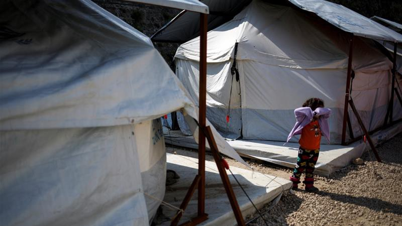
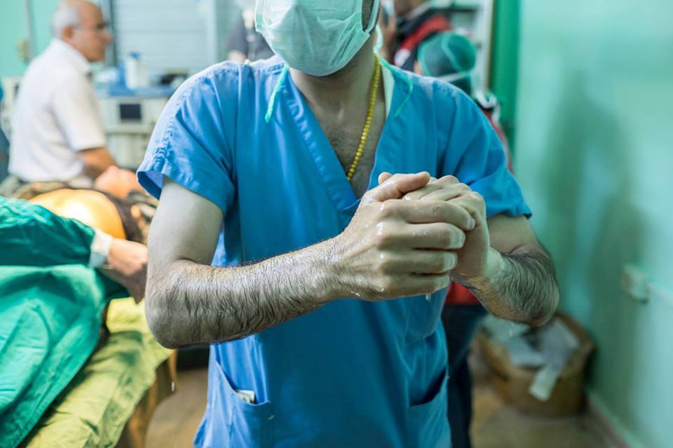
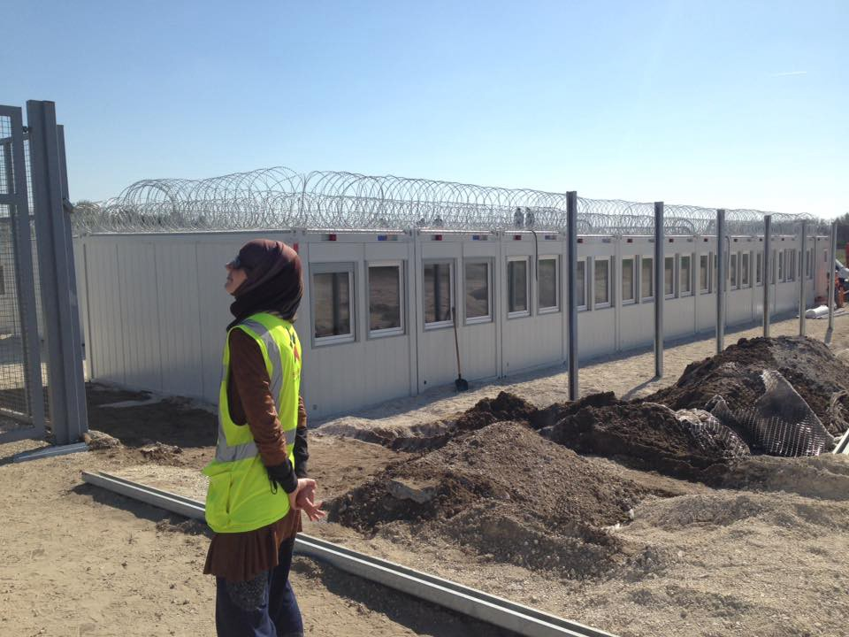
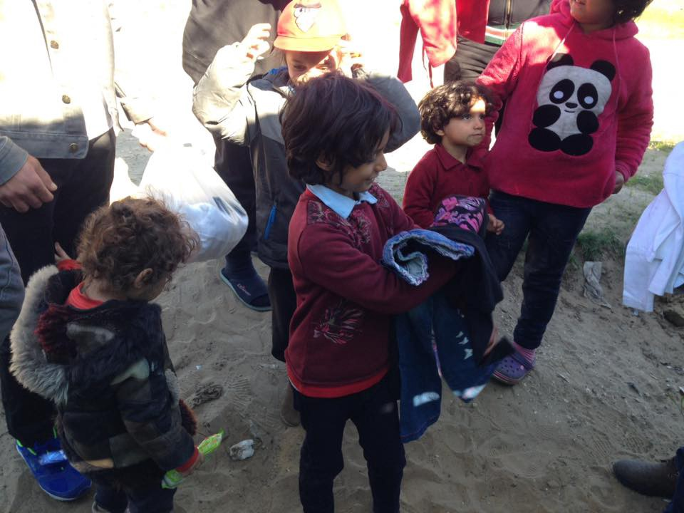

### AYS Daily Digest 30/03/17: Young Syrian attempts suicide in a Chios camp

_More than 5 million Syrians have now fled their country /_ _29 year old set on fire in Vial camp in Chios / Volunteers with medical/logistical/technical skills needed for an Iraq mission/ Update on Hungarian border detention camp / 23 migrants held captive by smugglers freed by Greek police / Arabic speaking translators needed in Greece / Mass deportation rescheduled for tonight in UK_

Vial camp inChios ; Photo by Alkis Konstantinidis/Reuters
#### Another attempted suicide at Vial camp in Chios today

A young Syrian man, reportedly from the city of Hama, set himself on fire today in Vial detention centre in Chios\. After he was reportedly rejected for the second time, he took on this desperate action\. Local doctors ordered that he be transferred to a specialized unit in Athens, [report](http://www.ekathimerini.com/217287/article/ekathimerini/news/syrian-refugee-in-critical-condition-after-setting-himself-on-fire) Ekathimerini\. He has since been brought to hospital and in critical condition, with burns to 85% of his body\.

Refugees present in Vial said he was asking to speak to the authorities and that he was only using the fire as a threat but he set himself alight when a police officer tried to contain him\. Footage of the event, which we decided not to publish, shows people apparently trying to talk him out of his intention and one police officer taking a chance and grabbing him from behind, but failing to stop him\. The officer sustained injuries to his face and hands during the effort and is also undergoing treatment in Athens\. Many people surrounding the man witnessed what happened\.

Scenes of desperate actions like this one are becoming more and more common for those stuck in camps throughout Greek islands\. The incident comes just three days after a 25\-year old Syrian refugee [was found](http://www.ekathimerini.com/217169/article/ekathimerini/news/syrian-man-found-hanged-at-piraeus-passenger-ferry-terminal) hanged in the Greek Piraeus passenger ferry terminal near Athens\. The mental health crisis, affecting people on Greek islands especially, which aid agencies \(such as [Save the Children](http://blogs.savethechildren.org.uk/2017/03/invisible-wounds-syrias-child-mental-health-crisis/) \) keep warning about is certainly connected to failed EU policies that keep people trapped in camps, rejected and in fear or deportation\. Witnessing violence and despair daily is traumatizing the most vulnerable, children, who often self\-harm and even attempt suicides themselves\.

UN’s refugee agency stated today that more than 5 million Syrians have now fled their country\. Millions more are displaced internally\. Turkey now hosts nearly three million Syrians, with 47,000 more coming since February alone, [writes](http://www.aljazeera.com/news/2017/03/number-syrian-refugees-passes-million-170330132040023.html) Aljazeera\.
#### IRAQ

Volunteers with medical/logistical/technical skills needed for a new mission in Northern Iraq for a minimum of 2 weeks\.

> The amazing CADUS CREWING currently have their mobile hospital on its way to northern Iraq\. The first team is ready to go\. They will bring medical aid wherever the reasons for the escape arise\. For the rest of 2017 they are looking for other crews for their mobile hospital\. They’re seeking medical specialists, ie doctors, nursing staff and rescue service personnel\. They’re also in need of people for their technology and logistics crews\. Technical expertise and a sense of material and logistics should be present\. Engineers, technicians, mechanics, firefighters\. \. Would you or someone you know be interested in these vital and life saving roles\. Do you have at least 2 weeks at a time, flexibility and a desire to contribute to helping people who are not even on their way to Europe? You can submit your application [here](https://cadus.f4.htw-berlin.de/) , _Calais Action writes\._ 

](assets/547648862932/1*4u-SMTcMhJ1FBCwX65vhOw.jpeg)

[Calais Action](https://www.facebook.com/calaisaction/posts/1471752446210589)
#### HUNGARY
#### Update on border detention camp

Tuesday was the first day when those asylum seeking families who had been let in the Serbian\-Hungarian transits were not taken to open camps, but they are kept in camps surrounded by barbed wire instead\. The new camps are not finished yet though, so people are detained in a small area separated from the camp temporarily, report Sirius\.Help\.

Refugees waiting on the Serbian side have mixed feelings about their near future\. Some are afraid of the new law and what awaits them\. Others are jokingly telling that they will start to learn Hungarian, since they will have to spend months in Hungarian the transit\.

](assets/547648862932/1*3G4OPRw6lIDJTd9Xm2eUbA.jpeg)

[Sirius\.Help](https://www.facebook.com/sirius.help/)

[MigSzol Csoport](https://www.facebook.com/migszolcsoport/) stands in solidarity with Hungarian CEU in the light of yesterday’s proposed amendments on National Higher Education, tabled in Hungarian Parliament, which would make it impossible for the University to continue its work in Budapest\. CEU [responded](https://www.ceu.edu/article/2017-03-28/ceu-responds-proposed-amendments-hungarian-higher-education-law) today by saying the proposed legislation targets CEU directly and is therefore discriminatory and unacceptable\. You can send a [letter of solidarity](https://www.ceu.edu/node/17842) \.

The attacks on CEU hit us hard too\. For almost one and a half years we have been co\-running OLIve with the university\. Since then several universities across Europe have initiated the same model — a model which provides a space of community experience and a push toward joining higher education for refugees and asylum seekers in Europe\. Lets stand with CEU\! — write MigSzol Csoport
#### GREECE

Greek police reported they have freed 23 migrants held captive by smugglers until their relatives pay the Turkey\-Greece smuggling\. 21 Pakistani and two Bangladeshi men were in good health despite being imprisoned for a week in a Roma camp near the northern city of Thessaloniki, according to the police, Ekathimerini [write](http://www.ekathimerini.com/217292/article/ekathimerini/news/greek-police-free-23-captive-migrants) \. One of their alleged captors, a 26\-year\-old Greek, was arrested\.

**KOS**

60 to 70 people were reportedly arrested at 6\.30 this morning in Kos hotspot and removed, people believe, to a new deportation centre close by\.

68 people landed today in Chios on two boats from Turkey\. Official numbers show 46 new registrations on [Lesvos](https://www.facebook.com/hashtag/lesvos?hc_location=ufi) today and 69 on Chios, making a total of 115 people\. There are now more than 1500 arrivals just this month\.
#### Arabic speaking translators needed

Mobile Info Team, a grassroots, crowd\-funded volunteer initiative providing legal support and information to refugees in Greece, is looking for one or two reliable volunteer translators who could help them once their current translators leave\.

The volunteer organisation was born a year ago in a squalid border camp, the tent\-city of Idomeni, after Macedonia closed its border with Greece\. Tens of thousands of people are still stuck in Greece and over the last year they’ve been active in dozens of camps and other places providing verified, reliable information on asylum procedures to literally thousands of refugees\. Information and understanding of their situation is one of the most valuable things that can be offered in a humanitarian crisis and that’s why we keep doing the work we do, say the current volunteers\. The work is quite technical but it’s really interesting and fulfilling\. They’re based in Thessaloniki, the largest city in northern Greece although they use cars regularly to make in\-person visits to the people we help\.

> Looking for someone who:
 

> \- speaks and understands advanced Arabic and English
 

> \- will have free time with no real study/work commitments from summer 2017
 

> \- can commit to at least a number of months \(the work is so specific that it really takes some time to get into\)
 

> \- has good people skills
 

> A valid driving licence would be a big plus too\. Law studies and experience with asylum law are not necessary, although of course they wouldn’t pose a problem\!
 

> In return we can offer:
 

> \- truly unique work experience
 

> \- free accommodation \(in a sometimes cramped but fun flat\)
 

> \- free food
 

> \- refunds for Greek mobile costs
 

> \- the ability to give something back yourself, rather than simply making donations 

If you’re able and willing to help, email them at mobileinfoteam@gmail\.com
#### ITALY

Proactiva Open Arms reports on the arrival at the port in Sicily with 400 people many of whom were victims of atrocities\.

#### AUSTRIA

La Stampa [reports](http://www.lastampa.it/2017/03/29/esteri/laustria-controller-tutti-i-treni-in-arrivo-dallitalia-zzWqqq1z3TReoYswPe0mnM/pagina.html) Austria is strengthening checks on all trains at the Brenner pass on border with Italy\. A separate track at Brennersee is being built to be able to control every train and not disturb international traffic and in order to relieve the stations of Brenner and Innsbruck, where these controls take place now\. This will cost about 1 million Euro, one third will be paid by Austrian Railways \(OEBB\) \. Officials said they could activate this barrier “at any moment” if necessary\.
#### UK

[Stop Charter Flights — End Deportations](https://www.facebook.com/StopCharterFlights/?ref=page_internal&fref=nf) warn about a mass deportation flight being rescheduled to tonight \(30/3\) \.

> Tuesday night activists blockaded a mass deportation flight\. The Home Office has now rescheduled it and the flight will be leaving to Nigeria and Ghana tonight\. Join us at Tottenham Hale by Jarrow Road 7\.30pm on the dot to go onto our target\. Bring your bike if you can, though most people will walk\. Call 07961848815 if needed\. 

#### SWEDEN
#### How deportations happen

Blank Spot Project [reported](https://www.blankspotproject.se/utvisad-till-kabul-utan-packning/) on a recent deportation from Sweden\. One of the deported, Josef Moradi, was given some kind of sedatives as he was about to be deported\. He didn’t get his belongings neither the money his friends had collected for him to take with him to Kabul\. His legal guardian Margareta Wahlström has been trying to find out exactly what happened the hours before the flight left, but there are still a lot of questions\.

When she called him at 4PM the day of the deportation she had trouble to communicate with Moradi as he wasn’t talking clear and wasn’t being himself\. According to her the staff noticed that Moradi had taken a lot of pills and put him in a room where he was under their watch\. He has said afterwards that he doesn’t remember anything of the flight and it is unclear what has happened with his things\.

Wahlström has been trying to get information but without success\. What is clear is that he got deported and landed in Kabul without a thing\. He now has two weeks housing in Kabul before he will be out and left to take care of himself\. He also lacks an Afgan ID\-card\.
#### EU

Greece’s EU commissioner for migration said there are ways to make all members states comply with the program of relocation of refugees among them, [writes](http://www.keeptalkinggreece.com/2017/03/30/eu-official-can-make-members-accept-refugees/) Keep Talking Greece\. Avramopoulos said the EU has the “tools, the means and the power” to convince all members to comply and will make an assessment of response by the end of September\.

> “If we don’t have tangible efforts by September … the commission will not hesitate to make use of its power,” Avramopoulos said at a news conference\. 

_Converted [Medium Post](https://areyousyrious.medium.com/ays-daily-digest-30-03-17-young-syrian-attempts-suicide-in-a-chios-camp-547648862932) by [ZMediumToMarkdown](https://github.com/ZhgChgLi/ZMediumToMarkdown)._
