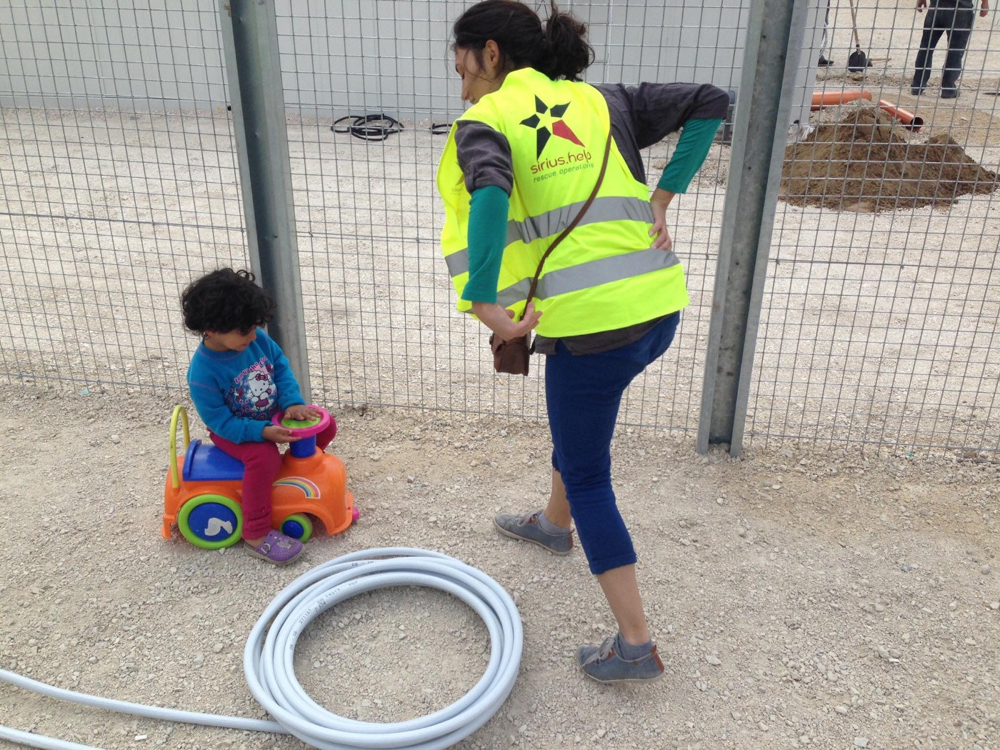
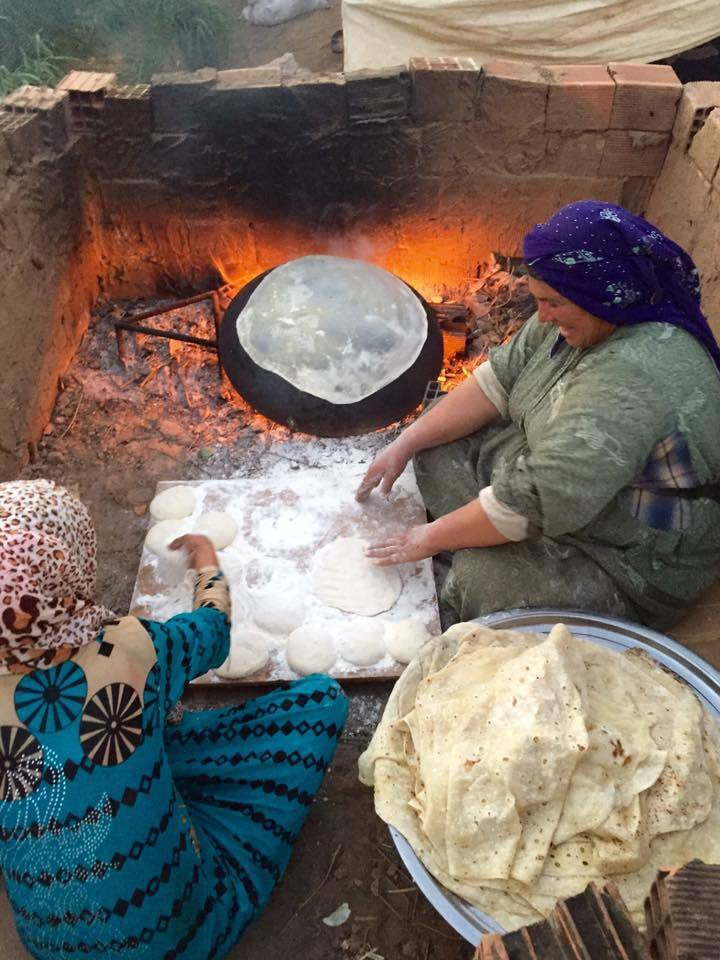
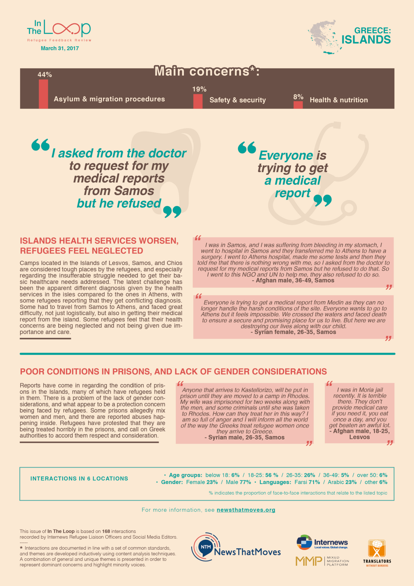
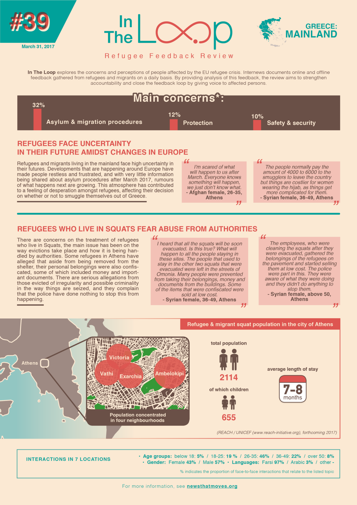
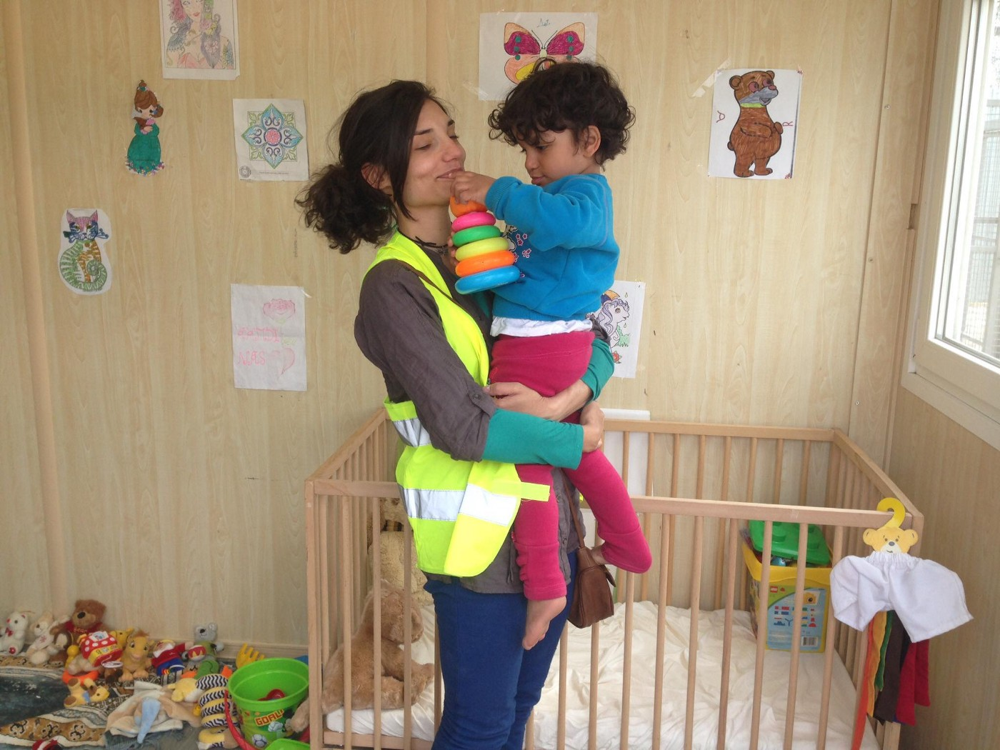
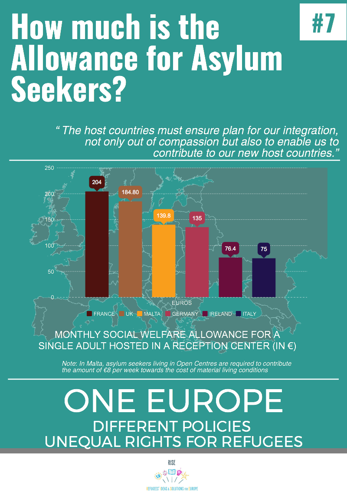

### AYS DAILY DIGEST 31/3/17: “Killing has many faces and stealing has many, too”

_Refugees in Serbia face additional discrimination in a catch\-22 bus SNAFU / Izmir refugee community struggling with hunger in off\-season / Officials and refugee community members respond to attempted suicides in Greece / Urgent need for AB blood donors in Thessaloniki / A peek inside new container detention/transit centers in Hungary / Lord Dubs releases guide to helping refugees_

Hungarian transit camp\. No child should grow up behind this fence\. Photo courtesy of SIRIUS\.HELP
### FEATURE: Serbia

In an extensive investigative report by Radio Free Europe, discrimination against refugees and people transiting Serbia by private bus companies was brought to light\. Citing concerns about “disinfection” and stating that some buses have been required to undergo maintenance after carrying refugees, often from Belgrade to Presevo, some bus fleet personnel are refusing to accept refugees onto the bus, even after they present a ticket\.

Branislava Djonin from Info Park, who was interviewed for the article, \( [available here in Serbian](http://www.slobodnaevropa.org/a/ko-ne-pusta-izbeglice-u-autobuse/28401643.html) \), noted that some carriers even refused to let refugees ride despite a representative from the Commission for Refugees accompanying the refugee passenger to the bus and presenting a certificate stating that the refugee was free from communicable disease; however, some operators simply rely on complaints by other passengers about “lack of hygiene” in order to pass the responsibility for their discriminatory practices on to someone else\.

After being registered — a registration which in theory can take place at any police station, but in practice occurs only in Belgrade — those who have registered are required to report to a designated camp, often Šid in the west or Preševo in the south, meaning that refugees MUST use buses or trains to get there as operators of private vehicles often face problems with the police if they give a refugee or migrant a ride\.

This complicated and confusing registration procedure, which does not initiate the asylum seeking process, but rather gives refugees 72 hours to gain access to the camp, after which point they can pursue further action, only causes urgency and panic since if refugees fail to report to the camp after 72 hours, their registration expires — and there is no second chance to re\-register\.

Those assigned to go to Šid face additional difficulties as many of the carriers going towards Šid are Croatian, and as international carriers, refuse to sell tickets to individuals without appropriate documentation \(as in a passport or identity card that allows regional travel\) so as to avoid being considered responsible for facilitating illegal transit of undocumented individuals across borders\. Whether this is a reasonable concern or simply an excuse to be absolved of all responsibility remains up for debate\. Regardless, as a result, only one Serbian carrier, “Lasta,” tends to hold the monopoly on this route, allowing them to wield an uncomfortable amount of power in the situation\. It is important for citizens of Serbia to remain alert and vocal about protesting against these violations of the rights of refugees in Serbia\.

In spite of this, as Samuel Nhor from Refugee Aid Serbia and the Odyssey project found while collecting testimonies, some refugees still maintain a strongly positive opinion of Serbian citizens and police\.

> “Serbian they are too good to us, they give us a lot of love\. They give us a lot of love, Serbia people, Serbian police\. You know they give us so much love we forget about Bulgaria, all the bad things are forgotten because of this kind of love\.” 

> “Srpski ljudi su pre dobro nama, oni daje nama mnogo ljubav\. srpski ljudi i policija daje nama mnogo ljubav tako vise da zaboravimo o Bulgarija i svi lose stvari da se desao tamo …” 

See what The Odyssey Project is up to [for more stories](https://www.facebook.com/odysseyvanproject/) \.

Looking to get involved in northern Serbia? Fresh Response is in need of a volunteer with a van for the second half of April\.

> [Fresh Response](https://www.facebook.com/freshresponseserbia/) ’s trusty borrowed white van has to go back home to Austria for its yearly service/maintenance, from around 15 April to 30 April\. We rely on it every day for our food and NFI distributions\. Any volunteers with a van who can join us in Subotica during these 2 weeks or more? Please send a message via our Facebook page if so\. 

### TURKEY

Worldwide Tribe is raising money and support for refugees in Izmir, Turkey\. They highlight that many refugees there are, of course, exploited by the local market, but that in between seasons, even this meager subsistence disappears as their labor is not needed in the fields and orchards\.

Photo courtesy of Worldwide Tribe

Families are in dire need of flour and, even more expensive, oil, to tide them over until the new work season starts\.

For those interested in donating, please see their page [here](https://www.facebook.com/theworldwidetribe/posts/1854904121462013) \.
### GREECE
#### URGENT: Thessaloniki

> SOS — Urgent call for blood cell donation \(AB group\) in Thessaloniki, Greece 

> There is an urgent need for donors for platelets \(red blood cells\) of the blood group AB \(positive or negative\) at the Ippokrateio Hospital of Thessaloniki\. The person needing the support is a 19 years old Syrian asylum seeker, mother of two kids, who is suffering from an acute leukaemia\. If you are a potential donor located in the region of Thessaloniki, please reach out urgently for Evi Adamídou \+30–231–1208056 / \+30–694–6536508\. For English speakers please contact \+30–694–9100207\. 

#### Chios

Referring to recent suicide attempts, [Migration Minister Mouzalas](http://www.ekathimerini.com/217317/article/ekathimerini/news/mouzalas-says-situation-on-chios-has-reached-breaking-point) stated that the situation on Chios has reached breaking point\. Although 2,500 people have been transferred to the mainland, with plans for 1,500 more, with centers over capacity at 3,500 refugees residing there, the situation continues to be dire\.

Another example of the horrible conditions on Chios can be found in more reports of worms in food served in Souda there\. Photo may be distressing\.

](assets/52e3e25f7b49/1*RmlEozC2YIssreehB7_8tQ.jpeg)

Photo courtesy of [**Irene Liberte**](https://www.facebook.com/profile.php?id=100014424134333)

With regard to recent suicide attempts, Wassim Omar has strong words that highlight who bears the blame for precipitating these tragedies, and, indeed, all suicides in the on\-going crisis of humanity\.

> To be a killer or a murderer, it isn’t necessary to have a gun or make bloodshed\. To be a thief, it isn’t necessary to steal or rob money or property\. 
 

> Killing has many faces and stealing has many too\. 

> What you have been doing, it is even worse than what the war has done to us\. When the EU opened its gates and borders to welcome refugees, it gave us hope, and the will to live\. 

> If the EU hadn’t done it, the oppressed people would have been living with death and facing it too\. But after you opened your doors and borders, it helped people who had lost hope and the will to live to come back to life and hope to have a future again\. 

> But shamefully, because of the EU’s disastrous and unjust deal with Turkey, you cut off their hope and their will to live again\. The EU showed oppressed people hope, and then you stole and took it away\. So that became harder for us than facing bullets and guns\. 

> The 20th of March 2016 was a dark day in refugees’ lives, it killed their hopes, dignity, purpose in life and sense of being valued as people\. 

> We \(refugees\) are no longer regarded and treated as human, we are just numbers to the authorities and politicians, who are are playing with us like chess pieces\. 

> We are living the life of one who doesn’t possess their own life\. 

> Authorities never have the right to rob us of our life\. 

> Return to us what we have lost from our lives on the waiting beaches\. 

Wassim Omar \(Kester Ratcliff Ed\. \)

> May these words serve to catalyze real action, rather than the standard hemming and hawing of officials and eventual despair and slow response\. 

In terms of response to these situations, Refugee Education Chios and Chios People’s Kitchen are putting together cooking classes for refugees\! The classes run three times per week at four to five hours per class and are designed to help young refugees not only pass the time, but also develop a skill set\. Refugees of all different nationalities are welcomed\.

> Our trainers are qualified and experienced chefs from Syria and Switzerland who together have developed a hands\-on approach that seeks to develop the basic skills required to work in a kitchen\. From knife skills, hygiene in the kitchen, to plate decoration, the course ensures our students receive a unique introduction to what it means to be a chef\. 

> However, what sets this project apart from many other vocational courses is the fact that the food cooked by the participants during each session is the dinner provided to our students in the school\. We have constructed an end\-to\-end virtuous supply chain\. At each point there is compassion, love and social development taking place\. 

Read more about the project [here](https://www.facebook.com/refugeeeducationchios/posts/450760198603368?hc_location=ufi) \!

Team Humanity caught a sad but beautiful moment after a landing in Greece as one man serenaded Syria and the children of the sea\.

The lyrics are as follows:

_“Oh you ocean, give us love\._ 
_Look what has happened to us\._ 
_Do not run the waves against us\._ 
_We Syrians, I swear, our cause is sad\._ 
_Oh, you would not believe it, but our tears can drown you, so much have we cried\._ 
_We accepted all people and were kind and loving towards them, but when we fell, everyone betrayed every one of us\. No one was crying for us\._ 
_Oh today the whole world failed us\._ 
_Oh you ocean, make your waves still, there are children in this boat, our memories and our lives are in this boat\._ 
_I swear, our tears could fill all the world’s seas, and all our children’s childhood is gone in your waves and these waves have killed our children\._ 
_Oh you ocean, let your waves have pity on us and be caring like a mother\._ 
_Oh we Syrians, our cause is very sad\._ 
_Let us have peace… We only want peace\._ 
_And now…\. We will go and get some peace…\. \.”_
#### Athens

Refugee Info Bus is now in Athens and is looking for team members\. They are looking for speakers of English and Greek, Arabic, Farsi, and Dari in order to help the work\.

_If you are passionate about the rights of Refugees and Migrant Workers and have an EU driving licence we would love to hear from you\._

_You must have good communication skills and experience of working with Refugees, but also with larger NGO’s as well as patience, flexibility, passion for your work and a willingness to travel and at times, work anti\-social hours\._

_Send us an email, to mail@refugeeinfobus\.com, with your CV and cover letter to find out more about our plans, what opportunities we have to offer for the next couple of months and if you would be interested in working with with us\._

Attached you’ll find the most recent additions of NewsThatMoves’s “In the Loop,” which aims to debunk rumors and answer repeated questions collected by residents on the islands and on the mainland\.

In the Loop for islands of Greece\. Courtesy, NewsThatMoves

In the Loop for mainland Greece\. Courtesy of News that Moves\.

See the full library of In the Loop [here](https://newsthatmoves.org/en/category/in-the-loop/) \.
### HUNGARY

SIRIUS\.HELP released their first impressions on the transit container camps at Tompa and Röszke\. They are not yet finished, yet all refugees and migrants have been placed in them since March 28th\. They bear some tiny good news however\.

> We met many acquaintances whom we provided with donations on the Serbian side during the recent weeks\. All due respect to the social workers of the Office of Immigration and Nationality, who are trying to install containers with a friendlier atmosphere for the families, even for these few days\. The children stepped into the “play container” shyly, they didn’t even dare to touch the toys brought to them at first\. Thank you to the donors from the German [The Protec Bros](https://www.facebook.com/theprotecbros/) for the loads of toys — we will try to make the following months to be spent here more bearable for the children\. Within a few weeks nearly 500 people are expected to stay in the two transits\. 

Photo courtesy of SIRIUS\.HELP

In spite of the cautious optimism about the state of the container camps, their existence, all would agree, is an egregious violation of human dignity\. _A comfortable prison remains a prison just the same\._

Thanks and support to the work of all groups in Hungary working to shed light on the serious situation and speaking out about these ignominious violations\.
### **EU**

Below is a helpful yet disturbing chart indicating the vast disparity in Asylum Seeker allowances across Europe\. The chart is one in the series ONE EUROPE — DIFFERENT POLICIES — UNEQUAL RIGHTS FOR REFUGEES which was designed by the Refugee Ideas and Solutions for Europe organization after consultation with over a dozen refugee communities across Europe\.

As has been demonstrated time and time again, Europe shows stunning amounts of solidarity when it comes to innovating and implementing policies that push refugees to the margins of society, isolate them from help, and push them back to the outer edges of Europe\. Implementing solutions that bring in positive solidarity seems to be a greater challenge, and unequal allowances for asylum seekers is another embodiment of this\. Although it is unclear if the chart takes into account the cost of living in each country, the disparity is staggering\.

Photo Courtesy of RISE

> The final event of this campaign took place in Brussels on 20th of March to call for a fair and common asylum application in Europe as well as decent and common standards for all refugees\. Furthermore we call on the EU to stop trading refugees and signing inhumane migration deals\. 

Source from [**Greek Forum of Refugees**](https://www.facebook.com/Greekforumofrefugees/)
### UK

The now\-famous Lord Alf Dubs has released a helpful guide to helping sponsor or resettle refugees in the UK\. With all the world’s attention on the triggering of article 50, it can be easy to lose sight of the practical and pragmatic ways for the community to get involved\. The guide called “Welcoming Syrian Refugees” provides comprehensive information from getting an organization assembled, to fundraising, to volunteering, to integration\. Although it is targeted at Syrian refugees, it clearly can be easily adapted to any refugee community\. Check it out below\!

_Converted [Medium Post](https://areyousyrious.medium.com/ays-daily-digest-31-3-17-killing-has-many-faces-and-stealing-has-many-too-52e3e25f7b49) by [ZMediumToMarkdown](https://github.com/ZhgChgLi/ZMediumToMarkdown)._
