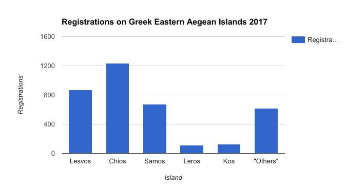
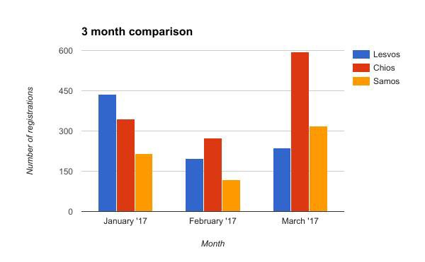
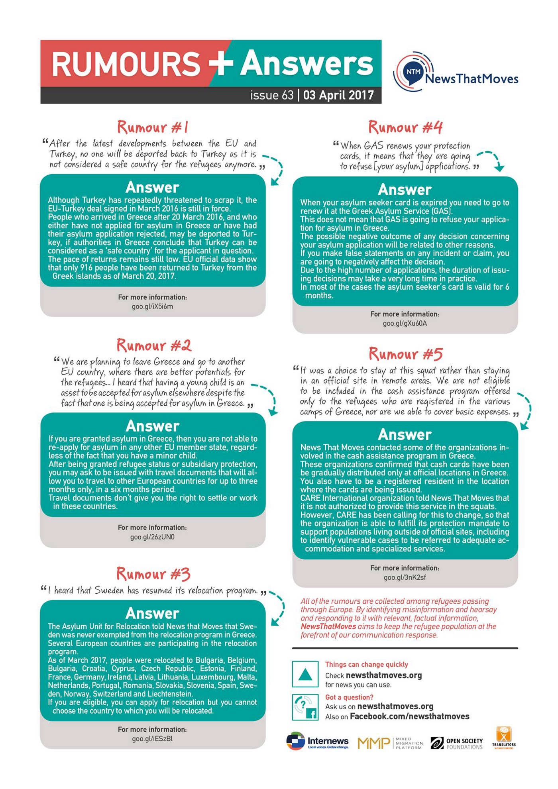
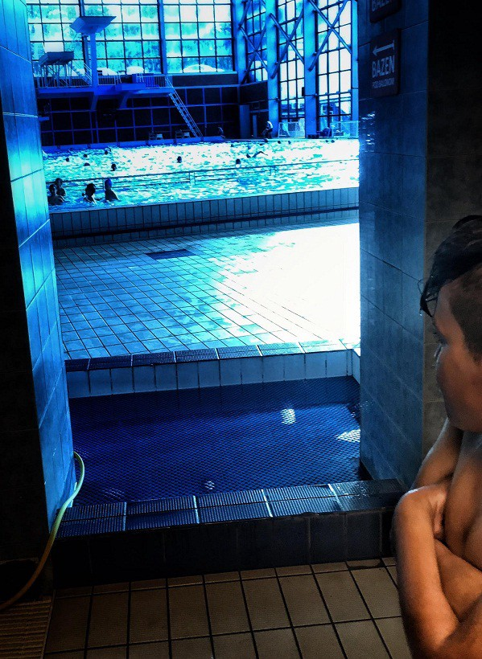
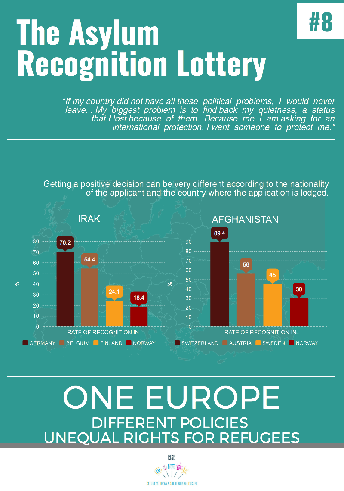

### AYS Daily Digest 03/04/17: New wave of police raids and evictions of refugees in Greece
#### Police raided refugee squats on Lesvos, same actions expected in Athens \| Protests on Greek islands as desperation grows \| Lebanese PM urges for help from the international community \| Italy to close the deal with Libya \| Germany closes school halls, but many still live in collective accommodation \| Horrible scenario develops in Calais and Dunkirk \| UK groups look for more hosts

 \)](assets/9c4b2455659c/1*HtND_FwwBKmx5wzhJArpdw.jpeg)

A wall at the warehouse in Belgrade that hosts young refugees \(Photo: [Mabel Montero](https://www.facebook.com/mabel.monterohernandez) \)
#### FEATURE
### 19 refugees arrested in a police raid

Early morning on Monday, police conducted raid of several squats in Lesvos arresting 17 people, refugees and volunteers\. While persons with the European documents were released soon after the arrests, refugees are taken to detention in Moria where from they will, most probably, be deported\. Apparently, they were arrested due to lack of proper documentation\. 
According to the No Border Kitchen Lesvos, one person who tried to run away, was severely beaten and had to be taken to the hospital\.

> “We are incredibly sad and angry\. Once again today our friends and comrades were imprisoned and beaten for no other reason than being in Europe without having the “right” passport\. Now many face weeks or month in prison and after that deportation\. \. \. for nothing\. Only for looking for safe place to live,” NBKL write in their statement\. 

This police action caused tensions and many rumors, not only on Lesvos\. In the afternoon, number of groups in Athens, including City Plaza, issued a warning about new possible raids and evictions of squats that could happen tomorrow or this week\. In their statement, CP reminds that over the course of one year, over 1500 people found rescue in squats organizing “a model for meeting fundamental human needs and model for social self\-organizing and multi\-ethnic cohabitation”\. They also remind about previous evictions of squats in Thessaloniki and Athens, as well as pressure coming from the government on a daily basis\.

> “Instead of planning to close the refugee detention centres, end the apartheid between the Greek mainland and the islands, and house trapped refugees within cities in dignified housing conditions, the government is ramping up measures against trapped refugees,” the statement reads\. 

Only in Athens, there is about 15 squats where accommodation for refugees is provided\. Those places were populated when the government and big NGOs fail to take care of people who needed protection\. Squats are self organized, meaning that people who are residing inside and those who support them are deciding together about all aspects of community life\. Squats are supported through private donations\.

Evictions and raids are not the only way the government is putting pressure on residents in squats\. Additional pressure is imposed through the cash cards program\. The government demanded from the NGOs who are distributing these cards to exclude people in squats\.

They easily obeyed this demand and joined forces\.

These acts and attitudes are putting additional pressure on refugees, as to their supporters all over Greece and are contraproductive as such\.

Today, many groups called for protests against such measures\. In the meantime, refugees who came to Europe to find rescue are pushed into uncertainty and live in constant fear\.
#### SYRIA
### At least 1134 documented civilian deaths in the past month

[SNHR](http://sn4hr.org/) published its periodic death toll [report for March 2017](http://sn4hr.org/wp-content/pdf/english/1134_civilians_were_killed_in_March_2017_en.pdf) that documents the killing of 1134 civilians at the hands of the main influential parties in Syria\. However, [they stress](http://sn4hr.org/blog/2017/04/02/37639/) that the number is not the real number of victims because documenting the casualties is difficult as people die not only in cities, but on battlefronts and as it is also difficult to get precise numbers about victims from the Syrian regime forces or from ISIS\.

The report calls on the Security Council and the relevant international entities to uphold their responsibilities in relation to the crimes of killing that is being perpetrated ceaselessly and to apply pressure on the Syrian government to stop the deliberate and indiscriminate shelling against civilians\.
#### LEBANON
### Lebanon is on the verge of a breaking point and urges action be taken by the international community

A country of 4\.2 million inhabitants welcomes 1\.5 million Syrian refugees\.
Over a million people are living in makeshift camps due to very poor conditions in the country\.

In an [interview](http://m.france24.com/en/20170401-video-lebanons-pm-hariri-ask-10-12-billion-investment-refugees) ahead of his visit to France, the Prime minister of Lebanon stressed that it is their responsibility to welcome the refugees, but it is not the exclusive responsibility of Lebanon to assume the consequences of the war and the international community must take their share\. But, they would not do anything to undermine the interests of the refugees\.

He stressed that they have been desperately asking for the international community’s help for the past several years\. They now ask at least for the funds to help Lebanon build up the country to be strong and able to uphold both the Lebanese and the Syrian refugees there\.

> “We say to Europe, to the United States, to the international community: there is a country that is willing to help these refugees\. What are you doing to help that country?” 

#### GREECE
#### Arrivals and registration

One boat landed on the north east coast of Lesvos with **26 people** on board: 8 children, 11 women and 7 men\.

**16 new arrivals** were reported during a day on Chios: 2 children, 2 women, 12 men \(5 Syria, 3 iraq, 6 Iran, 2 Palestinian\) \. Additonally, 24 people were officially registered on Chios this morning\.

Over the last month, **236** new arrivals were registered on **Lesvos, 596 on Chios and 318 on Samos\.**

### Protests

Today, people on Samos and in Kara Tepe camp on Lesvos protested — once again — because of the living conditions, deportation and slow asylum process\. Those responsible for any of these issues — once again — showed no concern about the reasons behind these protests\.

In a video by [**Voices from the road**](https://www.facebook.com/MSF.VoicesFromTheRoad/?hc_ref=PAGES_TIMELINE&fref=nf) , Guhdar, a Kurdish man who fled Iraq and now lives and waits with his family in the camp on Samos, describes the situation:

#### The Ellinikon warehouse has different opening hours in the next two weeks:

Monday — Tuesday \(April 10, 11\) 11:00 to 18:00h
Wednesday \(April 12\) 11:00 to 17:00 \(early closing\)
**From Thursday, April 13, until Wednesday, April 19, the warehouse will be closed\.** 
On Thursday, April 20, and Friday, April 21, it will again be open from 11:00h to 18:00h

New issue if Rumors is out with answers to rumors about deportations, protection cards, asylum requests, cash cards, relocation to Sweden, …

News That Moves and Translators without Borders bring new answers to the current rumours

Mobile Info Team clears another question many refugees have been having, concerning relocation or family reunification to Germany in particular\. It is currently not possible to be picked up at the airport by family members or friends who already are in Germany\. The German Federal Police in Munich, who are responsible for these arrivals, confirmed this yesterday to the Mobile Info Team\.

This is the same if you go through Dublin family reunification or if you travel through relocation\. When you land, you will first be met by immigration officials and will be registered in a first reception centre before being sent to the place where you are going to live\. Read this information in detail [here](https://mobileinfoteam.blogspot.hr/2017/03/if-i-go-to-germany-can-i-be-picked-up.html?m=1) \.

Asylum Service App is available for download now on a trial moth period\. It was developed to provide reliable info on asylum to asylum seekers in Greece\.

#### SERBIA
### Belgrade

> A 11 years old refugee looks at Serbian kids of the same age that are playing
 

> inside a swimming pool\. Volunteers are taking refugees to a public swimming pool in Belgrade where they can take warm showers and have some fun to forget a little the conditions they have in the abandoned warehouses 

— by [NuuNoo Miguel](https://www.facebook.com/nuunoo)
#### ITALY
### A deal between Italy and Libya formed

A political agreement between Italy and Libya, whose details have not yet been released, is the latest in a series of deals European countries have sought to reduce the flow of people coming from Libya, that has increased sharply in recent months\.

The Italian government said on Sunday that dozens of rival tribes in southern Libya had agreed to cooperate on securing the country’s borders, Italian media [report](https://www.thelocal.it/20170403/italy-has-reached-an-agreement-with-libya-aimed-at-curbing-migration) \. Among others, the previously taken coastguard vessels will be given back to Libya and Libyan coastguard service members will be educated in the EU and sent to the Libyan coast to prevent future departures to Europe\.

The details of this deal that were disclosed and discussed publically missed mentioning the reasons behind thousands of people’s life risking attempts to head towards the Old continent, and its political implications\.
#### GERMANY
### Last refugees staying in sports halls moved to other housing — still, many remain in mass shelters

Most of the refugees stuck in Greece or Serbia or in any of the reception centres in the countries that were not among those they knew, whose language they could speak and where they intended to go, have Germany as their goal, as an ideal refuge and an image of future success\.

However, as thousands who arrived there still await for the answers to their requests for international protection and asylum, a considerable number of people has arrived avoiding the legal procedures themselves or through the smuggling network, mostly made by those who earn unimaginable amounts on the desperation of the refugees\.

Once they’d arrived to Germany, many were dispersed across the country, hosted in a number of different reception centres in towns and villages, but most refugees are still being housed in mass shelters in the cities\.

Starting from April, the officials have [informed the public](http://www.dw.com/en/last-sports-hall-in-berlin-cleared-of-refugees/a-38273216) , the refugees who were staying in massive sport halls, deprived of any privacy for months, were finally transferred to other, more suitable, housing facilities\. However, many are still staying in places that can only serve as emergency facilities and not permanent shelters\. Instead of staying in massive halls, hangars, warehouses or in Berlin’s Tempelhof, for only a few weeks, some people have spent almost two years of their lives like this, living 24hours in the same space with many unknown people\.

The Berlin Refugee Council claims these circumstances are dangerous for the people living there — not only psychologically and socially, but also literally: women and children’s safety is put in risk\.

> “There’s not enough effort to get refugees out of mass shelters — the move away from camps to private living\. We think this camp policy is wrong\. We still need a better total concept\.” 

#### FRANCE
### Children in Dunkirk and Calais sleeping rough, controlled and threatened by gangs and traffickers

As many young refugees were scattered in reception centres across France, the UK decided not to grant 3,000 vulnerable unaccompanied minors a safe passage to Britain, as they initially promised, but received only 350 instead\. Under the pressure of NGOs, the Home Office decided to consider those children who were residents of Calais and have family in the UK for relocation\. Stopping the Dubs scheme and insisting on restricting policies brought the young people into an even more desperate situation\.

The latest [great surge](http://www.independent.co.uk/news/world/europe/child-refugees-france-uk-new-market-smugglers-traffickers-a7622656.html) of children to the area and the lack of safe spaces or services to protect them has made these young people targets and victims of the organised network of gangs and smuggling groups who profit from the desperation of children by charging them money to attempt boarding lorries and giving them so\-called “debts” if they cannot pay\.

The volunteer groups on site in Dunkirk and Calais report that more often children are constantly being watched by unknown adults in the camp, who control whom they talk to and prevent them from accessing other potential legal options that might bring them safe refuge\. Instead, they are left in day and night danger in the midst of what is becoming the leading organized criminal activity in Europe\.

Safe accommodation provided to refugee minors while they acess legal mechanisms to ask for family reunification or asylum in the UK is of the utmost importance to prevent even greater danger for the lives of these young people fleeing war, persecution and danger\.
### Paris
#### MSF MOBILE CLINIC schedule until the end of this week:

Tuesday and Friday 
1pm — 7 pm 
Porte de la Chapelle

](assets/9c4b2455659c/1*sxgAZmbCHFZTRrlH896y0g.jpeg)

Paris information map by [**Solidarithé**](https://www.facebook.com/solidarithe/)
#### UK
### 5 people arrested for attacking a young boy on Friday

A 17\-year\-old Kurdish\-Iranian who arrived unaccompanied in the UK a few months ago, was left seriously injured in the assault on Friday in Croydon, south London\.

The [media](https://www.theguardian.com/uk-news/2017/apr/03/five-charged-over-attack-on-teenage-asylum-seeker-in-croydon) report that five young adults have been accused of violent disorder after a teenage asylum seeker was beaten unconscious in a suspected hate crime\. Two men and a 17\-old\-year old girl arrested on suspicion of attempted murder and violent disorder remain in custody\. A man and woman arrested on Sunday have been released without charge\.

Up to 30 people were involved in the incident that left the boy with a fractured skull and a blood clot on his brain in what the Scotland Yard called a ‘brutal attack’\.
### Hosts wanted\!

[**_Refugees At Home_**](http://www.refugeesathome.org/) **_is looking for volunteer hosts who would welcome an asylum\-seeker or refugee into their homes\. All you need is a spare room and a generous spirit\._**

[Refugees at Home](https://www.facebook.com/refugeesathome/?hc_ref=PAGES_TIMELINE) is a UK based charity aiming to connect those with a spare room in their home with asylum seekers and refugees in need of accommodation\.

They are particularly looking for hosts in London, Birmingham, Brighton, Croydon and Manchester, but wherever you are, if you are able to share their request to your networks it might be possible to find someone a bed when it’s very urgently needed\.

With the closure of the winter shelters, there is more and more need for hosts and people are increasingly finding themselves with no housing options at all\.

> “It brings so much to your life and is a literal lifeline for someone who has already gone through so much\. Can you help us?” 

> **We strive to echo the correct news from the ground, through collaboration and fairness, so let us know if something you read here is not right\. Anything you want to share — contact us on [Facebook](https://www.facebook.com/areyousyrious/) or write to: areyousyrious@gmail\.com** 

_Converted [Medium Post](https://areyousyrious.medium.com/ays-daily-digest-03-04-17-new-wave-of-police-raids-and-evictions-of-refugees-in-greece-9c4b2455659c) by [ZMediumToMarkdown](https://github.com/ZhgChgLi/ZMediumToMarkdown)._
