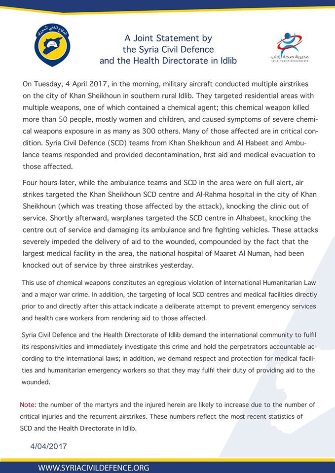
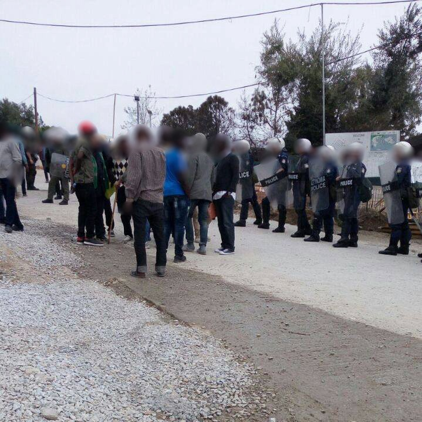
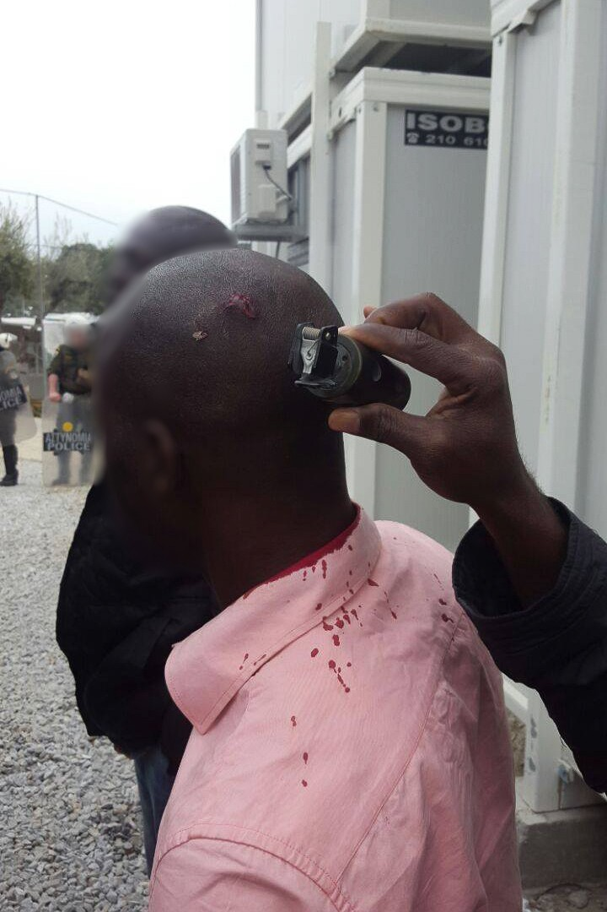
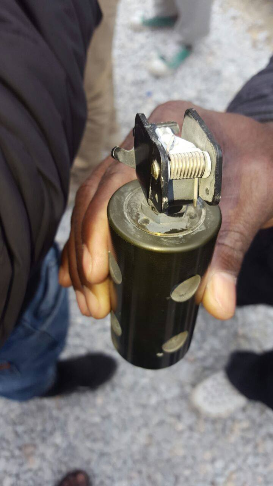
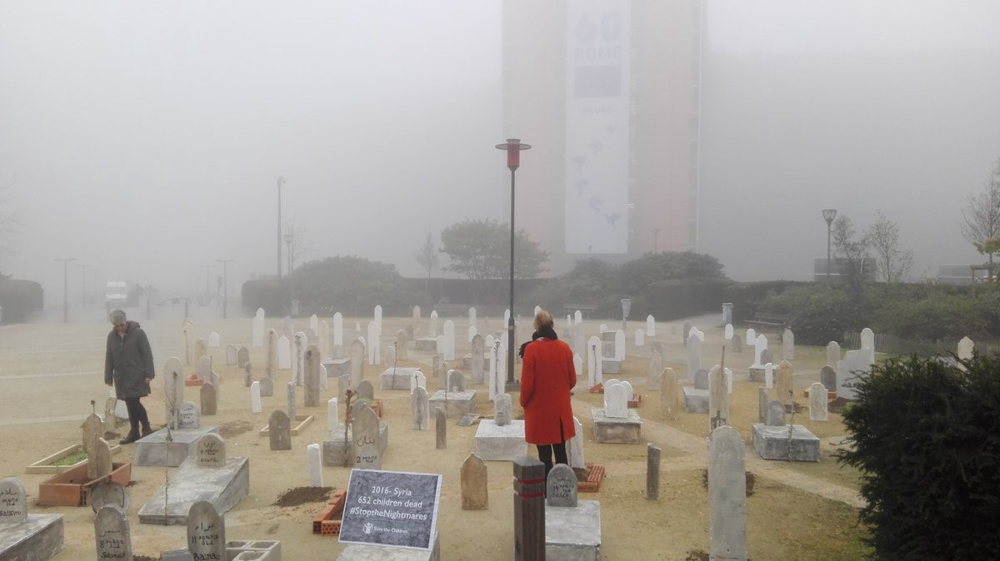

### AYS Daily Digest 04/04/2017: Possible nerve gas attack leaves 58 dead in Syria
#### Riots in Moria as tension keeps rising // Police continues to harass refugees in Calais // Peaceful protest for shelter in Italy // Deportations from Finland to Afghanistan // Tusk supports keeping the doors shut

](assets/1fd76ee2162c/1*QZV6mHiWAX1kC38y00c8eg.jpeg)

Photo by [BAAM](https://www.facebook.com/baam.asso/)
### Feature

Today many innocent people have been targeted on Khan Sheikhoun, a Syrian town in the Idlib province\. **At least 58 people, including 11 children, have been killed by what’s thought to be a “nerve agent”** in a bombing raid on the rebel\-held Syrian town\. Sadly chemical weapons have been used in many occasions in the conflict throughout this long war, most of the times being chlorine gas the toxic agent used on the attacks\. This time there though, patients presented symptoms like choking or fainting, and some foaming from the mouth and contracted pupils as reported by The Syrian Observatory for Human Rights and there was no chlorine smell on the bodies\. The United nations said they would investigate it as a possible war crime but was currently not in a position to independently verify these reports that, if confirmed like it seems, it will mark the deadliest chemical attack in Syria since sarin gas killed hundreds of civilians in Ghouta near the capital in August 2013\. Then the Syrian government was blamed by the western states but Damascus blamed the rebels\.

The attack happened early in the morning when jet planes dropped bombs on the small town and straight away people started to show symptoms of the toxic agent\. A hospital in the Idlib area started receiving patients from 8:30 am until 12:00 from the location of the attacks which is about 60–70 km away from this hospital\. Doctors say that 5 hospitals closer to the site have been destroyed recently so patients have to travel longer distances to get medical treatment and the patients they received today are likely victims of Sarin gas\.

> “In that situation, the treatment tends to be to try and strip people off, to get the chemicals away from their bodies, to hose them down as quickly as possible\.” 

](assets/1fd76ee2162c/1*ihN1nmkpiVdkdPWOrAQsIg.jpeg)

White helmets helping victims of the attack\-photo by [**One Nation**](https://www.facebook.com/onenationUK/?ref=page_internal)

Over the past year, Doctors Without Borders has received reports of at least 71 attacks on at least 32 different health facilities which it runs or supports in Syria\.

Forces operating on the ground have have promptly denied any involvement as Russia’s defence ministry told the state\-run RIA news agency that it did not carry out bombing runs in the area on Tuesday\. Assad regime, that was already found guilty of using chemical weapons by the UN on 3 occasions, also denied any involvement in the attacks but some western countries like Britain, France and the USA demanded that the ones responsible for these acts to be held accountable although previous attempts to punish the Syrian regime for crimes against humanity have always been blocked by Russia in the UN security council\.

The European Union’s top diplomat, Federica Mogherini also said that there is a primary responsibility from the regime because it has the primary responsibility of protecting its people\.

There were also reports later on by opposition activists and AFP news agency, citing one of its journalists on the scene saying that a rocket hit a hospital where the victims were being treated, bringing rubble down on medics as they struggled to deal with victims and a member of the Syrian Civil Defence also told Al Jazeera that for the past week, Idlib has been targeted by ongoing air strikes, and after yesterday’s attack, one of its main hospitals has been mostly destroyed and can no longer function\. This organisation and the Health Directorate in Idlib also published a joint statement about the attacks:

### Greece

Volunteers on Lesvos reported today that there has been unrest in Moria detention centre yesterday and today as refugees resisted the police intentions to arrest and later deport anyone without a valid document\. When the refugees refused to collaborate, riot police intervened using violence causing injuries on some of the refugees involved\.

> Tensions are running quite high in Moria right now due to rising fears of detentions and deportations\. This is particularly acute amongst the African community groups\. Yesterday the police began cracking down on asylum seekers with expired papers and those who have received their 2nd rejections at the front gate of the camp\. Police blocked off the gate and began scrutinizing papers\. Members of the African community groups which are probably the best organized in Moria got together to resist this\. They blocked off the gate not allowing anyone in or out\. Apparently, there was an agreement made amongst them that if any attempt was made to detain and deport a member of their communities that they would physically resist this with collective action\. This afternoon that all played out when some police officers tried to arrest someone in the middle of the camp to place him in detention\. A group of about 70 asylum seekers gathered to resist this, things got out of hand\. Green uniformed police special forces with riot gear were called in to disperse the crowd and flash\-bang grenades were used\. A number of people were injured; many refugees and the police commander of Moria\. An emergency meeting was held between the community groups and the authorities\. 

#### Islands

There have been a few arrivals reported by volunteers today as 2 boats arrived in the early hours of the day, the first with 16 people — 3 men, 2 women and 11 children and the second one with 14 people — 8 men, 2 women and 4 children\. Home man was reportedly taken to hospital after he broke his arm on the landing but everyone else was ok although a bit wet\. Volunteers from CESRT worked all night to provide first response to new arrivals with the cooperation of the port police, Frontex and waha \(medical team\) \.

On Lesvos also 2 boats arrived, one boat coming into the north coast of Lesvos at 5am the morning\. 59 people were reportedly picked up on yogi beech, 1 baby, 1 child, 19 women, 38 men and 2 pregnant women\. One refugee needed medical treatment but everyone else was in good health\. The second boat arrived in skala Sykaminia in the north coast Lesvos and was brought by the Greek coast guard at 2pm with 22 people on board including 5 children, 7 women and 10 men\. We were told everyone arrived safe on this boat\.

As the spring kicks in the arrivals have been steady and most days are busy days on the beaches of the Greek front line islands\.
#### Registrations

Today there were 47 new registrations on the islands as per official records:

Lesvos — 27

Chios — 16

Kos — 4

Humans 4 Humanity in Lesvos is a group that has been working on establishing a **Community Center that will serve as a one\-stop direct services to all refugees on Lesvos\!** The vision is to supply the basic aid needed in a dignified matter that returns the freedom of choice\.

**The House of Humanity** will feature a supermarket, clothing shop, school run by the SchoolBox Project, a Women’s Empowerment space, Vocational Arts Center and much more\.

> The supermarket shelves are up and now we need food, hygiene, and baby product stock to help fill them 

They also are willing to hear from you if you have any other goodies that could be useful in the center or on any of the spaces so please consider getting involved contacting [**Neda Kadri**](https://www.facebook.com/neda.kadri) ‎\.

 ‎](assets/1fd76ee2162c/1*4ACLkB62sKvT4T--teCRQw.jpeg)

Photo by [**Neda Kadri**](https://www.facebook.com/neda.kadri) ‎

Tomorrow and the day after tomorrow contract staff employees of the Greek Asylum Service have been called on to strike\. Because of this, work of the Regional Asylum Offices and Units will be disrupted\. If appointments have to be canceled, applicants will be informed by phone, so if you have an appointment on the 5th or 6th of April, please go there unless you are called and told not to come\. The reason for the strike is that, apparently, some employees haven’t been paid for four months\.

If anyone knows anyone who has their appointment on the 5th or 6th, please share this with them\. Arabic and Farsi translations of the above text are online both below and at the following [link](https://www.facebook.com/mobileinfoteam/photos/a.1800063030222418.1073741830.1796286800600041/1939422262953160/?type=3&theater) \.
#### Mainland

Today we get a report from New Kavala camp from a group of volunteers called [**We Are Here — Community Centre**](https://www.facebook.com/WeAreHereCentre/?ref=page_internal&fref=nf) **\.** More people are arriving to the camp and the it is starting to fill up\. Currently the camp is at about half of it’s capacity but volunteers predict expansions in the near future\. Its difficult to create school schedules with newcomers every week but this doesn’t seem that is gonna change any time soon so they take the challenge and continue to do their best\. On We are Here and and Drop in the Ocean are working together to try to find new activities and and solutions to improve the life standards in the camp\. Another group, Escosirak, the theatre group performed their new piece this week and there was also a world music dance party at the end\.

Please consider supporting these groups donating [here](https://www.gofundme.com/weareherecentre) \.
#### Athens

Piraeus Open School for the Immigrants will launch on Wednesday April 5th, its **first class of Greek language that will aim at the LGBTQI refugee** and immigrant community of Athens\. Classes will take place from 6:00 to 8:00 p\.m\. at the premises of the Piraeus Open School for the Immigrants\.
Address: Ko and Agion Anargyron, Palia Kokkinia, Piraeus\.

All courses at the Piraeus Open School for the Immigrants are free\.
### Serbia

International Rescue Committee, Save the Childres and 10 other NGO’s estimate that 1,300 unaccompanied child refugees and migrants are at an increased risk of exploitation, violence and trafficking due to the restrictive border policies and inadequate social protection systems across the Balkans\.

The warning was published in the report [“Out of Sight: Exploited and Alone”](https://www.rescue-uk.org/report/out-sight-exploited-and-alone)

National systems along the route are failing to identify and adequately support these severely vulnerable children, some as young as nine and are invisible to the authorities, and in some cases even when identified, they are placed in inadequate conditions, sometimes even detained\. This is causing desperation and pushing many into the hands of smugglers and traffickers, who children see as their only way out\. The smuggling and trafficking has risen significantly since borders shut and the EU\-Turkey deal was implemented one year ago\.

Unfortunately we get many reports of unaccompanied living in Belgrade by volunteers too often and most times these are the only reliable adults that these children have to help them through their journey\.
### France

Police in Calais reportedly marched into an area used for distribution of food and emergency items and demand identity papers from refugees there, [**Refugee Info Bus**](https://www.facebook.com/RefugeeInfoBus/?fref=nf) said today\.

After the ruling in Lille overturned the Mayoral ban on food distribution in Calais, the local police force have been finding new ways to make the experiences of refugees and unaccompanied minors in Calais as unpleasant as possible\. They have imposed a 1\-hour time limit on distribution\. Volunteers also state that probably if there wasn’t for their presence these interventions would be a lot less peaceful\. Many young refugees have signs of the police actions on their bodies like legs and arms in soft casts, bruises and lacerations on their faces and arms\. Arrested minors are taken to the police station and made to wait long hours before being released, while adults are sent to the CRA detention centre\.

As the weather gets better it can be expected that the number of people returning to Calais will greatly increase and volunteers on the ground hope that the local authority reassesses the nature of its relationship with people and unaccompanied children on the move and provides them with necessary humanitarian assistance and appropriate legal support\.

Also in Calais, Refugee Community Kitchen now prepares and serves more than 200 meals, mostly to unaccompanied minors\. They also provide hundreds of meals in the Dunkirk camp as well as stocking the free grocery shops\. Please consider donating [here](https://www.facebook.com/groups/RefugeeCommunityKitchen/?fref=ts) \.
### Italy

Today in Pordenone, asylum seekers peacefully protested in front of the Perfecture and asked for their right to be given a place inside the Hub\.

](assets/1fd76ee2162c/1*LCBg22x-hQOsg0ALqx4sXw.jpeg)

Photo by [Rete Solidale Pordenone](https://www.facebook.com/retesolidalepn/)

](assets/1fd76ee2162c/1*Z_F0xLVIgkIfT-c89Jo9bw.jpeg)

Photo by [Rete Solidale Pordenone](https://www.facebook.com/retesolidalepn/)
### Finland

Deportations of Afghan refugees back to Afghanistan were planned for Monday evening from Helsinki by Finnish authorities and hundreds of people protested whilst some clashed with the police, while trying to stop the paddy wagons from leaving\. Police sprayed gas to calm down the the protesters and also used dogs and batons on them\.

](assets/1fd76ee2162c/1*tbTJoYVx_cxhdlgfvMsD2w.jpeg)

Photo by [**Teo Comet Kortman**](https://www.facebook.com/cometteo)

The protests continued at the Helsinki\-Vantaa Airport where a few hundred people were sending out the message with signs saying “Afghanistan Is Not Safe” and “The Destination of Deportation is Annihilation\.” Last year, the Finnish Immigration Service MIGRI refused about 3,000 residence permits from Afghan refugees\. This amounts to about half of Afghan’s asylum applications\. The deportation flight that was scheduled to leave from Helsinki\-Vantaa at midnight was the third known flight shipping out refugees to Afghanistan\.

Finland has decided that refugees from Afghanistan, Somalia, and Iraq will not automatically be granted a residence permit because of the improved security situation in the aforementioned countries\. Tuesday’s evictions follow the aftermath of MIGRI chief Jaana Vuori’s promise that according to the new guidelines there will be “more denied applications\.”
### EU

Today the two days lasting Syria Conference in Brussels started\. In his opening speech Christos Stylianides, Humanitarian Aid & Crisis Management, said:

> “There is no humanitarian solution to this crisis\. Only a political solution can end the human suffering\. 

> The European Union fully supports the UN\-led efforts in Geneva\. Until we reach a political solution, our support to the Syrian people must continue\. They need us more than ever\. And we have a moral duty to stand by them\. 

> The EU as a host of this conference but also as leading donor will continue to take its responsibility\. OUR responsibility\.” 

Save the Children and artist Raul Armenteros set up a graveyard in front of the Commission’s building, remembering the Syrian children who died in the war\.

Photo by Save the Children

At the same time the European Council President Donald Tusk said that the EU stands firm on keeping Balkan migrant routes closed\. Tusk, who met Bulgaria’s President Rumen Radev, welcomed Sofia’s efforts to boost security on its southeastern border with Turkey to prevent migrants from crossing\. He said Brussels would provide additional financing if the situation worsened\.

Save the Children and artist Raul Armenteros set up a graveyard in front of the Commission’s building, remembering the Syrian children who died in the war\.

It seems rather hypocrite to talk again and again about standing with refugees and at the same time not allowing them to reach safety and also promoting and financing practices that have been proven to cause as much pain and even death to thousands of refugees since the beginning of the crisis as the border controls undertaken by Bulgaria’s government\. Practices that should be condemned and not praised by the European Union\.

_Converted [Medium Post](https://areyousyrious.medium.com/ays-daily-digest-04-04-2017-possible-nerve-gas-attack-leaves-58-dead-in-syria-1fd76ee2162c) by [ZMediumToMarkdown](https://github.com/ZhgChgLi/ZMediumToMarkdown)._
