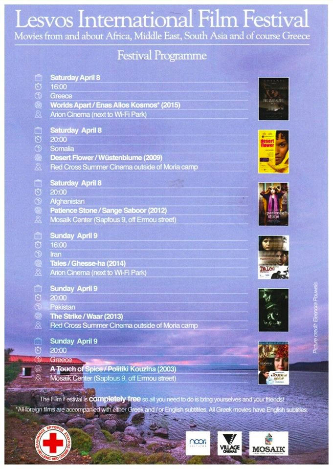
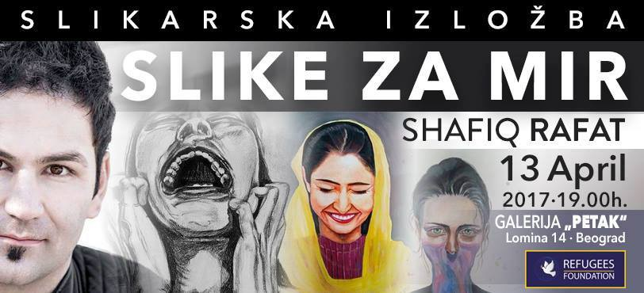
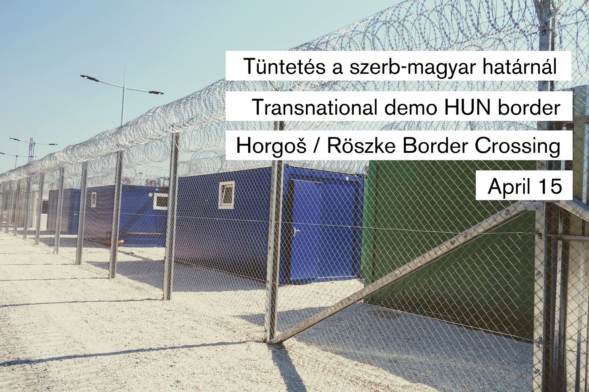
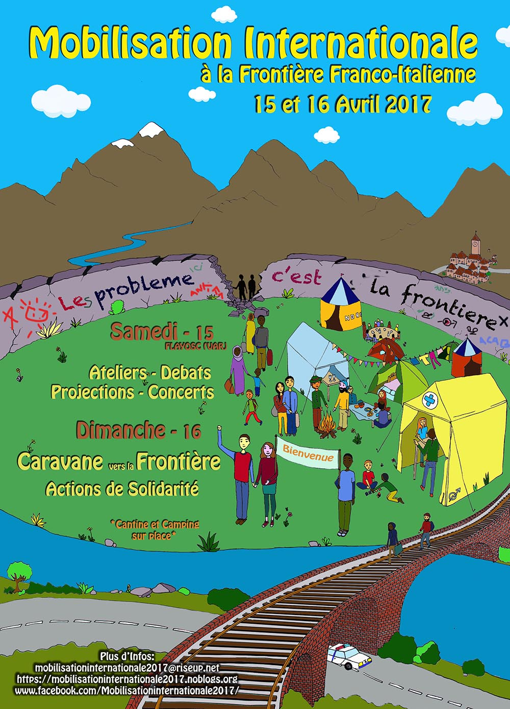
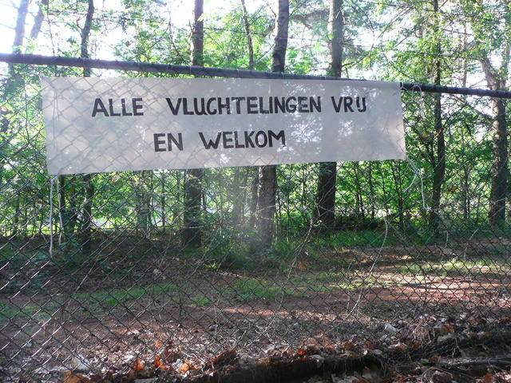
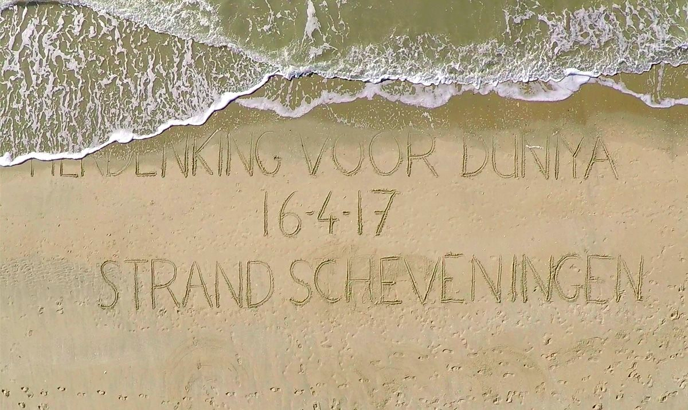
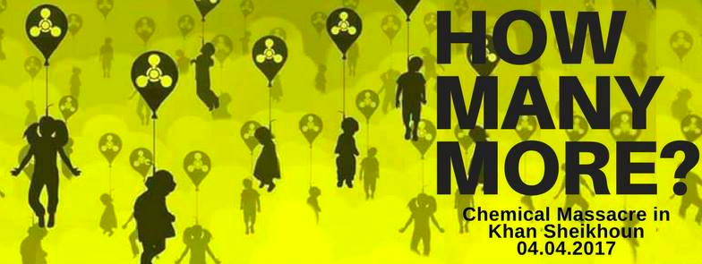
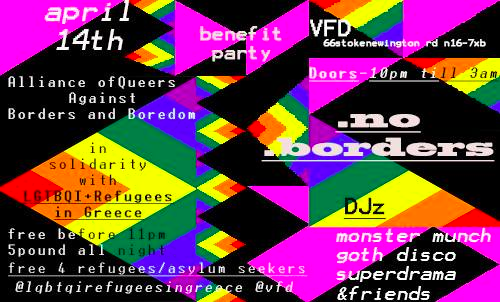

### This Week’s Solidarity Events in Europe
#### 8th to 15th of April — Calendar of protests, fundraisers and other events in solidarity with refugees, updated throughout the week\.
### Greece

**Saturday 8th — Sunday 9th:** [Lesvos International Film festival](https://www.facebook.com/events/1107278826085444/?__mref=mb) — A festival conducted by local Hellenic Red Cross Volunteers together with refugees from the Moria Cinema Club\. The films will be focused on the themes of diversity, each screening will be followed by a discussing about the movies and the issues it raises\. _Address: multiple locations across the island\._
### Hungary

**Saturday 13th to Friday 19th —** [Painting exibition — “Images for Peace”, Shafiq Rafat](https://www.facebook.com/events/1816320088687717/?acontext=%7B%22action_history%22%3A%22[%7B%5C%22surface%5C%22%3A%5C%22messaging%5C%22%2C%5C%22mechanism%5C%22%3A%5C%22attachment%5C%22%2C%5C%22extra_data%5C%22%3A%7B%7D%7D]%22%7D) : Refugees Foundation and the association “Kreativna fabrika” are organizing the exhibition “Images for Peace” in Belgrade by painter Shafiq Rafat from Afghanistan\. The exhibition “Images for Peace” is a cry for the end of suffering, and at the same time praying for people to find their home and serenity on earth\. _Address: Klub Petak Ulica Lomina 14, 11000 Belgrade\._

**Saturday 15th from 2:30pm to 6pm:** [Transnational Protest at the Hungarian\-Serbian border](https://www.facebook.com/events/1321782624534459) — Demonstration against police violence and the detention of refugees at the Hungarian\-Serbian border\.
### France

**Saturday 15th to Sunday 16th:** [International mobilisation at the French\-Italian border](https://www.facebook.com/events/406269619742461/?acontext=%7B%22ref%22%3A%224%22%2C%22feed_story_type%22%3A%22308%22%2C%22action_history%22%3A%22null%22%7D) — protests and workshops to expose the situation at the border and to fight generalized repression against refugees and volunteers\. _Address: On Saturday, [l’Usine de la Redonne](http://www.usinedelaredonne.org/situation.htm) , Route du Flayosquet 83780 Flayosc\. On Sunday, they’ll drive to the border with Italy\._
### Netherlands

**Saturday 8th from 10am to 7pm** : [Bus tour in solidarity with detained refugees](https://www.facebook.com/events/1389914987718466?acontext=%7B%22ref%22%3A%223%22%2C%22action_history%22%3A%22null%22%7D&aref=3) — Prior to deportation, refugees are often locked up in one of the detention centers in Rotterdam, Schiphol and Soesterberg\. A bus tour will be organized along with solidarity demonstrations at these detention centers\. _Address: Amsterdam Sloterdijk station, Orlyplein 103 Changiweg, Bedrijventerrein_

**Sunday 16th from 2:55pm to 3:45pm:** [Commemorating Duniya](https://www.facebook.com/events/260672757726373/?acontext=%7B%22action_history%22%3A%22[%7B%5C%22surface%5C%22%3A%5C%22messaging%5C%22%2C%5C%22mechanism%5C%22%3A%5C%22attachment%5C%22%2C%5C%22extra_data%5C%22%3A%7B%7D%7D]%22%7D) — A commemoration of those who died last year in the Mediterranean\. In particular, a commemoration of those who died during a shipwreck in April 2016, where an estimated 450 people drowned, including a two month old baby called Duniya\. _Address: Schevingen Strand, La Haye\._
### UK

**Saturday 8th from 12:30pm to 4pm:** [London Against Chemical Warfare in Syria](https://www.facebook.com/events/200964253728672/?__mref=mb) — Emergency march organised in direct response to the recent \(and ongoing\) use of chemical warfare in Syria\. _Assembly point: Marble Arch_

**Friday 14th from 10pm to 3am** : [LGBTQI\+Refugees in Greece Benefit Party](https://www.facebook.com/events/1252132898234525/?acontext=%7B%22ref%22%3A%2223%22%2C%22action_history%22%3A%22null%22%7D) — Benefit party in solidarity with the collective [Lgbtqi\+ Refugees in Greece](https://www.facebook.com/lgbtqirefugeesingreece/) , a grassroots collective trying to raise political visibility of LQBTQI\+ refugees, and fill needs such as clothing, food, legal fees, documentation, travel and other daily costs\.

_Address: VFD, 66 Stoke Newington Road, N16 7XB London_

_Converted [Medium Post](https://areyousyrious.medium.com/greece-5ccdbe8ec129) by [ZMediumToMarkdown](https://github.com/ZhgChgLi/ZMediumToMarkdown)._
