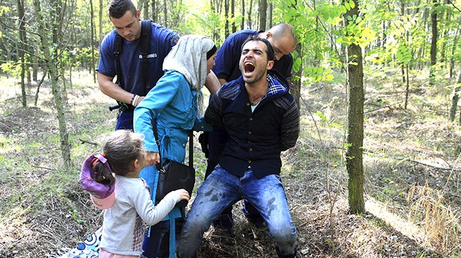
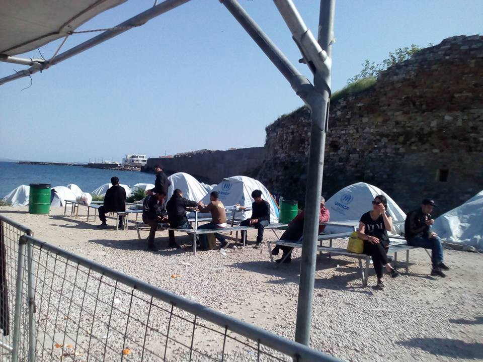
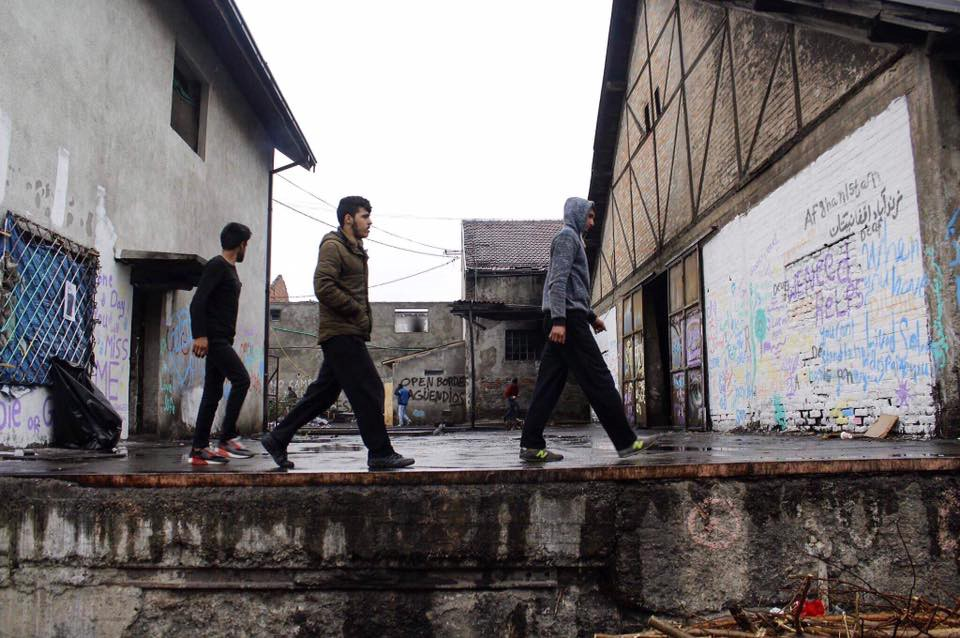

### AYS Daily News Digest 06\.04\.2017: Shocking Oxfam report details violent mistreatment of refugees on Balkan route

A refugee family being detained in Hungary in autumn 2015\. Little has changed\. Photo Credit: Bernadett Szabo
#### Feature

To anyone who has been keeping up with the Balkan Route for the last two years, the fact that refugees find themselves violated at the hands of police and border control as they try to make their way to Europe is no surprise\. Indeed, no country is innocent here, and refugees have reported being brutalized by police in countries from Serbia, to Hungary, to Croatia, to Bulgaria, as well as others\. Sometimes these stories are supplemented with evidence of the grimmest kind: photographs of men, women, and children, bloodied up and bruised\. [Oxfam’s latest report](https://www.oxfam.de/system/files/balkan-bericht_a_dangerous_game_0.pdf) about these pushbacks, which cause so much harm to refugees, confirms much of what we already knew, but also brought some interesting figures into the fore\. It also adds to the already vast repertoire of blood\-chilling testimonies\.

The term pushback refers to the practice of police forces capturing refugees as they are traveling through the country in question and forcing them to go back to the previous country on their route\. Such actions are justified with the claim that refugees are obligated to seek asylum in the first country in which they land, according to EU rules\. But, it is abundantly clear that the pushbacks nonetheless remain illegal according to international law, as a refugee cannot be deported until their case has been considered by the authorities of the country in question\. Needless to say, a refugee’s case cannot possibly be considered if they are being rounded up by police and forcibly escorted to the border and let loose\. Pushbacks are responsible for the accumulation of refugees in countries which do not have the infrastructure to support them in such large quantities\. Oxfam reports that there are roughly 7,800 refugees stranded in Serbia\.

The Oxfam report covers interviews conducted with 140 people, 100 in Serbia and 40 in Macedonia, spanning from late January to late February\. One refugee, Zahid from Pakistan, recalls having been forcefully removed from Hungary a total of 7 times, each time the group he was traveling with was assaulted by policemen wielding batons and dogs\. Another refugee, Arif from Afghanistan, told of the Croatian police’s poor treatment of him, their confiscation of his belongings and jacket before casting him out of the country\. These policies and actions have caused dismay to humanitarian organizations worldwide\. Unfortunately, all of these condemnations amount to nought\.
### IMPORTANT: please warn refugees to not ride atop trains\. It is very dangerous and could easily result in serious injury or death

As time drags on and their desperation grows, refugees resort to more and more risky behavior to reach places where they will not be mistreated\. One such method is travelling on the roofs of trains\. In your interactions with refugees, if they voice the intention to travel like this, please warn them that this is very risky behavior which may easily lead to serious injury or death\.
#### Syria
### Autopsies confirm that Idlib attack was carried out with chemical weapons

In the aftermath of this week’s attack in Idlib, Turkey transported a number of victims into its borders\. Since then, three of those afflicted have died\. The autopsies carried out on their bodies confirmed that chemical weapons were the culprit\. The attack was responsible for the deaths of at least 86 people\. The Syrian government denies involvement, while a Russian spokesman said that the attack happened as a result of a shell hitting a building where opposition fighters were producing chemical weapons\.

This claim is incredibly dubious, and several experts have testified that in the event of an airstrike, the explosion would not trigger the necessary chemical reaction to inflict harm on people\. Furthermore, in the event that the gas turns out to be sarin, currently the most likely candidate, it would be unlikely that opposition fighters would be stockpiling large quantities of the gas, as it is a binary agent that requires the mixing of multiple compounds\. Once mixed, the end product will have a shelf life of only a few days, making it further implausible that the effects were a result of rebel stockpiles\. The separate agents must be deliberately mixed, hence an airstrike on a warehouse containing all of the necessary compounds would not result in the creation of the end\-product\.

As a result of this attack, Donald Trump has changed his stance on Bashar Assad, whom he previously saw as a potential ally in the war against ISIS and Al\-Qaeda\. Trump has ordered military action in Syria in retaliation for the attack, a move which would have deadly consequences for the already fractured and war\-torn country\. In the early hours of the morning, an airstrike was called in to destroy the Syrian air base from which the planes carrying out the gas attacks are thought to have originated\. The full consequences of this move are not yet clear, but such a move risks the escalation of a conflict with Russia\. The current American strategy would bring the US on a direct collision course with Russia, as the plan would require the destruction of Russian air defense systems in the country\. Such a move would very likely lead to Russian casualties and would bring relations between the two countries to a new low\.

Furthermore, American intervention would further damage the volatile situation in the country\. The Syrian regime’s brazen violations of human rights must be brought to an end, but if past experience is any indication, American military intervention would only make the situation worse\.
### Billions of dollars pledged to UN to provide vital humanitarian aid in Syria

The UN has secured a total of nearly $10 billion in funding for 2017 and 2018\. $6 billion is slated to be spent in 2017, and $3\.8 billion in 2018\. The funding still falls short of what the UN reports are its needs for 2017\. At least $8 billion are needed for refugees in Syria and surrounding countries, and the UN hopes to reach 12\.8 million people over the course of the year\.
#### Greece

The people of Souda\. Photo Credit: Alkiem Abdullah
### Refugees in Souda refuse food after last night’s meals made them sick

A large number of refugees in Souda camp on Chios have refused dinner today, following cases of food poisoning from yesterday’s meals\. The situation may very well turn into a hunger strike\. Complaints about food in the camps are not rare, and especially in the early days of the refugee crisis it was not uncommon for refugees to receive moldy, or otherwise poorly handled food\.

Souda camp in general is in very dire condition\. According to inside sources, the toilets had not been cleaned in well over a week\. Samaritan’s Purse had been cleaning them but has either pulled out of Souda or been asked to leave\.

### UNHCR launches new page to help refugees navigate the asylum process

The site may prove to be a useful resource for those seeking information on the procedures related to relocation, family reunification, asylum in Greece, and voluntarily return\. The website may be found below\.

### At least 84 deported to Turkey

Yesterday night at 2 in the morning, 35 people were taken and deported to Turkey\. Also deported were 49 refugees from Lesvos\. There will be more coverage once we learn more about the situation\.
### Hope Cafe in Athens publishes list of needed goods

### Movement on the Ground seeks long term volunteers

### Attika Warehouse on Lesvos publishes list of needed items

The items may be found in the Google Document below:

#### Serbia

Asylum seekers on their way to get breakfast\.
### Refugee Info provides useful information on NGO\-run cash assistance programs

The Q&A, which may be found [here](http://blog.refugee.info/q-a-cash-assistance-in-serbia/) , details how refugees living in 13 out of 17 of Serbia’s official camps \(the exceptions are Subotica, Sombor, Obrenovac and Banja Koviljaca\) may be eligible for cash assistance, as well as the necessary steps to qualify for the service\.
### Afghan refugee photographer in Serbia starts fundraiser to buy laptop

#### Hungary
### Hungarian interior minister defends detainment of asylum seekers in shipping containers

Minister Sandor Pinter said that the refugees’ movements are not restricted, as they can go, “wherever they want… except in the EU\.” Pinter added that, “You cannot say it’s detention\. For example, if I want to protect my home, the people out on the street can still move freely… but I do not want them to come into my home\.”

The European Court of Human Rights has condemned the Hungarian government’s latest policy in a long series which has given the country a reputation as one of the toughest towards those who are trying to claim asylum in the EU\. the new law mandates that all asylum seekers over the age of 14 must wait in the shipping containers on the border with Serbia until their applications are processed\.
### Foster parents for unaccompanied children needed

SOS Children’s Village Hungary, a local NGO, is looking for foster parents within the country\. Particularly needed are people who will be able to care for children under the age of 12\. A foster parent can be anyone who is at least 24 years old, has no criminal record, can properly accommodate a child, and can complete a training course for foster parents\. More information \(only in Hungarian\) may be found at the link below:

#### Germany
### Germany works to annul child marriages of refugees within their borders

Germany is working to pass a new law which will annul marriages which were carried out when either of the parties was under 18 years of age, as well as reemphasizing a ban on child marriages\. There are currently 1,475 underage refugees registered as married in Germany, 664 of whom come from Syria, 157 from Afghanistan and 100 from Iraq\. 361 of these marriages involved children under the age of 14\. The marriages in question took place outside of Europe, but are of course banned in Germany\.

Refugee agencies have been reporting that refugee children find themselves marrying at younger ages to ensure that their families can support themselves\. Many such marriages take place in camps in Lebanon, Jordan, and Turkey\. Not seeing many other prospects for the future, families marry off their underage daughters to men who are significantly older\. The proposed law formalizes social workers’ right to take underage married girls into care, and to separate them from their husbands should there be such a need\.
### Phone line opens for victims of trauma

Refugees suffering from trauma will now be able to call in and receive counseling\. The line is available from Monday to Thursday from 10am to 12pm and from 2pm to 8pm, and it will be available in Arabic, English, German, and French\. You may reach the line by calling **01805 950 951** or **0228 71 00 24 25** \.
#### France
### Refugee Rights Data Project seeks funding for their documentation

As large quantities of people have once again made their way to Calais, child refugees are of course in the mix\. Refugee Rights Data Project seeks to quantify these children and document their living situation, so as to bolster the case of their needs to French and British authorities\. The group is over halfway to their goal, and a link to the fundraiser may be found below\.

### Refugee Youth Service in Calais is in need of donations\!

#### UK
### Six refugees rescued aboard a sinking vessel in the English Channel

On Tuesday morning, a small boat carrying six Iranian refugees issued a distress signal\. Their boat was sinking, and fortunately they were rescued in the nick of time, suffering mild cases of hypothermia but otherwise okay\. The refugees were hoping to reach Dover, but they were instead returned to Calais\.
#### Italy
### Italian Interior Ministry releases new numbers on refugee arrivals to Italy

According to the latest figure, as of April 6, a total of 25,098 refugees sailing from Libya have made their way to the country\. This number is a significant increase over the previous year’s figure, which stood at 19,326 for the same date\. A detailed report on the figures may be accessed [here](https://l.facebook.com/l.php?u=https%3A%2F%2Flookaside.fbsbx.com%2Ffile%2FSEA-ARRIVALS-TO-ITALY.docx%3Ftoken%3DAWxzj4-trSAcAB37WhD8byL1hDRcS_numddi9gwcSg2779BiYyf241ALULHAQsaNjWiL812CaPJtZcRr1Hhn9iLXeEbBTVmDELeIUFzXkpEQQzFF8eQnsj7L0b-bz8ma2ydEdWhzL4LZx6thkcrfjSLgXD8ndFud22HHlIY2wDne05cOnXcBOITx032ex0KJ-14&h=ATN4QfjG7EFaL6ULLtbke1FCCwuV33DKegdBWXDRvcM2u7Dn-yvh5jFq2x2IxRYhilsJcTLCUp0DAnMXAeFsKshoZTx_dpSxVy4jHmlkhMvazaeC8UzRgbIC_uR0VR1xL8d4ow) \.
### New organization to promote integration of refugees formed in southern Tuscany

Teachers, craftsmen, anthropologists, businessmen and other interested people came together to create a non profit organisation called “Incontriamoci” to promote integration between the local communities and the asylum seekers from Western Africa, Bangladesh, Afghanistan, Pakistan\. “We visited the reception centre where these men live and where they live in a limbo of uncertainty and lack of possibilities\. We ask for more people to join us in order to help this young men to come out of this forced idleness, which leads to depression and abulia\.”

Incontriamoci will be a network to coordinate integration on the social, linguistic, cultural, recreational and professional levels\. On Friday 21st April in Chiusi, there will be a meeting to present the new project\.

_Converted [Medium Post](https://areyousyrious.medium.com/ays-daily-news-digest-06-04-2017-3c9a0706be66) by [ZMediumToMarkdown](https://github.com/ZhgChgLi/ZMediumToMarkdown)._
