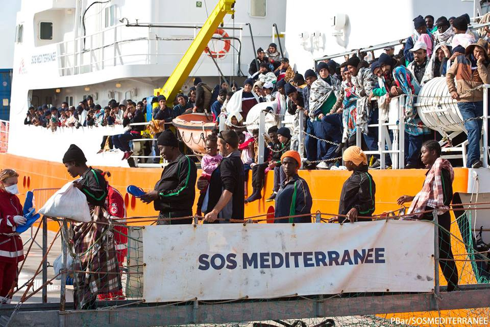
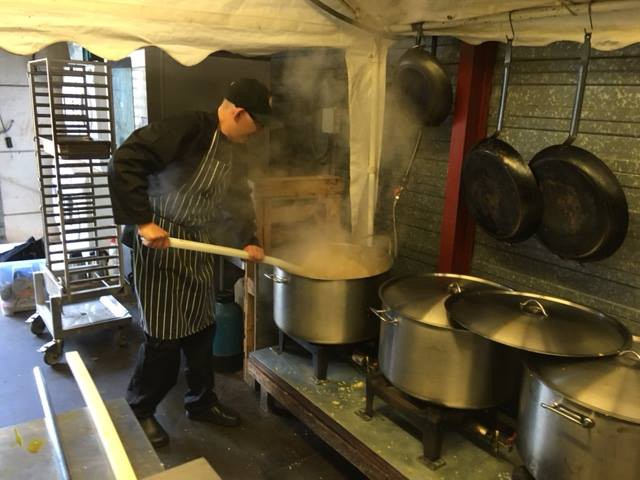
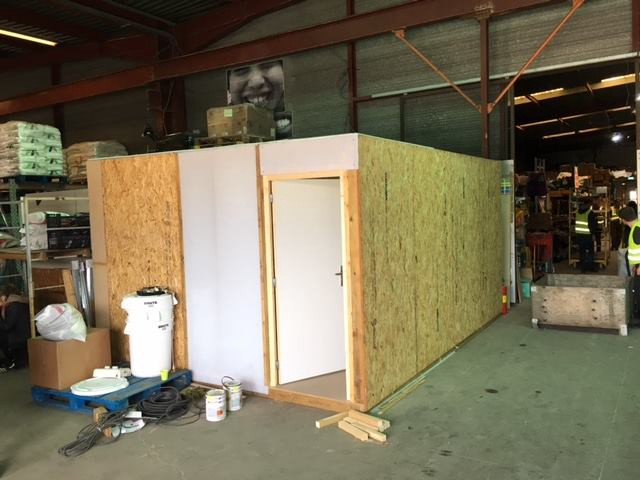
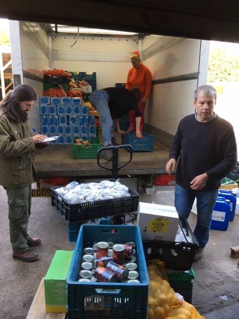

### AYS Daily Digest 07/04/17: Increased relocations and deportations causing more harm

_Civil society organisations write to the EU Commission / 29 year old Syrian who set himself on fire in Chios passes away / Demonstrations over bombings of civilians in Syria / English sessions starting at Belgrade’s Info Park / Open letter to city officials in Como and hunger strike in Turin / More on deportations and relocations_

 2 is saving lifes continuously\. It´s hard too keep up with reports — this morning, for instance, our crew spotted a wooden boat with over 400 people on board\.](assets/5a023858d976/1*-AqJ3riqa0LQkUfIcy84Lw.jpeg)

Sea\-Watch: Update from the SAR\-Area: The second day in a row, [Sea\-Watch](https://www.facebook.com/seawatchprojekt/?ref=page_internal) 2 is saving lifes continuously\. It´s hard too keep up with reports — this morning, for instance, our crew spotted a wooden boat with over 400 people on board\.
#### Relocations, rights and reception

Dozens of civil society organisations from around the world have recently joined forces to condemn new EU Commission plans on detentions and returns that will cause more harm and suffering, [report](https://newsthatmoves.org/en/ngos-new-eu-plan-goes-against-refugees-and-migrants-2/) NewsThatMoves\. The new EU plan urges member countries to [detain migrants](https://newsthatmoves.org/en/more-detentions-and-returns-to-deter-migrants/) more quickly and for longer periods of time, and [increase returns](https://newsthatmoves.org/en/more-detentions-and-returns-to-deter-migrants/) as a way to discourage further migration, they write\.

> Civil society organisations demand the EU Commission respect its own laws and regulations and continue to support human rights and the rule of law, and promote the implementation of the highest human rights standards in its legislation, _stands in the statement\._ 

The statement can be read [here](http://legis.mk/uploads/CSO%20joint%20statement%20EC%20Return%20and%20%20Detention%2003%20March%202017_EN.pdf) in full\.

The European Asylum Support Office [published](https://www.easo.europa.eu/questions-and-answers-relocation) a piece explaining the relocation process\. The eligible countries as of 1st April 2017 are now Antigua and Barbuda, Bahrain, British overseas countries and territories, Eritrea, Grenada, Guatemala, Syria and Yemen or a stateless person previously residing in one of these countries, they write\.

> _In addition, in order to benefit from relocation:_ 

> \- you have to first apply for international protection in Greece or Italy; 

> \- you must go through the identification, registration and fingerprinting procedure carried out by the Italian and Greek authorities; 

> \- you must also show that you arrived in Italy or Greece after 24 March 2015\. 

More about fingerprinting, priority in case of special needs, relocation destinations and the procedure can be read [here](https://www.easo.europa.eu/questions-and-answers-relocation) in English and Arabic \(soon also in Pashto and Dari/Farsi\) \.

EASO has also published a leaflet on rights and obligations in the context of reception, available [here](https://www.easo.europa.eu/sites/default/files/Reception%20Leaflet%20v10.pdf) , providing general information about certain rights such as access to accommodation, food and clothing, healthcare, daily allowances, education, access to the labor market, also information on benefits and obligations\.
#### Mediterranean Sea

IOM reports that 29,811 migrants and refugees entered Europe by sea in 2017 through 5 April, with over 80 percent arriving in Italy and the rest in Spain and Greece\. A total of 663 people died en route\. The detailed report can be found [here](http://www.iom.int/news/mediterranean-migrant-arrivals-reach-29811-deaths-663) \.

[SOS MEDITERRANEE](https://www.facebook.com/SOSMEDITERRANEE/) also writes about an arrival in Sicily two days ago when 365 people were rescued\.

> There are six children among the 365 people rescued yesterday\. “You can hardly imagine what it feels like to pull these little children into safety and at the same time think they have been drifting on a rubber boat in the middle of the sea for hours”, commented Benedetta from the rescue team\. 

365 people that have shared their fears, hopes and dreams with us during the last 24 hours\. We wish them strength to continue their journey — SOS Mediterranee
#### SYRIA

A massacre in a village in the eastern countryside of Al\-Raqqah raises the civilian death toll to 204, including about 70 children and women killed in strikes by the international coalition since the beginning of March 2017, [reports](http://www.syriahr.com/en/?p=64380) the Syrian Observatory for Human Rights\.

A demonstration was held in Khan Shaykhun city located in the south of Idlib province, which witnessed bombing three days ago that caused a massacre claiming the lives of 87 civilians, including more than 50 women and children\.

#### GREECE
#### Follow\-up on yesterday’s deportations from Lesvos

Pursuant to the responsibility of the Greek Police and the Frontex staff assistance, as provided for in the Joint EU\-Turkey Declaration, 49 people — all men, of whom 38 from Pakistan, seven from Algeria, two of the Mangklantes, one from Ghana and one Palestinian were returned to Turkey yesterday\. The Frontex boat sailed from the port of Mytilene to Dikili in Turkey\.
It is noted that from January 1, 2016 there were returns to Turkey:

• Based on the bilateral Readmission Protocol Greece — Turkey, 1,196 foreign nationals from third countries,
• Under the EU Readmission Agreement — Turkey, 63 Turkish and foreign nationals
• Based on the Joint EU\-Turkey Declaration, 993 foreigners of various nationalities\.

In addition, since the implementation of the EU\-Turkey deal, 922 foreign nationals from third countries who entered Greece by sea from Turkey have returned to their home countries voluntarily through IOM\. The report is available in Greek [here](http://mindigital.gr/index.php/%CF%80%CF%81%CE%BF%CF%83%CF%86%CF%85%CE%B3%CE%B9%CE%BA%CF%8C-%CE%B6%CE%AE%CF%84%CE%B7%CE%BC%CE%B1-refugee-crisis/1152-49) \.

Amnesty International published a [report](https://www.amnesty.org/en/latest/news/2016/04/greece-refugees-detained-in-dire-conditions-amid-rush-to-implement-eu-turkey-deal/?utm_source=facebook&utm_medium=article&utm_term&utm_campaign=social) on the conditions in which refugees are automatically detained in Moria in Lesvos and VIAL in Chios after visiting the camps on 5th and 6th of April\. Amnesty interviewed 89 people in the camps, many of whom need special care, where currently a total of around 4,200 people reside\.

“People detained on Lesvos and Chios have virtually no access to legal aid, limited access to services and support, and hardly any information about their current status or possible fate\. The fear and desperation are palpable” stands in the report\. They continue to say that in Moria detention centre, Greek army and police exercise strict control over who goes in and out, detaining 3,150 people in a camp closed off from the outside world by several layers of fencing topped with barbed wire\.

In VIAL centre, built around an abandoned aluminium factory, access is also tightly controlled\. The majority of those who fled after clashes in the camp \(when around 400 people escaped\) are now sleeping rough in and around the main port in downtown Chios where there is little security and scant access to basic services\.

Many refugees they spoke to talked about the lack of access to doctors or other medical staff \(especially acute for vulnerable groups in need of highly specialized medical assistance\) in both centres, also poor quality of food, lack of blankets and privacy\. Only two of the refugees and migrants Amnesty International spoke to were able to show their detention orders based on their individual circumstances\. Automatic, group\-based detention is by definition arbitrary and therefore unlawful\.

> The official told Amnesty International that it will be up to the individual case workers to determine if Turkey will be deemed a safe third country for people who apply for asylum in Greece\. When Amnesty International visited VIAL, there were no clear instructions yet regarding what criteria and information will be considered in this process\. 

Read the full report [here](https://www.amnesty.org/en/latest/news/2016/04/greece-refugees-detained-in-dire-conditions-amid-rush-to-implement-eu-turkey-deal/?utm_source=facebook&utm_medium=article&utm_term&utm_campaign=social) \.
#### Greeks overestimate refugee population

A [survey](http://aboutpeople.gr/entaxi-ton-prosfigon-stin-ellada/) \(in Greek\) carried out by the research agency [AboutPeople](http://aboutpeople.gr/about-us/) shows that Greeks overestimate the number of migrants and refugees currently living in the country, [reports](https://newsthatmoves.org/en/greeks-overestimate-refugee-population/) NTM\. They found that about six out of ten Greeks believe that there are more than 100,000 refugees currently in Greece, and around 30 percent believing that the figure is over 200,000, while official data show that the number of refugees in Greece does not exceed 60,000\.

However, majority of Greeks see integration of refugees in a positive light, an example of which is 60\.1 percent thinking that refugee children should be enrolled in the same classes with Greek pupils\.
#### Urgent need list from Koutsohero camp

> Nappies nο 1 to 6 and baby milk no 2 urgently needed\. 

> The population of babies under one year is: 80 
 

> and children 1–3 years : 150 
 

> Pampiraiki warehouse can send us some help but we don’t have the budget for transportation from Athens to Larissa\. Any other organisation or volunteers group can send us nappies and baby milk No 2 \.?
 

> Delivery is made to storage of Municipality at Larissa and we are open every day 7\.30–15\.00 
 

> Contact Danai\-Katrerina [here](https://www.facebook.com/danaikaterina.vallianou?fref=nf) \. 

#### Jafra R2R Greece need help for refugee\-run Athens shelter

JAFRA are a group of refugees in their twenties, who want to empower their fellow refugees in Greece to initiate and implement community based programming from within camps and accommodation centers\. They aim to build the capacity of fellow refugees to organize and gain support from existing informal, non\-governmental and governmental structures, by developing their skills and supporting youth\-led projects\. Single women with children who have been displaced are particularly vulnerable\.

The Jafra team have set up a shelter in the centre of Athens to house women and children\. They are raising funds for the rent and running costs of this vital project\. See more and support the project [here](https://mydonate.bt.com/events/jafra/421618) \.

One volunteer reports on 38 asylum\-seekers from Pakistan, 7 Algerians, 2 Bangladeshis, 1 Ghanaian, 1 Palestinian being re\-admitted to Turkey yesterday\. Other sources say 49 people \(nationalities of Pakistan, Bangladesh, Algeria, Palestine and Ghana\) were deported by Frontex from [Lesvos](https://twitter.com/hashtag/Lesvos?src=hash) to Turkey, 35 from other islands and 14 from Moria, Lesvos\. People reported being handcuffed and chained by four\.

The 29 year old Syrian refugee who set himself on fire in VIAL camp in Chios on [March 30th](ays-daily-digest-30-03-17-young-syrian-attempts-suicide-in-a-chios-camp-547648862932) passed away in the hospital today\.

There were 25 new registrations, 6 in Kos island and 19 elsewhere\.
#### SERBIA
#### Belgrade — English classes start at Info Park from Monday 10 April

> If you are a resident of Krnjaca or Obrenovac camp, a registered asylum seeker living in Belgrade, or you sleep rough in downtown Belgrade, you are most welcome to join us every working day from 4PM to 6PM following this schedule: 

> 4PM — English for girls & women only \(no men\! \) 

> 5PM — English for men or men&women \(those who don’t mind studying with men together\) 

> The sessions are 50–60 minutes long and if they prove to be successful we can consider extending them\. The classes will be held by a very enthusiastic group of teachers from Canada, United States, England, Pakistan…\.who will try to entertain you through various subjects such as maths, history, geography, social science, interactive games and many many more\. We promise you will be thrilled\! We encourage all ethnicities: Afghani, Syrian, Somali, Iraqi, Pakistani, Sri Lankan, Palestinian, Cuban, Nepali…\.to join\. One World at Info Park\! Since we are limited with space \(maximum 10 per group\), we would appreciate your early expression of interest — please send us a message with your name and nationality\. See you on Monday 10 April 4PM \(if you are a girl/woman\) or 5PM \(if you are a man\) and than every next day at the same time, _writes Info Park_ 

#### AUSTRIA

While a German court has decided against Dublin deportations to Bulgaria, a Syrian family is facing this fate in Fürstenfeld, Austria \(Styria\) \. The family has been living in Austria for 3 years, and is well integrated, the children go to school\. The Christian charity Diakonia has filed a protest against this decision and the case is now pending at court, [reports](http://steiermark.orf.at/news/stories/2835238/) Steiermark\.
#### GERMANY

A German court has deemed deportations to Bulgaria illegal, because refugees will face inhuman and humiliating treatment, might become homeless, have almost no chance to find work or integrate into society, and will therefore be existentially threatened\.

The case was made for a 19 year old Yesidian Kurd, who had received refugee status in Bulgaria, but moved on to Germany afterwards and who went to court to appeal against the decision to be sent back to Bulgaria\. The court stated that his decision is final and unlimited \(in time\), Neues Deutschland [reports](https://www.neues-deutschland.de/artikel/1047443.gericht-verhaengt-abschiebeverbot-nach-bulgarien.html) \.
#### Afghan refugee goes to court in Bavaria over work permit

Yesterday a young Afghan won his case in court in Munich against the decision not to be issued a work permit to pursue his apprenticeship \(3 year professional training\) \. He had already secured a placement to be trained as a professional tailor after having completed an internship\. He worked as a tailor for 13 years in Afghanistan\.

In general, work permits for people from countries with “low acceptance rates” should not be issued or should even be revoked according to a directive in Bavaria in order to discourage \(ab\)use of asylum law for work migration\. Some count Afghanistan as one of these countries \(in 2016, about 50% of Afghans who had their asylum procedure decided received some form of protection, though most not full refugee status\) \. One exception to the directive not to issue work permits to these people are apprenticeships, because Germany has a lack of skilled workers, so refugees pursuing an apprenticeship will receive a permit for 3 years \+ 2 further years after successful completion\.

While other German regions are implementing this, Bavaria sticks to a number of exemptions and rarely issues these “3\+2” work permits: A work permit does not need to be granted if there are “imminent deportation measures pending”, the refugee “does not actively participate to clarify his identity” or committed a crime\. Companies and board of trades have continuously protested against this legal practice in Bavaria\. They need young workers and certainty that refugees can stay for a couple of years to complete their training\.

Yesterday, the court decided in favor of this young Afghan man and the employment office needs to reconsider his case with the current situation in Afghanistan in mind\. This is the first time a refugee went to court in Bavaria to sue against not being granted a work permit and NGOs such as ProAsyl consider the decision, even if only for a single case, as a very positive sign\. The court also stated that there is no age limit to the apprenticeship rule, and the fact that the young man’s level of German is only A1 after 2 years cannot be held against him\. He needed to learn to write first and was not granted a place in one of the official language courses, so relied solely on volunteers teaching him\. He is eager to successfully pursue his new career and not disappoint anyone, and his future employer will keep his job open until a final decision is issued\. More on the case available [here](http://www.sueddeutsche.de/bayern/asyl-bayerisches-gericht-hebt-arbeitsverbot-fuer-fluechtling-auf-1.3453989?reduced=true) \.

Chancellor Merkel defended Germany’s stepped up deportations of rejected Afghan asylum seekers in a meeting today, saying other European countries were doing the same, [writes](http://www.reuters.com/article/us-europe-migrants-germany-merkel-idUSKBN179298) Reuters\.

A new study shows that Germans are still for welcoming in refugees in principle, but at the same time feel that their country can’t cope with more arrivals, The Local [writes](http://A new study shows how Germans are still for welcoming in refugees in principle, but at the same time feel like their country can't cope with more arrivals.) \. While in 2015, 40 percent of respondents told the study that Germany had reached the point where it could take in no more refugees, in 2017 this proportion has risen to 54 percent\.
#### POLAND

Polish head of the Ministry of Foreign Affairs Witold Waszczykowski rejected the possibility of penalties for Poland for not accepting refugees\. The problem of refugees is not linked to structural funds, Waszczykowski [said](http://wiadomosci.wp.pl/witold-waszczykowski-odrzuca-sugestie-ws-kar-dla-polski-za-nieprzyjmowanie-uchodzcow-6108457501730433a) in Strasbourg, rejecting the suggestion that the country could be punished by Brussels for shutting its doors to refugees\.

The reaction comes after The Times [reported](https://www.thetimes.co.uk/edition/news/take-in-migrants-or-leave-eu-tells-hungary-and-poland-rscwfgtwn) on possible financial and political sanctions for Poland and Hungary if they fail to accept the given quota\. Waszczykowski emphasized that Poland receives structural funds, which were intended as a tool for equalizing the economic level of the EU countries and compensating for opening up the market to stronger economies, having nothing to do with the issue of refugees\.
#### ITALY
#### Como — open letter to city officials to intervene

An open letter was published urging the City of Como to intervene with respect to the serious danger posed to hundreds of people not having any reception and being forced to sleep in the street\. The current situation is not tolerable and is an emergency\. About 100 persons are currently living on the streets in Como, since the \(already insufficient\) official shelters closed on 1st April\. Also, the station which many homeless used as a refuge last year, is now heavily guarded so no one can use it as a shelter\. The city should help and provide spaces the homeless can use as dormitories\. Read it \(in Italian\) [here](https://ecoinformazioni.wordpress.com/2017/04/07/emergenza-persone-abbandonate-in-strada-nessi-e-grossi-il-comune-intervenga/) \.
#### Hunger strike in Turin center

Yesterday night refugees in Turin have initiated a hunger strike to protest their detention and the poor conditions in which they are living\. It is not the first time that the center in Turin, only one still active in northern Italy, became the venue of such protests, there were many in recent years regarding unacceptable conditions and degradation\.
#### UK
#### Volunteers needed in the London area

The Refugee Council, supporting refugees arriving in the UK, calls for volunteers for housing resettlement, mother and toddlers group, destitution and children’s panel\. Find more about the open positions [here](http://www.refugeecouncil.org.uk/how_you_can_help_us/volunteer) \.
#### FRANCE

Another Sudanese refugee is facing deportation\. He was arrested close to Caen when he tried to cross to the UK\. He is now at Rennes detention center\. “Passeurs d’hospitalité “ asks people to take action and contact the secretary of interior affairs as well as the prefecture \(contact details [here](https://passeursdhospitalites.wordpress.com/2017/04/07/risque-dexpulsion-vers-le-soudan-prefecture-du-calvados-cra-de-rennes/) , text in French\) \. NGO La Eimade has written a press communiqué concerning the case\.
#### Refugee Community Kitchen in Calais got their first visit from the health inspector

> After nearly a year and a half of service and over a million nutritious hot meals made and distributed from our kitchen at the Auberge Calais warehouse HQ, we had our first official health and safety inspection from the local authorities, triggered by the mayor of Calais\. We received the inspection report and although the officials are very impressed with our set up and systems they have imposed refinements and environmental improvements that we must undertake within a time frame of firstly 21 days for medium improvements and 60 days for major works\. 

> For the medium improvements we have created a changing room and must have sufficient kitchen work clothes for all volunteers in our hot and cold kitchen, that’s at least 600 items, we must also upgrade our hand wash sink and extend our kitchen and storage daily and weekly checklists and temperature records\. We have engaged with these initial changes and with the help of many kind people and groups we have achieved them within the allotted time frame\. The major works entail building a sanitary room around our existing hot and cold kitchen, within the warehouse \(the enclosed kitchen will be approx 120m2\), creating industrial extraction and re plumbing & electrical works\. 

> We will use our recently refurbished kitchen truck over the building period to carry on providing our hot food commitments\. The first use of our mobile kitchen will provide a robust test of its capabilities before we set it to work\. The Calais static distribution continues to grow \(190 people yesterday, 170 the day before\), 140 mobile take away meals in Calais, 500 hot meals served in Dunkirk, 1000 people provided for daily through the Dunkirk free shops \(1650pop\), 380 people provided for weekly through the two unofficial refugee camps, 200 homeless people fed over three distributions per week in London\. 

> To put that in monthly figures : 

> Monthly hot meals provided : 27,000 

> Individual Provisions provided monthly : 41,400 

> With your help this work continues, so please spread the word\. If you or any one you know may want to get involved with volunteering or contributing in any way please let us know\. 

> Endless thanks and love from all RCK team and supported communties\. xxxx 

> refugeecommunitykitchen@gmail\.com 

> [http://refugeecommunitykitchen\.com/](https://l.facebook.com/l.php?u=http%3A%2F%2Frefugeecommunitykitchen.com%2F&h=ATPtfryrN50mFsht4aU0bUDGYqG6jET6LL6NCV5bJ75XzE5ocO1jiV9xTAf7oVNCzfwatovkcVdNMvb-6PIzq3fNjF722NUoWcVVTz-bVsFleD3N0pIHp1q3eSxLVkftDKnxfty4egZdq9E&enc=AZOJWw4BE5NtzwkxgITImlHJgsLa6YySPbSGBVamgLHBG9EuouzEM9twCH7MuoHC4jOwhX1_P2_rLpJECMz4g-BRKm1tTrmVrWuQPL4wAEhi--vBSkug3601h7-OsqpHONnl6-4K25DO0otGyjRsYDjyRhn0rdMNLfr9QmxbC-LUuA&s=1) 

> You can donate [here](https://mydonate.bt.com/charities/refugeecommunitykitchen) \. 

](assets/5a023858d976/1*YdXWlHuRASiiADY17eJTtA.jpeg)

[Refugee Community Kitchen](https://www.facebook.com/groups/RefugeeCommunityKitchen/permalink/1379456285455204/?hc_location=ufi)
#### SWEDEN

The Swedish Migration Agency \(Migrationsverket\) has asked psychology experts to help them better judge the stories of asylum applicants during the application process and make it more legally secure, [writes](https://www.thelocal.se/20170407/sweden-asks-psychology-experts-to-help-improve-asylum-assessments) The Local\. “Each case is unique\. But we can probably get it right to a greater extent\. This will to some degree lead to more legally secure assessments,” Migrationsverket skills developer Christian Andersson commented\.

_Converted [Medium Post](https://areyousyrious.medium.com/ays-digest-07-04-17-increased-relocations-and-deportations-causing-more-harm-5a023858d976) by [ZMediumToMarkdown](https://github.com/ZhgChgLi/ZMediumToMarkdown)._
