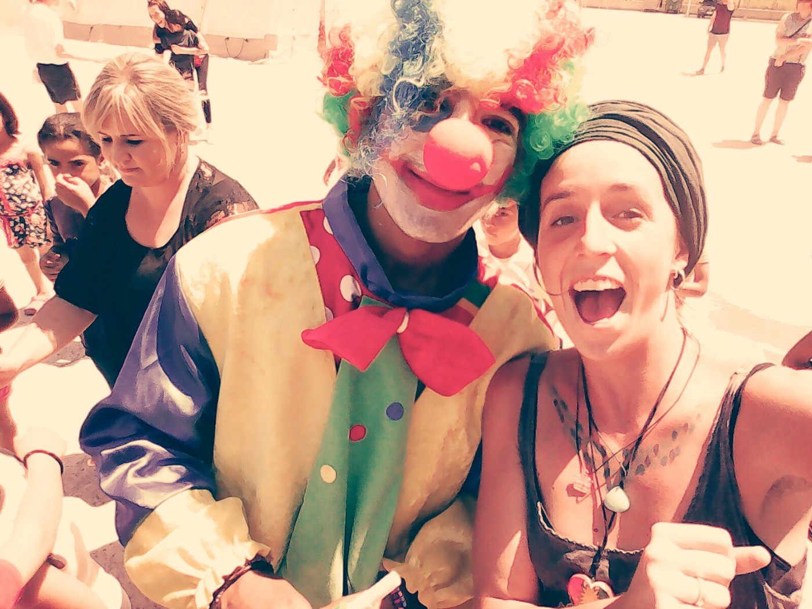
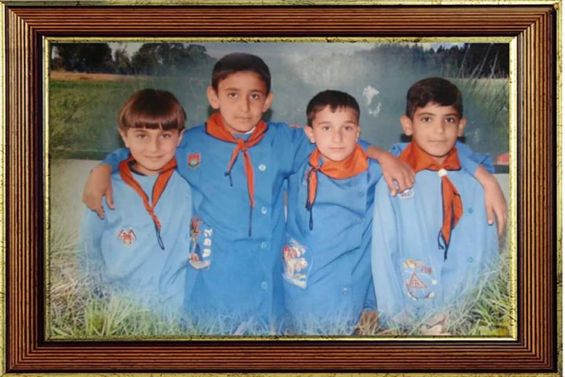
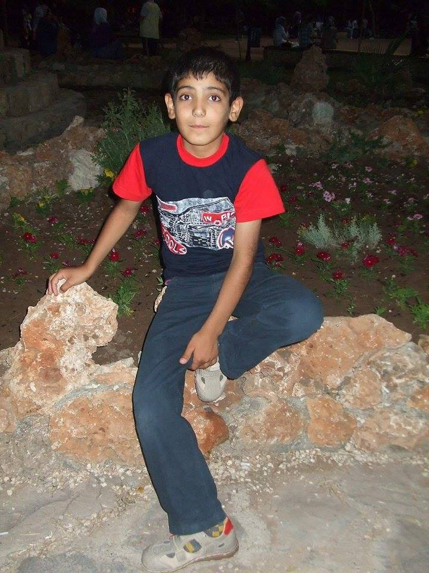
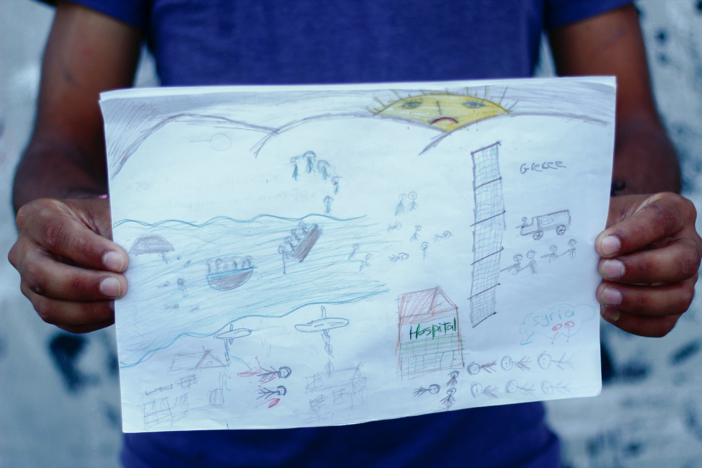
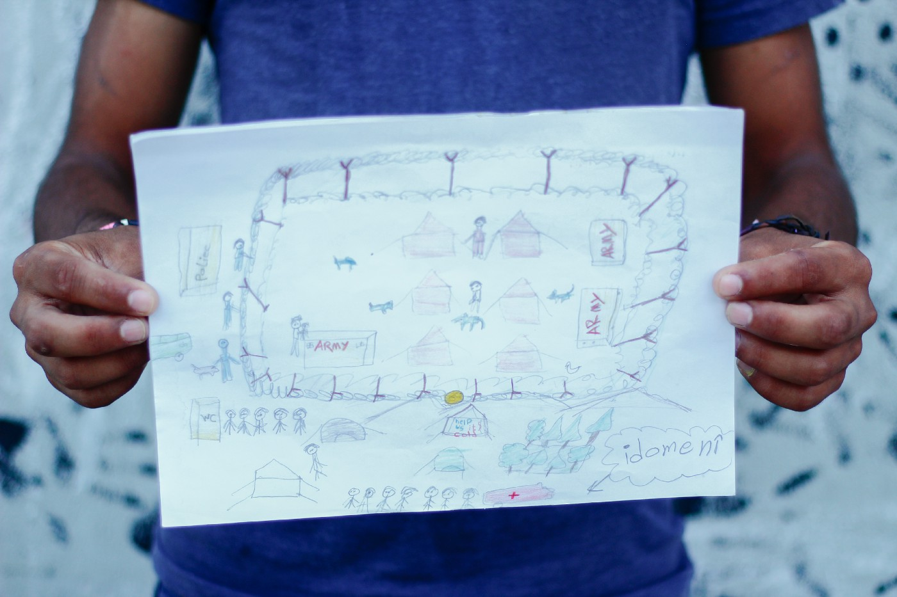
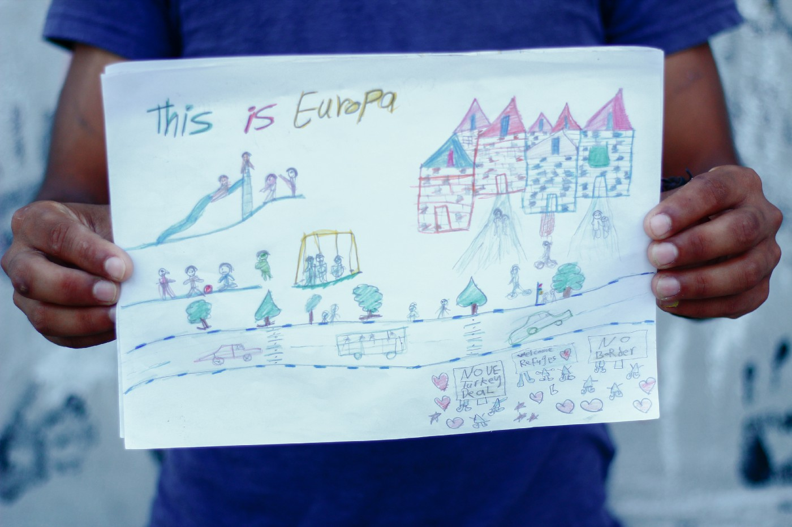

### AYS SPECIAL: Here is Adnan’s story

_Giulia Baccosi is a volunteer who spend last summer working in Kalochori camp, near Thessaloniki\. There she met Adnan \(17\), a young man who used to help her with translation, but also to find her way in the camp\. And they became friends\. After almost a year, they came up with the story\._

Adnan and Giulia in Kalochori, friends for life\.

Adnan and I became friends, very quickly as it always happens in situations where the lack of humanity is deeply felt, drinking lots of chai \(tea\) in his tent with his lovely family\. Once I asked him if he wanted to make a drawing\. After few days he came back with three of them\. There was much more to read on those papers filled with lines and colors than in thousand books\.

Now Adnan completed his long journey to safety\. Finally, he is in Germany with his family and he can enjoy a humane life\. I asked him if he wanted to write his story, from Syria to Europe, and if he agreed for it to be published later on\. He replied that there is nothing to be afraid or ashamed of now, not anymore, and he joined the idea with enthusiasm and passion\. I think he saw in me an open window to the world, the possibility to speak out something that was for too long locked inside his soul\.

Writing was a kind of an exorcism ritual to set free the ghosts and nightmares in order to go on, but most of all, he was motivated by the deep need he grew inside himself, to act and help\. Despite his young age he passed through enough hard and challenging experiences to understand that ignorance is the main enemy of integration\. We know that ignorance is the poisoned root of every evil and, since it is dangerously mixed with the fear we are all breathing, nothing will ever change for the better, and the integration will remain a pure utopia\.

For a while he was emailing me what he remembered and I was sending back some questions regarding what he wrote\. Slowly, he put together the fragments of his memory and got to what you will read below\. I guarantee for the authenticity and integrity of the text, I didn’t change, correct or edit anything\. It was not needed\. I simply supported him\. Anyway, what I think or feel is not important and I will not waste more of your time in commenting\.

I only invite you to consider that there is much more behind the word “refugee”\. Here is Adnan’s story\.

**Chapter 1\.**

Adnan with his school friends in Syria\.

**SYRIA**

“ **_What can we do when the death is following us? When is taking our dreams away? When the warplanes are flying over our heads? Or against the tanks? What would you do?”_**

My name is Adnan\. I am 16 years old\. I am from Syria a city call Qamishlo\. I really love computers and also to play football with friends in the streets\.

We were all living in harmony despite the diversity of the population and we had a stable and safe life before the war began\. I was studying at the basic stage, I used to study a lot because I wanted to follow the informatics and technology studies\. But in one day the war started\. I was 11 years old\.

The war broke out and prevented me because the conditions were getting bad day by day: no heating, no electricity, no water to drink, everything became so expensive\.

Adnan back in Syria\.

One day started snowing, I was so happy for that and I went out to play snowball with friends\. Suddenly, we heard a really big noise close to us\. I was afraid\. I run home to get warm, but was shocked because there was no heating and electricity and I went under the blanket crying a lot saying: why this happen, I am cold, I am afraid, I want to play , I want to continue my school, I felt so helpless\.

It was three years of Revolution\. During all these years we were suffering a lot: we can’t go out of home, or to go school, we live like in a box \(cold, dark, hungry\) \. Some days we didn’t have anything to eat and this forced us to eat only a moldy bread\. But more than all was to see people killed in front of our eyes\. Everywhere blood\. Bombing noise no stop\.

After all that happen my father decided to send me and my sister \(18 years old\) to Turkey, even if we didn’t want to leave\.

But what can we do when the death is following us? When is taking our dreams away? When the warplanes are flying over our heads? Or against the tanks? What will you do?

One week after we found a man\. His work was to bring people to Turkey\. My father contacted him, then next week he called us to be ready to start the trip and he asked for 700 dollars for each of us\. I soled my computer and other things at home till we got enough\. After that, in one midnight, we went to the border of Turkey\. Everywhere was so dark and cold, we run like two hours to pass the border, finally we passed safe, we went to one park in the city close to the border, we spent all the night there till the morning came…

War in Syria by Adnan

**Chapter 2\.**

**TURKEY**

“ **_We felt happy and we thought that we are free and safe now, but honestly it was not as we thought… “_**

When we wake up in the morning we see a lot of people around and children are going to school\. We felt happy and we thought that we are free and safe now, but honestly it was not as we thought\.

Me and my sister live in the basement of my cousin’s house\. After a while I find a work in a factory, which was so hard and heavy for me, and also in the place I work people were laughing at us\. My sister was at home, I really didn’t want her to work with this people and to treat her like they do for me\. It was very bad but I didn’t want to ask for money in the streets, how could I want the money from these people? In the end I have to leave the work because they didn’t pay me for five months I worked because they thought that I can’t make anything with my age in their country\. The Turkish people are looking at us badly, and treat us with racism and injustice, laughing at us just because we are refugees from Syria and some of them because we are Kurdish\. They used to say that we shouldn’t have smartphones but bananas and when I went to market to buy some food they put higher prices for us\. If you don’t want to buy\. Get out\. Same things in the public bus or train\.

They were saying that no one push me to come to their country, that we have to leave their country\. If you don’t want to buy \. Get out\. Some things in the public bus or train \.

My father came also to Turkey and when he saw how they treat us he felt big disappointment for that, so he decided to go to Germany to make a family reunion for us\. He left with hope…

I find a new work in a coffee shop working 16 hours a day, but just because one day I didn’t go to work because I was sick they expelled me from the work\. I fed up from everything, I couldn’t stay there anymore: so we decided to go to Greece and pass other countries to go Germany to my father\. There were many Syrian and Turkish people getting people in Greece\. One in my family knows one of them: he wants 2500 euros for each of us\. We don’t have this money so my father has to ask to his friends for money\. When we get enough money we can go, but it was a really dangerous choice to know that this is a journey between life and death, but it was our last hope for life\. We come to the sea in a town call Ceşme in Izmir, together with many other people in middle of night\. The man said that he will only put 37person in the boat, but he lied to us\. We ride the boat but the boat was too small compared with us\! We were 78 persons and the boat was for 40\. And we come all in the boat \.When the motor turn on I close my eyes and start praying for survival…

**Chapter 3\.**

**GREECE**

**_“It was not better to die quickly than die slowly?”_**

One hour in middle of the death sea and when I open my eyes I saw there are lights, it is Greece\! It is an island and its named is Chios\. We reach the beach and some organizations come to help us to come down the boat, and they give us water and some blankets and they take us to the bus to go to the border of Macedonia\.

Life in Idomeni by Adnan\.

We arrive to the border of Macedonia\. It is called Idomeni\. We see a lot of people there living in small tents\. I ask to someone I met there since how many days he was there\. He answers one week\. I say “ohhh how could you stay here for this long…\!”, but we also stay for long long time, in a small tent, raining a lot and cold\. Our tent couldn’t withstand the water and

wind\. I was so tired and weak from everything, asking my self: IT WAS NOT BETTER TO DIE QUICKLY THAN TO DIE SLOWLY?

It was really hard place to live in\. I have to stop lots of hours in the line to get food for us, our tent can’t stand because of the strong wind\. But there was an organization distributing c _horba_ \(soup\) and we were spending a bit of time with them dancing and playing football\.

After a while the police give all of us a paper by the Greek state that we should move out fast, the action was coordinated by the office of asylum application\. And at 5 o’clock in morning a lot of police and military forces were there with the buses and they come to us saying that we should take our things and go to the camp\. I was afraid to move, I was saying myself that maybe the border will open if we go away from there\.

So we take the bus but we arrive to the military camp\. We were 500 people there\. It is called Kalachori, 5 km from Thessaloniki\. It was so difficult the situation there and the food was so bad, every needed thing was not available\. Until the awesome volunteers come and help us to make the situation better\. I met really great volunteers and I started to help them with building school and distribution food and vegetables to the tents\. I learn English with them, which I insisted to learn in the school in Syria, but school is not only between four walls, school is everywhere\. So I learnt English in Greece, in a refugee camp\.

One of the awesome volunteers from Spain bring to me a laptop I loved a lot\. I start to show to the kids carton movies for them by laptop\. This present helped me a lot and I will never forget this\. I was so happy for that because the children are my half part, I love them a lot and I spent all my time being and playing with them to make them smile again and forget the situation\.and to be with other people from around world, to be one hand and one family and also to make a birthday club for kids to have some fun and give them smile in their faces…

But it was 9 months in Greece still with hope that one day it will finish\.

And Finally after 11 months in Greece the good news arrives, our visa come and we can fly to Germany\! I felt strange to leave Kalachori, which I loved, the place I met amazing people\. I am really thankful to all the amazing people who help us and gave us hope\.

**Chapter 4\.**

By Adnan\.

**GERMANY**

**_“We used to have everything you have\. We have mind and body and feelings like you\. I am Muslim and I am proud of that\.”_**

I’m in Germany now, two months already\. I am free now to study and to continue my dreams\. I have a safe apartment now and I can go to my school or to the streets safe, but also some German people look at us strongly afraid that we are terrorists\.

As long as I am here I will spread my message toward Europe and whole world that: we didn’t come here for money of anything like this\. We were happy in Syria but the war broke out destroying everything, everything\.

WE ARE NOT TERRORISTS, WE DIDN’T COME FOR NOTHING, WE WERE FORCED TO COME, AND NO ONE CHOOSES TO LEAVE HIS HOME AND COUNTRY\. We used to have everything you have\. We have mind and body and feelings like you\. We don’t want war anywhere, but what if it happens to you one day? Life is not only today\. Our dream is not so big, it is: to breath in safe, to study, to live, is that a lot?

I am Muslim and I am proud of that\. But not because I am a Muslim I am a terrorist\.

I am a refugee\. I deserve life\. I am a human\!

> **_We strive to echo the correct news from the ground, through collaboration and fairness, so let us know if something you read here is not right\._** 

> **_Anything you want to share — contact us on [Facebook](https://www.facebook.com/areyousyrious/) or write to: areyousyrious@gmail\.com_** 

_Converted [Medium Post](https://medium.com/are-you-syrious/ays-special-here-is-adnans-story-a4c246b92a07) by [ZMediumToMarkdown](https://github.com/ZhgChgLi/ZMediumToMarkdown)._
