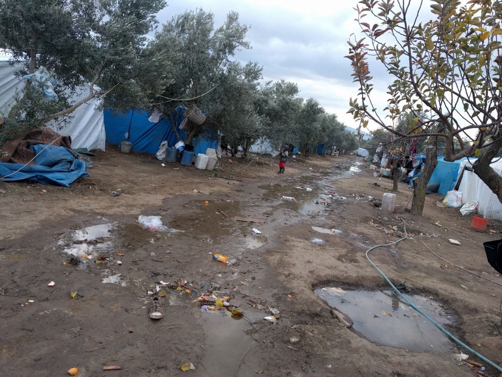

### **AYS SPECIAL: Syrians set to lose in the Turkish Referendum**

A constitutional referendum will be held in Turkey on 16 of April\. Voters will decide on amendments that could change the country from a parliamentary democracy into a presidential system\. According to some, this referendum could be the most significant political development since the Turkish republic was declared in 1923\. Millions of Syrian refugees in this country could be affected by the vote\.

Camp in Turkey\. Photo AYS\.

Right now Turkey is in a state of limbo, fascinating and terrifying in equal measure, bookended by two events\. The spectre of [last year’s coup](https://www.theguardian.com/world/2016/jul/15/turkey-coup-attempt-military-ankara-istanbul) , on July 15th, is still being used as justification for many state actions that would have been unconceivable a year ago due to the continuing [“State of Emergency”](https://www.wsj.com/articles/turkey-extends-state-of-emergency-1475507092) \. The [upcoming referendum](http://www.telegraph.co.uk/news/2017/03/31/turkey-referendum-everything-need-know-president-erdogans-bid/) , nine months later, on the 16th of April is the other\. \(The “State of Emergency” is due to end on April 19th, but there is understandable concern that this is contingent on a “yes” vote, which favours President Erdogan\) \. The period between these events has been filled with fear, [with purges of people in state employment](https://www.nytimes.com/interactive/2016/08/02/world/europe/turkey-purge-erdogan-scale.html) and [the hunt for the “Gulenist” bogeymen that have supposedly infiltrated the state](http://www.bbc.co.uk/news/world-europe-36835340) \.

The future is unknown and there is a feeling of uncertainty and fear that pervades almost every aspect of life here, and Syrians are a political tool in, and thus victims of, this messy situation\.

**The Upcoming Referendum**

One needs to understand the basics of the referendum and Turkish politics before the role of Syrians can be examined so, in brief: The upcoming referendum, if the vote is “yes”, will turn Turkey from a parliamentary democracy to an executive presidency\. The position of Prime minister will be done away with and the president becomes the head of government\. Whilst Erdogan undoubtedly has considerable influence over Turkish politics, this change will increase and enshrine the power of the presidency in law\. He will also be able to select his whole cabinet and two thirds of the senior judiciary, from whom thousands have already been purged\. Turkish politics is polarised and [this is reflected in polling on the referendum](http://www.reuters.com/article/us-turkey-referendum-idUSKBN1712G1) with an almost 50–50 split three weeks before the vote\.

Recently Turkish politics was described, by a native who has just returned from living in the west for 15 years, as being like picking a football team\. If one side takes a political stance the other is automatically against it\. Whilst this is clearly a massive generalisation it does explain some political leanings that would appear confusing to the rest of Europe\. Here it is part of the “right” that politically support, or tolerate, the presence of nearly 3 million registered refugees\. Whereas the “left”, which in Turkey is defined by the religious tolerance of Ataturk, regularly use this humanitarian crisis, and the presence of refugees, as a stick with which to bash the government, a reversal of the usual political landscape in Europe\. Part of the reason that Erdogan has been tolerant of Syrians is solidarity with a neighbouring Muslim population that is suffering, and part of an attempt to win support in the wider Middle East as a defender of Islam\. The left see this solidarity as a threat to the continued religious plurality of Turkey\.

The AKP, Erdogan’s ruling Justice and Development party, has made [vague announcements that Syrians “could” become citizens](http://www.aljazeera.com/news/2016/07/erdogan-syrian-refugees-turkish-citizens-160703133739430.html) \. These were met with huge [opposition publicly](http://www.hurriyetdailynews.com/turkish-twitter-users-criticize-syrian-citizenship-proposal-as-hashtag-becomes-tt.aspx?pageID=238&nID=101188&NewsCatID=338) and [politically](https://www.brookings.edu/blog/future-development/2016/07/26/the-turkish-coup-and-the-refugees/) \. There were definitely fears amongst Syrians that had last year’s coup been successful that none of the [other political players would be nearly as accommodating](https://www.theguardian.com/world/2016/jul/21/we-feared-the-worst-turkeys-failed-coup-relief-for-syrian-refugees) \. The almost total lack of support from the “left” is explained partly by the above football analogy and the fear of Islamic immigration\. There is also a widespread misconception of the rights of Syrians in Turkey, and the extent of state help they receive\.

**Misconceptions and Misinformation**

There is a huge amount of widely believed misinformation about Syrians, and their rights within Turkey, in both conventional and [social media](https://www.facebook.com/suriyedevleti/) \. \(There is [some attempt to counter](https://www.facebook.com/evimizneresi/posts/1860614790630948?notif_t=notify_me_page&notif_id=1491300314696890) this, but conversations on the street make it fairly clear who is winning\) \. The most worrying of these myths is that Syrians can vote in the referendum, whilst categorically false it is widely believed\. There is a fear that if the referendum returns a “yes” vote, the left will blame Syrians\. What little tolerance people on the left have, may well turn into open hostility as they blame Syrians for the end of parliamentary democracy in Turkey\.

This is compounded by the fact that Syrians lack any meaningful employment protections\. Thus they are often forced to work at much lower wages, pricing Turks out of the labour market\. The blame for this should not land on Syrians, they work for less, are exploited for renting property and are essentially taken advantage of in every aspect of their financial lives\. However [the Turkish unemployment rate is on the rise](http://www.tradingeconomics.com/turkey/unemployment-rate) , and this problem is undeniably affected by the influx of nearly [3 million](http://data.unhcr.org/syrianrefugees/country.php?id=224) , registered, new inhabitants\. This problem is a political and economic one and that is where the blame should rest\. Yet Syrians, the heavily exploited victims of employers trying to reduce production costs by any means, are easy, politically defenseless targets and that is being exploited heavily by both sides\.

There is also the very commonly heard misconception that every Syrian adult is paid 1,500TRY \(£327, €382\) by the Turkish government, a simple calculation proves that this is impossibly mind boggling sum, but many Turks feel that Syrians are getting preferential treatment from the state\. \(There is a very limited program that provides especially vulnerable individuals with an income, but this is very rare\) \. This only serves to further entrench a resentment towards Syrians amongst almost every echelon of Turkish society\. \(This is not to say that there aren’t Turks that are desperate to help people in need but in general the landscape is unfavourable, if not hostile\) \.

[Turkey is also increasing its military involvement](https://southfront.org/syrian-war-report-february-24-2017-turkey-seized-al-bab-what-now/) in Syria, which can be viewed as a continuation of the war against the Kurds on Turkey’s southern border\. Turks are being asked to fight and die in their neighbouring country, whilst millions of Syrians have made their homes in Turkey\. Once again this isn’t the fault of Syrians, but the fact that they are the face of this crisis means that they are the ones that pay the price socially and politically\.

**What Happens Next?**

The Future here is very uncertain, there is a huge amount of political instability and the xenophobia that comes with that, something that should be easily recognisable to Europeans\. If the referendum returns a “no” vote, it is likely that the situation in Syria, and by extension Syrians, will almost certainly be used as justification for the extension of the “State of Emergency”, If “yes” wins then the, incorrect, idea that Syrians can vote will likely see portions of the Turkish populace blame Syrians for the end of parliamentary democracy, and ten more years of Erdogan\. Either way it feels like Syrians lose\. Public opinion will probably become even more adversarial no matter the outcome\. As is so often the case, big political games are played and it is the people at the bottom of the stack, the most vulnerable in society that pay the real price\.

**\(Written by an independent volunteer in Turkey\)**

> **_We strive to echo the correct news from the ground, through collaboration and fairness, so let us know if something you read here is not right\._** 

> **_Anything you want to share — contact us on [Facebook](https://www.facebook.com/areyousyrious/) or write to: areyousyrious@gmail\.com_** 

_Converted [Medium Post](https://medium.com/are-you-syrious/ays-special-syrians-set-to-lose-in-the-turkish-referendum-42f839bc6fd5) by [ZMediumToMarkdown](https://github.com/ZhgChgLi/ZMediumToMarkdown)._
